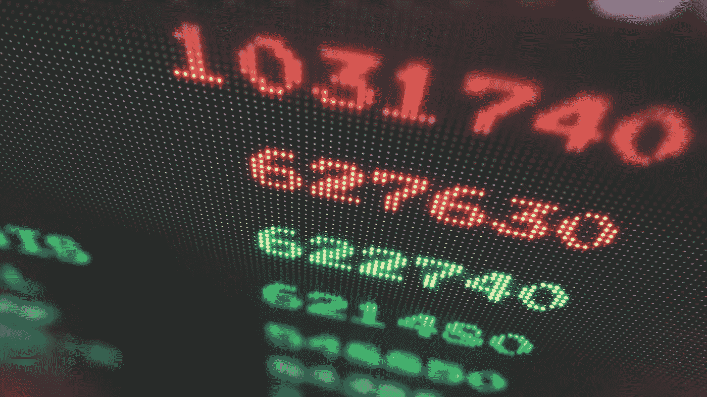

# 如何在 Python 中将 ARGB 整数转换成 RGBA 元组

> 原文：<https://levelup.gitconnected.com/how-to-convert-argb-integer-into-rgba-tuple-in-python-eeb851d65a88>

Python 中`&`和`>>`位运算符的真实用例



[西格蒙德](https://unsplash.com/@sigmund?utm_source=unsplash&utm_medium=referral&utm_content=creditCopyText)在 [Unsplash](https://unsplash.com/s/photos/pixel?utm_source=unsplash&utm_medium=referral&utm_content=creditCopyText) 上拍照

通过阅读本文，您将了解如何将无符号 32 位 ARGB8888 整数值转换为其相应的 RGBA 元组，反之亦然。让我们来看看 32 位 ARGB8888 的颜色空间是什么样的


图片来自[维基百科](https://en.wikipedia.org/wiki/RGBA_color_model)

根据上面的图像，我们可以确定每个颜色空间按以下顺序占用整数的 8 位:

*   `0–7` —前 8 位代表蓝色空间。
*   `8–15` —接下来的 8 位代表绿色空间。
*   `16–23` —红色空间由第 16 至 23 位表示。
*   `24–31` —最后 8 位代表 alpha 颜色空间，表示像素的透明度。

这些整数数据中的每一个都代表图像的一个像素中的色彩空间。将这样的数据转换成元组是必要的，因为它将在与其他模块集成时为我们提供更多的灵活性。

# 履行

我将在本教程中使用 Python，但也可以随意使用其他语言。这段代码的实现是基于位运算的。你也可以用算术方法来达到同样的效果。至于像素值，我将使用以下颜色，RGB 值为(38，192，204)。


作者图片

让我们初始化一个代表无符号 32 位 ARGB 整数的变量。

```
pixel_data = 4280729804
```

如果您不确定使用什么作为输入，您可以使用`int`函数直接将十六进制代码转换为整数。它接受表示基数的第二个输入参数，在本例中是 16。`0x`是十六进制的前缀，其余部分是 ARGB 风格。

```
pixel_data = int('0xff26c0cc', 16)
```

## 按位&运算符

我们将开始提取颜色空间。最简单的方法是将其屏蔽，只保留前 8 位。你可以用`&`符号来做。供您参考，255 代表二进制值 11111111。换句话说，我们将对这两个值执行 AND 运算。

```
11111111 00100110 11000000 11001100 #binary for pixel_data
00000000 00000000 00000000 11111111 #binary for 25500000000 00000000 00000000 11001100 #binary after AND operation
```

当您运行下面的代码时，您将获得值`204`。

```
int('0b11001100', 2)
```

## 按位>>运算符

上述方法仅适用于蓝色空间，因为它由前 8 位表示。为了解决这个问题，我们可以使用按位运算符`>>`，它将根据您指定的位数向右移动。假设我将值向右移动了 8。

```
11111111 00100110 11000000 11001100 #binary for pixel_data00000000 11111111 00100110 11000000 #binary after right shift
00000000 00000000 00000000 11111111 #binary for 25500000000 00000000 00000000 11000000 #binary after AND operation
```

当您运行下面的代码时，您应该得到`192`。

```
int('0b11000000', 2)
```

## 从整数到 RGBA

让我们把所有我们学过的东西组合成一个函数。创建一个新函数，并根据自己的喜好命名。它接受一个参数作为输入，该参数将是无符号的 32 位整数。

```
def RGBAfromInt(argb_int):
    blue =  argb_int & 255
    green = (argb_int >> 8) & 255
    red =   (argb_int >> 16) & 255
    alpha = (argb_int >> 24) & 255return (red, green, blue, alpha)
```

*   `blue` —仅获取前 8 位数据。
*   `green` —将位值右移 8 位，得到前 8 位数据。
*   `red` —将位值右移 16，得到前 8 位数据。
*   `alpha` —将位值右移 24，得到前 8 位数据。

最后，我们将按照 RGBA 顺序以元组的形式返回值。您可以根据自己的喜好随意重新排列元组中的顺序。让我们通过运行下面的代码来测试一下

```
result_tuple = RGBAfromInt(pixel_data)
print(result_tuple)
```

您应该在终端上看到以下输出。

```
[38, 192, 204, 255]
```

## 来自 RGBA 的 Int

让我们创建另一个相反的函数，将 RGBA 元组改回它原来的无符号 32 位整数。这次我们将把位向左移动，并对所有的值求和。

```
def IntfromRGBA(rgba):
    red = rgba[0]
    green = rgba[1]
    blue = rgba[2]
    alpha = rgba[3] RGBint = (alpha << 24) + (red << 16) + (green << 8) + blue return RGBint
```

让我们用下面的代码来测试一下。我们将使用之前获得的结果作为输入数据。

```
result_int = IntfromRGBA(result_tuple)
print(result_int)
```

您应该得到`4280729804`,因为最终输出表明我们已经成功地将其转换回原始数据。

# 结论

让我们回顾一下今天所学的内容。

我们首先简要解释了 ARGB8888 数据的结构。

接下来，我们深入探讨了如何使用`&`和`>>`位运算符。此外，我们测试了转换成不同的基础，如二进制和十六进制值。

此外，我们创建了一个函数来将无符号 32 位整数转换为 RGBA 元组。同样，我们实现了 reverse 函数，将元组改回其原始形式。

感谢你阅读这篇文章。希望在下一篇文章中再见到你！

# 参考

1.  [将一维转换为二维](https://stackoverflow.com/questions/17483557/python-transforming-one-dimensional-array-into-two-dimensional-array)
2.  [枕头的文档](https://pillow.readthedocs.io/en/latest/handbook/concepts.html#concept-modes)
3.  [灰度图像问题](https://github.com/python-pillow/Pillow/issues/3781)
4.  [RGB 转整数](https://stackoverflow.com/questions/2262100/rgb-int-to-rgb-python)
5.  [RGBA 色彩模型百科](https://en.wikipedia.org/wiki/RGBA_color_model)