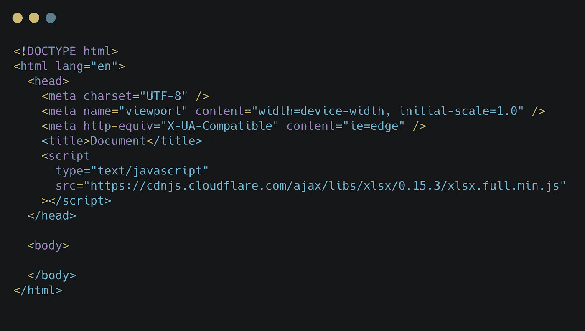
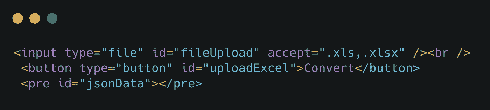
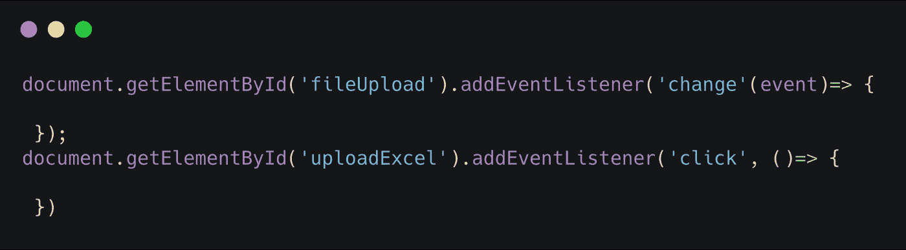
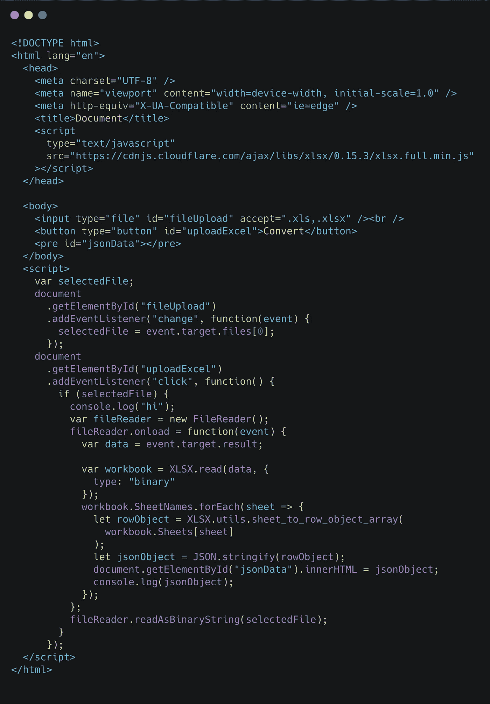

# 如何使用 JavaScript 将 Excel 文件数据转换成 JSON 对象

> 原文：<https://levelup.gitconnected.com/how-to-convert-excel-file-into-json-object-by-using-javascript-9e95532d47c5>

照片由[德鲁·科夫曼](https://unsplash.com/@drewcoffman?utm_source=medium&utm_medium=referral)在 [Unsplash](https://unsplash.com?utm_source=medium&utm_medium=referral) 上拍摄

最初，当我开始处理这个需求时，人们建议使用任何一个后端库来读取 excel 数据并将其转换成 JSON 对象。但是很难每次都向服务器发送请求。另一方面，通过使用纯 JavaScript 将客户机上的 excel 文件转换成一个 **JSON** 对象非常容易。

有一个 JavaScript 插件 **XSLX** 可以用来读取 excel 文件作为二进制字符串，并将其转换为 JSON 对象。

需要的插件:[**xlsx . full . min . js**](https://cdnjs.cloudflare.com/ajax/libs/xlsx/0.15.3/xlsx.full.min.js)

**安装**

在 HTML 文件的`head`标签中包含 CDN 链接，如下所示:

现在，在 HTML `body`标签中，我们需要编写一个类型为 file 的输入标签，并且需要限制用户只能选择扩展名为。将下面的代码粘贴到你的 HTML `body`标签中。

现在我们需要为`input`和`button`元素添加事件监听器，以处理输入和按钮点击事件的变化。

在 JavaScript 中，我们可以像这样将事件监听器添加到元素中:

我们可以使用文件阅读器读取 excel 文件中的数据，作为 JavaScript 中的二进制字符串。然后我们使用 **XLSX** 将我们的二进制字符串转换成一个 **JSON** 对象**，XLSX** 有一个内置的 SheetJS 工具。

如何使用 JavaScript 将 excel 文件转换成 JSON 对象

现在选择 excel 文件并单击 convert 按钮，在浏览器中显示 JSON 对象。之后，我们可以使用 JSON 对象进行任何操作，并将数据集成到不同的 UI 布局中。

在角度上

Angular 中的 Excel 到 JSON

JSON 超越 JavaScript

为了您的方便，我在这里添加代码沙盒链接现场演示

要将 JSON 数据导出为 excel 格式，请看这个视频

**点击此处获取** [**源代码**](https://github.com/jayanthbabu123/excel-to-json-by-javascript)

感谢您的时间:)

# 分级编码

感谢您成为我们社区的一员！升级正在改变技术招聘。 [**在最好的公司**找到你最理想的工作](https://jobs.levelup.dev/talent) **。**

 [## 提升——改变招聘流程

### 🔥让软件工程师找到他们热爱的完美角色🧠寻找人才是最痛苦的部分…

作业. levelup.dev](https://jobs.levelup.dev/talent)