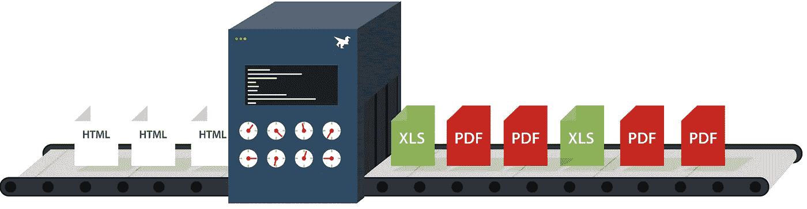
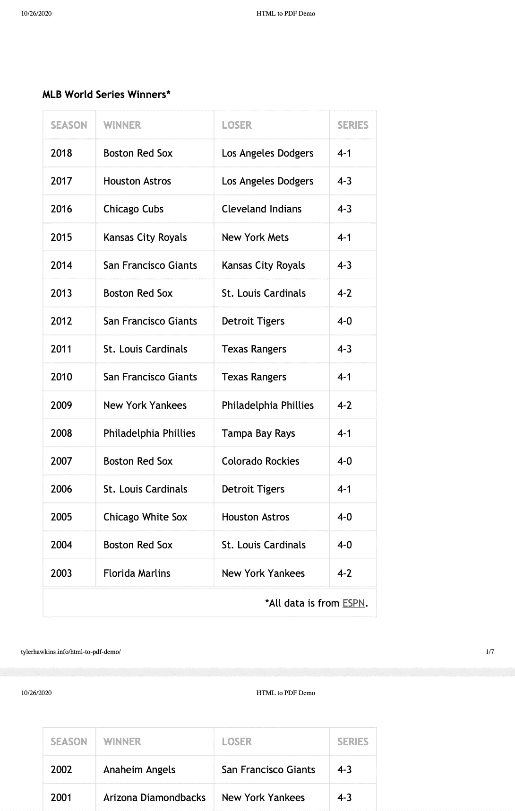
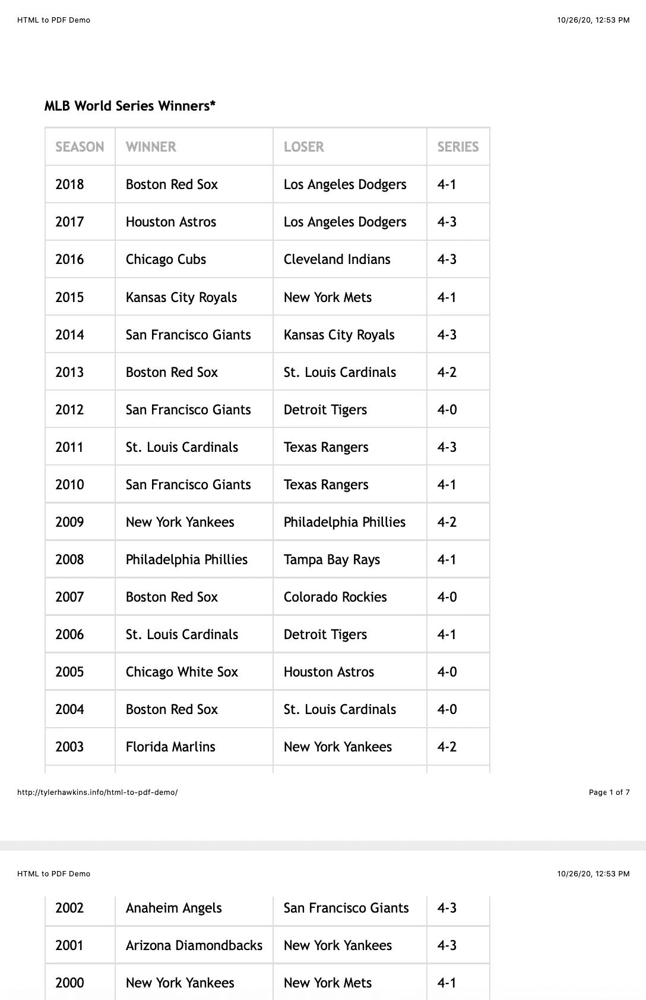
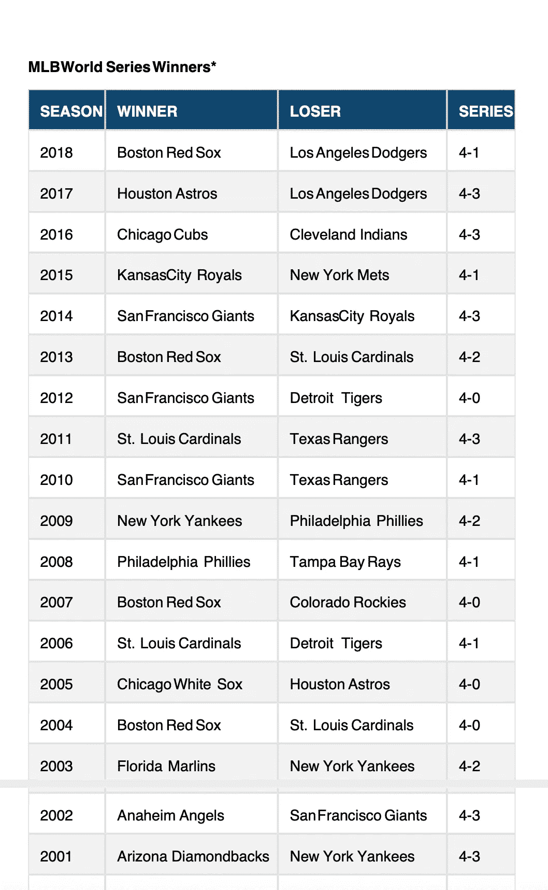
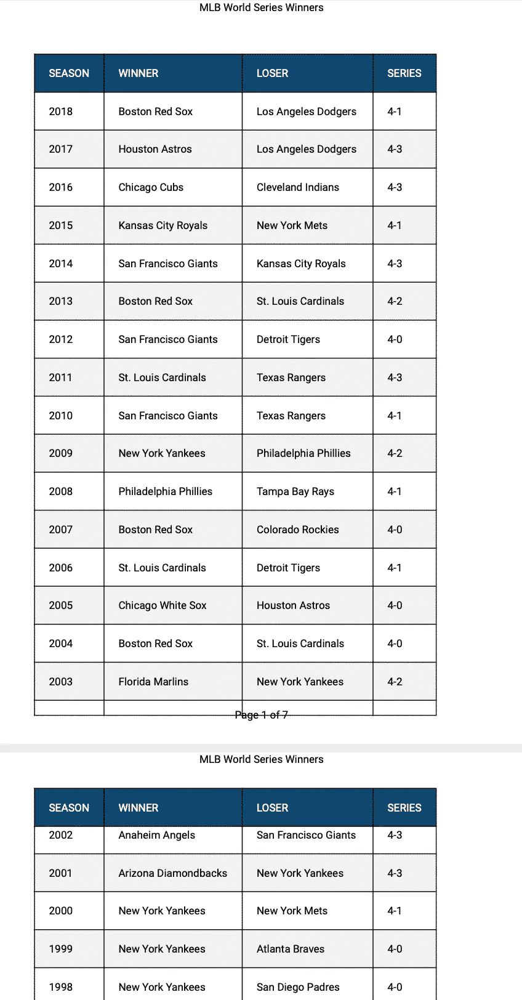
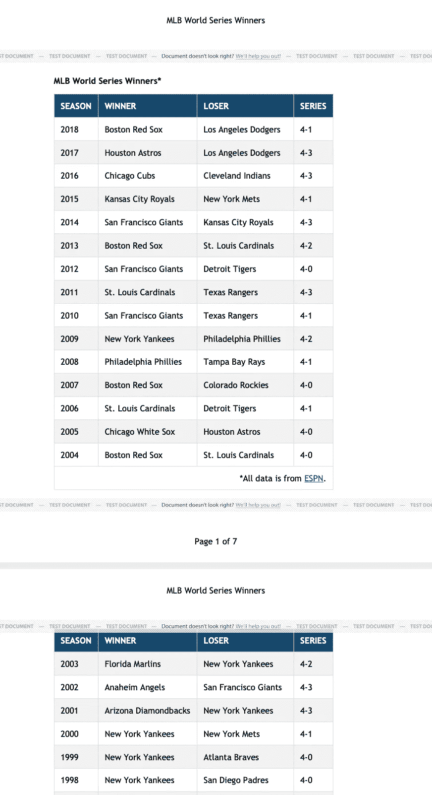

# 如何将 HTML 表格转换成漂亮的 pdf

> 原文：<https://levelup.gitconnected.com/how-to-convert-html-tables-into-beautiful-pdfs-eac2ce4c77de>

图片由 [DocRaptor](https://docraptor.com/) 提供

包含表格、图表和图形的 Web 应用程序通常包含将数据导出为 PDF 的选项。作为一名用户，你有没有想过，当你点击那个按钮时，在引擎盖下会发生什么？

作为开发人员，如何让 PDF 输出看起来更专业？大多数免费的 PDF 在线导出程序基本上只是将 HTML 内容转换成 PDF 格式，而没有做任何额外的格式化，这会使数据难以阅读。如果您还可以添加诸如页眉和页脚、页码或重复表格列标题之类的内容，会怎么样？像这样的小改动对把一个业余爱好者看起来的文档变成一个优雅的文档大有帮助。

最近，我探索了几种生成 pdf 的解决方案，并制作了[这个演示应用](http://tylerhawkins.info/html-to-pdf-demo/)来展示结果。所有的代码都可以在 Github 上找到。我们开始吧！

# 演示应用概述

HTML 到 PDF 演示应用程序

我们的演示应用程序包含一个冗长的样式化表格和四个将表格导出为 PDF 的按钮。该应用程序是用基本的 HTML、CSS 和普通 JavaScript 构建的，但你可以使用你选择的 UI 框架或库轻松创建相同的输出。

每个导出按钮使用不同的方法生成 PDF。从右向左看，第一个使用本机[浏览器打印](https://developer.mozilla.org/en-US/docs/Web/API/Window/print)功能。第二种使用一个名为 [jsPDF](https://github.com/MrRio/jsPDF) 的开源库。第三个使用另一个名为 [pdfmake](http://pdfmake.org/) 的开源库。最后，第四个使用一个叫做 [DocRaptor](https://docraptor.com/) 的付费服务。

让我们逐一研究每个解决方案。

# 本机浏览器打印功能

首先，让我们考虑使用浏览器的内置工具导出 PDF。当查看任何网页时，您可以通过右键单击任意位置，然后从菜单中选择打印选项来轻松打印该页面。这将打开一个对话框，供您选择打印设置。但是，您实际上不必打印文档。该对话框还为您提供了将文档保存为 PDF 的选项，这就是我们将要做的。在 JavaScript 中，`window`对象公开了一个`print`方法，因此我们可以编写一个简单的 JavaScript 函数，并将其附加到我们的一个按钮上，如下所示:

以下是谷歌 Chrome 浏览器的输出:

使用内置打印功能和 Chrome 浏览器导出的 PDF

我对这里的输出感到惊喜。虽然它并不花哨——内容只是黑白的——但主要的表格样式保持不变。此外，七个页面中的每一个都包括表的列标题和表尾，我认为浏览器会智能地拾取它们，因为我在构建一个结构正确的表时选择了语义 HTML。

然而，我不喜欢浏览器在 PDF 中包含的额外页面元数据。在顶部附近，我们可以看到日期和 HTML 页面标题。在这一页的底部，我们有它的印刷网站和页码。

如果我保存这个文档的唯一目标是查看数据，那么 Chrome 做得相当好。但是，文档顶部和底部的额外文本行虽然有用，但看起来不太专业。

另一个需要注意的是，不同浏览器的原生打印功能是不同的。如果我们使用 Safari 浏览器打印同样的文档会怎么样？

以下是输出结果:

使用内建打印功能和 Safari 浏览器导出的 PDF

您会注意到表格看起来大致相同，页眉和页脚内容也是如此。但是，表格的列头和表尾是不重复的！这有点没用，因为当您忘记任何给定的列包含什么数据时，您都需要返回到第一页。第一页上的表格底部也被切掉了一点，因为浏览器在创建下一页之前试图挤进尽可能多的内容。

因此，浏览器输出似乎并不理想，可能会因用户选择的浏览器而异。

# jsPDF

接下来让我们考虑一个名为 [jsPDF](https://github.com/MrRio/jsPDF) 的开源库。这个库已经存在至少五年了，并且每周从 NPM 下载超过 20 万次。可以肯定地说，这是一个受欢迎的、久经考验的库。

jsPDF 也相当容易使用。您创建一个新的`jsPDF`类实例，给它一个您想要导出的 HTML 内容的引用，然后提供任何其他附加设置，比如页面边距大小或文档标题。

在幕后，jsPDF 使用了一个名为 [html2canvas 的库。](https://html2canvas.hertzen.com/)顾名思义，html2canvas 获取 html 内容，并将其转换为存储在 HTML `<canvas>`元素上的图像。jsPDF 然后获取画布内容并保存它。

让我们看看使用 jsPDF 得到的输出:

使用 jsPDF 导出的 PDF

乍一看，这个挺好看的！PDF 包括我们漂亮的蓝色标题和条纹表格行背景。它不包含浏览器打印方法包含的任何额外的页面元数据。

然而，请注意第一页和第二页之间发生了什么。表格一直延伸到第一页的底部，然后又回到第二页的顶部。没有应用额外的边距，并且表格文本内容有可能被减半，这实际上是在第六页和第七页之间发生的事情。

PDF 也不包括重复的表格列标题或表格页脚，这与我们在 Safari 的打印功能中看到的问题相同。

虽然 jsPDF 是一个功能强大的库，但是当导出的内容只能放在一个页面上时，这个工具可能工作得最好。

# pdfmake

让我们来看看我们的第二个开源库， [pdfmake](http://pdfmake.org/) 。这个库每周从 NPM 下载超过 300，000 次，寿命为 7 年，比 jsPDF 更受欢迎，也更高级。

在为我的演示应用程序构建导出功能时，pdfmake 的配置比 jsPDF 要困难得多。原因是 pdfmake 使用您提供的数据从头开始构建 PDF 文档，而不是将页面上现有的 HTML 内容转换为 PDF。这意味着，我必须为 PDF 表格的页眉、页脚、内容和布局提供数据，而不是为 pdfmake 提供对 HTML 表格的引用。这导致了我代码中的大量重复；我首先在我的 HTML 中编写了表格，然后用 pdfmake 重新构建了用于 PDF 导出的表格。

代码如下所示:

在我们完全忽略 pdfmake 之前，让我们看一下输出:

使用 pdfmake 导出的 PDF

不算太寒酸！我们开始为表格添加样式，所以我们仍然可以复制蓝色的列标题和条纹状的表格行背景。我们还获得了重复表格的列标题，以便于跟踪我们在每页的每列中看到的数据。

pdfmake 还允许我添加页眉和页脚，所以添加页码很容易。您会注意到，第一页和第二页之间的表格内容仍然没有完全分开。分页符在页面之间部分分割 2002 年的行。

总的来说，pdfmake 最大的优势似乎是从零开始构建 pdf。例如，如果您想基于一些订单数据生成一张发票，而您实际上并没有在 web 应用程序的屏幕上显示发票，那么 pdfmake 将是一个很好的选择。

# DocRaptor

我们将考虑的最后一个选项是 [DocRaptor](https://docraptor.com/) 。DocRaptor 与我们探索的前三个选项不同，它是一个付费服务。它使用 Prince HTML-to-PDF 引擎来生成 PDF 导出。这个服务也是通过 API 使用的，所以您的代码会遇到一个外部 API 端点，然后它会返回 PDF 文档。

基本的 DocRaptor 配置相当简单。您向它提供您的文档的名称、您想要创建的文档的类型(在我们的例子中是`'pdf'`)以及要使用的 HTML 内容。根据你的需要，有数百种不同配置的其他选择，但是基本配置是一个很好的起点。

以下是我用过的:

让我们来看看 DocRaptor 生成的 PDF 导出:

使用 DocRaptor 导出的 PDF

现在有一个好看的文档了！我们可以保持我们漂亮的餐桌风格。表格列标题和表格页脚在每一页上都是重复的。表格行不会被截断，并且页面的所有边上都有适当大小的边距。页眉也在每一页上重复出现，每页底部的页码也是如此。

为了[创建页眉和页脚文本](https://help.docraptor.com/en/articles/1067094-headers-footers-for-pdfs)，DocRaptor 建议您使用带有`@page`选择器的 CSS，如下所示:

说到 PDF 输出，DocRaptor 显然是赢家。

*(作为额外的奖励，看看一个* [*全出血样式的 HTML 标题*](http://tylerhawkins.info/html-to-pdf-demo/styled-header.html) *会是什么样子！)*

# 结论

那么，你的 app 选择哪个选项呢？如果您想要最简单的解决方案，并且不需要专业外观的文档，本机浏览器打印功能应该就可以了。如果您需要对 PDF 输出进行更多的控制，那么您将需要使用一个库。

当涉及到基于 UI 中显示的 HTML 生成的单页内容时，jsPDF 大放异彩。当从数据而不是从 HTML 生成 PDF 内容时，pdfmake 效果最好。DocRaptor 是其中最强大的，它有简单的 API 和漂亮的 PDF 输出。但是，与其他服务不同的是，这是一项有偿服务。但是，如果您的业务依赖于优雅、专业的文档生成，DocRaptor 是非常值得的。