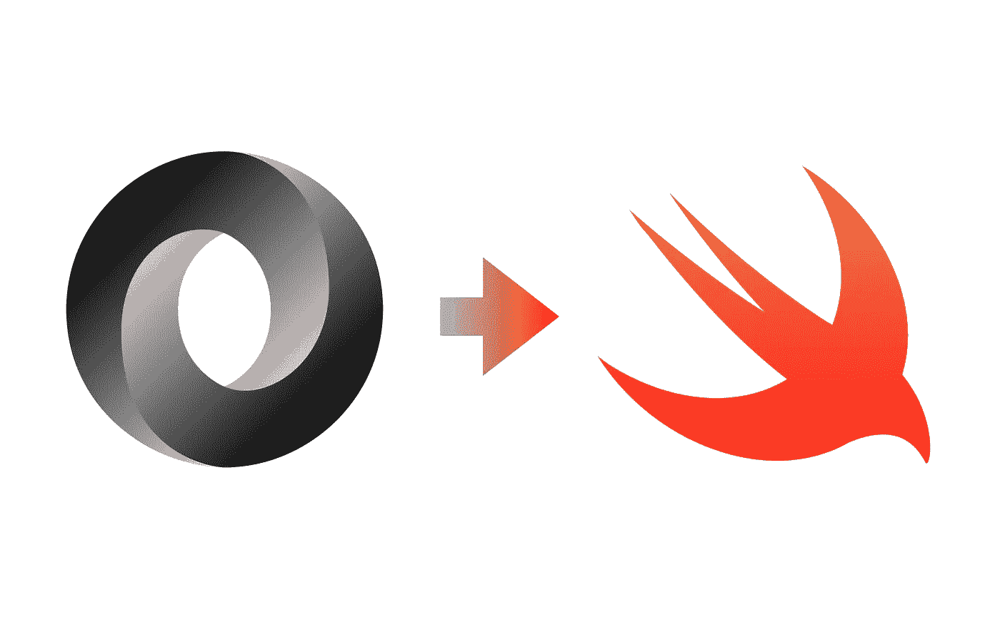
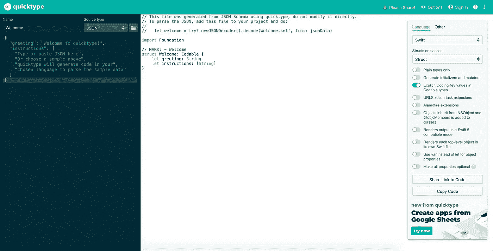
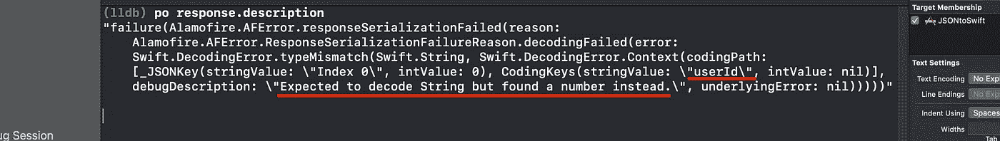

# 如何把你的 JSON 转换成 Swift？

> 原文：<https://levelup.gitconnected.com/how-to-convert-your-json-to-swift-235965d71ee>

## 使用工具和可解码

作者 JSON 至 Swift 照片

# JSON 是什么？

JSON——JavaScript 对象符号——是一种轻量级数据交换格式。它也是独立于任何语言的，但使用程序员已经熟悉的相同约定。JSON 建立在两种基本的数据结构之上，

1.  名称/值对的集合。我们可以把这些对看作一个对象、结构或字典。
2.  值的有序列表。简单地放一个数组，向量，列表，或者序列。

几乎所有的现代语言都支持上述两种数据结构。这就是 JSON 流行的原因。这是人类可读的，同时，非常轻量级。一个 100，000 字符的 JSON 文件大约有 100KB 大。对于 100KB 来说，这已经是很大的信息量了。

# 工具

1.  quick type—[https://app . quick type . io](https://app.quicktype.io/)
2.  JSON cafe—[http://www.jsoncafe.com](http://www.jsoncafe.com/)
3.  https://www.json4swift.com/

可能还有更多，但这些是我目前遇到的。来说说我的一个最爱吧。

## QuickType

这个工具是我非常喜欢的。只需复制你的 JSON 并粘贴到[https://app . quick type . io](https://app.quicktype.io/)上。它应该立即生成 Swift 代码，我们可以复制/粘贴到 Xcode 的权利。我们还可以在右侧获得过多的定制选项。

你也可以从[这里](https://apps.apple.com/us/app/paste-json-as-code-quicktype/id1330801220?mt=12)下载 macOS 应用和 Xcode 扩展。

作者[https://app.quicktype.io/](https://app.quicktype.io/)的照片

# JSON 到 Swift 对象，可解码

## 我们的 Swift 模型

使用 QuickType 生成

我喜欢将模型和协议一致性的基本声明分开。它清楚地表明了模型并不 100%依赖于协议一致性。

## 使用 URLSession 的示例

在这里，我们从[http://jsonplaceholder.typicode.com](http://jsonplaceholder.typicode.com)获取帖子。这里没有什么特别的，只是一个常规的`URLSession`用于从 REST API 获取数据，并使用`JSONDecoder`从 JSON 转换到 Swift 模型。

## 使用 Alamofire 的示例

代码少了很多！Alamofire 提供了一种支持开箱即用的`Decodable`的方法。只需接入`response`的`value`，就可以了！

# 破解常见错误

## 类型不匹配

应该解码字符串，但却找到一个数字。

尽管有可互换性的好处，但还是会出现一个常见的错误，即期望的和接收的不匹配。我们的模型需要一个字符串值，但它收到了一个数字值。例如，在我们的`Post`模型中，如果我们将`userID`类型改为`String`，然后再次运行代码，Alamofire 就会抛出这个错误，

作者照片

正如你所看到的，错误的要点是下划线。实际误差和什么有关，也就是`userId`。简而言之，这意味着`userId`在 JSON 中作为`number`被接收，但我们正试图将其解码为`String`。

当使用 URLSession 实例调用 REST API 时，会出现相同的错误输出。

作者照片

## JSON 文本没有以数组或对象开头，并且没有设置允许片段的选项。

这也是使用 JSON 时非常常见的错误之一。大多数情况下，这意味着你收到的 JSON 是一个错误的。最好使用类似于 [Postman](https://www.postman.com/) 的工具来查看 REST API 是否正常工作，然后在项目中继续实现。

# 参考

 [## JSON

www.json.org](https://www.json.org/json-en.html) 

# 下载代码

 [## akshitzaveri/jsontoswitf

github.com](https://github.com/akshitzaveri/JSONtoSwift) 

感谢您的阅读。如果你想让我写点什么，请告诉我。