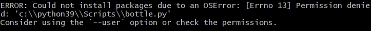
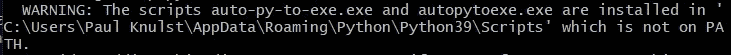
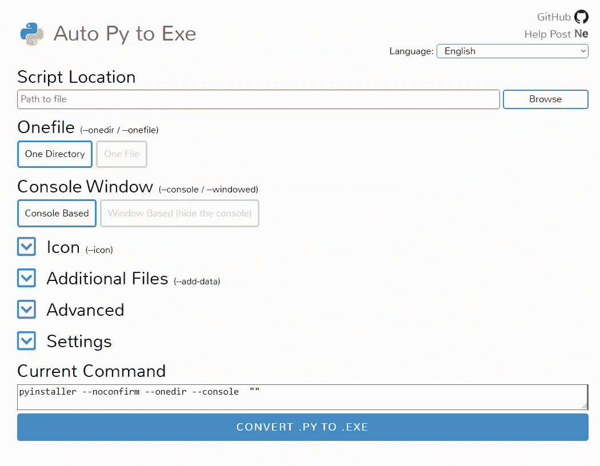
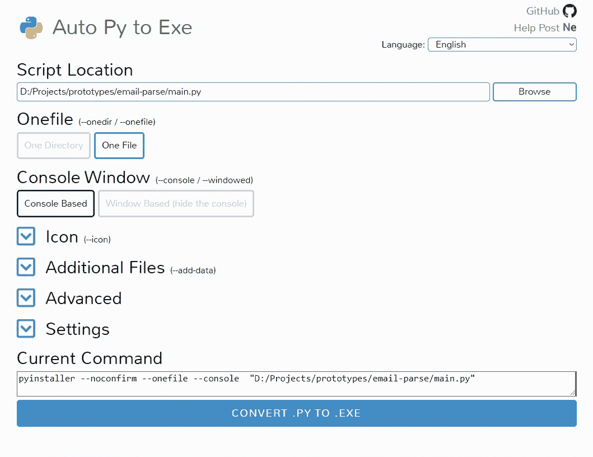
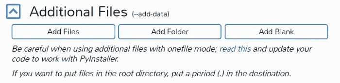
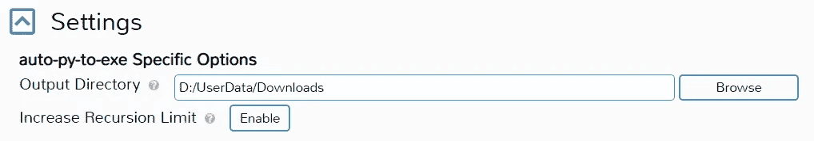

# 如何转换你的？py 文件复制到。exe 文件

> 原文：<https://levelup.gitconnected.com/how-to-convert-your-py-file-to-an-exe-file-729aa7ca2b>

## 在具有简单 GUI 的 Windows 上！


由 Racool_studio 创作的人物照片—[www.freepik.com](http://www.freepik.com)

如果你和使用 Windows 的人一起工作(或者你自己也使用 Windows ),并且想提供你的项目的可执行文件，我会解释你如何转换你的。py 文件到 Windows 可执行文件！

将要使用的程序是**自动复制到可执行文件**。这是一个 Gui 模块，工作方式类似于`pyinstaller`，但是是在图形用户界面模式下。这意味着您不需要打开终端，自己输入转换命令。

# 安装自动复制到可执行文件

您可以在终端的 pip 安装中安装该程序

`pip install auto-py-to-exe`

有时，当你安装它时(通常在使用 Windows 时)，你会看到



要解决这个问题，只需使用`--user`选项重做安装命令

```
pip install auto-py-to-exe --user
```

一旦你安装了这个模块，你可以通过在命令提示符下输入 `auto-py-to-exe`直接运行它，它会弹出一个如下的窗口。

如果您无法启动程序，请查看输出。如果你(像我一样)没有将 Python39/Scripts 文件夹添加到你的路径中，你就不能在控制台中执行这个程序。在安装输出中将会有一个警告



如果您遇到这种情况，您可以打开一个资源管理器，切换到该文件夹并启动。请手动执行。

# 创建可执行文件

如果您启动 auto-py-to-exe，将会启动一个网络浏览器，您将会看到



截图由作者拍摄

现在，你必须点击浏览按钮，这将打开一个文件选择器，然后你可以选择你的 Python 文件。一旦你完成选择文件，它将看起来像下面的图像。



截图由作者拍摄

在开始转换之前，你需要做一些设置。

## 一个文件/一个目录

首先，你需要改变你的文件转换，它被设置为**一个目录**，这意味着它将生成你的 Python 程序使用的所有 Python 应用程序和包，并将它们放在一个目录中。这显然意味着没有这些目录，你就不能运行你的 main.exe。

虽然这在处理一些媒体文件时很方便，但对于简单的脚本来说就不太好了。现在你的程序没有(希望)使用任何媒体文件，所以你需要把它改成**一个文件**选项。


## 图标

此外，如果您不喜欢默认的 Python 图标，您可以更改`exe`文件的图标。您可以通过点击**图标**并浏览`.ico`扩展名文件来设置自己的图标。


当您的程序或脚本使用外部文件或文件夹时，附加文件选项会很方便。

举一个简单的例子，你在一个图形用户界面(GUI)程序上工作，你创建了一个 assets 文件夹，用来存储程序使用的资产/图像。转换时`pyinstaller`无法识别该资产的位置，因此您必须使用附加文件选项手动设置附加文件夹或文件的位置。



## 输出位置

您可以通过按**设置**来设置转换后的`exe`的输出位置



所以我们准备将我们的`.py`文件转换为`.exe`文件，点击底部的蓝色转换按钮。它将启动转换过程，并生成如下输出

```
Running auto-py-to-exe v2.13.0
Running auto-py-to-exe v2.13.0
Building directory: C:\Users\PAULKN~1\AppData\Local\Temp\tmpdsu7dksq
Building directory: C:\Users\PAULKN~1\AppData\Local\Temp\tmpdsu7dksq
Provided command: pyinstaller --noconfirm --onefile --console  "D:/Projects/prototypes/email-parse/main.py"
Provided command: pyinstaller --noconfirm --onefile --console  "D:/Projects/prototypes/email-parse/main.py"...
MORE OUTPUT HERE
...1056240 INFO: Emedding manifest in EXE
1056240 INFO: Emedding manifest in EXE
1056256 INFO: Updating manifest in C:\Users\PAULKN~1\AppData\Local\Temp\tmpdsu7dksq\application\main.exe
1056256 INFO: Updating manifest in C:\Users\PAULKN~1\AppData\Local\Temp\tmpdsu7dksq\application\main.exe
1056341 INFO: Updating resource type 24 name 1 language 0
1056341 INFO: Updating resource type 24 name 1 language 0
1056358 INFO: Appending PKG archive to EXE
1056358 INFO: Appending PKG archive to EXE
1058034 INFO: Building EXE from EXE-05.toc completed successfully.
1058034 INFO: Building EXE from EXE-05.toc completed successfully.Moving project to: D:\UserData\Downloads
Moving project to: D:\UserData\Downloads
Complete.
```

之后，文件将在您选择的输出文件夹中创建


# 结束语

我希望这篇文章对您有所帮助，并且现在能够转换您的。将文件复制到 Windows 可执行文件中。我很想听听你的想法。如果您有任何问题，请记在下面*👇👇👇*

```
**Want to Connect With the Author?**Here's my [GitHub](https://github.com/paulknulst) handle and [LinkedId](https://linkedin.com/in/paulknulst) profile.
```