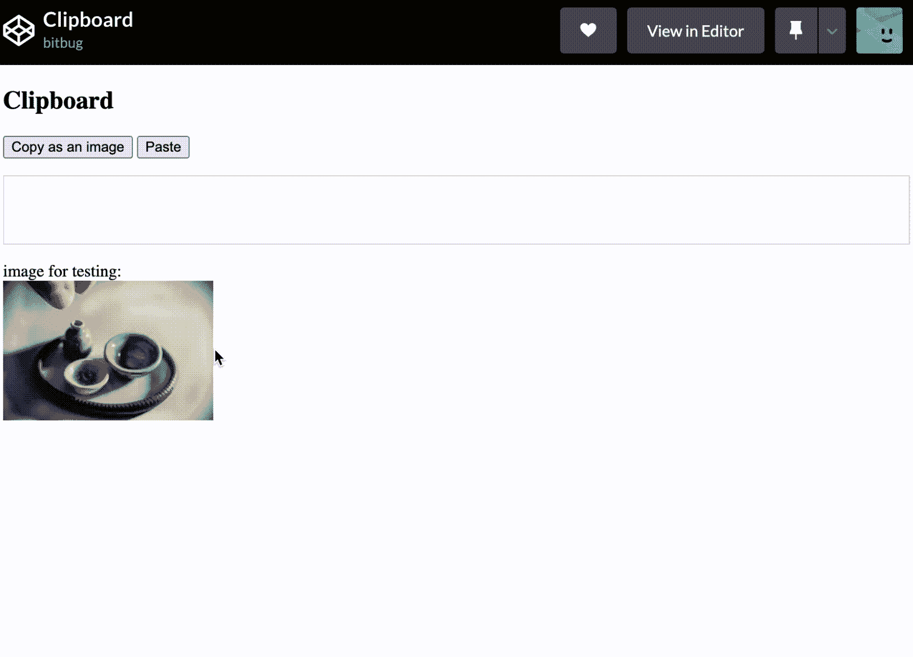
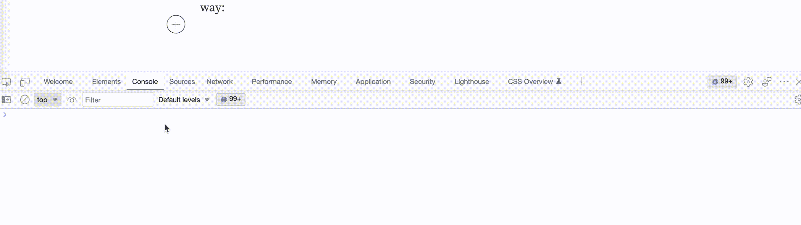

# 如何用普通 Javascript 复制或粘贴图像

> 原文：<https://levelup.gitconnected.com/how-to-copy-or-paste-image-by-plain-javascript-6ea804c6944a>


照片由 [Mailchimp](https://unsplash.com/@mailchimp?utm_source=medium&utm_medium=referral) 在 [Unsplash](https://unsplash.com?utm_source=medium&utm_medium=referral) 上拍摄

## 前言

在我们的日常开发中，截图粘贴图片到 IM 或者富文本编辑器中是非常常见的。你对如何通过 JavaScript 复制和粘贴图片感到好奇吗？

在本文中，我们将研究如何用普通的 JavaScript 实现这些特性。可能有一个演示，最终效果如下所示:



## 剪贴板 API

当我们想要获取数据或将数据写入剪贴板时，我们可以使用[剪贴板 API—Web API | MDN(mozilla.org)](https://developer.mozilla.org/en-US/docs/Web/API/Clipboard_API)，它提供了访问剪贴板的能力。而且我们可以通过全局`navigator.clipboard`访问系统剪贴板，而不是创建一个`Clipboard`对象实例:

```
navigator.clipboard
  .readText()
  .then((clipText) => {
    console.log('clipboard text:', clipText);
  });
```

**提示:将这段代码复制到 Devtool 控制台可能会出现错误** `DOMException: Document is not focused` **，**解决方法是通过 setTimeout 将这段代码包装起来，然后点击页面使其成为焦点，如下图所示:



剪贴板 API 包括四个方法，所有的方法都将返回一个承诺。

1.  read():从系统剪贴板中请求任意数据。
2.  readText():从系统剪贴板请求文本，并返回一个用文本字符串解析的承诺。
3.  write():将任意数据写入系统剪贴板。
4.  writeText():将文本数据写入系统剪贴板。

当我们需要处理图像数据时，我们可以使用`read`和`write`方法。

## 粘贴图像

粘贴图像意味着我们必须使用系统剪贴板中的数据，在这种情况下，我们可以使用`read`方法，该方法将返回一个用`[ClipboardItem](https://developer.mozilla.org/en-US/docs/Web/API/ClipboardItem)`对象数组解析的承诺。`[ClipboardItem](https://developer.mozilla.org/en-US/docs/Web/API/ClipboardItem)`有一个`types`属性，可以用来确定数据的类型，它还定义了`getType`方法，该方法返回一个承诺，该承诺用一个请求的 MIME 类型的 Blob 进行解析。我们想从系统剪贴板中请求图像数据，如下所示:

```
async function parseClipboardData() {
  const items = await navigator.clipboard.read().catch((err) => {
    console.error(err);
  });
  for (let item of items) {
    for (let type of item.types) {
      if (type.startsWith("image/")) {
        clipboardItem.getType(type).then((imageBlob) => {
          const image = ``;
          $container.innerHTML = image;
        });
        return true;
      }
    }
  }
}
```

每个 clipboardItem 可能有几种类型，比如当我们在 chrome 中右键单击网页上的某个图片来复制一个图像时，这些类型会像`[‘text/html’, ‘image/png’]`。

你可以在同样支持粘贴文本数据的 Codepen.io 上测试它:

## 复制图像

当我们想将 html 标签复制为图片时，建议使用 [html-to-image](https://github.com/bubkoo/html-to-image) ，它是基于 promise 的，支持将 html 转换为图片、svg 和 blob 数据。

通过使用这个 npm 模块，很容易将 html 标记复制为图像:

```
const $body = document.querySelector("body");
$body.addEventListener("click", () => {
  htmlToImage
    .toBlob($body)
    .then(function (blob) {
      return navigator.clipboard.write([
        new ClipboardItem({
          [blob.type]: blob
        })
      ]);
    })
    .then(
      () => {
        console.log("copy success");
      },
      (err) => {
        console.error(err);
      }
    );
});
```

并且可以在 Codepen.io 上测试一下:

## 结论

在本文中，我们学习如何使用`navigator.clipboard`来完成粘贴和复制图像。通过使用`navigator.clipboard.read()`方法，我们可以从系统剪贴板中获取任意数据。我们可以通过`navigator.clipboard.write()`方法将任意数据写入系统剪贴板。

希望这篇文章能对你有所帮助，如果你想知道更多的剪贴板提示，你可以参考这篇文章:

[](https://medium.com/@bitbug/javascript-how-to-copy-text-to-clipboard-92394f28b045) [## Javascript 如何将文本复制到剪贴板

### 在 Javascript 中将文本复制到剪贴板的三种方法

medium.com](https://medium.com/@bitbug/javascript-how-to-copy-text-to-clipboard-92394f28b045)