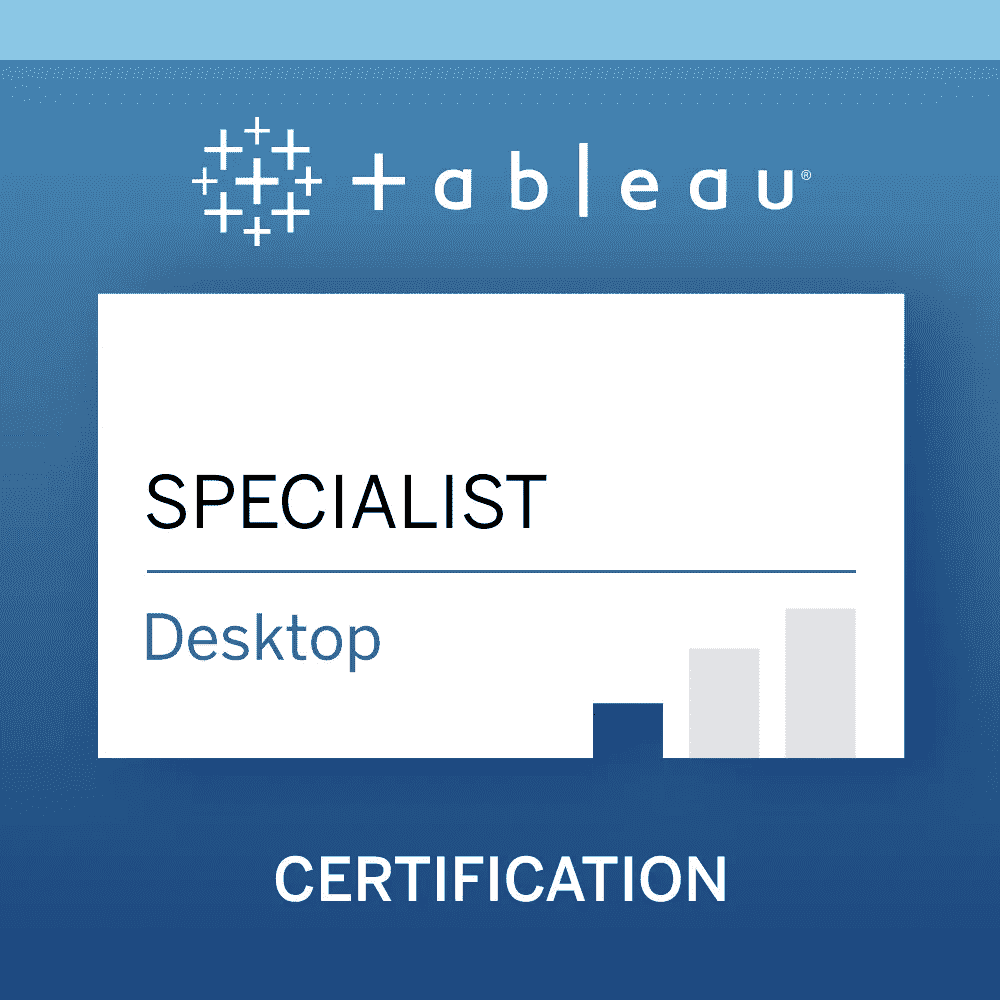
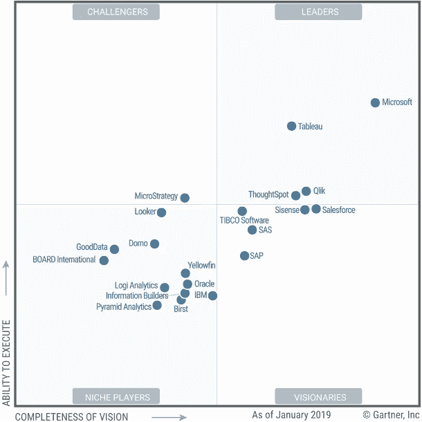
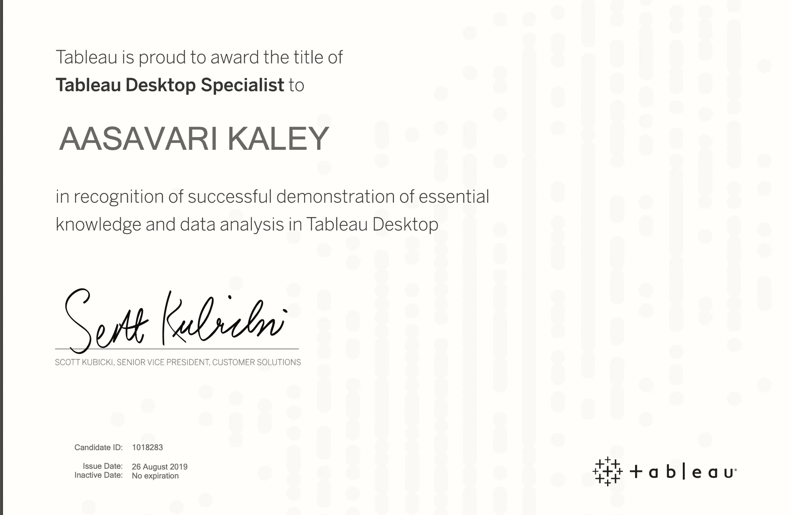
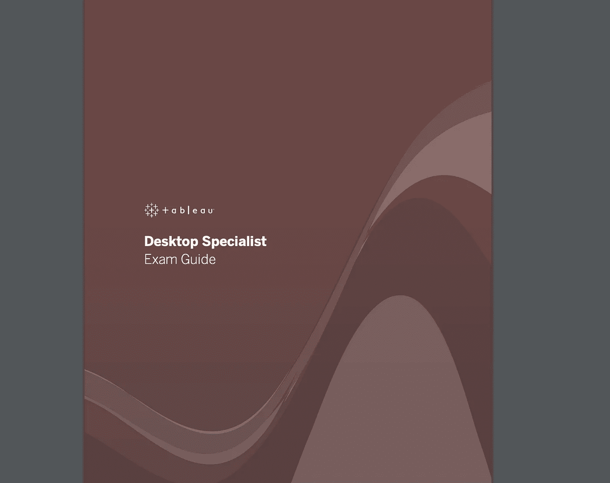
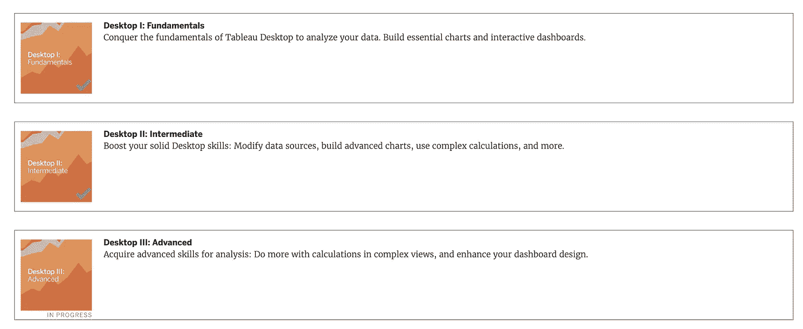
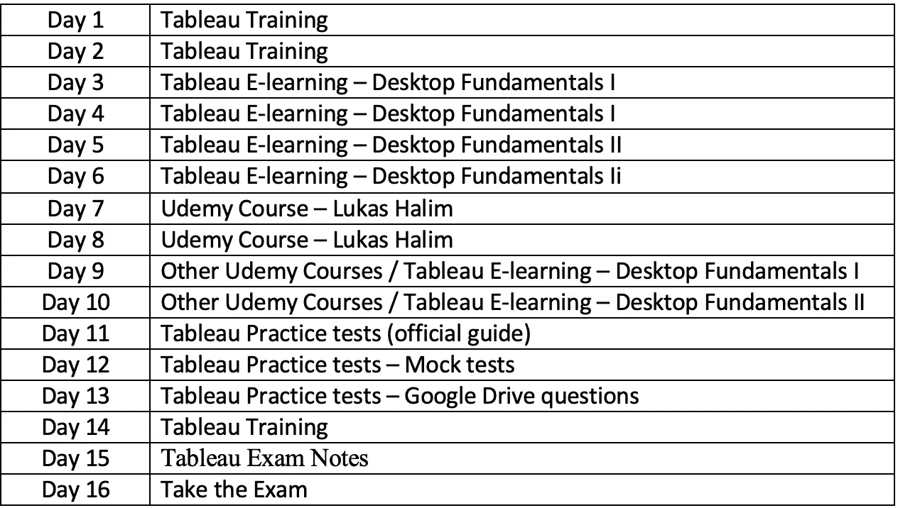

# 如何在 15 天内破解 Tableau 桌面专员考试

> 原文：<https://levelup.gitconnected.com/how-to-crack-the-tableau-desktop-specialist-exam-in-15-days-4a1c7ab895ff>

## Tableau 桌面专家考试资源—课程、练习题链接和 15 天的时间表

图片来源:[https://www . tableau . com/learn/certification/desktop-specialist](https://www.tableau.com/learn/certification/desktop-specialist)

T ableau 是目前市场上最流行的数据可视化软件。它在各行业和组织中提供的价值正确地验证了它的受欢迎程度。

> Tableau 作为商业智能软件大放异彩，提供高质量的可视化分析，并连续两年(2020 年和 2019 年)在 Gartner 的魔力象限中被评为 BI 平台领导者，如下所示。

图片来源:[https://www . analyticsvidhya . com/blog/2020/02/Gartner-2020-magic-quadrant-bi-analytics-tools/](https://www.analyticsvidhya.com/blog/2020/02/gartners-2020-magic-quadrant-bi-analytics-tools/)

据 Glassdoor 称，Tableau Developer 的简介吸引了平均 10.2 万美元的基本工资。

因此，Tableau 认证是当前商业智能领域中最有价值的资产之一。

# Tableau 提供三种认证:

> 1.Tableau 桌面认证专家

 [## Tableau 桌面专家

### 考试形式时间限制:60 分钟问题形式:选择题、多选题、动手数题…

www.tableau.com](https://www.tableau.com/learn/certification/desktop-specialist) 

Tableau 桌面专家是 Tableau 提供的第一级认证。这项考试是为那些对该工具有基本了解并建议有 3 个月经验的人准备的，但是，这不是强制性的。没有前提条件，考这个之前。Tableau 桌面专家的头衔永远不会过期。我们将在这个博客中关注这次考试。

> 2.Tableau 桌面认证助理

 [## 桌面认证助理

### 这个考试是为那些全面了解 Tableau 桌面的功能和至少五…

www.tableau.com](https://www.tableau.com/learn/certification/desktop-certified-associate) 

Tableau 桌面认证助理(以前称为 tableau 桌面认证助理考试)是认证考试的第二级。这次考试测试了 Tableau 中的一些高级主题和专业知识。这项考试没有先决条件，并建议使用该工具 5 个多月的经验。称号有效期两年。

> 3.Tableau 桌面认证专家

 [## 桌面认证专家

### 这个考试是为那些谁有先进的知识和技能，在 Tableau 桌面和应用能力…

www.tableau.com](https://www.tableau.com/learn/certification/desktop-certified-professional) 

Tableau 桌面认证专家考试是第三级认证。该考试侧重于高级概念和可视化最佳实践的应用。参加本考试的先决条件是拥有当前有效的桌面助理徽章/头衔。在参加这个考试之前，建议有 12 个月以上的经验。

# Tableau 桌面专家考试资源

> Tableau 考试指南

[https://mkt . tableau . com/files/desktop specialist _ exam guide . pdf](https://mkt.tableau.com/files/DesktopSpecialist_ExamGuide.pdf)

tableau 考试指南被认为是准备 Tableau 考试的圣杯。本指南列出了大纲中的所有 tableau 概念，在参加实际考试之前，您必须精通这些概念。本指南还提供了一套反映实际考试难度的样题。这些样题可以在考试前尝试，以评估准备程度。

> 桌面培训

 [## 免费培训清单- 2020.2

### 你在做深度数据准备和分析吗？负责给别人创作内容？如果你有舞台准备和…

www.tableau.com](https://www.tableau.com/learn/training/20203) 

Tableau 提供了 tableau 考试指南中几乎所有概念或技能测试部分的视频教程。每个视频大约 5-10 分钟长，完全免费。在准备考试时，这是一个很好的参考资源。这些视频也为你的日常场景工作提供了快速复习。

> Tableau 电子学习

 [## Tableau 电子教学

### 当您将电子学习与 Tableau 桌面专家认证相结合时，培训将更上一层楼。我们的新…

www.tableau.com](https://www.tableau.com/learn/training/elearning) 

Tableau 还提供针对您希望参加的特定级别考试的付费电子学习课程。培训视频分为 3 个高级部分:桌面基础知识 I、桌面基础知识 II 和桌面基础知识 III。

培训从基础概念开始，在基础 I 部分建立坚实的基线或基础，并在基础 II 和基础 III 部分达到专家级高级主题。

图片来源:【https://www.tableau.com/ 

每个部分都由多个模块组成，每个模块都致力于一个 tableau 概念，为您提供理论/知识基础以及实践活动，最后是挑战和问题，以测试您对该模块的理解。

虽然这是一个耗时的练习，但这可能是**准备 tableau 考试的最佳**资源，因为它非常容易掌握。我建议至少浏览两遍所有模块，以便对所有概念有一个牢固的了解。

> 建议的 Udemy 课程

1.  初学者 Tableau:获得 CA 认证，成长你的职业生涯

 [## 初学者表格:获得 CA 认证，发展你的职业生涯

### Tableau 是当今成千上万家公司在应对大数据问题时使用的解决方案。本课程…

www.udemy.com](https://www.udemy.com/course/tableau-accelerate-your-career-and-get-certified/) 

Lukas Halim 的课程是 tableau 考试备考的传奇课程之一。他的课程是精确的，专注于考试中测试的概念，没有过多地转移到工具的本质上，这可能对考试不是至关重要的。他还提供了购买 udemy 课程后免费获得的三个模拟测试。许多学生相信他的课程。

2.kickstarting Tableau[免费]

 [## 免费 Tableau 教程- Kickstarting Tableau

### Aasavari Kaley 拥有计算机科学背景，是一名信息系统和…

www.udemy.com](https://www.udemy.com/course/kickstarting-tableau/) 

3.用 Tableau 实现数据可视化

 [## 用 Tableau 实现数据可视化

### Aasavari Kaley 拥有计算机科学背景，是一名信息系统和…

www.udemy.com](https://www.udemy.com/course/data-vsualization-with-tableau/) 

为了回馈 tableau 社区，你真的在 Tableau 上创建了两门课程，涵盖了初级到中级概念。以上课程以简单易懂的方式总结了考试中测试的概念，适用于初学者和有 Tableau 中级经验的人。

> 贾斯汀·迪克斯的 Tableau 考试笔记

 [## Tableau 专家考试笔记—第 1 部分:连接和准备数据

### 格式:

medium.com](https://medium.com/@justindixon91/tableau-specialist-exam-notes-part-1-connecting-to-and-preparing-data-bb5e1d8c1b40) 

贾斯汀·迪克逊在他的笔记中漂亮地总结了所有的 tableau 概念，对你最后一天的复习非常有帮助。

> 模拟测试

虽然网上没有现成的官方模拟考试。下面有几个模拟练习题，可能会给你要点。这些并不能反映考试的实际难度，但是它们有助于练习。

考试指南中的试题示例:

[https://mkt . tableau . com/files/desktop specialist _ exam guide . pdf](https://mkt.tableau.com/files/DesktopSpecialist_ExamGuide.pdf)

模拟测试:

 [## 免费 Tableau 认证考试模拟测试

### 是的，模拟测试经常更新，以包括特定于 Tableau Desktop 10 的新材料。它节省了…

www.simplilearn.com](https://www.simplilearn.com/tableau-exam-questions-free-practice-test)  [## Tableau 认证转储和模拟测试-参加本课程

### 全面收集 Tableau 认证考试样题，Tableau 认证实务考试，tableau…

www.takethiscourse.net](https://www.takethiscourse.net/tableau-certification/) 

Google drive 问题[非本人所有或策划]:

 [## Knowledge _ Based _ Questions.docx

### 编辑描述

drive.google.com](https://drive.google.com/file/d/1UAQpwBpx407QmfONH9aV2T-Zx9aGXKUI/view?usp=sharing) 

# 15 天时间表

最后，以下是我为 Tableau 认证准备所遵循的时间表，您可以遵循相同的时间表，也可以根据自己的喜好和日程进行修改。

敬请关注 Tableau 和 Data 中的更多此类故事…