# 如何创建 10 000 个创成式 NFT

> 原文：<https://levelup.gitconnected.com/how-to-create-10-000-generative-nfts-feb0112197c3>

就是这个！这是你需要用生成艺术生成 10 000 个 NFT(或者几乎任何你想要的数字)的教程/步骤。

你想制作你自己的 NFT 艺术收藏吗？您想自动生成 x 个 NFT 吗？你想结合不同的层来自动生成随机的 NFT 吗？那你来对地方了！

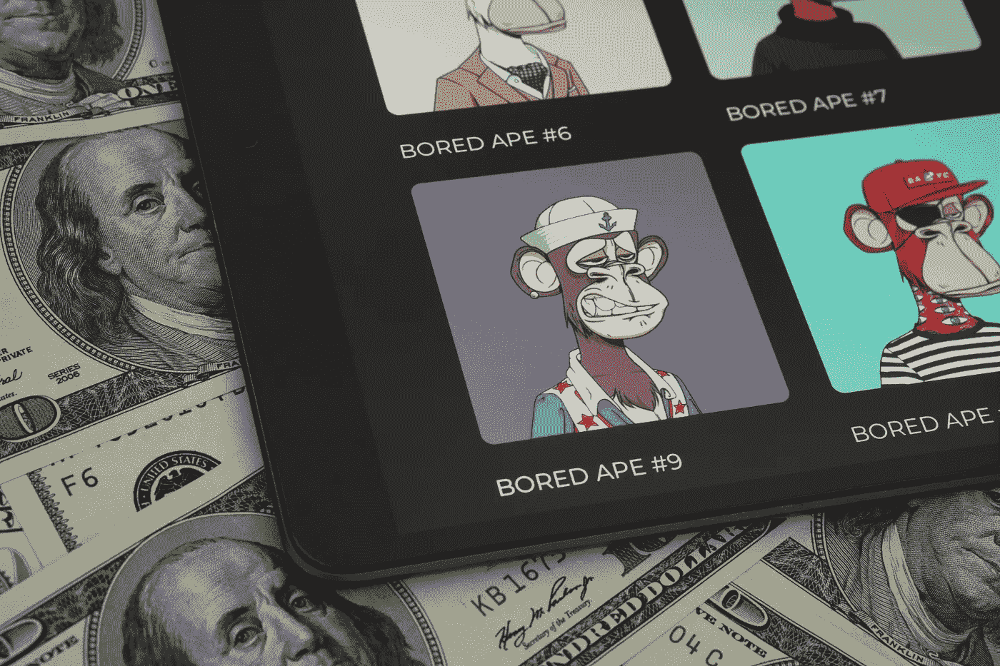

在这个详尽的会议中，我们将学到很多东西:

*   IPFS 是什么
*   皮纳塔到底是什么，有什么用途
*   Hashlips art 引擎和 Hashlips GitHub Repo
*   安装 Visual Studio 和 Node.js
*   将 Hashlips 艺术引擎 repo 克隆到 Visual Studio
*   为 NFTs 生成新图像
*   上传图片到皮纳塔·IPFS
*   生成并上传带有元数据的 JSON 文件
*   在 OpenSea 上检查您的 NFTs
*   将版税添加到您的 NFT 收藏中

如果你已经到了这一步，你一定已经理解了加密资产的形式是可替换和不可替换的集合。在这里，我们将主要处理不可替代的方面，通常被称为 NFTs——我们将创造一个生成艺术，而不是从零开始创造一个 IPFS。

为了能够遵循这个教程，并创建一个 NFT 集合，你可能需要看看一些[以前的文章](/deploy-your-first-erc20-token-in-5-min-17c1333d8434)以获得基本知识:

🤖[**5 分钟后部署您的首个智能合约**](/deploy-your-first-smart-contract-in-5-minutes-67361699ae03)

🚀 [**在 5 分钟内部署您的第一个 ERC20 令牌**](/deploy-your-first-erc20-token-in-5-min-17c1333d8434)

🐶 [**今天就在以太坊上创建您自己的柴犬-伊努代币吧！**](https://medium.com/datadriveninvestor/create-your-own-shiba-inu-token-on-ethereum-today-7e0c28d4f682)

***此外，查看这个智能合同主类，了解如何创建 ERC20、ERC721 和 ERC1155:***

**👾** [**创建 NFT、令牌和 DAOs 智能合约主类**](https://www.udemy.com/course/create-nfts-tokens-and-daos-smart-contracts-masterclass/?referralCode=39A122B4B0FA4780826A)

最后，如果你想学习什么是生成艺术 NFTs，查看下面的 2 篇文章。很酷的东西！

 [## NFT 空间中生成艺术的力量

### 艺术市场的未来可能在画笔、土坯、计算机算法和区块链之间的交叉点上…

medium.com](https://medium.com/geekculture/the-power-of-generative-art-in-the-nft-space-2e92221dd702)  [## 革新 NFTs 的 7 个生成性艺术收藏

### 如果你在这些项目的早期阶段或以全新的价格获得了这些项目的 NFTs，你做得很好。恭喜你。

medium.com](https://medium.com/geekculture/the-7-generative-art-collections-that-revolutionized-nfts-af782805fe90) 

我们开始吧！

# 什么是 IPFS？

首先，IPFS 代表**星际文件系统**(很酷的名字吧？)**、**用一句话来解释，这就像是**分布式云存储**。不像你可能听说过的云存储提供商，亚马逊网络存储(AWS)的亚马逊 S3，谷歌云等，任何人都可以在 IPFS 拥有一个节点并做出贡献。

IPFS 对我们有利有几个原因:它更分散，它有一个内容标识符(CID)系统，可以为任何上传的图像生成一个哈希，通过这个哈希可以上传和检索图像。如果对我们的数据、图像进行了更改，CID 会帮助系统检测更改并应用必要的更新。

像 [OpenSea](https://opensea.io/) 这样的 NFT 市场包括 [IPFS CID](https://docs.ipfs.io/concepts/content-addressing/#identifier-formats) 作为元数据中的一个需求；元数据是指标识另一个特定数据的一组数据，在我们的例子中，它是我们要上传的 NFT。点击这里阅读更多关于 IPFS [的信息，点击这里](https://ipfs.io/)阅读更多关于 NFT 元数据标准的信息。

## **这让我们想到了皮纳塔**

Pinata 基本上是一个为区块链网络设计的云接口，用于在 IPFS 网络上托管文件。虽然对于我们正在做的事情，还有其他有价值的选择，其中之一是 [NFT 存储](https://nft.storage/)，但我们使用 Pinata 代替，这只是我的偏好，真的。在这个演示中，我们将使用 Pinata 的免费层服务。

前往该网站，点击[免费计划](https://www.pinata.cloud/pricing)下的按钮，注册并开始使用该服务。它为我们提供了 1GB 的空间，这对于开始使用网络来说绰绰有余。

## **Hashlips Art 引擎和 Hashlips GitHub 库**

为了生成我们的 NFT 集合，我们将使用 [Hashlips GitHub Repo](https://github.com/HashLips) 。Hashlips 艺术引擎将允许您混合图像的不同层，并创建一个生成性艺术收藏，无论您想要多少，10，100，1000，6969 等..

## **接下来，我们的下载/安装**

*   下载代码编辑器， [Visual Studio Code](https://code.visualstudio.com/download) ，它无疑是程序员世界中最受欢迎的编辑器。很有可能，如果你已经在编码了，你已经拥有它或者听说过它。您也可以使用您喜欢的编辑器。
*   另外，如果你以前没有下载 Node.js [的话，请点击这里](https://nodejs.org/en/download/)

**注意:确保选择为您的 PC/操作系统指定的下载。**

# 让我们为 NFTS 生成新的图像！

现在我们已经安装了 IDE 和 Node.js，继续前进到 [Hashlips Art Engine](https://github.com/HashLips/hashlips_art_engine) ，你可以继续阅读文档，但它允许我们做的是自动生成将形成我们的 NFT 集合的图像，它还将生成元数据，这些元数据将在与我们的市场 [Opensea](https://opensea.io) 的连接中资源丰富。

找到最新版本的链接。请注意，当前的最新版本是 **v1.1.2，**当您阅读本文时，更新可能已经完成，请继续点击最新版本。

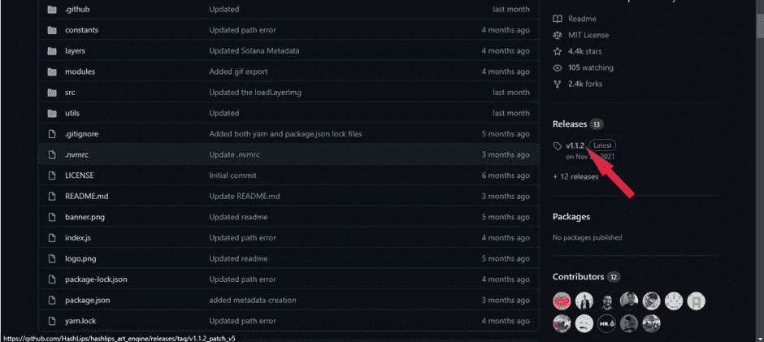

下载最新版本的源代码。确保下载了 zip 文件。

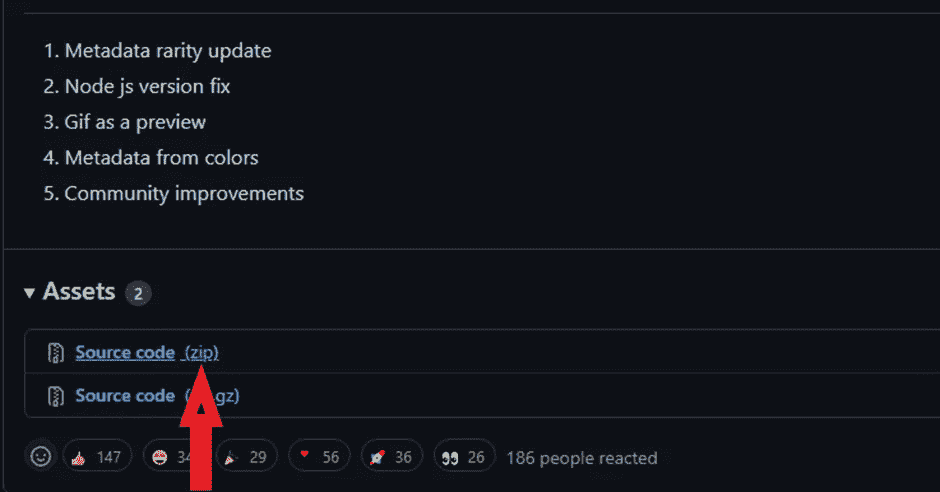

解压文件，用 **Visual Studio 代码**打开。如果您使用的是 windows，请确保**以管理员身份运行**，因为如果您不是以管理员身份运行，某些功能可能无法正常工作。选择**打开文件夹，**您可以从欢迎屏幕获得它，或者在顶部菜单的**文件**选项中找到它。然后从下载文件中找到解压后的文件。

作为解释，我将稍微关注一下**层**文件夹，从而对我们现在从存储库中获得的代码的功能进行一点窥视。包含在这个文件夹中，你有背景，底盖，眼睛颜色，眼球，粘性，虹膜，光泽，和顶部模块；它们都描述了我们生成图像的各个方面，这些方面组合在一起形成一个完整的图像。如果您浏览该文件，您会看到每个文件夹中都有预设，这些预设定义了该文件附带的图像预设。随着本演示的深入，我们将使用我们想要的任何图像片段填充图层部分，同时根据您的偏好重命名每个文件夹。我们是如何做到这一点的，我们进入 **src** 文件夹中的 **config.js** 文件，并在**层配置**功能中实现我们的更改。

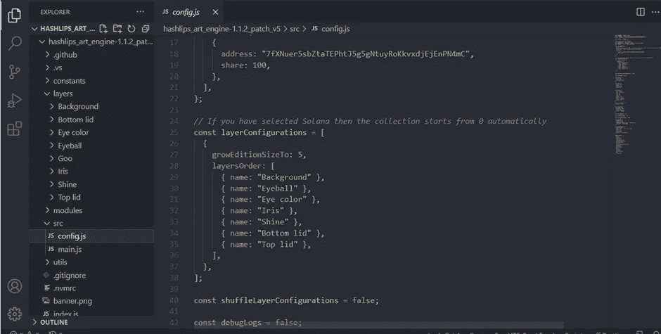

对于好奇的一群人来说，我美丽的主题是 **One Dark Pro** ，你可以在 Visual Studio marketplace 买到它。😉

关于上面的**图层函数**需要注意的一点是**遵循与上面**相同的顺序和图层文件夹的命名规则，因此，如果你想应用更改，你必须确保它对 config.js 文件中图层函数的**对应代码中图层部分的文件夹命名产生影响。**

我们需要下载我们的依赖，这将使 Haslips 艺术的工作。所以，去打开终端吧。在菜单中点击**查看**，在那里找到“终端”，快捷方式是 **ctrl +`(反勾)**。在我的终端中，我使用了 [**Git Bash**](https://git-scm.com/downloads) 。您可以继续使用默认的 **PowerShell** 、Windows 的**命令提示符或 Mac 的终端**。最初，您可能不在正确的文件夹中，因为解压缩的文件夹中有另一个文件夹，就像这样:

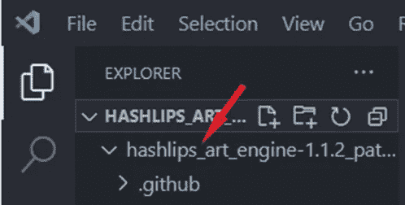

你需要右击上图中我指向的文件夹，找到**在集成终端**中打开选项，在终端中打开它。
现在开始安装，如下图所示，在**终端**中键入 **npm install** 并按 enter 键开始安装。

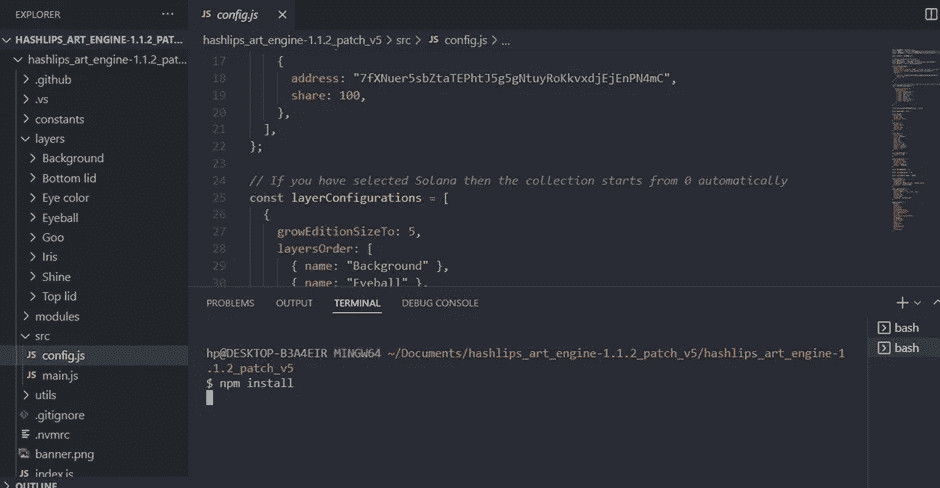

我们不需要对文件夹中使用的不同包大惊小怪，因为作者已经为我们做了。为什么我们需要进行 npm 安装是因为在下载的时候，所使用的包只是留下了一个蓝图，但是它们本身并没有被下载，所以当我们在本地工作的时候，我们需要在本地文件夹中下载实际的程序。这些程序被称为依赖关系。我希望你能理解，我已经尽量简化它，不使用专业术语。

接下来，我们做**纱线安装**，因为[纱线](https://yarnpkg.com/)也被使用。对于 Windows 用户，如果你在这方面遇到困难，你可以尝试命令 **npx yarn install** ，对于 mac 用户，你可以在你的终端中，在命令前使用 **sudo** 。

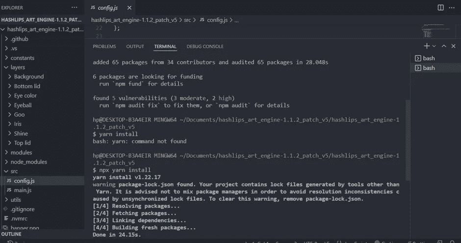

如果看到以上，两者都是成功的。

一点演示，到终端键入以下命令，**节点** **index.js.** 您应该看到以下内容:

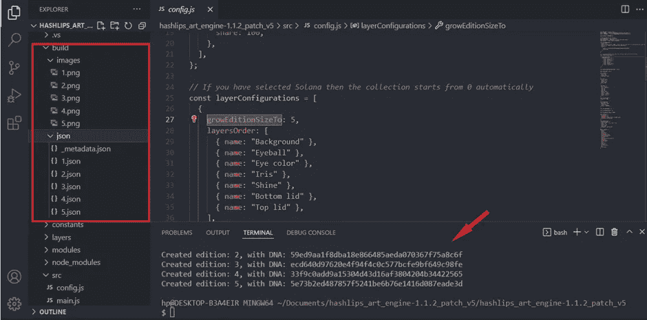

一个**构建**文件夹立即为我们生成，然后它包括**新生成的图像**以及分别在**图像**和 **json** 文件夹中的**元数据**。请注意，由于第 27 行**上的代码，图像正好是 5 个，例如，如果数字变为 15，则生成 15 个图像。您可以试用这个命令，看看它每次运行时是如何创建新图像的。在这次演示中，我将生成 10 幅图像。
**注:****DNA 存在于终端上的反馈意味着一个图像是重复的。在进入下一步之前，让我向您展示我们需要元数据的一个主要原因，正如我前面提到的。****

**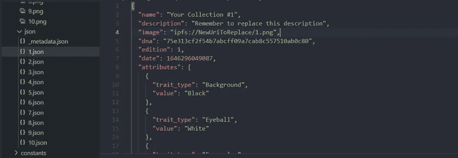**

**我们在第 4 行看到的是 **image** 属性，它将保存从 Pinata 生成的链接。NFT 的图像将被上传到 Pinata 服务器上，并提供一个链接引导我们回到图像，只是图像现在在云上；所以元数据包含了 Pinata 云服务上的图片链接。**

## ****图片上传至 IPFS 皮纳塔****

**进入 [Pinata](https://app.pinata.cloud/pinmanager) ，点击上传按钮，很难错过，然后在你的 PC 上找到你的**构建文件夹**，上传**图片文件夹。**给上传起你想要的名字，只有这样最后的上传按钮才会被激活。上传后，您应该会看到以下内容。**

**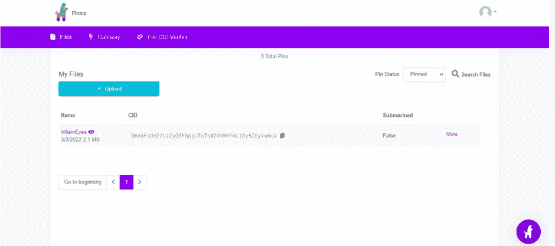**

**我们的 CID 已经为我们生成。您也可以点击名称以获取有关您上传的更多信息。我把我的上传命名为 VillianEyes。当你点击名字的时候，它会把你带到一个不同的页面，上面有所有的个人上传。为了理解为什么我们需要在我们的项目中使用 CID，我将演示一些东西。**

**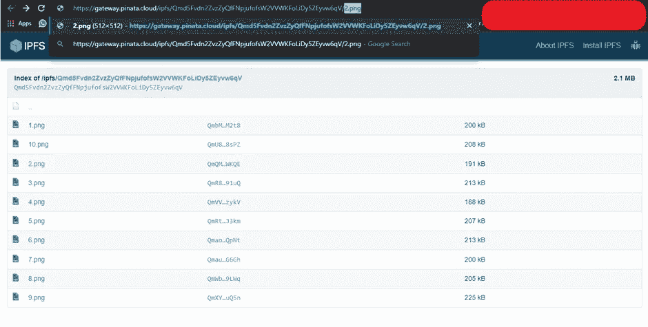**

**如果我将 **/2.png** 添加到 URL，它会将我带到第二张图片。这同样适用于从 1 到 10 的所有图像。你可以玩这个。您现在将理解为什么我们需要它在我们的元数据文件中。**

**将 CID 放入我们的元数据文件:从我们的上传返回第一个屏幕，点击复制图标复制 CID。**

**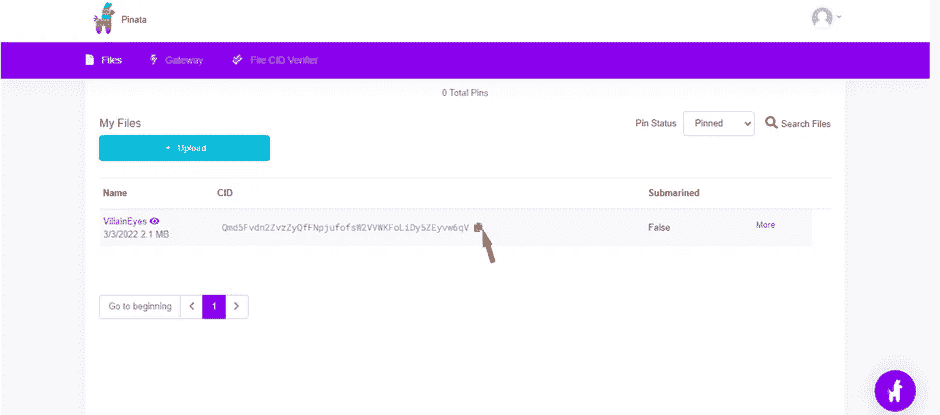**

**当它被复制后，回到你的代码编辑器，在 **config.js** 文件中，编辑**行 10** 上的 **baseURI** ，并在 **ipfs://** 之后添加 CID，就像这样:**

**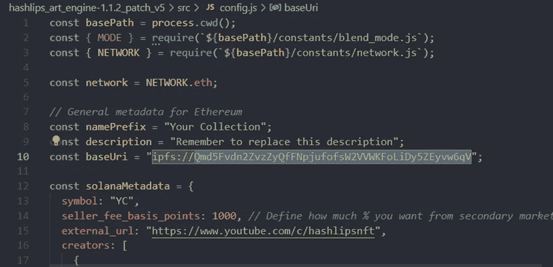**

**关于添加 **/{number}。png** 向我们的程序获取一个特定的文件，我们的程序为我们做这件事。如果你检查一下 **src/main.js** ，你应该会看到下面的代码，它使我们的程序能够为我们填充那个部分。想象一下，您必须生成 50 个图像，然后您必须手动将 CID 粘贴到所有 50 个元数据文件中，这很累人。**

**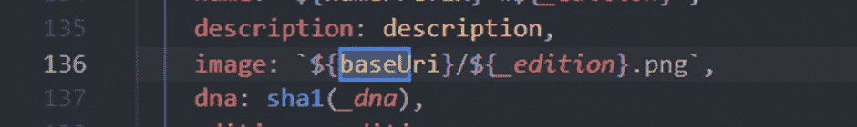**

****更改文件后，确保保存文件。****

**更新 JSON 文件:为此，我们将使用 **utils** 文件夹中的 **generate_metadata** 文件。键入以下命令，**node utils/generate _ metadata . js .**现在，如果您转到任何一个 JSON 文件，您应该会看到图像的 URL 已更新。**

**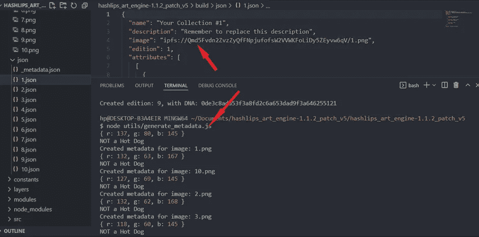**

## ****上传 Pinata 上的 JSON 文件****

**转到您的 pinata 页面，再次点击上传。然后选择文件夹并找到您的 JSON 文件。你还必须在上传前命名你的文件夹。我已经把我的名字命名为**villaineyejson**。**

**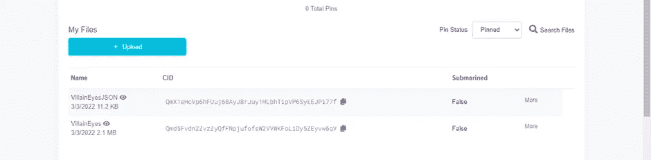**

**如果你点击名字，它会打开一个新的页面，显示我们所有的文件，就像图片一样。如果你也通过添加**对图像进行同样的实验。/2.json** 到这个地址，它向您显示文件 2 的元数据以及您认为合适的其他元数据。**

****

**我们的图像和元数据已经生成，给自己拍一下背。现在让我们来处理智能合同吧！**

## ****我们集合的智能合同创建和部署****

**前往 [Hashlips Solidity 智能合约库](https://github.com/HashLips/solidity_smart_contracts)。点击**合同**，然后 **NFT** ，然后 **NFT.sol，**然后复制代码。**

**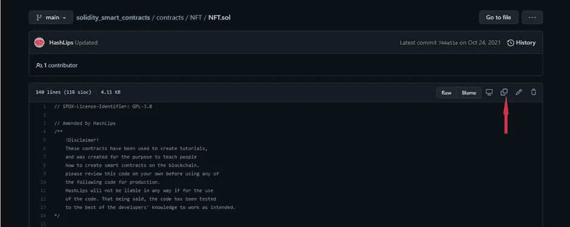**

**前往 [remix](http://remix.ethereum.org/) ，创建一个新文件，我将把我的**命名为 VillainEyes.sol** 。然后粘贴您复制的代码。你应该有这样的东西:**

**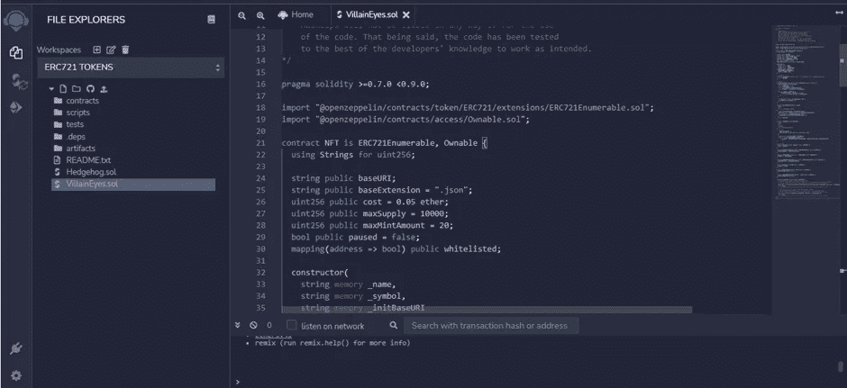**

1.  ****第 18–19 行**暗示 Openzeppelin 用于此智能合同，因为它用于 NFT 收藏的大多数智能合同，还有许多其他选项，但它很突出。
    注意**第 24–30 行**你会看到有一些变量被初始化和赋值，以使我们的智能合约工作。让我们来解释其中的几个:**
2.  ****第 26 行**“成本”定义了人们为铸造你的 NFT 所支付的价格。**
3.  ****第 27 行**“最大供应量”定义了可用于铸造的 NFT 的最大数量**
4.  ****第 28 行**‘maxmintmount’定义了一个地址允许铸造的最大数量**
5.  **值得一提的是, **Line 50** _mintAmount > 0 有助于我们确保人们肯定会铸造至少一个 NFT，这样他们就不会因为没有指定要铸造的 NFT 数量而损失汽油费。因为铸造零 NFT 而损失汽油费不是件好事。**
6.  **合同中的最后一个功能， **withdraw()** 被添加到合同中，以确保 Hashlips 团队获得 Hashlips 初始销售额的 5%。这是支持团队努力工作的一种方式，因为它都是开源的。你可以选择移除它或者保留它。**

**接下来编译合同。当你看到一个绿色的检查，你知道它是编译的。确保编译器版本与智能协定顶部的版本相同。**

**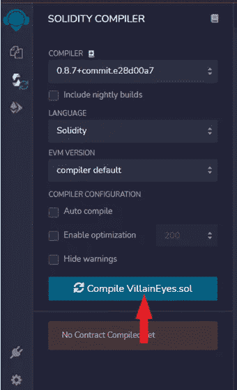**

**7.接下来，我们将它部署到 Goerli 测试网络。如果你不知道 Goerli 或 Metamask，我建议你参考早先的一篇文章，在这里解释那些。你还需要给格利做些乙醚测试。你可以在[这个视频](https://youtu.be/Ni3XocoNaDI)中查看如何获取一些。
进入部署部分，照常选择**注入 Web3** ，同时在**合同**部分选择您的合同，并激活 Metamask。**

**就在部署之前，单击下拉箭头并用必要的信息填充构造函数，因此:**

**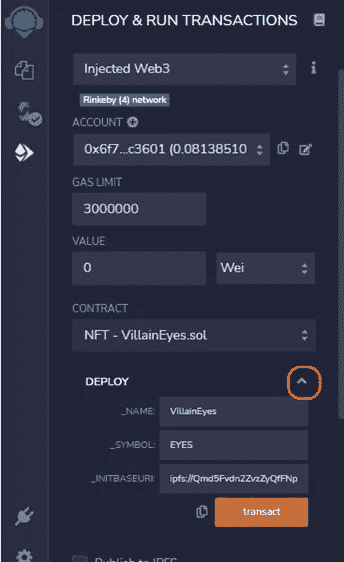**

**_INTBASEURI 是我们从 VSCode 中的代码中需要 BASEURI 的地方，vs code 是我们从 Pinata 得到的 URI。在使用**事务按钮**进行部署之前，在现场进行复制和粘贴。在你的元掩码上确认交易，你就可以直播了。🚀🍺🤑**

**向下滚动时，您会看到**已部署的合同**，您应该会看到您可以使用合同执行的所有操作:**

**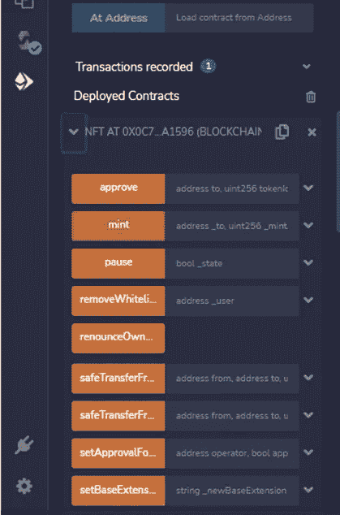**

****合同的部分功能:****

1.  **薄荷:嗯，它铸造新的非功能性食物！🚀🚀🚀**
2.  **totalSupply():显示制造的 NFT 的数量。**
3.  **symbol():显示在部署点指定的 ticker:EYES。**
4.  **tokenURI():显示我们想要查看的特定令牌的 URI，例如，如果我们输入数字 3，我们将获得我们上传到 Pinata 上的第三个图像的 **ipfs 地址**。**
5.  **name():显示 NFT 的名字: **VillainEyes。****
6.  **maxSupply():显示指定 NFT 的最大供应量，**10000**。**

**现在你可以开始铸造你的 NFT 了！！！**

**继续在 [Opensea testnet](https://testnets.opensea.io/) 上检查你的合同。如果您还没有 Opensea 帐户，您应该可以轻松连接您的 Metamask 钱包。请注意，我们正在使用 testnet，因为我们已经在 Goerli 测试网络上部署了它。**

**如果你对区块链、加密、NFTs、元宇宙、金融科技和 DeFi 感兴趣，不要忘记看看我的高评级和超级有趣的课程:**

*   **🌎 [**DeFi —分权金融—金融大师班的未来**](https://www.udemy.com/course/def-i-decentralized-finance-future-of-finance-masterclass/?referralCode=AB3572DA1669084E47E4)**
*   ****🚀** [**以太坊合并升级大师级**](https://www.udemy.com/course/the-ethereum-merge-upgrades-masterclass/?referralCode=732F453B5B228B789846)**
*   ****👨‍💼** [**元宇宙的商家——如何从元宇宙获益**](https://www.udemy.com/course/metaverse-for-businesses-how-to-benefit-from-the-metaverse/?referralCode=4B3DF285FE8F0CDC8143)**
*   ****👾** [**创建 NFT、令牌和 DAOs 智能合约大师级**](https://www.udemy.com/course/create-nfts-tokens-and-daos-smart-contracts-masterclass/?referralCode=39A122B4B0FA4780826A)**
*   ****🦄** [**元宇宙大师班——了解元宇宙的一切！**](https://www.udemy.com/course/metaverse-masterclass-learn-everything-about-the-metaverse/?referralCode=4795AA478A4B496F3BC5)**
*   ****💰** [**NFT 投资大师班—NFT 投资小贴士**](https://www.udemy.com/course/nft-investing-masterclass-pro-tips-about-nft-investing/?referralCode=32FD108E41BB3959925F)**
*   ****🛑** [**网络安全大师班——一切关于 IT 安全**](https://www.udemy.com/course/cyber-security-masterclass-all-about-it-security/?referralCode=09C03B45F07977CE0DB1)**
*   ****🐶** [**第一部完整的 DOGE 课程——关于 DOGE 的一切**](https://www.udemy.com/course/-dogecoin-course-the-first-complete-dogecoin-course/?referralCode=9416B1408224CE309DD8)**
*   ****💻** [**Fintech 概述:AI、区块链、云、数据、网络安全**](https://www.udemy.com/course/fintech-technologies-cloud-and-cybersecurity/?referralCode=F1D4EA005A2881735A36)**
*   ****🙉** [**完整的 NFTs 课程—了解关于 NFTs 的一切**](https://www.udemy.com/course/the-complete-nft-course-learn-everything-about-nfts/?referralCode=AAEE908D13D0E2276B19)**
*   ****⛓️** [**区块链深度挖掘:从比特币到以太坊再到密码**](https://www.udemy.com/course/blockchain-deep-dive-from-bitcoin-to-ethereum-to-crypto/?referralCode=B8463EE382E6D313304B)**

**YouTube:[**Crypto Henri**](https://www.youtube.com/results?search_query=henrique+centieiro)
Twitter:@[**henriquecentiei**](https://twitter.com/henriquecentiei?s=11)
LinkedIn:[**Henrique Centieiro**](https://www.linkedin.com/in/henriquecentieiro)**