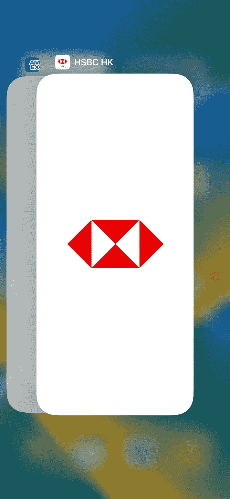
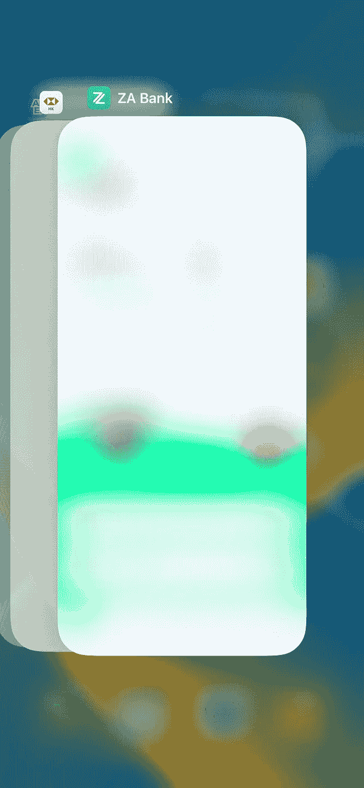
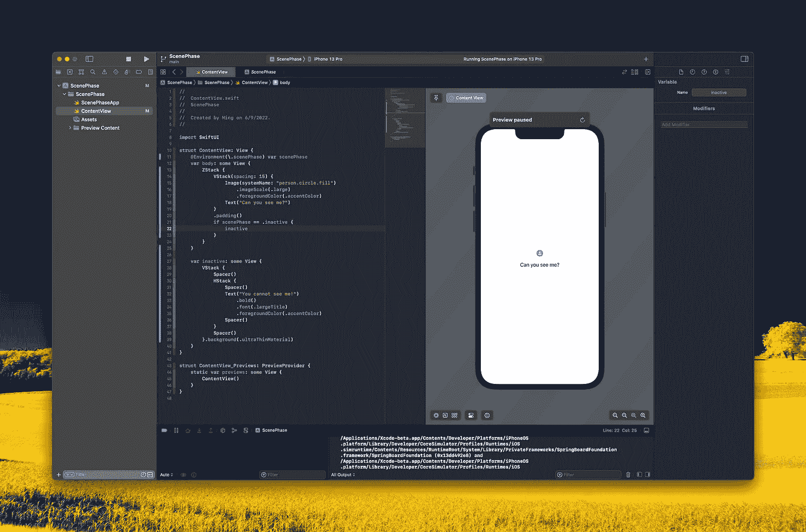
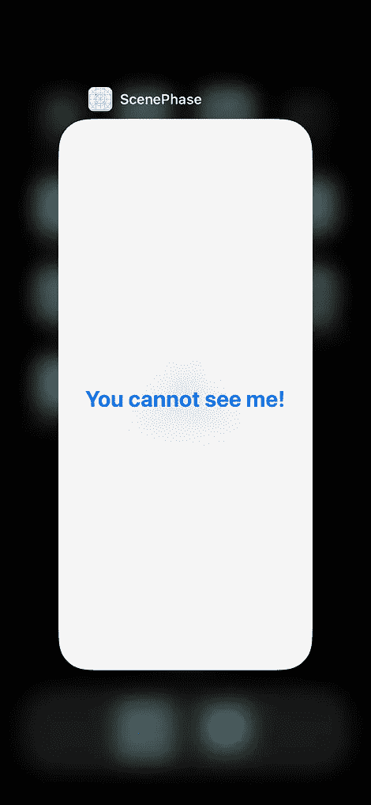

# 如何:使用 SwiftUI 创建银行级安全模糊屏幕

> 原文：<https://levelup.gitconnected.com/how-to-create-a-bank-level-security-blur-screen-with-swiftui-49a0e569bdc6>

## 用几行代码和 scenePhase 快速实现

如今，电子银行应用程序越来越受欢迎，已经成为日常生活中的常用工具。当切换到另一个应用程序或在 force 杀死应用程序之前，您可能会看到上面的模糊屏幕。今天，我们将快速学习如何用 SwiftUI 和本机 scenePhase API 编写这个视图。

# 环境

*   Xcode 14 beta 6(至少 13 个)
*   iOS 15 或以上
*   在 iPhone 和 iPad 上测试

# 步伐

1.  在`var body`前增加`@Environment(\.scenePhase) **var** scenePhase`
2.  制作模糊封面视图(以下示例:非活动视图)
3.  使用`ZStack`用`inactive View`覆盖原始内容
4.  添加`if scenePhase == .inactive`然后显示`inactive View`
5.  就这样🎉

# 代码示例

## 有问题吗？
不用担心！通过下面的 Github 找到完整的项目:

 [## GitHub-1998 代码/场景相位

github.com](https://github.com/1998code/ScenePhase) 

## 感谢阅读:)

## 跟踪并关注最新技术。

# 分级编码

感谢您成为我们社区的一员！在你离开之前:

*   👏为故事鼓掌，跟着作者走👉
*   📰查看[升级编码出版物](https://levelup.gitconnected.com/?utm_source=pub&utm_medium=post)中的更多内容
*   🔔关注我们:[Twitter](https://twitter.com/gitconnected)|[LinkedIn](https://www.linkedin.com/company/gitconnected)|[时事通讯](https://newsletter.levelup.dev)

🚀👉 [**加入升级人才集体，找到一份神奇的工作**](https://jobs.levelup.dev/talent/welcome?referral=true)