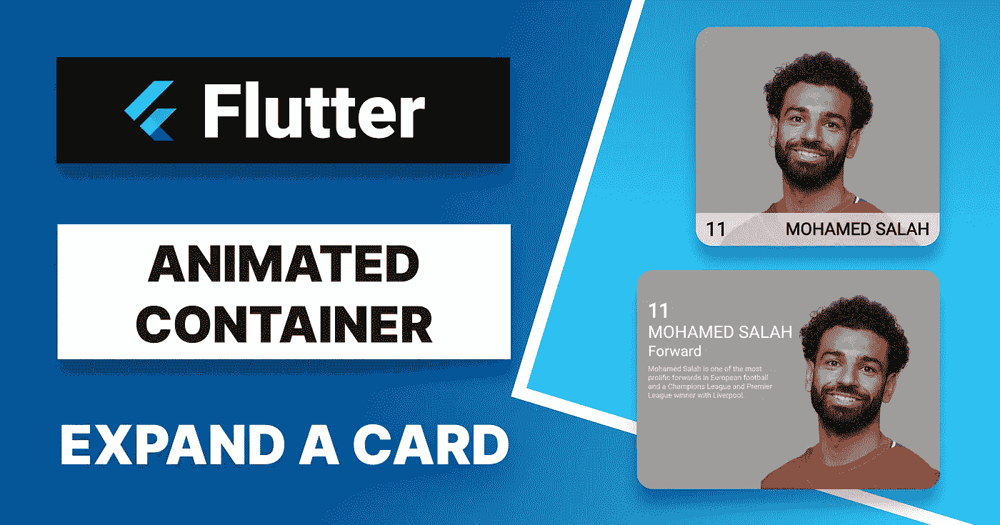
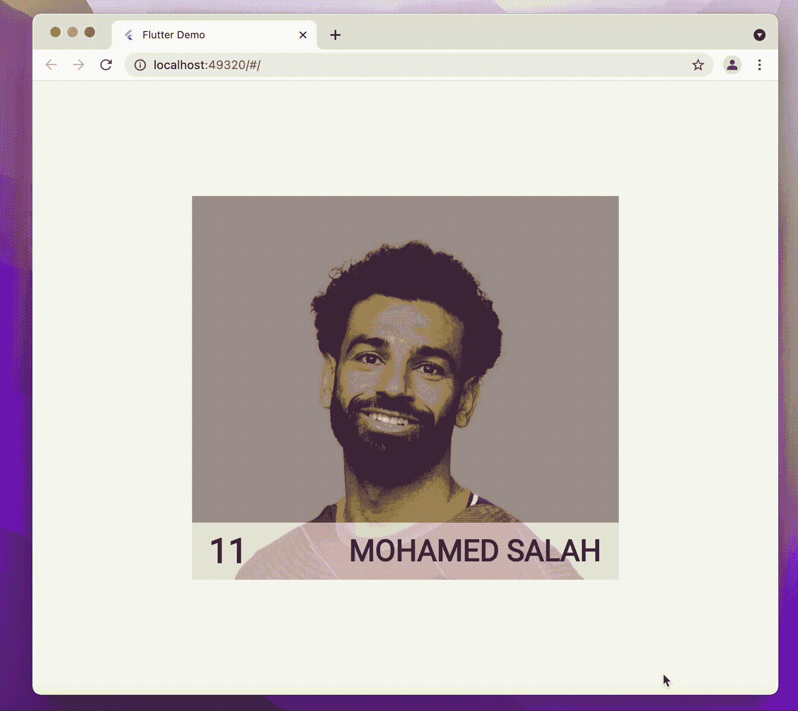
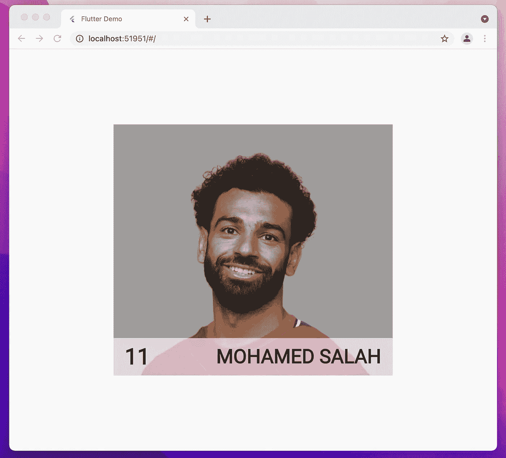
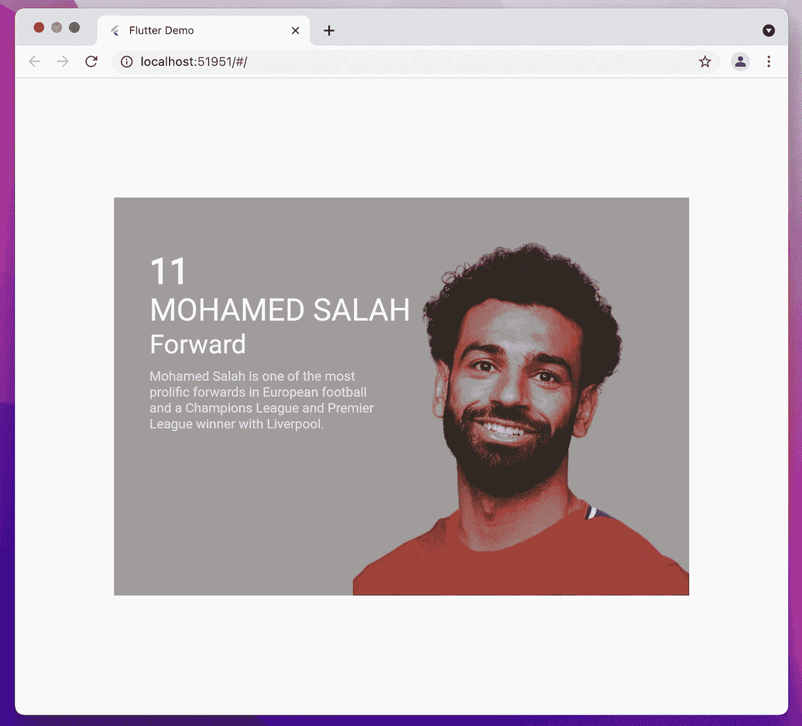

# 如何在一张卡片上创建一个漂亮的悬停效果

> 原文：<https://levelup.gitconnected.com/how-to-create-a-beautiful-hover-effect-on-a-card-in-flutter-f82a2958e235>

## 在本教程中，我将使用 AnimatedContainer 扩展一个卡片，使它看起来更好。

# 介绍

写 Dart/Flutter 文章是成为更好的软件工程师的一个很好的方法，通常被视为高级开发人员的一项技能。*写文章很重要，因为你通过与其他开发者分享你的学习成果为社区做出了贡献。另外，你可以随时重温这篇文章。*

出于这个原因，2021 年我决定在学习 Flutter 的同时写一些文章，分享一些关于 Flutter 小工具的基础知识。

在此基础上，在本教程中，我决定结合自己的兴趣(编码和足球)，在这张卡片上创造这种互动的悬停效果。

最后的结果

在本教程中，我将使用`MouseRegion`小部件来了解鼠标何时进入或退出该区域，并使用`AnimatedContainer`小部件来制作容器变化的动画，展开卡片并显示关于玩家的更多信息。

普通卡

然后当鼠标进入该区域时，卡片展开并显示其他信息。

悬停效果上的扩展卡

## 你会学到什么

本教程涵盖以下内容:

> 动画容器
> 
> 动态容量
> 
> 鼠标区域

# 动画容器

**AnimatedContainer** 是一个集成到 FlutterSDK 中的隐式动画，当新旧属性值使用提供的曲线和持续时间发生变化时，它会自动在新旧属性值之间进行动画处理。

你可以用一个特殊的属性来构建它，比如`color`，当你用一个不同的值重新构建它时， *AnimatedContainer* 会在两个值之间进行线性插值。你可以动画边框，背景图像，阴影，填充，宽度，高度等等。

动画的长度由`duration`参数和动画`curve`控制。使用动画曲线，您可以自定义效果。

在这种特殊情况下，我使用`AnimatedContainer`来制作宽度和高度值与另一个值之间的过渡动画。

# 动态容量

**animated capacity**是 **Opacity** 小部件的动画版本，它将子小部件的不透明度从一个值转换为另一个值。

对于这个小部件，设置`duration`参数来设置你想要的不透明度之间的过渡时间。一个`opacity`值等于 **0** 意味着它完全不可见，一个`opacity`值等于 **1** 意味着它完全可见。

`curve`参数控制不透明度随时间的变化。

> 就表演而言，制作动画`opacity`相对昂贵，因为它需要在缓冲区中绘制孩子，所以要小心使用。

# 鼠标区域

MouseRegion 是一个跟踪鼠标移动的小部件。当需要比较鼠标指针悬停在此帧和最后一帧之间的对象列表时，会使用它。

MouseRegion 接受`onEnter`和`onExit`参数:

*   `onEnter`当指针移动到小工具内的某个位置而没有按下按钮时触发。
*   `onExit`当鼠标指针离开该区域时触发。

在这个特殊的例子中，我使用`MouseRegion`小部件的`onEnter`来启动动画，展开卡片并显示关于玩家的更多信息。我使用`onExit`来隐藏玩家的信息，并将卡片恢复到初始形状。

# 完整的代码

希望这篇教程对你接下来的 app 开发有所帮助。在结束之前，我建议你喜欢并分享这篇文章，并留下评论。

下节课再见。😉

# 我博客上的其他故事

 [## 用 Flutter 构建一个 web 应用程序，并将其部署到 Firebase 主机上

### 在这篇文章中，在简要介绍了 Flutter 之后，我展示了一些 web 特性，我们将看到如何构建和部署一个简单的…

levelup.gitconnected.com](/build-a-web-app-with-flutter-and-deploy-it-to-firebase-hosting-3ee020b0e3db)  [## 在 Flutter 中构建漂亮的 UI

### 增强下一个 Flutter 移动应用程序设计的快速介绍指南

levelup.gitconnected.com](/building-beautiful-ui-in-flutter-8e75277aa980)