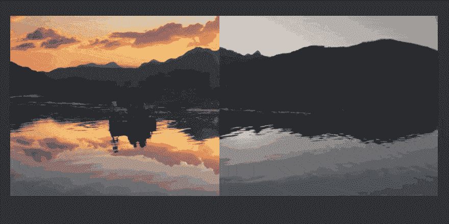
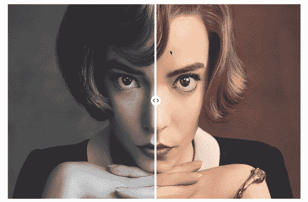
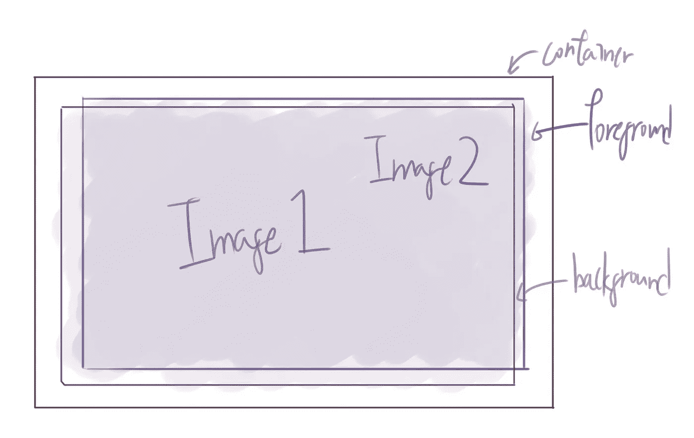
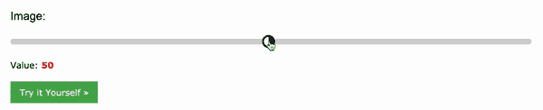
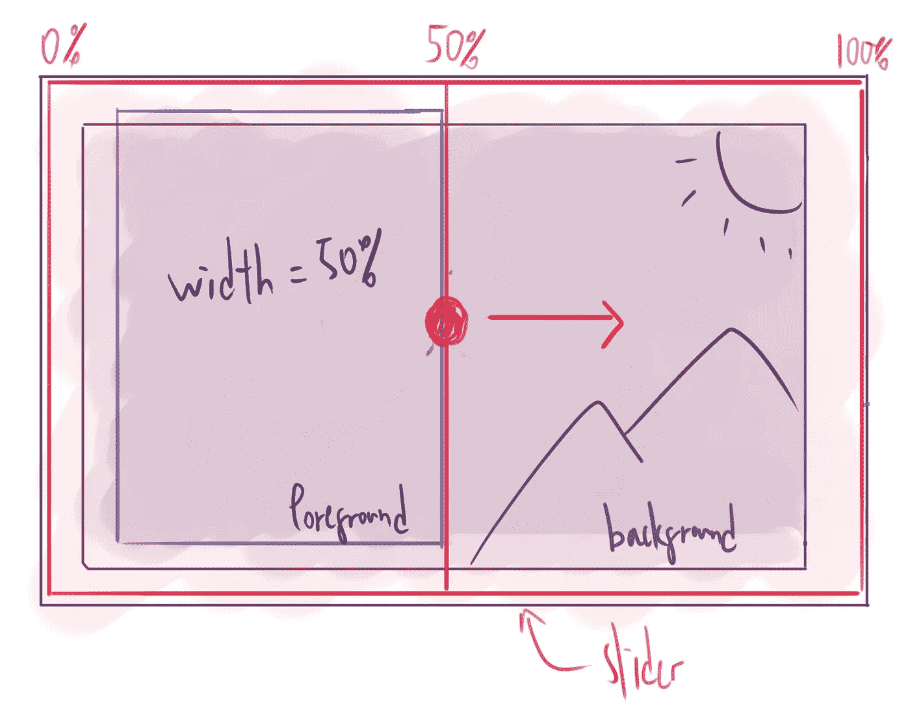
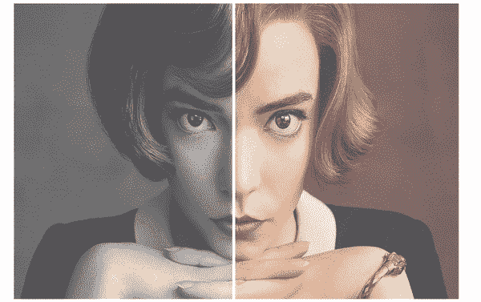
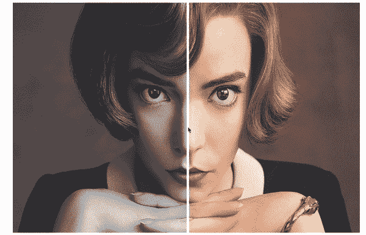

# 如何用 CSS 和 JS 创建一个“前后”图像滑块

> 原文：<https://levelup.gitconnected.com/how-to-create-a-before-after-image-slider-with-css-and-js-a609d9ba77bf>

使用 html 范围输入创建前后图像比较效果的分步教程

# 内容

1.  介绍
2.  结果演示
3.  先决条件
4.  逐步指南
5.  结论

# 介绍

如果您有两个图像进行比较，一个有效且简单的 UI 元素是“之前和之后”图像滑块。



来自谷歌的 Gif

这个“滑块”元素允许你的用户控制两个图像如何在屏幕上显示，并自由地浏览两个不同的图像。你可能认为它需要一些库来创建这样的效果，但实际上，它是一个非常直接且易于编码的 UI。有了 CSS 和 JS 的基础知识，每个人都可以创建它。

在本教程中，我将详细解释这个 UI 背后的概念，如何实现它，以及进一步增强的建议。开始编码吧。

# 结果演示



安雅·泰勒·乔伊饰演贝丝·哈蒙(女王的策略)

Codepen 演示:[https://codepen.io/josephwong2004/pen/NWRGxdR](https://codepen.io/josephwong2004/pen/NWRGxdR)

(视窗中的最佳视图> 900 像素)

# 先决条件

*   基本的 HTML、CSS 和 JS 知识
*   (可选)为了方便起见，可以使用 SCSS 和 JQuery，但是不使用它们也可以达到同样的效果

# 逐步指南

**第一步。理解概念**

这个“图像滑块”的概念非常简单。您只需要两个组件，图像容器和滑块。

图像容器只是一个普通的 div，两个相同大小的图像相互重叠。一个作为“背景”，另一个作为“前景”。



我们将使用绝对位置使前景图像直接位于背景图像之上。背景图像总是有 100%的宽度，而前景图像的宽度会根据用户输入而改变，使背景图像的一部分出现。

第二个组件是“滑块”。为了简单起见，我们可以只使用 html 的“范围”输入元素。它允许用户通过拖动在你定义最小值和最大值之间选择一个值。使用 javascript 中的事件监听器可以很容易地检索输入。

```
<input type="range" min="1" max="100" value="50" class="slider" id="myRange">
```



更多细节，请参见 https://www.w3schools.com/howto/howto_js_rangeslider.asp 的

> 使用默认滑块输入的一个缺点是，它的样式是有限的。你不能在设计上太疯狂。如果你正在寻找一个更加可定制的滑块，你可能需要自己制作。但是，这不是本教程的重点。

我们将使用容器的 100%宽度和高度制作滑块，并将其放置在图像容器的顶部。当用户拖动滑块时，我们同时更新前景的宽度。相反，创建用户的幻觉是拖动图像。



当滑块值更新时，我们将改变前景的宽度

我希望这是足够的解释。我们现在开始编码。

**第二步。创建图像容器**

让我们从创建容器开始。这是一个简单的结构，内部有两个 div。因为我们不希望我们的图像基于包含它们的 div 宽度缩放，我们将使用带有`background-image`而不是``标签的图像。我们需要使用的一个重要样式是`background-size`属性，并确保图像总是保持相同的大小。

HTML:

SCSS:

> 为了让本教程变得简单一点，我对所有东西都使用了固定大小。
> *如果不想用 SCSS，就把样式做成扁平而不是嵌套


我使用了同一个图像的两个版本(有颜色和没有颜色)，所以它们完全对齐

现在我们有了容器，让我们添加滑块。

**第三步。创建滑块**

我们的滑块需要覆盖整个图像，用一个细的白色条“分隔”图像的前后部分。这可以通过设计滑块和滑块(拖动的部分)来实现。我们需要使滑块和缩略图的默认外观不可见，然后在其上应用我们自己的样式。

HTML(图片下方):

https://www.w3schools.com/howto/howto_js_rangeslider.asp(参照[)SCSS:](https://www.w3schools.com/howto/howto_js_rangeslider.asp)

> 如果不想用 SCSS，用`@mixin center`中的内容替换`@include center`，用`.slider::-webkit-slider-thumb`替换&语法

我在滑块上应用了一个稍微可见的灰色背景，在悬停时，使颜色更加透明。当用户悬停在图像上时产生“聚焦”效果。对于 slider-thumb，它只是一个白色背景的 div，具有容器的整个高度。

> 您可能需要::-moz-range-thumb 来支持 firefox 中的浏览器



我们现在有了一个工作滑块，让我们把它和前景图像的宽度联系起来。

**第四步。将事件监听器添加到滑块**

最后一步是将滑块的值链接到前景图像的宽度。这很容易实现(因为我们使用本地 html 范围输入作为滑块)。当我们应用事件监听器时，我们可以在`event.target.value`中得到一个从 1 到 100 的值。

然后，我们只需要选择前景元素，并在滑块更新时改变它的宽度。

JS:

> 如果它没有像预期的那样工作，试着看看你是否正确地检索了滑块的值，并仔细检查你的 css 的背景尺寸属性



耶！该功能正在工作。使用范围输入的额外好处是，我们甚至可以在容器内单击，使滑块移动到单击的位置。

我们可以(或许应该)添加到 UI 中的另一件事是滑块上的“拖动我”圆形图标，作为这是一个可拖动组件的指示器。

**第五步(可选)。在滑块上添加圆形滑块**

原生范围输入有其优势(易于实现、易于检索值等)，但是当涉及到样式时，我们没有太多可以做。当我们用白色分隔线替换默认的“圆圈”时，我们需要以某种方式将圆圈添加回来。

一种快速(但不太好)的方法是添加另一个元素，它与滑块完全无关，但位于滑块的中心，并通过 javascript“跟随”滑块的移动。这正是我们要做的。

HTML:

SCSS:

> after 和 before 元素在圆形按钮内添加了两个“箭头”

JS:

我们需要做的另一件事是使这个圆不可选择，这样鼠标事件总是指向滑块。通过一些仔细的定位和 JS，我们让圆形的拇指和滑块一起移动。


这是从上面看的同一个图像。

至此，我们的“之前和之后”图像滑块完成。你现在可以选择你最喜欢的图片并进行实验。(感谢贝丝·哈蒙陪伴我们走过这段旅程)

# 结论

正如承诺的那样，这个 UI 元素的概念非常简单。你不需要为了这个效果再安装一个库。也就是说，这是一个非常基本的实现，正如你所看到的，我使用了很多固定的像素大小。如果你想要一个更“产品化”的设计，我建议花些时间研究不同尺寸的窗户设计是如何变化的。

在这个例子中，我使用了黑白图片和彩色图片的对比。但我看到了很多其他以时间变化为特征的例子(比如 100 年前和现在的同一个城市)。对于这种设计，您还可以添加一个显示当前年份的标签(类似于我们添加滑块按钮的方式)。

此外，由于我们使用了背景图像属性(不受容器大小的影响)，您也可以使用动画 gif 来轻松创建静态到移动的滑块。

如果你喜欢这个教程或者有其他想法，欢迎留言评论！

# 分级编码

感谢您成为我们社区的一员！ [**订阅我们的 YouTube 频道**](https://www.youtube.com/channel/UC3v9kBR_ab4UHXXdknz8Fbg?sub_confirmation=1) 或者加入 [**Skilled.dev 编码面试课程**](https://skilled.dev/) 。

[](https://skilled.dev) [## 编写面试问题+获得开发工作

### 掌握编码面试的过程

技术开发](https://skilled.dev)