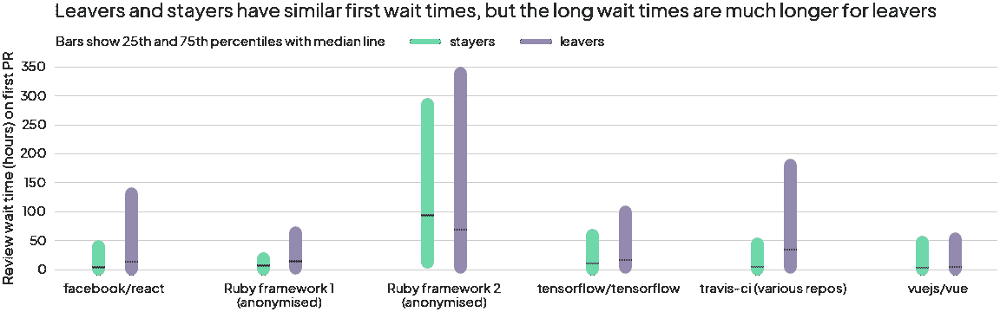
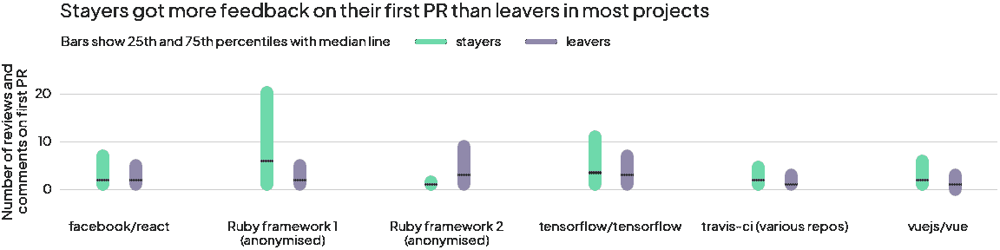
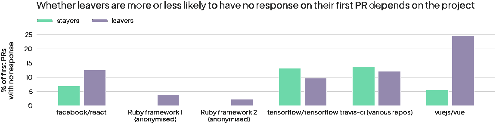
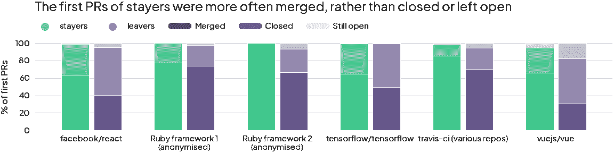

# 如何为您的开源项目创造更好的首次投稿体验

> 原文：<https://levelup.gitconnected.com/how-to-create-a-better-first-time-contributor-experience-for-your-open-source-project-27300d6085ad>


你好！我是珍妮，是 [*众*](http://multitudes.co/) *的数据科学家。我想看看我们在大众中提供的见解是否对开源软件(OSS)社区有所帮助，这是我们在技术世界中所依赖的。我与 OSS 的贡献者交谈，阅读文献，并探索从 GitHub 挖掘的数据，以确定关键挑战&机会，这些挑战和机会不仅与 OSS 相关，而且与任何希望改善团队福利、协作和交付的软件团队相关。*

# 理想的首次投稿体验是怎样的？

开放源码软件(OSS)项目是由一群志愿者推动的，他们贡献自己的时间来为公众消费构建一些东西。维护 OSS 是一项重要但耗时的工作，因此吸引并留住 OSS 项目的新贡献者是关键(在[第 1 部分](/how-to-grow-a-sustainable-inclusive-open-source-community-ce156214cc9f)和[第 2 部分](/how-does-pr-review-wait-time-affect-your-open-source-project-d79bd0af0ea3)中了解更多)。

从与 OSS 社区管理者和维护者的交谈中可以清楚地看到，如果人们感到被包容和受欢迎，他们会更有动力留下来做出贡献。这种组织文化的某些方面可以用数据来衡量——这就是我们在大众公司所做的！事实上，我们认为衡量组织福利、协作和绩效至关重要，因为尤其是在快速变化和远程工作的时代，文化问题很容易被隐藏。基于数据的洞察可以揭示瓶颈和弱点。**在这个分析中，我使用** [**GitHub 数据**](/how-to-mine-github-data-in-2022-e9c70b3f61d3) **来确定新来者在第一次公关后离开社区的潜在因素，而不是那些留下来成为定期贡献者的人。**换句话说，我在寻找**社区粘性的预测者**。

*💡流失&保留是任何组织的相关话题，不仅仅是 OSS 社区——研究 OSS 社区的文化也可以为私有软件公司提供经验。这是因为无论你去哪里，人们离开的原因都非常相似。由于 OSS 社区的成员是自愿的，人们比在公司里更容易离开，这就创造了一个更快的关于组织文化如何影响人们的反馈循环。*

# 大约 70%的贡献者是一次性贡献者

在研究留下来的人和离开的人之间的衡量标准之前，我必须对每一组人下一个定义。为了确保我的定义是现实的，我首先检查了每人每年典型的拉取请求(PRs)数量。在我的 6 个 oss 项目的 5 年数据集上，我发现 68%的贡献者是一次性贡献者，他们只为给定的回购打开 1 个 PR，然后就不再返回。很少有人每年至少提交一份简历。

鉴于上述信息，我对“留下来的人”和“离开的人”进行了如下启发式定义:

*   **Stayer:** 在他们的第一个 PR 之后，他们继续开至少 4 个 PR(没有时间限制)，在接下来的 12 个月里至少开一个。这大约是我们数据集中 10%的贡献者。
*   **离开者:**在第一次公关后，他们不会在接下来的 12 个月内再开一次公关。

这将公关作者分成了两个不均衡的群体:741 名留下来的人和 5102 名离开的人。在这里，我选择了几个潜在的社区粘性预测器，这些预测器是基于我从与开源维护者交谈和阅读学术研究中了解到的东西(参考资料部分)。

# 一旦人们等过了 PRs 的某个点，他们很可能会离开



当我们查看人们的第一个 PR 的审核等待时间(从 PR 准备好审核到第一次响应的时间——有关更详细的定义，请参见第 2 部分)时，我们发现离开者和留下者具有相似的中位数。然而，离职者往往有一个更大、更长的尾巴(我们的 6 个项目中只有一个例外)。总体而言，第 75 百分位中，离职者的审核等待时间是留宿者的 3 倍多(117 小时对 34 小时)。对于第 90 个百分位数，这一差异变为 5 倍。这意味着，虽然人们等待的时间有很大的重叠，但不管他们最终是离开还是留下，在等待响应的某个阈值之后，人们更有可能离开。每个回购的阈值都不同，但从上面的绿条来看，大多数情况下都在 72 小时以内。这与直觉和轶事证据一致，即较长的等待时间会让新人倒胃口。

我认识到这里有一个潜在的混淆变量没有被考虑，这是这两组人的 PRs 的性质。这可能是因为那些成为正式员工的人倾向于写与离职者非常不同的简历，这些简历可能更容易审阅，或者对合并更重要(因此等待时间更短)。因此，这并不是说为了留住新的贡献者，审核某人的第一份公关必须是重中之重。项目维护人员最了解他们自己的背景。通过了解最终结果(离开者等待更长时间)，我们至少可以确定事情的进展情况，并将这种洞察力反馈到社区健康的其他信号中(其中一些可能根本无法量化！).

*🌱等待审核的时间可以是几天或几周——但是关注那些已经开放很长时间的审核是很重要的。如果你时间不够，只需一个简短的信息来确认公关，并给出一个等待时间的估计，就可以帮助新人感觉被看到了。*

# 留下来的人倾向于在他们的第一次 PRs 中得到更多的反馈



对于人们得到的反馈数量，我们发现了类似的趋势，以审查等待时间，但在相反的方向。虽然每位投稿人的第一份公关报告中的评论和评论数量的中位数相似，但留下来的人比离开的人有更大、更高的分布。**这与 org psych research 的观点一致，该研究认为获得足够的支持性反馈是一个关键的成长机会。如果人们加入 OSS 是为了学习和成长，那么在你的第一次公关中获得有用的反馈可能是鼓励他们留下来的好方法！**

*🌱具体的*[](https://hbr.org/2016/04/research-vague-feedback-is-holding-women-back)**[*可操作的*](https://hbr.org/2021/02/research-men-get-more-actionable-feedback-than-women) *反馈对学习和发展至关重要。花一点额外的时间来添加代码块、链接到资源，或者对所请求的更改给出理由，这不仅分享了您对代码库的了解，还分享了您对项目的更广泛的愿景和战略优先级的了解。这有助于为贡献者最终成为维护者打下基础。***

# **不清楚在你的第一次公关中没有回应会如何影响你的去留**

****

**当我们查看审查等待时间时，我们没有考虑没有任何响应的 PRs 的数量，因此没有审查等待时间。正如我们在[第 2 部分](https://medium.com/@jennysahng/d79bd0af0ea3)中看到的，许多贡献者在他们的任何 PRs 上都没有得到回应，我们可以想象这对第一次贡献者来说是令人沮丧的。然而，在离开者和留下者之间，对贡献者的第一次拉动请求没有回应的比率似乎没有任何一致的差异。我们观察的 6 个项目在不同的方向上，两组之间有微小的差异。这里没有结论！**

# **留下来的人第一份简历被接受的几率更高**

****

****在*所有*组织中，留下来的人第一次公关被合并的比率比离开的人高！**这与直觉相符——如果你的第一次公关尝试被接受(合并),你可能会比第一次公关被拒绝(关闭)或被搁置(仍未关闭)更受鼓励在未来再次做出贡献。**

**🌱如果一个公关需要结束而不是合并，并且这是作者的第一个公关，我们如何以一种最大限度减少沮丧的方式沟通？有没有一个简单的反馈模板，新的维护人员可以遵循来做到这一点？是否有改变流程的机会，比如引导他们去完成另一项他们可以接手的任务？**

# **其他潜在预测因素**

**上述指标只是贡献者粘性的许多潜在预测因素中的四个，也是观察它们的一种时间点方式。像许多探索性数据分析一样，我带着比开始时更多的问题离开了！以下是我将来想探索的一些问题:**

*   ****时间趋势:**从 2017 年到 2021 年，所有这些项目都发生了巨大的变化。我很想了解这些指标通常如何随着社区的发展和成熟而变化(更不用说疫情的影响了！).**
*   ****训练模型以找到粘性的最佳预测指标:**我们可以通过根据上述指标训练模型来了解哪些因素对保留最重要，以了解哪些因素是最佳的。其他功能的一些想法可能包括 PR 上的审核状态(批准与请求更改)、PR 对话中参与者的数量和性质，以及第二次 PR 上的类似指标(以验证第一印象是否真的很重要)。**
*   ****分别分析维护者和贡献者:**由维护者创建的 pr 对于贡献者来说可能有非常不同的模式。**
*   ****PR 大小:**“离职者”是否创建了更大的首个 PR，因此需要更长的时间来审核？**
*   ****PR“质量”**:是不是“留守者”的工作做得更好，所以更好的得到了审稿人的好评？他们的 PR 是否更好地遵守了贡献标准，因此更有可能获得批准，从而获得顺利的 PR 体验？**
*   ****网络联系:**“留下来的人”与其他贡献者和维护者有更多的联系，所以 a)他们有更多的社会动机留下来，b)所以人们认出了他们的名字，并做出更多的努力来回应？**
*   ****人口统计分析:**不同人口统计的首次投稿体验有差异吗？**
*   ****地点分析:**不同地点的贡献者有差异吗？某些地区的人更受欢迎吗(例如美国、欧盟)，还是和其他活跃贡献者在同一个地区/时区更好？**

# **结论**

*   **“留守者”很少——68%的贡献者是一次性贡献者，他们只为给定的回购打开 1 个 PR，然后就不再返回。很少有人坚持不懈地为一个项目做贡献。**
*   **离职者更有可能等待更长时间的评估。
    👉行动:如果你需要一段时间来做公关，留下一张简短的便条来感谢做出贡献的人&给他们一个时间框架的概念。**
*   **离职者在第一份 PRs 中得到的反馈比留任者少。
    👉行动:在编写代码评审时，要以具体的、可行的反馈为目标，并且要有正当的理由。这将有助于提高你所在社区的技能水平，支持继任计划。**
*   **留下来的人比离开的人有更高的第一次公关被合并的比率。
    👉行动:如果你需要结束一次公关，要机智地沟通&理想情况下，给他们指出一个他们可以接手的新任务。**

**总的来说，这些数据符合直觉，即更“愉快”的首次公关体验(更短的等待时间、得到回应、更多的反馈和公关合并/接受)与首次投稿者成为常客的更高机会相关。你将如何建立你的团队流程和文化来使这些经历成为规范？这不仅适用于开源项目，也适用于任何软件团队。积极的贡献体验对于提高员工参与度、工作满意度、创造性解决问题和快速交付至关重要。**

```
**Enjoyed this series on open source & community health, or want to learn more about how you can measure these team health indicators in a thoughtful, human-centric way? **Multitudes provides engineering effectiveness metrics, without the creepiness**. We’d love to hear from you 🌱👉 [Apply to join our closed beta](http://multitudes.co/)!
👉 Send us your feedback, questions, and thoughts via [Twitter](https://twitter.com/MultitudesCo), [LinkedIn](https://www.linkedin.com/company/multitudesco/), or [hello@multitudes.co](mailto:hello@multitudes.co)**
```

# **资源**

## ****给项目维护人员和评审人员的提示****

*   **[如何建设性地对公关说不的模板](https://cloudblogs.microsoft.com/opensource/2021/02/03/maintainers-spotlight-kent-dodds-open-source-testing-library/)Kent c . Dodds(Ctrl+F 代表“如何对公关说不？”)**
*   **[帮助新人成为开放项目贡献者的十条简单规则。艾尔。(2019).](https://www.ncbi.nlm.nih.gov/pmc/articles/PMC6742214/)**
*   **[开源指南为维护者提供的最佳实践](https://opensource.guide/best-practices/)**
*   **[通过开源指南构建欢迎社区](https://opensource.guide/building-community/)**

## **关于社区粘性潜在预测因素的文献**

*   **李，于，杨，王，田，尹，李，王，洪(2021)。你还在做这个关于放弃拉式请求的实证研究吗？软件工程汇刊。[链接](https://ieeexplore.ieee.org/abstract/document/9332267)。**
*   **林(2017 年 5 月出版)。全球工业开源项目中的开发人员流动:应用生存分析的见解。2017 年 IEEE 第 12 届全球软件工程国际会议(ICGSE)(第 66–75 页)。IEEE。[链接](https://ieeexplore.ieee.org/abstract/document/7976690)。**
*   **Steinmacher，I .，Wiese，I .，Chaves，A. P .，& Gerosa，M. A. (2013 年 5 月)。为什么新人会放弃开源软件项目？。2013 年第六届国际软件工程合作与人类方面研讨会(CHASE)(第 25-32 页)。IEEE。[链接](https://ieeexplore.ieee.org/abstract/document/6614728/)。**
*   **Steinmacher，I .，Silva，M. A. G .，Gerosa，M. A .，& Redmiles，D. F. (2015)。关于开源软件项目新手所面临的障碍的系统性文献综述。*信息与软件技术*， *59* ，67–85。[链接](https://www.sciencedirect.com/science/article/pii/S0950584914002390)。**
*   **Yu，y .，Wang，h .，Filkov，v .，Devanbu，p .，& Vasilescu，B. (2015 年 5 月)。github 上拉请求评估延迟的决定因素。2015 年 IEEE/ACM 第 12 届挖掘软件库工作会议(第 367–371 页)。IEEE。[链接](https://ieeexplore.ieee.org/abstract/document/7180096/)。**

# **分级编码**

**感谢您成为我们社区的一员！在你离开之前:**

*   **👏为故事鼓掌，跟着作者走👉**
*   **📰查看[升级编码出版物](https://levelup.gitconnected.com/?utm_source=pub&utm_medium=post)中的更多内容**
*   **🔔关注我们:[Twitter](https://twitter.com/gitconnected)|[LinkedIn](https://www.linkedin.com/company/gitconnected)|[时事通讯](https://newsletter.levelup.dev)**

**🚀👉 [**加入升级人才集体，找到一份神奇的工作**](https://jobs.levelup.dev/talent/welcome?referral=true)**