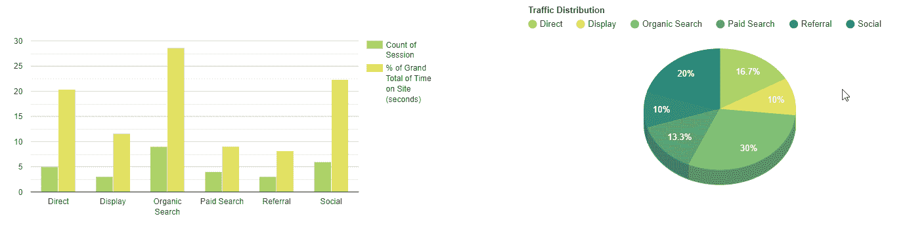

# 如何使用数据透视表和图表库创建 BI 仪表板

> 原文：<https://levelup.gitconnected.com/how-to-create-a-bi-dashboard-using-a-pivot-table-and-a-charting-library-3ade66b55600>

## 在应用程序中实现创造性商业智能数据可视化的分步教程

想到*数据分析*，大概首先想到的就是电子表格数据。但是数据分析不仅仅是数字和干巴巴的文字。如果方法正确，并与*可视化组件*相结合，分析能够彻底改变你做生意的方式，并将它带到一个新的发展水平。

无论你在哪个行业工作，我都深信数据可视化是劳动力市场需要的顶级技能。这就是为什么今天我想描述如何在**旋转**和**图表**的帮助下最大限度地发挥你演讲的潜力。

遵循这些指南，最后，您将学习如何创建一个带有数据透视表和图表的交互式**仪表板**。在我们的例子中，交互性仅仅意味着应用于报告的所有更改都将立即反映在图表中。

这种数据可视化技术有助于实现有效的报告和做出明智的决策。听起来很有趣？我们继续吧。

# **开始前要记住的事情**

让我给你一些视觉化的建议:

*   选择汇总数据的工具。
*   选择正确的图表，使用自然的颜色模式。
*   了解你的领域和受众来传达重要信息。

整个过程非常简单，你只需要知道 JavaScript 的基础知识就可以开始了。我将为您提供演示中的代码。如果你想马上得到结果，请查看文章末尾的 CodePen 演示。

# **分析工具**

我们将使用以下提供数据汇总和可视化功能的工具:

1.  **Flexmonster 数据透视表** —一个数据透视表组件，丰富了基本和高级报表功能—聚合、过滤、排序、内置导出和定制。由于是用 JavaScript 编写的，它可以很容易地嵌入到应用程序中。
2.  **谷歌图表**——一项网络服务，被证明是最流行的图表制作工具之一。由于易于理解的 API，使用起来很简单。有足够的可用图表类型列表，可以根据任何设计要求进行定制。

开始吧！

# 第一步:准备好你的资料

在本教程中，我们编写了一个返回 JSON 对象数组的函数。

这是我的营销数据集的一个例子:

在这个阶段，我鼓励你选择自己的数据。

# **第二步:**在表中定义一个报表

我遵循了《Flexmonster 快速入门指南》中的说明，这本指南看起来对初学者很友好。结果——组件被构建到我的项目中。

现在是时候回答*你想在表格和图表上看到什么了*。

在这份报告中，我想按流量对我的网站上的会话进行分类，并查看在某段时间内有多少会话。此外，我想检查用户在网站上花费的时间百分比。

让我们为报告准备**切片。**

将字段放入列、行和度量中，并为度量定义聚合函数。

# 第三步:连接谷歌图表

首先，添加 Google Charts 的[加载器，将它的脚本包含到网页中。其次，添加 Flexmonster 的连接器:](https://developers.google.com/chart/interactive/docs/basic_load_libs/?r=gt)

添加以下代码片段以加载包，并设置一个回调以了解何时加载图表:

# **第四步**:将数据发送到图表

现在使用**flex monster . Google charts . get data()**方法在图表中显示来自网格的数据。它为特定类型的图表执行数据的预处理。将回调函数传递给此方法，这些函数在数据加载到表中或更新时被触发。

定义负责创建和绘制图表的功能。不要忘记选择它的类型:

现在，您已经设置了所有基本功能，让我们继续进行高级定制。

## **奖金**

如果您想突出最有说服力的数据，并以报告的独创性给同事或朋友留下深刻印象，请尝试使用“条件格式”功能。让我给你看看我有什么:

我已经为数据透视表实例设置了“条件”。为了不放置太多代码，你可以在教程最后的演示中看到细节。

现在，图表中的颜色与单元格的颜色相对应，分析仪表板就可以使用了。

**结论**

让我们总结一下我们通过这个简单的教程所取得的成果:

*   数据透视表嵌入在我们的 web 应用程序中。它填充了我们想要分析的数据。
*   图表显示表中的内容，并对报告中的任何更改做出反应。尝试动态更改报告中的数据:**拖动** & **放下**字段，过滤记录，看看图表是如何变化的。

我希望你喜欢本教程所取得的成果。我期待你的反馈。

**有用链接**

*   [Flexmonster 数据透视表&图表:演示](https://www.flexmonster.com/demos/pivot-table-js/?r=gt)
*   [谷歌图表库](https://developers.google.com/chart/interactive/docs/gallery/?r=gt)
*   [带完整代码的 CodePen 演示](https://codepen.io/ronika/pen/MzPpxr)。

 [## 学习 JavaScript -最佳 JavaScript 教程(2019) | gitconnected

### 排名前 64 的 JavaScript 教程。课程由开发者提交并投票，使您能够找到最好的…

gitconnected.com](https://gitconnected.com/learn/javascript)