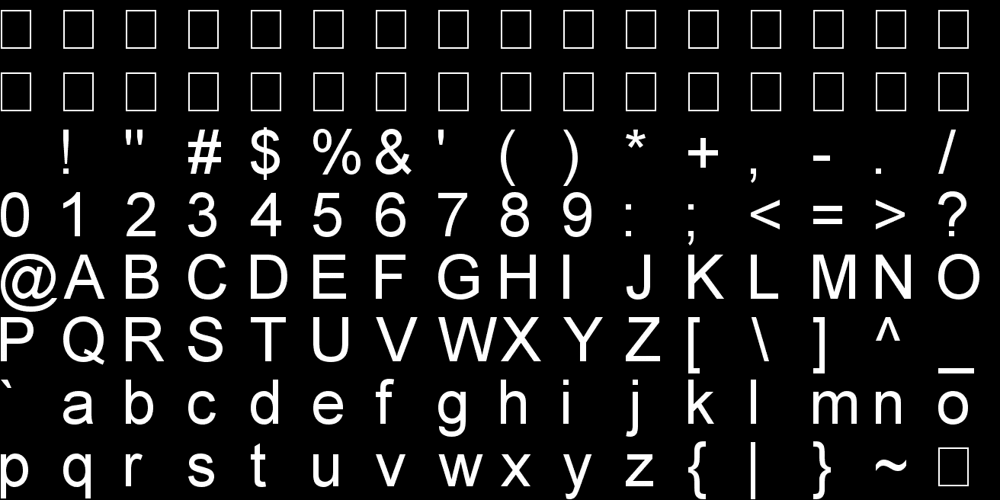
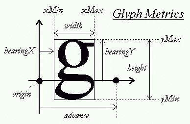
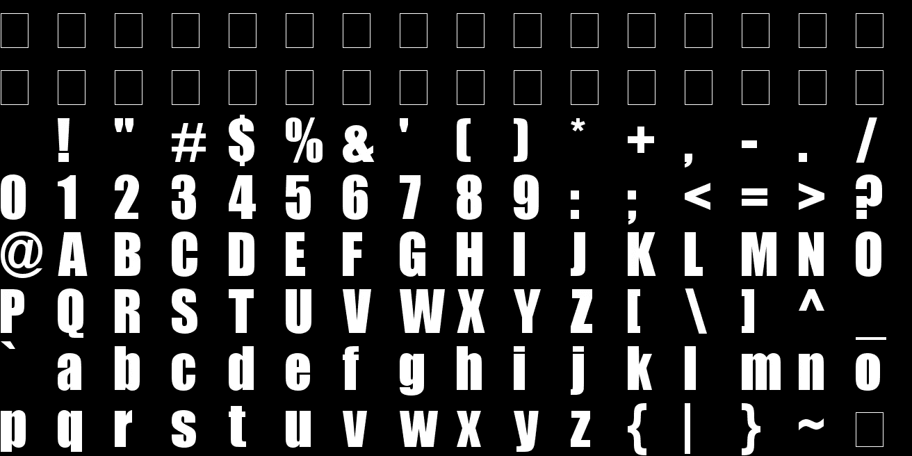

# 如何用 FreeType 创建位图字体

> 原文：<https://levelup.gitconnected.com/how-to-create-a-bitmap-font-with-freetype-58e8c31878a9>

## 为 OpenGL、DirectX 或 Vulkan 创建位图字体纹理的简单 C++解决方案

使用本教程中的位图字体生成器创建的位图字体。

位图字体是在 OpenGL、DirectX 或 Vulkan 等计算机图形 API 中呈现文本的常用方式。位图字体是一种很大的纹理，上面有所有的 [ASCII](https://en.wikipedia.org/wiki/ASCII) (或更多)字符。然后，可以通过为每个字母创建一个四边形并应用位图字体纹理的正确部分来渲染文本。

# 如何创建位图字体纹理？

有很多方法可以得到位图字体。第一种是从网上下载一个(只要谷歌*位图字体纹理*你就会找到一个)。但是，如果您正在寻找特定大小的特定字体，您可能找不到它。

第二种选择是使用位图字体生成器。有[离线](https://www.angelcode.com/products/bmfont/)和[在线](https://snowb.org/)工具，可以从任何大小的任何字体文件创建位图字体纹理。与下载随机的位图字体相比，这无疑是一个进步。

然而，在创建位图字体时，有一个更好的解决方案:你可以用 [FreeType 库](https://www.freetype.org/)从任何字体文件中直接创建它们。

# 用 FreeType 创建位图字体

让我们来看看如何使用 FreeType 创建位图字体纹理。第一步是[下载 FreeType 库](https://www.freetype.org/)并将其添加/链接到您的项目。然后我们可以写一些代码来自动生成位图字体。

我们想创建一个简单的函数，它可以从一个字体文件中生成一个位图字体，并将其保存为图像，所以我们的类定义非常简单。它只接受我们想要的字体的文件名和大小以及结果的文件名作为参数。

## 初始化自由类型

在函数的实现中，我们要初始化 FreeType 库，然后用它来加载字体，设置我们的字体大小，这只需要几个 FreeType 函数。

现在我们可以为位图分配一些内存。因为有 128 个 ASCII 字符(尽管前 32 个不可打印)，所以我们需要一个有 128 个图块的图像，并将其分成 8 行，每行 16 列。我们还在字体大小上增加了 2 个填充像素，这样当结果纹理缩放不良时就不会有纹理溢出。

## 字符度量

接下来，我们必须包括一些字体度量计算，以找出我们的字体基线在哪里。像 *g* 或 *y* 这样的一些字符会低于基线，所以如果我们只在每个区块的底部绘制字符，它们会溢出到下面的区块中。

为此，我们遍历所有可打印字符并加载每个字形图像，以访问字形度量。通过从字符超出基线的高度(bearingY)中减去字符的总高度，我们可以找出它低于基线的程度。然后，我们找到它的最大值，并在创建图像时将所有字符上移该值。

FreeType 中的字形度量，图像来自[freetype.org](https://www.freetype.org/freetype2/docs/glyphs/glyphs-3.html)。

## 画人物

此时，我们已经准备好将我们的字符绘制到位图上了。我们遍历每个字符，加载字形，然后使用`FT_Render_Glyph`函数让 FreeType 找出如何将基于矢量的字形转换为抗锯齿位图。然后，在将 FreeType 中的单个字符位图复制到我们的大位图图像的正确位置之前，我们需要一点数学知识来正确对齐字符。

现在复杂的事情已经结束，我们只需要将位图保存到一个文件中。[这里是这个](https://gist.github.com/pingpoli/a9386d8ade20d3ec8f1ce81067877010)的代码，或者只看教程底部的完整代码。

使用本教程中的位图字体生成器创建的另一个不同字体的位图字体图像。

# 使用

使用位图字体生成器非常简单。只需给它一个字体文件和你想要的大小以及你输出的文件名(在 Windows 上你可以在`C:/Windows/Fonts/`中找到你安装的字体的实际字体文件)。

# 字符宽度

如果你仔细看看代码，你可能会注意到我们也存储每个字符的宽度并保存到一个文件中。如果使用等宽字体(即每个字符宽度相同的字体)，可以忽略字符的宽度。然而，大多数字体使用不同宽度的字符，因为像 *i* 和 *m* 这样的字符通常具有非常不同的宽度。当使用这种字体进行文本呈现时，我们需要知道每个字符前进到下一个字符的正确值有多宽。因此，我们还将字符的宽度存储在一个文件中，并在呈现文本时使用位图图像之外的信息。

# 笔记

在本教程中，我们将图像保存为位图，因为位图无需任何外部库即可轻松保存。然而，我们的缓冲区还包括一个 alpha 通道，所以我们可以将图像保存为 png，以保持透明度值。事实上，我们根本不需要保存图像。我们也可以直接从缓冲区创建一个纹理，并立即将其用于文本渲染。

用 FreeType 从字体文件直接创建位图字体是一种简单方便的处理位图字体的方法，用于在计算机图形中渲染文本，我在我的 OpenGL 游戏引擎中使用了一个非常类似的系统。正如你所看到的，它不需要很多代码来自动创建图像，并且当这样做时，有很多额外的定制空间。

# 资源

*   [BitmapFontGenerator.hpp](https://gist.github.com/pingpoli/7d53c5d6fb13cddfbb62ee391323f30c)
*   [BitmapFontGenerator.cpp](https://gist.github.com/pingpoli/b651433ad666a7f48ff2fad7a486e28d)
*   [FreeType 库](https://www.freetype.org/)

你喜欢这样的内容吗？通过加入 Medium ，可以无限制地访问所有故事，并支持我和其他作者。如果你通过此链接注册，你的一部分会员费将归我所有。