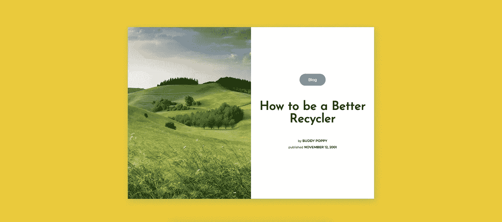

# 如何使用 Flexbox 创建带有 CSS 的博客文章预览布局

> 原文：<https://levelup.gitconnected.com/how-to-create-a-blog-post-preview-layout-with-css-using-flexbox-c616f0fd0b10>

## 我们使用 flexbox 的基础来帮助创建这个极简的博客文章预览布局。



在本文中，我们将学习如何使用 CSS flexbox 创建这个受 [dribbble post 启发的](https://dribbble.com/shots/7861612-Blog-Article-Webpage)极简博客预览帖子。以下是最终结果:

# 创建标记

首先，让我们从创建整体布局的标记开始。

```
<body>
  <div class="container">
    <div class="blog">
      <div class="img"></div>
      <div class="blog-name">
        <div class="blog-category">Blog</div>
        <h1>How to be a Better Recycler</h1>
        <div class="details">
          <p class="author"><span>by</span> Buddy Poppy</p>
          <p class="date"><span>published</span> November 12, 2001</p>
        </div>
      </div>
    </div>
  </div>
</body>
```

分解一下，实际的博客内容在 div 元素中，带有一个类`.blog`。

```
<div class="blog">
    <div class="img"></div>
    <div class="blog-name">
        <div class="blog-category">Blog</div>
        <h1>How to be a Better Recycler</h1>
        <div class="details">
            <p class="author"><span>by</span> Buddy Poppy</p>
            <p class="date"><span>published</span> November 12, 2001</p>
        </div>
    </div>
</div>
```

为了用 flexbox 创建这种布局，我们必须从盒子的角度来考虑博客文章的布局。我们有自己的主箱或容器，即`<div class=”blog”>`。

在`.blog`盒子里，我们有两个半盒子:

右半框是图像框，`<div class=”img”></div>`。

左半框是包含所有博客文章细节的框，`<div class=”blog-name”>`。

在`.blog-name`箱内，我们有三个成排的箱子:

第一行包含类别名称 Blog，`<div class=”blog-category”>Blog</div>`。

第二行是博客标题，`<h1>How to be a Better Recycler</h1>`。

第三行也是最后一行保存了博客文章的详细信息，比如作者和发布日期。

当使用 flexbox 时，将我们的内容想象成一个大盒子，在主盒子里面是按行或列排列的小盒子是很有帮助的。

接下来，我们创建 CSS 标记。

# CSS 标记

下面是我们的`.blog` div 的 CSS 标记。重要的是我们将`display`设置为`flex`并将`flex-direction`设置为 row。我们希望盒子的两半并排放置，而不是叠放在一起。

```
.blog{
  width: 1000px;
  height: 700px;
  background-color: white;
  display: flex;
  flex-direction: row;
  box-shadow: 4px 7px 29px 0px rgba(69,69,69,0.3);
  margin: 30px;
}
```

现在，我们可以在`.blog`容器中设置两个盒子的样式。我们将设计容器的左半部分。除了添加一个背景图片并将我们的`width`设置为`50%`之外，这里没有什么真正重要的东西。

```
.img{
  height: 100%;
  width: 50%;
  background: url('[https://images.unsplash.com/photo-1506260408121-e353d10b87c7?ixlib=rb-1.2.1&ixid=eyJhcHBfaWQiOjEyMDd9&auto=format&fit=crop&w=2600&q=80'](https://images.unsplash.com/photo-1506260408121-e353d10b87c7?ixlib=rb-1.2.1&ixid=eyJhcHBfaWQiOjEyMDd9&auto=format&fit=crop&w=2600&q=80')) no-repeat center center;
  background-size: cover
}
```

对于图像的右半部分，我们使用`display: flex`，如上所述，这个部分将包括额外的方框。

我们希望将`.blog-name` div 中的内容排列成一个堆叠在另一个之上，为此，我们编写了`flex-direction: column`。我们希望一切水平和垂直居中，所以我们将`justify-content`和`flex-direction`都设置为`center`。

```
.blog-name{
  height: 100%;
  width: 50%;
  display: flex;
  flex-direction: column;
  justify-content: center;
  text-align: center;
  align-items: center;
  font-family: 'Montserrat', sans-serif;
}
```

我们现在已经在 flex 的帮助下完成了总体布局的创建。布局的其余部分可能或多或少会有所不同，这取决于您想要如何设置样式，但这里是用于`.blog-name`类中所有内容的 CSS 的其余部分。

```
.blog-name h1{
  font-family: 'Josefin Sans', sans-serif;
  font-size: 50px;
  margin-top: 50px;
  cursor: pointer;
  padding: 10px 30px;
}.blog-category{
  background-color: #69B1B5;
  font-size: 15px;
  padding: 15px 35px;
  border-radius: 50px;
  color: white;
}.details{
  line-height: 13px;
}.details p{
  font-weight: bold;
  text-transform: upperCase;
  font-size: 13px;
}.details p span{
  font-size: 12px;
  font-weight: normal;
  text-transform: lowercase;
}
```

# 结论

我们使用 CSS flexbox 创建了一个简单的博客文章布局。在创建使用 flexbox 的布局时，我们还学习了如何将布局视为盒中盒。这些盒子居中吗？它们是按列还是按行排列的？虽然 flexbox 不仅仅是堆叠或居中盒子，但对于基本的东西，这些问题你可以问自己。