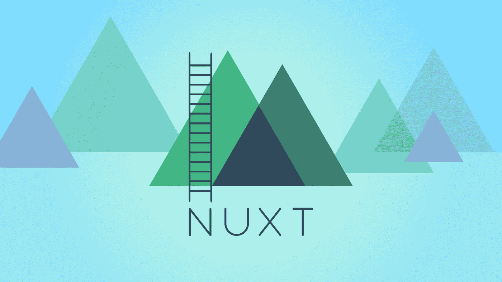

# 如何创建包含 Vue 和 Nuxt 内容的博客

> 原文：<https://levelup.gitconnected.com/how-to-create-a-blog-with-vue-and-nuxt-content-f8f0d58cf8bb>

## 是时候创建自己的博客了

这个故事解释了如何在 VueJS 和 Nuxt 内容的帮助下做到这一点。



# 介绍

在脑子里考虑了一会儿这个想法后，我决定自己写一篇博客。

我博客的目的是就各种 ICT 主题撰写有趣的文章。我知道，我不是第一个。但是也许，只是也许人们确实喜欢我的写作风格。我知道的唯一检查方法就是开始。—或者耐克会说“只管去做！”—

> 此外，拥有一个博客也向你未来可能的老板表明你渴望学习和帮助他人！

# 堆栈

我开始寻找一种方法来建立一个博客网站，使用 CMS 轻松发布新文章。为此，我决定使用果酱栈。JAM 代表 Javascript、API 和标记。预先生成各种 HTML 页面并放在服务器上。我想在 markdown 中写我的博客，这样它们——以及网站的其他代码——也可以保存在库中。因此，我实际上跳过了 A 步骤，这给了我一个 JM 堆栈。还是因为降价而成为 JMM 堆栈？谁知道呢。

以下是我选择果酱叠的个人原因:

*   创建自定义网站既快速又简单
*   JAM 对我来说是一个新概念，通过它我可以获得新的知识
*   它可以无服务器托管，这意味着更少的设置、维护和资金

# 计划和挑战

这是我对我的博客的想法:

*   超快速渲染
*   优化搜索引擎优化
*   用 NuxtJS 构建
*   用 Markdown 写的博客
*   [上的无服务器托管](/a-website-with-a-custom-domain-for-less-then-1-for-a-year-fb1fff6f7759)上的网络托管
*   Disqus 处理的评论

简而言之，我将用 NuxtJS 创建一个将在 Netlify 上托管的博客。最重要的挑战是让所有动态元素在后台顺利工作。我指的是动态元素:标签、类别和一些搜索引擎优化的特定主题，比如创建一个网站地图。

# 为什么是 NuxtJS？

我已经在几个项目中使用了 VueJS，效果非常好！对于这个项目，我的计划是再次使用 VueJS，当你想创建一个静态网站时，使用 [NuxtJS](https://nuxtjs.org/) 是与 VueJS 结合的合理选择。在对 NuxtJS 做了进一步的研究后，发现博客可以通过使用 [nuxt/content](https://content.nuxtjs.org/) 用 markdown 编写。这样，我就完成了计划的一部分。

# 安装 NuxtJS

在创建 NuxtJS 项目之前，您需要能够使用 [npx](https://www.npmjs.com/package/npx) 。Npx 标配 NPM `>5.2.0`。现在我们只需要在 CLI 的帮助下创建一个 NuxtJS 项目。在您想要的项目文件夹`npx create-nuxt-app <project-naam>`中运行下面的命令。在这个过程中，您将选择您的包管理器，林挺，CSS 框架和测试框架选项。然后选择`nuxt/content`创建降价文件，选择`static`渲染模式。就这样，你现在有了一个 NuxtJS 网站！

您可以通过运行以下命令来查看您的站点:

```
$ cd <project-name>
$ npm run dev
```

# 你的第一篇文章

在内容文件夹中创建一个文件夹，其中将包含您的所有博客。我给我的取名为`/content/articles/`。下面的例子向你展示了第一个博客的样子。我把我的第一个博客命名为`my-first-blog.md`(扩展名改为`.mdd`，否则 gist 已经把它格式化为 markdown 了😂)

正如您在示例中看到的，标题部分使用了 YAML。在这个页眉中，写入了可以在其他页面上重复使用的信息。这对于在博客概述页面上显示博客的简短描述非常有用。对于标签部分，我创建了动态页面来显示具有相同主题/标签的所有博客。这使得用户可以非常容易地找到相关的博客。

# URL 的结构

在一个 NuxtJS 项目中，URL 是根据文件夹和文件结构自动生成的。我更喜欢把我的博客放在一个单独的文件夹里，以防我也想在网站上发布我的个人项目。这就是我选择以下网站结构的原因:

```
koenvanzeijl.nl                     /// Homepage
koenvanzeijl.nl/blog                /// See all posts
koenvanzeijl.nl/blog/my-first-blog  /// Single blog koenvanzeijl.nl/tag/vue             /// All relating posts
```

要实现这个 URL 结构，您需要如下设置您的项目:

```
pages/index.vue                    /// Homepage
pages/blog/index.vue               /// See all posts 
pages/blog/_slug.vue               /// Single blog 
pages/tag/_slug.vue                /// All relating posts
```

名为`_slug.vue`的文件将拾取其文件夹中的所有请求，实际的请求作为参数在`params.slug`中传递。

# 单个博客文件

下面是一个简化的`pages/_slug.vue`博客页面示例。它从降价元信息中获取图像、标签和标题。

创建此文件后，您可以通过导航到`http://localhost:3000/blog/my-first-blog`来查看您的第一个博客。恭喜你！你创建了你的第一个博客。现在我们只需要对它的功能做一点解释。在`_slug.vue`文件中，博客被函数`asyncData()`获取。该方法通过传递的`params.slug`参数定义要检索哪个博客。获取博客后，`article`可以在你的视图中使用，标题数据可以很容易地从中提取出来。

引人注目的是，我使用的是`article.createdAt`,而它并没有放在标题 YAML 中。这是 nuxt/content 自动传递的属性之一。

这些是默认情况下可以利用 nuxt/content 检索的属性:

*   **正文:**博客正文
*   **目录:**包含您的博客的文件夹
*   **扩展名:**博客文件扩展名(。在这个例子中是 md)
*   **路径:**博客的路径
*   **鼻涕虫:**博客鼻涕虫
*   **toc:** 一个包含目录的数组
*   **创建日期:**创建日期
*   **更新日期:**最后更新日期

要查看所有博客(`/pages/blog/index.vue`)，可以使用 nuxt/content API 来检索数据。下面是另一个例子:

使用 nuxt/content 模块中的`sortBy()`可以很容易地对文章进行分类。您可以扩展这个视图，例如，将描述放在`v-for`循环中。

# 标签

标签页的模板与上面的页面几乎相同。唯一的区别是标签在`asyncData()`方法中被过滤。

# 网站地图

最后，我们需要一个网站地图来方便地索引博客。然而，动态博客页面使这变得有点困难，所以我们必须安装另一个 NuxtJS 模块来实现这一点。即 nuxt/sitemap。运行以下命令`npm install @ nuxtjs/sitemap`来安装 nuxt/sitemap。

安装完 sitemap 模块后，您需要编辑 nuxt 配置文件，这样就完成了。

仅此而已！我们刚刚创建了一个博客网站，每个博客有一个页面，博客概述有一个页面。我们还在`sitemap.xml`中为每个页面生成一个条目。现在我们运行命令`npm run generate`，它将创建一个`dist` 文件夹，并将你发布的网站放在那里，你可以在任何你想要的地方托管网站！在另一个故事中，我解释了我如何在 Netlify 上主持我的博客。

[](/a-website-with-a-custom-domain-for-less-then-1-for-a-year-fb1fff6f7759) [## 一个自定义域名的网站，一年的费用不到 1 美元

### 你刚刚编写了有史以来最好的网站，但是你如何发布你的网站和它的自定义域名，同时考虑…

levelup.gitconnected.com](/a-website-with-a-custom-domain-for-less-then-1-for-a-year-fb1fff6f7759) 

# 博客的优化

正如你所阅读的，你可能会看到这是一个新的博客，可以使用一些优化。一些想法是:

*   优化 NuxtJS 中的网站图像
*   自动将博客发布到 Instagram
*   优化降价文件中的图像

你有什么想法/建议或其他有趣的事情吗？请在评论中告诉我。


[https://ko-fi.com/koenvanzeijl](https://ko-fi.com/koenvanzeijl)

# **资源**

*   主框架的 [NuxtJS](https://nuxtjs.org/)
*   [用于写入降价的 nuxt/content](https://content.nuxtjs.org/)
*   [托管网站的 Netlify](https://medium.com/r?url=https%3A%2F%2Flevelup.gitconnected.com%2Fa-website-with-a-custom-domain-for-less-then-1-for-a-year-fb1fff6f7759)

*最初发布于*[*https://www . koenvanzeijl . nl*](https://www.koenvanzeijl.nl/blog/blog-with-vue-nuxt)*。*