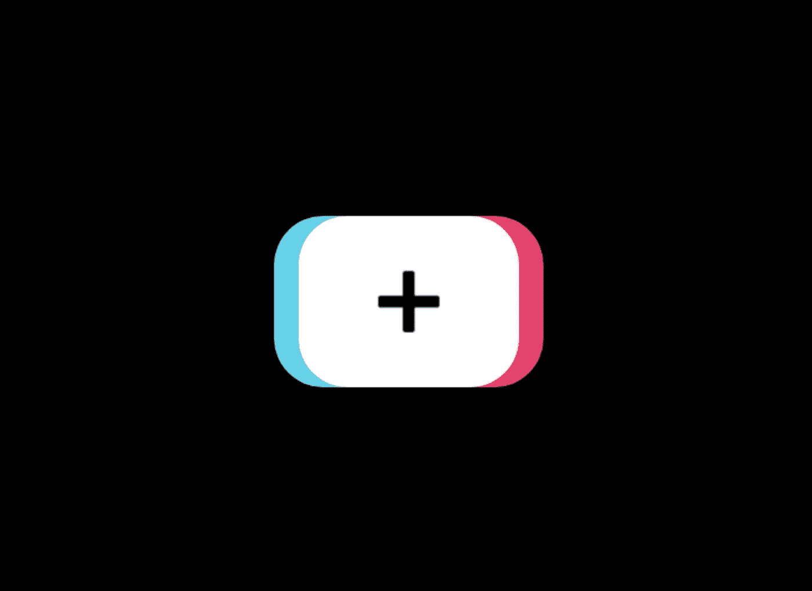
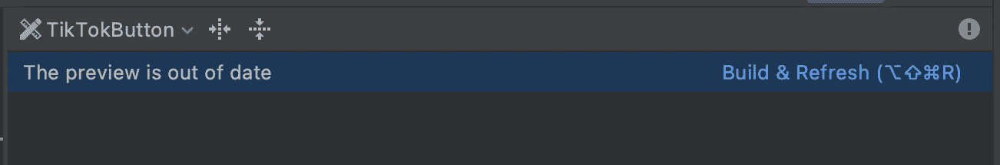
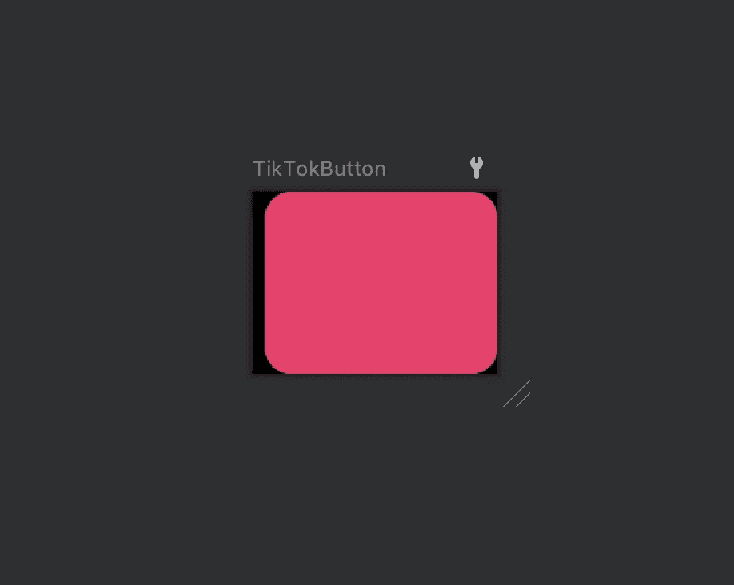
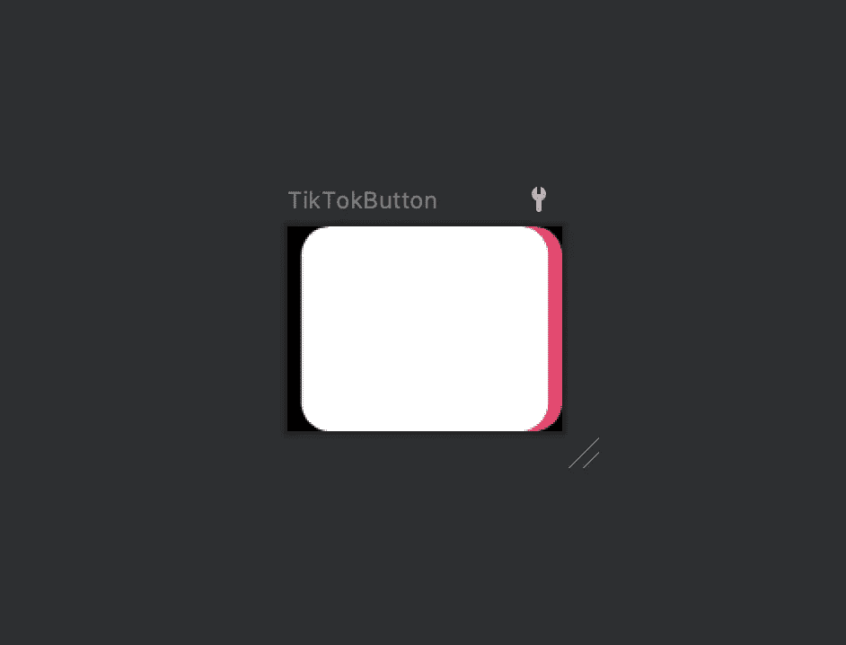
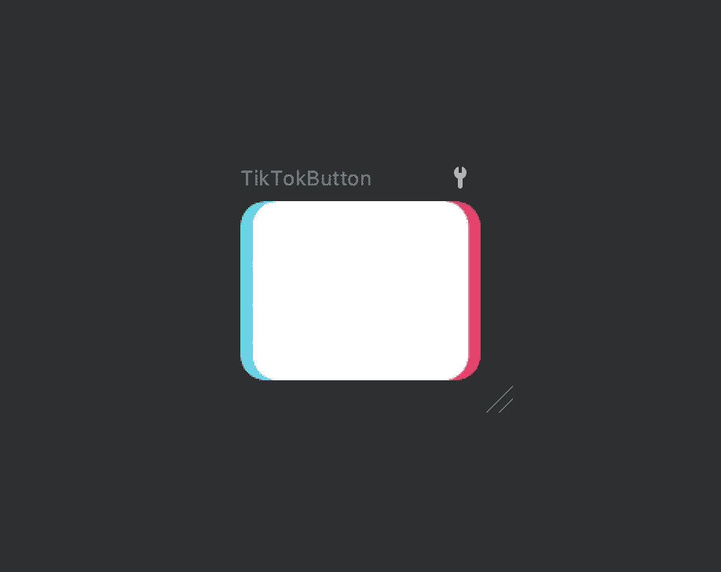
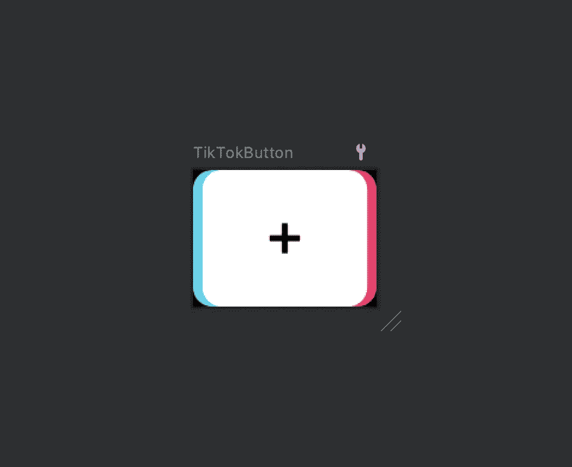

# 如何为 Android 创建一个像抖音一样的按钮

> 原文：<https://levelup.gitconnected.com/how-to-create-a-button-like-tiktok-2554280331bb>

## 创建抖音克隆第 1 部分



抖音按钮

# 介绍

这篇博客是开发抖音克隆应用系列的第一集。敬请关注！🥰

# 必需的知识

自定义视图的一些基本概念。有关自定义视图组件的更多信息，请参考:

[https://developer . Android . com/guide/topics/ui/custom-components](https://developer.android.com/guide/topics/ui/custom-components)

和波特-达夫概念:

[*https://developer . Android . com/reference/Android/graphics/porter duff。模式*](https://developer.android.com/reference/android/graphics/PorterDuff.Mode)

# 编码部分

我将编码部分分为 2 个步骤，如下所示:

*   [创建自定义视图。](#ae5e)
*   [处理 OnDraw()方法。](#8297)

# 步骤 1:创建自定义视图

## a.创建视图类

您可以通过扩展`View`类来创建您的自定义视图。虽然`View`有许多方法来处理度量，但是我们的视图不需要对它的大小进行特殊控制，为了简单起见，它们不需要被覆盖。

自定义视图最重要的部分是它的外观。第一步是覆盖`onDraw()`方法。`onDraw()`的参数是一个`Canvas`对象，视图可以用它来绘制自己。这里有一个片段显示了框架结构:

```
class TikTokButton @JvmOverloads constructor(
    context: Context,
    attrs: AttributeSet? = null,
    defStyle: Int = 0
) : View(context, attrs, defStyle) { override fun onDraw(canvas: Canvas) {
        super.onDraw(canvas)
    }
}
```

在 Kotlin 中，记得使用`@JvmOverloads`注释来定义一个构造函数，而不是像 Java 中那样定义多个构造函数。

## b.将其添加到 XML 文件中

接下来，用 XML 实例化我们的定制`TikTokButton`:

# 步骤 2:处理 OnDraw()方法

## 1.在 OnDraw()方法中创建骨架结构

注意，我们使用了`lazy`委托:

> 对`get()`的第一次调用执行传递给`lazy()`的 lambda 并记住结果，对`get()`的后续调用只是返回记住的结果— [doc](https://kotlinlang.org/docs/delegated-properties.html#standard-delegates)

如果我们分配了大量最终会被垃圾收集的新对象，我们的 UI 将不会流畅。在`lazy`委托的帮助下，我们只创建一个然后重用。

在绘制任何东西之前，我们需要创建一个或多个`Paint`对象。在这个例子中，我们只创建了一个画图，并使用`getXXXPaint()`方法来更新颜色。

## 2.创建一个与视图大小相同的位图

在`onDraw()`触发的时候，我们已经知道了视图的大小。所以我们可以从这个大小创建一个位图:

```
val bm = Bitmap.createBitmap(width, height, Bitmap.Config.ARGB_8888)
val canvas = Canvas(bm)
```

## 3.画出正确的部分

我们使用`drawRoundRect()`绘制指定的圆角，并使用`radius`定义圆角椭圆的半径。

然后我们在 X 轴上平移一点。有一个叫`withTranslation()`的简便方法可以帮助我们自动保存和恢复画布。

```
rectF.set(0f, 0f, width.toFloat() - spaceTiny, height.toFloat())
getRightPaint().let {
    canvas.withTranslation(x = spaceTiny) {
        drawRoundRect(rectF, radius, radius, it)
    }
}
```

注意右上方区域，有一条消息叫做`The preview is out of date`:



点击`Build & Refresh`查看结果，无需构建整个项目:



这就对了。🤟

## 4.画中心部分

我们想在粉色矩形上面画一个白色矩形，但是去掉一些没有覆盖粉色矩形的部分。

这里我们使用 PorterDuff 模式 [SRC_ATOP](https://developer.android.com/reference/android/graphics/PorterDuff.Mode#SRC_ATOP) ，它完全符合我们的情况:

> 丢弃没有覆盖目标像素的源像素。在目标像素上绘制剩余的源像素。

```
getCenterPaint().let {
    paint.xfermode = PorterDuffXfermode(PorterDuff.Mode.SRC_ATOP)
    canvas.drawRoundRect(rectF, radius, radius, it)
}
```

点击`Build & Refresh`:



万岁！！🤟

## 5.画左边的部分

我们想在白色和粉色的矩形下面画一个蓝色的矩形。让我们来看看 [DST_OVER](https://developer.android.com/reference/android/graphics/PorterDuff.Mode#DST_OVER) 模式:

> 源像素绘制在目标像素的后面。

```
getLeftPaint().let {
    paint.xfermode = PorterDuffXfermode(PorterDuff.Mode.DST_OVER)
    canvas.drawRoundRect(rectF, radius, radius, it)
}
```

同样，只需点击`Build & Refresh`即可查看结果:



我们快完成了！💪

## 6.绘制加号图标

最后一部分是在视图的中心绘制加号图标。这是一个特例。其实没有画但是很清楚。我们希望丢弃加号图标覆盖的像素。幸运的是，有一种模式适合我们的情况。这是一种[异或](https://developer.android.com/reference/android/graphics/PorterDuff.Mode#XOR)模式:

> 当源像素覆盖目标像素时，丢弃源像素和目标像素。绘制剩余的源像素。

```
plusIconBitmap.let {
    paint.xfermode = PorterDuffXfermode(PorterDuff.Mode.XOR)
    canvas.drawBitmap(it, width / 2f - it.width / 2f, height / 2f - it.height / 2f, paint)
}
```

那就看看我们的产品吧！🥰



## 7.清除端口缓冲 Xfermode

当我们完成时，记得清除 PorterDuff 模式。这意味着我们又回到了正常的绘制方式，一层一层的绘制。

这是一种编程习惯，当我们开始使用某个东西时防止 bug，当我们不再需要它时清除 bug。

```
paint.*xfermode* = null
```

# 这是一个总结！

下面是`TikTokButton`类的完整代码:

如果您在执行代码片段时发现问题，请查看 GitHub repo 获取帮助:

[](https://github.com/PhongHuynh93/TikTok/tree/feature/1/create_bottom_navigation) [## GitHub—phonghuynh 93/抖音 at feature/1/create _ bottom _ navigation

### 在 GitHub 上创建一个帐户，为 phonghuynh 93/抖音的发展做出贡献。

github.com](https://github.com/PhongHuynh93/TikTok/tree/feature/1/create_bottom_navigation) 

正如你所看到的，创建一个自定义视图并不难，尤其是我们可以从一个著名的应用程序如抖音创建一个按钮。这个类只有 66 行代码，很容易理解。

*如果你喜欢这个故事，请点击**👏 ***按钮，分享*** *它来帮助别人！*关注我[中](https://mr-umbrella.medium.com/)获取更多牛逼安卓小技巧。也可以在 [LinkedIn](https://www.linkedin.com/in/huynh-phong-3649a7131/) 上找到我。祝您愉快！😄*

# *继续读 Android 的东西*

*[安卓按钮变形动画](/android-button-morphing-animation-bc3bed740501)*

*[如何在 Android 中创建类似按钮的动画——第一部分](/how-to-create-like-button-animation-in-android-part-1-f99e2792143d)*

*[Android 中使用 MaterialContainerTransform 的共享元素](/shared-element-using-materialcontainertransform-in-android-6d420e74b122)*

*[运动布局——折叠工具栏](/motionlayout-collapsing-toolbar-d0ce8dd874b6)*

# *Jetpack 撰写*

*[在 Jetpack Compose 中实现 snack bar](/implement-android-snackbar-in-jetpack-compose-d83df5ff5b47)*

*[在 Jetpack Compose 中实现 tab layout](/implement-android-tablayout-in-jetpack-compose-e61c113add79)*

*[在 Jetpack Compose 中用 ViewPager 实现 talayout](/implement-tablayout-with-viewpager-in-android-jetpack-compose-d509fc6e2d8e)*

*[在 Jetpack Compose 中创建一个带有变形和 ken burns 效果的自动滚动浏览器](/create-an-auto-scroll-viewpager-with-transformation-and-ken-burns-effect-in-android-jetpack-compose-efdf46f2e8ed)*