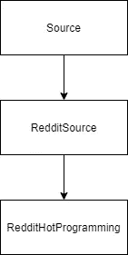
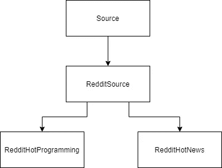
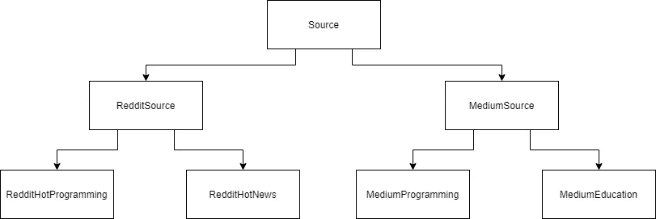

# 如何用 Python 创建内容聚合器

> 原文：<https://levelup.gitconnected.com/how-to-create-a-content-aggregator-with-python-381a3e6cff12>

## 在一个地方获取您最喜欢的内容


Susn Matthiessen 在 [Unsplash](https://unsplash.com?utm_source=medium&utm_medium=referral) 上拍摄的照片

对内容聚合器的需求显而易见。互联网上充斥着无穷无尽的信息，为了让您及时了解最新消息或任何其他类型的内容，您可能每天都要浏览各种网站。

内容聚合有助于我们优化内容消费——我们只需要一个网站，而不是滚动浏览 5 个不同的网站，也不是没完没了地滚动试图过滤我们关心的内容，我们可以看到与我们感兴趣的主题相关的内容。

在本文中，您将学习如何使用 python 从头开始创建自己的定制内容聚合器。

# 先决条件

要完成本教程，您需要:

*   Python 3.6+的本地开发环境
*   熟悉 Python。

# 步骤 1 —安装依赖项

创建一个名为`requirements.txt`的新文件，并复制以下内容

```
praw==7.4.0
```

运行以下命令安装所有依赖项

```
pip install -r requirements.txt
```

在下一节中，我们将为我们的内容聚合器提出一个设计，这样就可以很容易地添加新的来源和主题。

# 第二步——设计

在本文中，我们将从一个单一的来源——Reddit——创建一个内容聚合器，但是为了更容易地添加新的来源，我们必须适当地设计我们的项目。

我们将创建一个`Source`抽象类，它将是我们想要包含的不同来源(Reddit、Medium 等)的基类。
在我们的内容聚合器中，我们将创建一个继承自`Source`的`RedditSource`类。
最后，我们将创建另一个类`RedditHotProgramming`,它将代表我们希望从源中获取内容的主题。



如果您希望输入将从 Reddit 源获取的第二个主题，您只需创建一个新的类，例如`RedditHotNews`



为了从不同的平台(例如 Medium)获取帖子，您将创建一个`MediumSource`类和您希望关注的主题类。



在下一节中，我们将开始编写我们的内容聚合器，从`Source`抽象类开始。

# 步骤 3 —创建源类

创建一个名为`content_agg.py`的新文件，并导入以下库

```
**from** abc import ABC, abstractmethod
**import** praw
**import** os
```

现在让我们定义我们的`Source`抽象类。
`Source`类将有两个抽象方法，这两个方法将允许我们*将*连接到一个源(例如它的 API)并*从中获取*帖子。

```
***class*** Source(ABC): @abstractmethod
  ***def*** connect(*self*):
    **pass** @abstractmethod
  ***def*** fetch(*self*):
    **pass**
```

在下一节中，我们将创建`RedditSource`类，它将实现`Source`类中的抽象方法。

# 步骤 4 —创建 Reddit 源类

在这一节中，我们将把`RedditSource`类写入`content_agg.py`。

在这个类中，我们将实现到 Reddit API 的连接。为了访问 Reddit 的 API，您需要生成一个密钥。
幸运的是这个过程非常简单和简短，在 github 的 Reddit-archive 上跟随它。

一旦有了必要的键，就为它们创建环境变量，或者简单地在代码中将它们作为常量使用(仅当您不打算在其他地方共享您的代码时)。如果你像我一样选择为这两个键创建环境变量，下面是你如何从代码中访问它们

```
CLIENT_ID = os.environ.get('REDDIT_CLIENT_ID')
CLIENT_SECRET = os.environ.get('REDDIT_CLIENT_SECRET')
```

现在继续创建`RedditSource`类

```
***class*** RedditSource(*Source*): ***def*** connect(*self*):
    *self*.reddit_con = praw.Reddit(*client_id*=CLIENT_ID,
                      *client_secret*=CLIENT_SECRET,
                      *grant_type_access*='client_credentials',
                      *user_agent*='script/1.0')
    **return** *self*.reddit_con***def*** fetch(*self*):
    **pass**
```

现在我们有了一个到 Reddit 的 API 的工作连接。
函数`fetch`在这个类中没有实现，因为我们将为每个主题实现它。

在下一节中，我们将创建`RedditHotProgramming`类，在那里我们将从 r/programming 中获取热门帖子。

# 步骤 5 —创建 Reddit 热编程类

在这一节中，我们将实现一个类，它将使我们能够从 r/programming 中获取热帖。
我们将依赖从我们的父类`RedditSource`到 Reddit 的 API 的连接。

```
***class*** RedditHotProgramming(*RedditSource*):***def*** __init__(*self*) -> None:
    *self*.reddit_con = *super*().connect()
    *self*.hot_submissions = []***def*** fetch(*self*, *limit*: *int*):
    *self*.hot_submissions =  
           *self*.reddit_con.subreddit('programming').hot(*limit*=limit)***def*** __repr__(*self*):
    urls = []
    for submission in *self*.hot_submissions:
      urls.append(vars(submission)['url'])
    **return** '\n'.join(urls)
```

除了获取功能，我们还实现了`__repr__`方法，这样当我们在`RedditHotProgramming`对象上调用`print`时，我们将打印它的自定义表示，在我们的例子中，它将是来自热帖的 URL 列表。

在下一节中，我们将把所有东西粘在一起，并执行我们的内容聚合器。

# 第六步——把所有东西粘在一起

为了运行一切，我们将创建一个`RedditHotProgramming`实例，并从中获取一些帖子。然后，我们将能够打印我们的对象，并获得出现在每个热帖中的所有 URL。

```
**if** __name__ == '__main__':
  reddit_top_programming = RedditHotProgramming()
  reddit_top_programming.fetch(*limit*=10)
  print(reddit_top_programming)
```

要执行，只需在您的终端中运行`python content_agg.py`。

# 结论

在本文中，您完全从零开始构建了一个新闻聚合器。现在，您可以选择任何您想要添加和扩展这个项目的平台和主题。

***对我的更多内容*** 感兴趣？通过**我的** [**推荐链接**](https://eliran9692.medium.com/membership) 加入媒介会员，在 [**Twitter**](https://twitter.com/CodingKaiser) 上关注我，在 [**我的博客**](http://codingkaiser.blog/) 上阅读我所有的作品。

简而言之，我所有的链接都在这里。