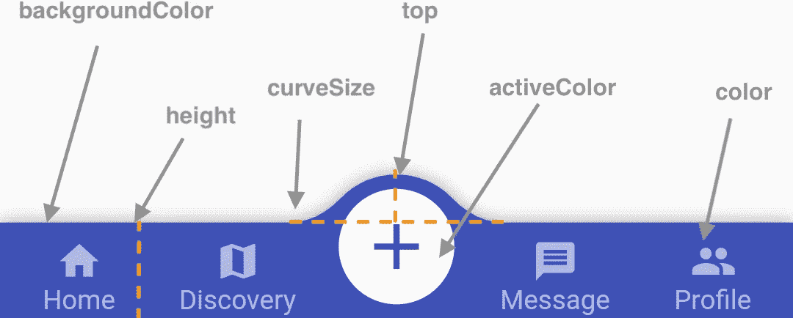

# 如何在 Flutter 中创建一个凸底 AppBar

> 原文：<https://levelup.gitconnected.com/how-to-create-a-convex-bottom-appbar-in-flutter-a52d8239dd25>

## 使用这个包创建一个凸底 Appbar。


阿什利·伯德在 [Unsplash](https://unsplash.com/s/photos/app-bar?utm_source=unsplash&utm_medium=referral&utm_content=creditCopyText) 上的照片

你好，欢迎来到我关于**颤振包测试**的帖子。每周我都会测试另一个发布在 [pub.dev](https://pub.dev/) 下的包。如果你想看这个系列的第一篇文章，请阅读 [**如何在 Flutter**](https://betterprogramming.pub/how-to-validate-emails-in-flutter-957ae75926c9) 中验证电子邮件。

# 凸底 AppBar

本周的小部件是一个 UI 小部件，将您的 AppBar 体验提升到一个新的水平。凸起的底部 AppBar 小部件让你为你的 flutter 应用程序创建一个底部 appbar。该小部件为您提供了快速实现 appbar 和七种预定义的样式。

# 目的

几乎每个应用都有多个屏幕。通过为用户提供更好的体验，你需要一种快速的方式在应用程序中最重要的页面之间切换。这通常可以通过使用底部应用程序栏来解决。使用凸底 AppBar，您可以获得开箱即用的特性，包括使用预定义样式的动画和样式调整。

# 包范围

这个包附带了一个只需要显示一个列表项的 ConvexAppBar 小部件。指定 initialActiveIndex 和 onTab 参数，就得到一个默认的 appbar，它提供了您需要的一切。要自定义 appbar，您可以设置以下参数。设置您可以选择的系统参数

*   **修正**(上标图标保持在中心)
*   **固定圆圈**(相同，但固定图标周围有一个白色圆圈)
*   **反应**(点击另一图标，上标图标改变)
*   **反应圈**(相同，但上标图标周围有一个白色圆圈)
*   **textIn** (选中的离子显示其对应的标题)
*   **标题为**(未选中的图标仅显示其标题)
*   **翻转**(点击图标显示翻转动画)
*   **自定义**(使用 ConvexBottomAppBar 构建器自定义预定义的参数)

您还可以自定义的最重要的参数有

*   **高度**(提升 appbar)
*   **顶部**(抬起上标图标)
*   **curveSize** (拉伸上标图标的曲线)
*   **颜色**(设置图标颜色)
*   **背景颜色**(设置 appbar 背景颜色)
*   **渐变**(使用渐变小工具设置 appbar 背景颜色)
*   **活动颜色**(设置圆圈颜色)



[https://raw . githubusercontent . com/hack tons/convex _ bottom _ bar/master/doc/app bar-theming . png](https://raw.githubusercontent.com/hacktons/convex_bottom_bar/master/doc/appbar-theming.png)

提供一个列表标签小部件，你可以定义图标及其标题显示在应用程序栏。该列表应该只包含奇数个表项，以便运行小部件时不会导致错误。如果希望显示图像而不是图标，可以在每个 TabItem 小部件中为 icon 参数提供图像。如果你想创建一个单一的图标底部应用程序栏，你可以使用凸按钮。它提供给你更少的参数和一个快速好看的图标应用程序栏。

除了 ConvexAppBar 小部件和他的预定义样式之外，这个包还提供了一个徽章版本和一个构建器。徽章版本允许您添加一个可更改的徽章列表，该列表将在 appbar 的选项卡之外设置。构建器提供了更多的自定义来处理图标，徽章等等。

# 一个例子

为了配置所有的个性化设置，我再次在[包示例应用程序](https://flutter-package-examples.netlify.app/#/)中为您构建一个 Flutter 页面，您可以在其中配置所有必要的 concular appbar 小部件参数。下面的要点向您展示了我在 State 小部件中设置的所有参数，以便在 ConvexAppBar 小部件中使用它们。我在 initState 函数中初始化列表和对象。

concular appbar 小部件作为 Scaffold 小部件的 bottomNavigationBar 参数放置。它不能用作 appbar 的替代。下面的代码显示了相应应用程序的构建方法以及 concular app bar 小部件的用法。我用了。徽章版本，也说明了如何使用徽章的 appbar 小部件。唯一改变的是小部件开始时需要的徽章列表。

生成的用户界面类似于下面的示例视频:

# 限制

虽然 appbar 有一些不错的特性，但是我发现它有一些限制。根据您的需求，它们或多或少与您相关。首先(这是很明显的),如果你想在中间有一个上标图标，你只能在应用栏中添加奇数个图标。如果你提供一个偶数，它会抛出一个错误。第二个问题与其说是限制，不如说是缺陷。在我的应用程序中，默认情况下我没有让徽章显示在图标的右上角。虽然您可以自己调整参数，如空白和空白。在发布的时候，我已经为这个 bug 开了一个[的问题。](https://github.com/hacktons/convex_bottom_bar/issues/146)

接下来我要提到的是屏幕处理。当我查看我的其他一些颤振项目时，我使用了一个页面视图，通过向左或向右滑动来动画显示下一页的滑动。查看该包的 github 库，我发现它对提到的需求没有限制。您可以使用 PageView 或 TabBarView 和 TabController 来获得相同的功能。你可以在[https://github . com/hack tons/convex _ bottom _ bar/blob/master/doc/issue-change-active-tab-index . MD](https://github.com/hacktons/convex_bottom_bar/blob/master/doc/issue-change-active-tab-index.md)下查找这个。

我在使用 convex appbar 小部件编程时发现的最后一件事是，你不能总是提供一个干净的 UI，尤其是当你使用一个预定义的圆形样式并想要调整曲线大小和顶部时。你有时会在使用智能手机的时候看到一个有问题的用户界面，而所有的东西都在你的网页窗口上。公平地说，这可能最多会稍微延长应用程序的设计时间。

# 装置

安装这个包时，你可以在命令行中使用 flutter 命令，或者简单地在依赖项下的 pubspec.yaml 中添加最新版本的`convex_bottom_bar`。

运行这个 Flutter 命令:

```
**$** flutter pub add convex_bottom_bar
```

这将向您的包的 pubspec.yaml 中添加一行(并运行一个隐式的`dart pub get`):

```
dependencies:
  convex_bottom_bar: ^latest_version
```

或者，你的编辑可能会支持`flutter pub get`。查看编辑器的文档以了解更多信息。

## 导入它

现在，在您的 Dart 代码中，您可以使用:

```
**import** 'package:convex_bottom_bar/convex_bottom_bar.dart';
```

# 版本

发帖时的最新版本是 **3.0.0** 。最新版本支持 Flutter 2 的零安全。看看历史，你可以看到，出版商投入了大量的工作，这个包，以保持其最新。

# 得分

包的人气是我们现在以来最好的: **1137 赞**、来自 Flutter 的 **130 Pub 分**、96% 的**人气。**

此外，该软件包支持 **null safety** 和**所有当前平台** (Android、IOS、Linux、macOS、Web、Windows)。它于 2019 年 10 月在**首次发布，自去年 11 月起支持空安全(今年 3 月起正式支持)。它在 **Apache 2.0** **许可**下，有一些很好的示例代码和常见问题(在自述文件的末尾)。该包为包提供了一些实用程序和提供程序测试。它也有一些非常好的小部件测试 UI 和 UX 行为。它的覆盖率超过 96%,由许多护盾中的一个可视化。如果你读这篇文章，但你的母语是中文，你也可以用你的母语阅读大部分文档。；)**

# 评级

提供一个中文文件，我只能给这个包 10 分 10 分。开玩笑的。查看变更日志，作者做了大量工作来修复包中所有必要的 bug。我认为提供这样一个准确且简单易用的 appbar 小部件并不容易，所以我认为 bug 会经常出现。比较上述限制和软件包范围，我给软件包**打 8 分。**在我看来，一个普通的底部应用程序栏的唯一优点是预定义的样式，它显示了一个漂亮的高亮项目，这让我相信我会使用这个包。然而，总而言之，这是一个为 Flutter 社区增加了许多价值的包。向包裹的作者致意。

# 链接

可以在[**下的 pub.dev 找到最新的包。**](https://pub.dev/packages/convex_bottom_bar)

如果你想看看我写的每个包的应用程序，请前往[**lucianojung/flutter _ package _ examples**](https://github.com/lucianojung/flutter_package_examples)。

如果你对包的源代码很好奇，可以访问[**hack tons/convex _ bottom _ bar**](https://github.com/hacktons/convex_bottom_bar)。

> 前往[**flutter-package-examples . net lify . app**](https://flutter-package-examples.netlify.app/)查看所有的 Flutter 包示例并亲自尝试。