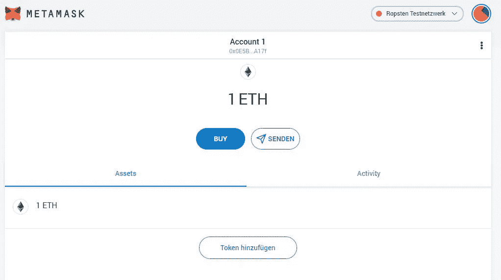
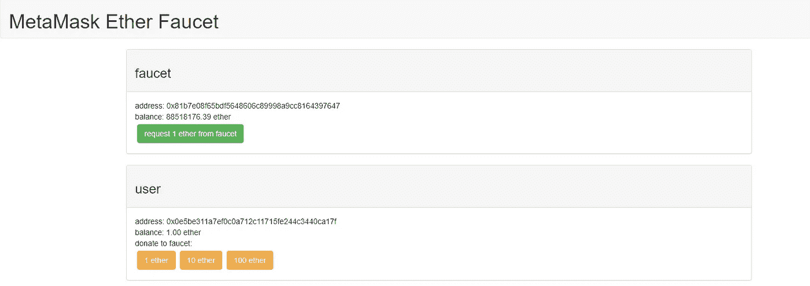
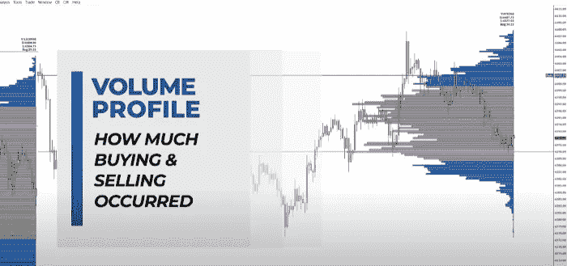
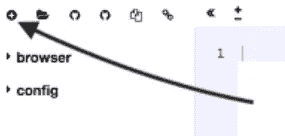
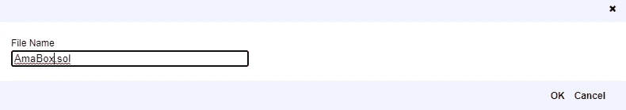
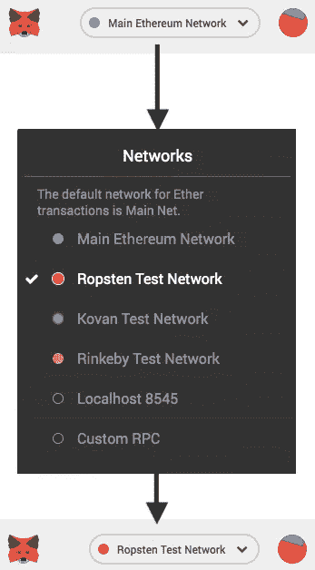
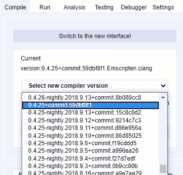
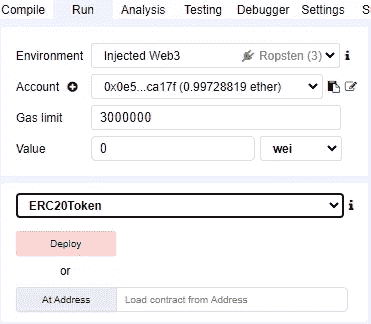
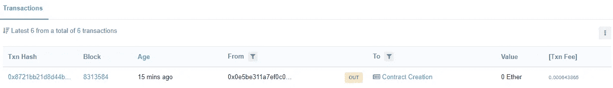
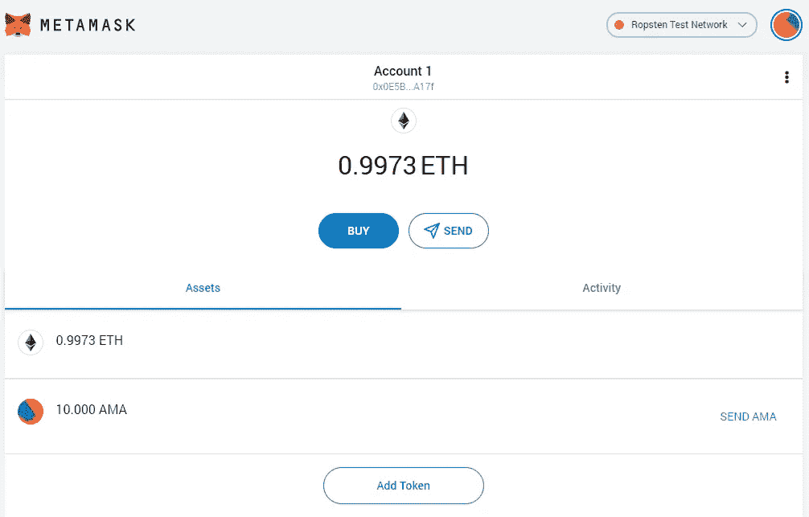

# 如何创建加密货币令牌

> 原文：<https://levelup.gitconnected.com/how-to-create-a-cryptocurrency-token-15a898e2bb8d>

本文将作为创建您自己的加密货币令牌的教程。**我们将使用以太坊的“ERC-20”令牌作为我们代码的基础。一旦我们完成，你可以用它来代表货币或任何你想交易的东西，并在流通中有固定的供应。**这应该是不言而喻的，但拥有编码方面的知识对完全理解我们在整个过程中所做的事情是非常有益的。


照片由 [Clifford 摄影](https://unsplash.com/@cliffordgatewood?utm_source=medium&utm_medium=referral)在 [Unsplash](https://unsplash.com?utm_source=medium&utm_medium=referral)

# 第一步。创建元掩码帐户

Metamask wallet 是区块链应用程序的门户，这是您开始使用时必须做的第一件事。这是你的浏览器的扩展，确保只使用谷歌浏览器。你必须创建一个账户，并写下一个 10 个字的气动代码。



[点击这里](https://chrome.google.com/webstore/detail/metamask/nkbihfbeogaeaoehlefnkodbefgpgknn)下载扩展。

# 第二步。给你的钱包加点乙醚

正如你在上面的图片中看到的，我已经添加了 1 个以太坊，这是因为当我们创建令牌时，我们将使用一些以太坊作为费用。这叫油费，是用他们的区块链转移你的代币的费用。这个网站允许你从他们的水龙头至少要 1 个以太坊。



[点击这里](https://faucet.metamask.io/)获得 1 个以太坊。

> *学习最佳交易策略，提升你的交易水平！*

[](https://volumeprofileformula.com/vpf-sales-funnel?affiliate_id=3864458)

成交量分析可以说是世界上最好的交易策略之一，已经被证明是有效的。点击[此链接](https://volumeprofileformula.com/vpf-sales-funnel?affiliate_id=3864458)开始。

# 第三步。让我们创建令牌

要开始创建您的令牌，您需要访问[该网站](https://remix.ethereum.org/)。打开后，按照以下步骤。



点击网站左上角的+按钮创建一个新文件。



你想给你的令牌取什么名字就取什么名字，但是不要删除它。sol 到底。

然后将这段代码粘贴到代码编辑器中。

```
pragma solidity ^0.4.4;contract Token {
 /// [@return](http://twitter.com/return) total amount of tokens
 function totalSupply() constant returns (uint256 supply) {}/// [@param](http://twitter.com/param) _owner The address from which the balance will be retrieved
 /// [@return](http://twitter.com/return) The balance
 function balanceOf(address _owner) constant returns (uint256 balance) {}/// [@notice](http://twitter.com/notice) send `_value` token to `_to` from `msg.sender`
 /// [@param](http://twitter.com/param) _to The address of the recipient
 /// [@param](http://twitter.com/param) _value The amount of token to be transferred
 /// [@return](http://twitter.com/return) Whether the transfer was successful or not
 function transfer(address _to, uint256 _value) returns (bool success) {}/// [@notice](http://twitter.com/notice) send `_value` token to `_to` from `_from` on the condition it is approved by `_from`
 /// [@param](http://twitter.com/param) _from The address of the sender
 /// [@param](http://twitter.com/param) _to The address of the recipient
 /// [@param](http://twitter.com/param) _value The amount of token to be transferred
 /// [@return](http://twitter.com/return) Whether the transfer was successful or not
 function transferFrom(address _from, address _to, uint256 _value) returns (bool success) {}/// [@notice](http://twitter.com/notice) `msg.sender` approves `_addr` to spend `_value` tokens
 /// [@param](http://twitter.com/param) _spender The address of the account able to transfer the tokens
 /// [@param](http://twitter.com/param) _value The amount of wei to be approved for transfer
 /// [@return](http://twitter.com/return) Whether the approval was successful or not
 function approve(address _spender, uint256 _value) returns (bool success) {}/// [@param](http://twitter.com/param) _owner The address of the account owning tokens
 /// [@param](http://twitter.com/param) _spender The address of the account able to transfer the tokens
 /// [@return](http://twitter.com/return) Amount of remaining tokens allowed to spent
 function allowance(address _owner, address _spender) constant returns (uint256 remaining) {}event Transfer(address indexed _from, address indexed _to, uint256 _value);
 event Approval(address indexed _owner, address indexed _spender, uint256 _value);
}contract StandardToken is Token {function transfer(address _to, uint256 _value) returns (bool success) {
 //Default assumes totalSupply can’t be over max (2²⁵⁶ — 1).
 //If your token leaves out totalSupply and can issue more tokens as time goes on, you need to check if it doesn’t wrap.
 //Replace the if with this one instead.
 //if (balances[msg.sender] >= _value && balances[_to] + _value > balances[_to]) {
 if (balances[msg.sender] >= _value && _value > 0) {
 balances[msg.sender] -= _value;
 balances[_to] += _value;
 Transfer(msg.sender, _to, _value);
 return true;
 } else { return false; }
 }function transferFrom(address _from, address _to, uint256 _value) returns (bool success) {
 //same as above. Replace this line with the following if you want to protect against wrapping uints.
 //if (balances[_from] >= _value && allowed[_from][msg.sender] >= _value && balances[_to] + _value > balances[_to]) {
 if (balances[_from] >= _value && allowed[_from][msg.sender] >= _value && _value > 0) {
 balances[_to] += _value;
 balances[_from] -= _value;
 allowed[_from][msg.sender] -= _value;
 Transfer(_from, _to, _value);
 return true;
 } else { return false; }
 }function balanceOf(address _owner) constant returns (uint256 balance) {
 return balances[_owner];
 }function approve(address _spender, uint256 _value) returns (bool success) {
 allowed[msg.sender][_spender] = _value;
 Approval(msg.sender, _spender, _value);
 return true;
 }function allowance(address _owner, address _spender) constant returns (uint256 remaining) {
 return allowed[_owner][_spender];
 }mapping (address => uint256) balances;
 mapping (address => mapping (address => uint256)) allowed;
 uint256 public totalSupply;
}contract ERC20Token is StandardToken {function () {
 //if ether is sent to this address, send it back.
 throw;
 }/* Public variables of the token */
 string public name = “AmaBox”; //Name of the token
 uint8 public decimals = 3; //How many decimals to show. ie. There could 1000 base units with 3 decimals
 string public symbol =”AMA”; //An identifier: eg AXM
 string public version = ‘H1.0’; //human 0.1 standard. Just an arbitrary versioning scheme.//
// CHANGE THE FOLLOWING VALUES FOR YOUR TOKEN!
////make sure this function name matches the contract name above. So if you’re token is called TutorialToken, make sure the //contract name above is also TutorialToken instead of ERC20Tokenfunction ERC20Token(
 ) {
 balances[msg.sender] = 10000; // Give the creator all initial tokens (100000 for example)
 totalSupply = 50000; // Update total supply (100000 for example)
 name = “AmaBoX”; // Set the name for display purposes
 decimals = 3; // Amount of decimals
 symbol = “AMA”; // Set the symbol for display purposes
 }/* Approves and then calls the receiving contract */
 function approveAndCall(address _spender, uint256 _value, bytes _extraData) returns (bool success) {
 allowed[msg.sender][_spender] = _value;
 Approval(msg.sender, _spender, _value);//call the receiveApproval function on the contract you want to be notified. This crafts the function signature manually so one doesn’t have to include a contract in here just for this.
 //receiveApproval(address _from, uint256 _value, address _tokenContract, bytes _extraData)
 //it is assumed that when does this that the call *should* succeed, otherwise one would use vanilla approve instead.
 if(!_spender.call(bytes4(bytes32(sha3(“receiveApproval(address,uint256,address,bytes)”))), msg.sender, _value, this, _extraData)) { throw; }
 return true;
 }
}
```

# 第四步。编辑代码

您必须编辑您的代码规范，并通过替换代码中的这些字段来使它们成为您自己的规范。

*   `NUMBER_OF_TOKENS`发行的代币总数(在这种情况下，还有创建者最初放在钱包中的代币数)。在这种情况下，10000。
*   `DECIMALS`小数位数，从而定义了令牌的最大整除性，在我们的例子中为 3。
*   `NAME_OF_TOKEN`令牌的显示名称，例如，“AmaBox。
*   `SYM`令牌的缩写，例如，“AMA”

# 第五步。编译代码



现在我们已经编辑了代码，下一步是将您所在的网络更改为 Ropsten。

在“编译”选项卡中，选择编译器版本 0.4.25，并确保“自动编译”已打开，“启用优化”已关闭。



现在返回到 Run 选项卡，在选择 ERC20Token 后单击 Deploy。



现在，您必须等待一分钟，直到它处理信息，您应该会看到一个来自小部件的弹出窗口，显示交易已确认。要验证该信息，请单击以太网扫描上的 MetaMas 小部件、设置和视图。



你可以看到你的帐户的交易，这是合同创建，点击它，并复制其地址。

# 第六步。向您的钱包添加令牌

进入你的钱包，点击添加令牌。从单击按钮后出现的弹出窗口中，转到自定义令牌选项卡并粘贴合同地址。现在，如果一切顺利的话，你应该还能在钱包里看到你的代币。



现在每一步都完成了，你的令牌在 Ropsten 网络上启动并运行如果你想做一个新的但要在以太坊网络上运行，你需要支付 30 美元左右，但步骤是一样的。

# 结束语

如果你对这篇文章有任何问题或建议，不要犹豫，在评论区留下回复。喜欢你读的东西吗？为什么不关注我的媒体简讯，这样你就不会错过我未来的任何文章了？很简单，点击[这里](https://kgabeci.medium.com/subscribe)，输入你的邮箱地址，然后点击订阅。

你喜欢阅读媒体上的文章吗？考虑成为会员，有很多功能，你将获得所有创作者的内容，每月只需 5 美元。用[这个链接](https://kgabeci.medium.com/membership)，你也帮我出赚点小提成；点击成为会员，并输入您的信息。