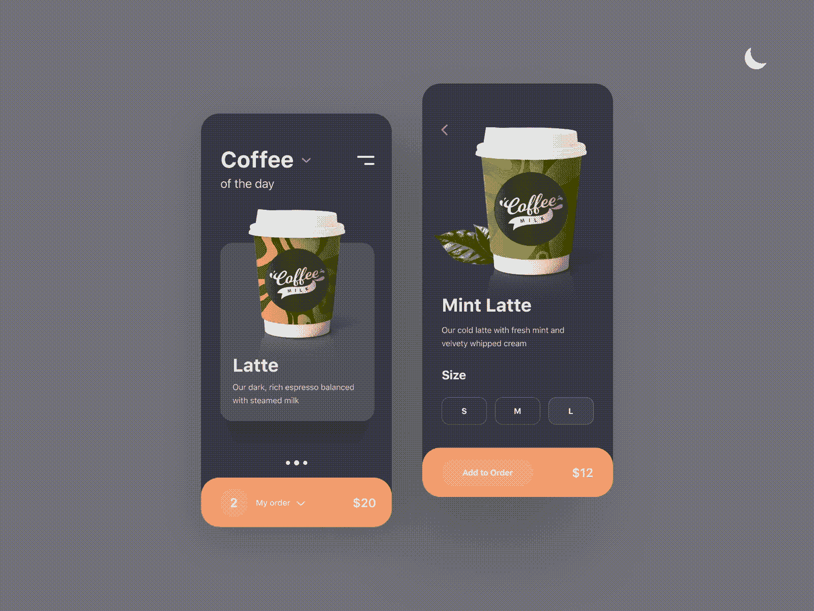

# 如何用风格化的 JSX 创建一个暗/亮模式开关

> 原文：<https://levelup.gitconnected.com/how-to-create-a-dark-light-mode-switch-with-styled-jsx-6d12d03a00bf>

https://dribbble.com/Rvachev[设计](https://dribbble.com/Rvachev)

当你有一个 Next.js 应用程序时，你可能会使用样式化的 JSX 来编写组件的样式。这是因为 Next.js 在你的项目中默认包含了 JSX 风格。如果这是你的情况，或者你只是用自己的风格 JSX，你想在你的网站上实现暗/亮模式切换，这篇文章是给你的。

我们将用这个 CSS-in-JS 库和 JavaScript 分四步实现一个简单的主题切换(暗光)。

# 第一步:定义你的主题

第一步是为你的深色和浅色主题选择合适的颜色。定义适合这两个主题的颜色可能会成为一个挑战。这是因为你必须考虑设计原则，比如卡片深度、背景颜色、字体颜色、可用性和可访问性(a11y)。这里有一个很好的视频，展示了一些你(或你的设计师)可以遵循的最佳实践，以创造一个成功的色彩决策。

# 第二步:创建 CSS 变量

随着我们的应用程序的设计，我们可以开始创建将与我们的项目一起使用的 CSS 变量。为此，我们将使用全局样式来创建变量。

样式 JSX 允许我们使用`<style jsx global`添加全局样式，在这里我们将定义我们的主题变量和它们的值。我们将把浅色主题作为我们的默认主题(它可能是深色主题),我们将它设置在由选择器`:root`表示的文档树的根元素中。

# 第三步:创建次要主题

现在是时候添加次要主题值了(在我们的例子中是深色主题),它将覆盖先前定义的默认主题。我们将在文档根元素的`theme`数据属性中定义第二主题。

# 最后一步:在明暗主题之间切换

在这一步，使用 JavaScript，我们将使用我们在 JSX 风格中使用的定义在亮主题和暗主题之间切换。为此，基本上，我们将读写我们在根元素中使用的数据属性`theme`。改变这个属性将自动改变我们的样式变量的值。

# 例子

让我们用这些步骤创建一个简单的 React 组件。

您可以注意到，我们使用 CSS 变量来确定文档元素中主题的颜色。正如我们在 JSX 全局中定义的变量一样，我们也可以在子组件中使用它们。

[点击此处](https://stackblitz.com/edit/switch-themes-example?file=index.tsx)查看工作示例。