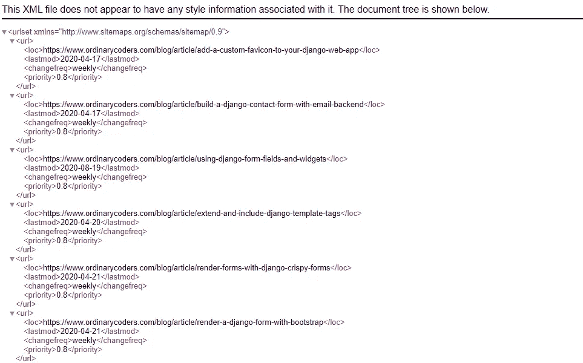
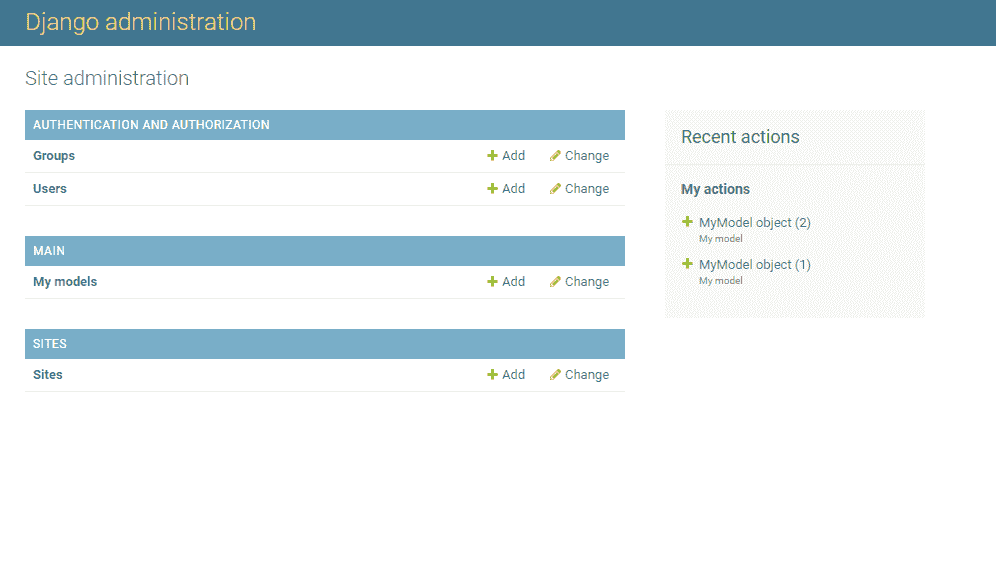
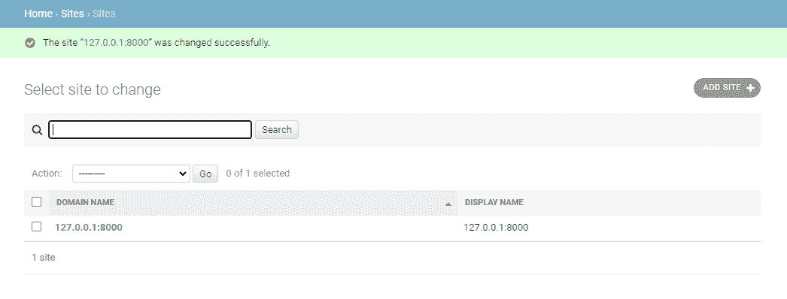
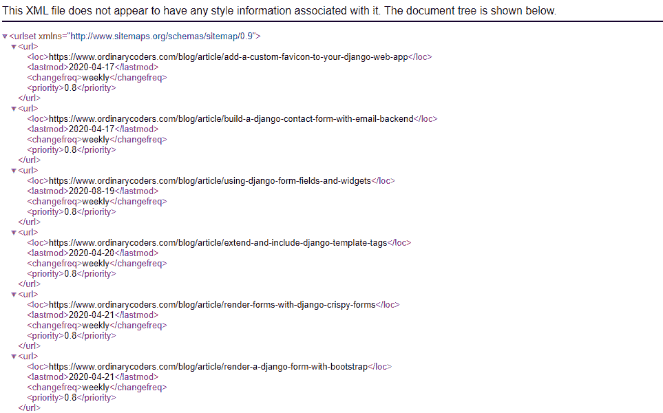

# 如何创建动态 Django 网站地图

> 原文：<https://levelup.gitconnected.com/how-to-create-a-dynamic-django-sitemap-532adb226b94>



网站地图是你网站上的一个 XML 文件，搜索引擎读取它来智能地抓取你的网站。它不仅提供了关于您认为重要的页面和文件的信息，还说明了页面上次更新的时间以及页面更改的频率。

如果您使用的是 Django，那么使用站点和站点地图框架自动创建您的 Django 站点地图。

# **安装 Django 网站应用**

```
#*env > mysite > mysite > settings.py*INSTALLED_APPS = [
    'main.apps.MainConfig',
    'django.contrib.admin',
    'django.contrib.auth',
    'django.contrib.contenttypes',
    'django.contrib.sessions',
    'django.contrib.messages',
    'django.contrib.staticfiles',
    'django.contrib.sites',    #add sites to installed apps
]SITE_ID = 1   #define the site id
```

首先，安装网站的应用程序。然后在设置中定义`SITE_ID`。站点的框架将用于定义站点地图中站点的名称。

# **运行迁移**

*macOS 终端*

```
(env)User-Macbook:mysite user$ python3 manage.py migrate
```

*Windows 命令提示符*

```
(env)C:\Users\Owner\desktop\env\mysite> py manage.py migrate
```

在命令提示符下运行`migrate`，将 sites 表添加到数据库中。

# **创建超级用户**

*macOS 终端*

```
(env)User-Macbook:mysite user$ python3 manage.py createsuperuser
Username (leave blank to use 'owner'): admin
Email address:
Password: *****
Password (again): *****
Superuser created successfully.(env)User-Macbook:mysite user$ python3 manage.py runserver
```

*Windows 命令提示符*

```
(env) C:\Users\Owner\Desktop\Code\env\mysite>py manage.py createsuperuser
Username (leave blank to use 'owner'): admin
Email address: 
Password: *****
Password (again): *****
Superuser created successfully.(env) C:\Users\Owner\Desktop\Code\env\mysite>py manage.py runserver
```

如果还没有，创建一个超级用户，这样就可以访问项目中内置的 Django 管理。

# **登录 Django 管理系统**

注册一个信号处理程序，创建一个名为 example.com 的默认站点。您需要通过登录到 Django admin 的[http://127 . 0 . 0 . 1:8000/admin/***来更正您的 Django 项目的名称和域名。***](http://127.0.0.1:8000/admin/.)

找到链接*站点*并点击它。



然后，您会看到列出了站点域名和显示名称，这两个名称都应该更改为适当的网站名称。

对于开发，使用本地主机 127.0.0.1:8000。对于生产，将名称更改为您实际的域名。



# **安装 Django 网站地图应用**

```
#*env > mysite > mysite > settings.py*INSTALLED_APPS = [
    'main.apps.MainConfig',
    'django.contrib.admin',
    'django.contrib.auth',
    'django.contrib.contenttypes',
    'django.contrib.sessions',
    'django.contrib.messages',
    'django.contrib.staticfiles',
    'django.contrib.sitemaps',   #add Django sitemaps to installed apps
]TEMPLATES = [
    {
        'BACKEND': 'django.template.backends.django.DjangoTemplates',
        'DIRS': [],
        'APP_DIRS': True,
        'OPTIONS': {
            'context_processors': [
                'django.template.context_processors.debug',
                'django.template.context_processors.request',
                'django.contrib.auth.context_processors.auth',
                'django.contrib.messages.context_processors.messages',
            ],
        },
    },
]
```

现在我们已经定义了站点的名称，我们可以使用 Django sitemap 框架了。

要安装 Django 网站地图应用程序，请将`'django.contrib.sitemaps'`添加到`INSTALLED_APPS`。然后向下滚动到`TEMPLATES` ，确保`DjangoTemplates`已列出(默认情况下应该在那里)，并且`APP_DIRS`已设置为`True`。

# **创建一个 Django 站点地图文件**

```
#*env > mysite > main > (New File) sitemaps.py*from django.contrib.sitemaps import Sitemap
from .models import Article

class ArticleSitemap(Sitemap):
    changefreq = "weekly"
    priority = 0.8
    protocol = 'http' def items(self):
        return Article.objects.all() def lastmod(self, obj):
        return obj.article_published

    def location(self,obj):
        return '/blog/%s' % (obj.article_slug)
```

创建 Django 站点地图类似于创建 Django 模型。首先，在应用程序的文件夹中创建一个名为 *sitemaps.py* 的新文件。这是有*模型. py* 和*视图. py* 的文件夹。

然后从文件顶部的`django.contrib.sitemaps`导入`Sitemap`类。还要导入包含站点地图上所有文章/页面的模型，在本例中，就是模型`Article`。

接下来，创建一个名为`ArticleSitemap`的站点地图类，它扩展了`Sitemap`类。

然后我们可以添加属性`changefreq`、`priority`和`protocol`。

`changefreq`是页面内容变化的频率。该值可以是:

*   `'always'`
*   `'hourly'`
*   `'daily'`
*   `'weekly'`
*   `'monthly'`
*   `'yearly'`
*   `'never'`

`priority`是页面对站点上其他页面的重要性。该值可以是从`0.0`到`1.0`的任何值。

`protocol`不是`'https'`就是`'http'`。在这种情况下，我们将使用 HTTP，因为本地主机域是 http://127.0.0.1:8000。

`items()`方法返回我们希望在 Django 站点地图中列出的所有模型对象的列表。

`lastmod()`方法返回最后一次修改模型对象的时间，这意味着您需要返回一个在模型中指定的已定义的发布日期字段，它才能正常工作。

最后，`location()`方法返回文章的 URL 位置。默认情况下，Django sitemap 框架调用`get_absolute_url()`。

因此，如果您的文章 URL 不是[http://127 . 0 . 0 . 1:8000/name-of-article，](http://127.0.0.1:8000/name-of-article,)您需要添加 location()方法并返回在文章 slug 之前列出的适当 slug。

根据上面的例子，URL 位置现在是[http://127 . 0 . 0 . 1:8000/blog/name-of-article。](http://127.0.0.1:8000/blog/name-of-article.)

# **添加 Django 网站地图 URL**

```
#*env > mysite > main > urls.py*from django.urls import path
from . import views
from django.contrib.sitemaps.views import sitemap
from .sitemaps import ArticleSitemapapp_name = "main"sitemaps = {
    'blog':ArticleSitemap
}urlpatterns = [
    path("", views.homepage, name="homepage"),
    path('sitemap.xml', sitemap, {'sitemaps': sitemaps}, name='django.contrib.sitemaps.views.sitemap'),]
```

查看 Django 站点地图需要做的最后一件事是将其 URL 添加到应用程序 URL 列表中。从适当的文件中导入站点地图和`ArticleSitemap`。

然后添加一个映射到 sitemap 类 ArticleSitemap 的 Django sitemap 字典。最后，添加指向 Django 站点地图的 URL 模式。

# **向动态 Django 网站地图添加静态页面**

```
#*env > mysite > main > sitemaps.py*from django.urls import reverseclass StaticSitemap(Sitemap):
    changefreq = "yearly"
    priority = 0.8
    protocol = 'https' def items(self):
        return ['main:homepage_view', 'main:contact_view'] def location(self, item)
            return reverse(item)
```

您还可以向动态 Django 站点地图添加静态页面，如/contact 或/about。

转到 *sitemaps.py* 文件，添加一个名为`StaticSitemap`的新函数，它扩展了`Sitemap`类。

设置`changefreq`、`priority`和`protocol`，然后添加返回列表`app_name:url_name`的`items()`方法。

接下来，从文件顶部的 Django URLs 导入`reverse()`方法。

添加返回 URL 的`location()`方法来完成静态 Django sitemap 函数。

**注意**，您将需要参考您的*主> urls.py* 文件以获得正确的 URL 名称。

```
#*env > mysite > main > urls.py*

from django.urls import path
from . import views
from django.contrib.sitemaps.views import sitemap
from .sitemaps import ArticleSitemap, StaticSitemap #import StaticSitemapapp_name = "main"sitemaps = {
    'blog':ArticleSitemap,
    'static':StaticSitemap #add StaticSitemap to the dictionary
}
```

返回 *main > urls.py* 并在文件顶部导入新的站点地图。

然后将`StaticSitemap`添加到站点地图字典中。

# 查看姜戈网站地图

Django 网站地图现在可以在 http://127 . 0 . 0 . 1:8000/sitemap . XML/上找到。当您转到这个域时，它应该列出文章模型中定义的所有 URL 以及添加到 *sitemaps.py* 中的属性。

*Django 网站地图示例*



*原载于*[*https://www.ordinarycoders.com*](https://www.ordinarycoders.com/blog/article/django-sitemap)*。*