# 如何创建一个 Firebase 项目并将其与您的 Flutter 应用程序链接

> 原文：<https://levelup.gitconnected.com/how-to-create-a-firebase-project-and-link-it-with-your-flutter-app-acd826be8356>

## 面向您的应用的云计算！

## 如果你的应用需要一些云服务，Firebase 可能是个不错的选择。在本文中，我将向您展示如何创建一个 Firebase 项目，以及如何将它与您的 Flutter 应用程序链接起来。

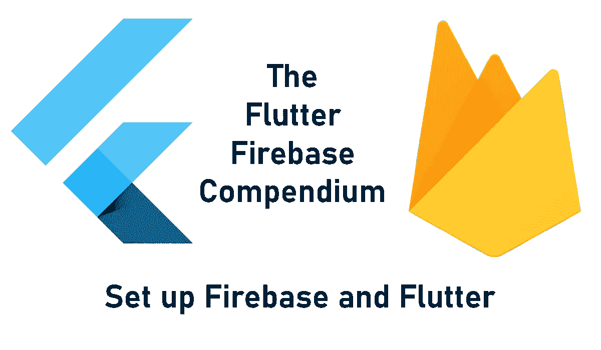

Firebase 是 Google 的一个轻量级应用程序开发平台，提供各种服务，如数据库、身份验证、消息传递等等。它为不同的编程语言提供了 SDK，并且有很好的文档记录。如果您想了解使用 Firebase 可以实现什么，可以看看我写的这篇文章。

[](/send-push-notifications-from-a-flutter-app-to-devices-with-firebase-9c84ce58fe30) [## 从 Flutter 应用程序向安装了 Firebase 的设备发送推送通知

### 以下是向具有 Firebase Cloud 功能和 Firebase Cloud 的设备发送自定义推送通知的指南…

levelup.gitconnected.com](/send-push-notifications-from-a-flutter-app-to-devices-with-firebase-9c84ce58fe30) 

本文涵盖以下子主题:

🔹创建一个新的 Firebase 帐户
🔹创建一个新的 Firebase 项目
🔹创建一个新的 Firebase 应用程序
🔹升级您的账单方案
🔹检查您的使用数据
🔹管理用户和权限
🔹创建新预算

```
👉 Do you want all the details? Check out [**my ebook**](https://xeladu.gumroad.com/l/ffc) with in-depth guides about building Flutter apps with Firebase! Buy it on [**Gumroad**](https://xeladu.gumroad.com) now!
```

## 创建一个新的 Firebase 帐户

建立一个账户相当容易。只需进入[console.firebase.google.com](https://console.firebase.google.com)，点击**开始**，用你现有的谷歌账户登录。否则，您需要创建一个新的。


作者的 Firebase 欢迎屏幕

🎉就是这样！现在，您需要创建您的第一个项目。

## 创建新项目

创建一个项目只需一分钟。只要按照这些步骤，看看解释图像。

1.在[console.firebase.google.com](https://console.firebase.google.com)的 Firebase 仪表盘上点击**添加项目**

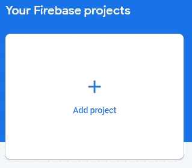

作者添加新的 firebase 项目时的屏幕截图

2.为您的项目选择一个**名称**

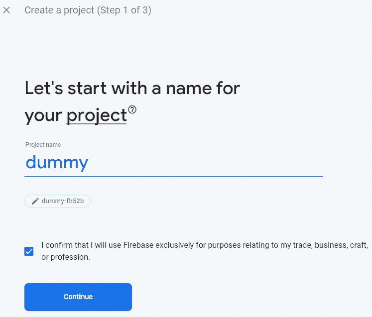

按作者选择 Firebase 项目名称时的屏幕截图

3.你将被要求启用**谷歌分析**，但如果你愿意，你也可以禁用它

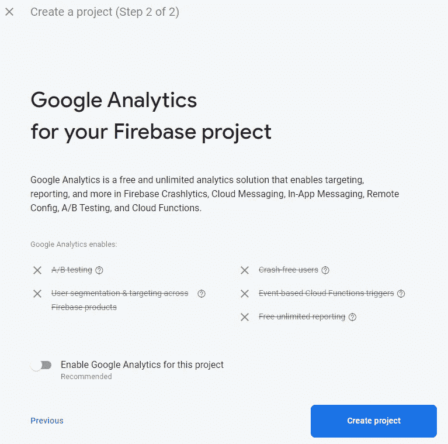

作者创建 Firebase 项目过程的最终屏幕

4.点击**创建项目**完成该过程。

您的新项目将出现在仪表板中，并可供使用💪

## 用 Firebase 连接你的 Flutter 应用

要从 Flutter 应用程序访问 Firebase，您需要做一些设置步骤。

1.安装 Flutter SDK 并创建一个 Flutter 项目

[](https://xeladu.medium.com/create-a-new-flutter-project-in-three-different-ways-a5ace80195b9) [## 用三种不同的方式创建一个新的颤振项目

### 这篇短文展示了如何创建一个新的 Flutter 项目，这样您就可以开始开发您的应用程序了。

xeladu.medium.com](https://xeladu.medium.com/create-a-new-flutter-project-in-three-different-ways-a5ace80195b9) 

2.安装 [Firebase CLI 工具](https://firebase.google.com/docs/cli)

3.使用 [firebase 登录](https://firebase.google.com/docs/cli#sign-in-test-cli)命令登录您的 Firebase 帐户

4.从任何位置使用任何命令行工具安装 FlutterFire CLI`dart pub global activate flutterfire_cli`

5.导航到你的 Flutter 项目根文件夹并运行命令`flutterfire configure --project=<project-id>`
一个文件`firebase_options.dart`将在你的`lib`文件夹中创建。但是，它会产生构建错误。该文件包含使用 Firebase 所需的所有信息。如果您更改了 Firebase 配置(例如，通过添加一个 web 应用程序)，您需要再次运行 configuration 命令。

6.添加 [Firebase 核心插件](https://pub.dev/packages/firebase_core) `flutter pub add firebase_core`构建错误应该已经修复。

[](https://xeladu.medium.com/how-to-install-packages-in-your-flutter-app-e7f7e62711ee) [## 如何在你的 Flutter 应用中安装包

### 这篇短文展示了如何将包添加到一个 Flutter 应用程序中，这样你就可以使用现有的代码并加速…

xeladu.medium.com](https://xeladu.medium.com/how-to-install-packages-in-your-flutter-app-e7f7e62711ee) 

找不到您的项目 id？查看项目设置😉

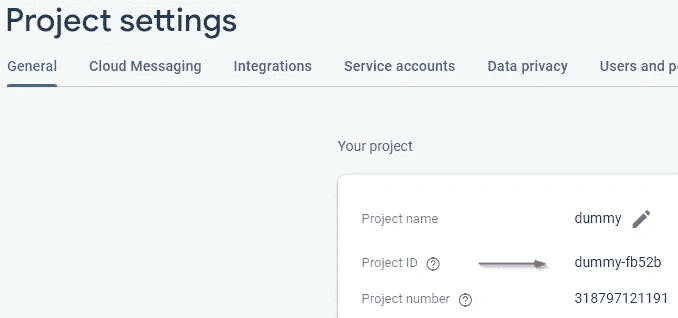

作者的 Firebase 项目设置截图

或者使用命令行工具中的命令`firebase projects:list`。

您也可以在 Firebase 中使用一个向导来提供相同的设置说明。当你在 **Firebase 项目总览仪表板**上时，只需点击 Flutter 图标。


作者将 Flutter 应用程序添加到 Firebase 截图

这是另一个关于如何连接 Firebase 和你的 Flutter 应用的指南。

[](https://firebase.google.com/docs/flutter/setup) [## 将 Firebase 添加到您的 Flutter 应用程序| Firebase 文档

### 如果您还没有一个 Flutter 应用程序，您可以完成入门:试用，使用…创建一个新的 Flutter 应用程序

firebase.google.com](https://firebase.google.com/docs/flutter/setup) 

这就是全部的魔力。你现在可以开始用[可用的 Firebase 插件](https://firebase.google.com/docs/flutter/setup?platform=ios#available-plugins) ⭐开发你的应用

## 升级您的账单方案

默认情况下，你的账户使用的是 **Spark** 计划，该计划对 Firebase 的一些特性有免费使用配额。为了发挥全部潜力，您需要切换到 **Blaze** 计划。根据该计划，在达到免费限额后，将向您收取使用费。没有固定的基本费用需要支付。要比较这些计划的细节，请参见此[链接](https://firebase.google.com/pricing?authuser=0&hl=en)。

💡如果你不托管任何 web 服务，不占用任何数据库存储，不使用 Firebase 的任何功能，你不会被收取任何费用。没有月租费。

❗:您需要设置一个账单账户，在转投 Blaze 计划时需要信用卡。

按照以下步骤改变你的计划:

🔹在你的 Firebase 项目仪表板上，点击左下角的**升级**

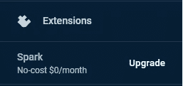

作者升级链接截图

🔹点击**火焰**栏中的**选择计划**

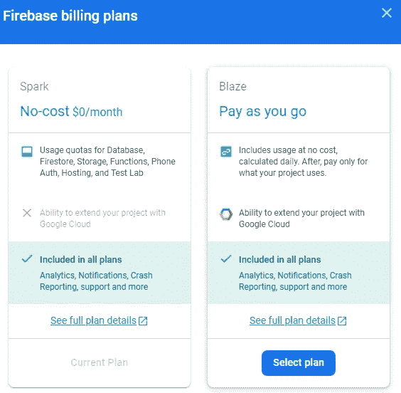

作者方案选择截图

🔹如果需要，设置可选的计费提醒并继续

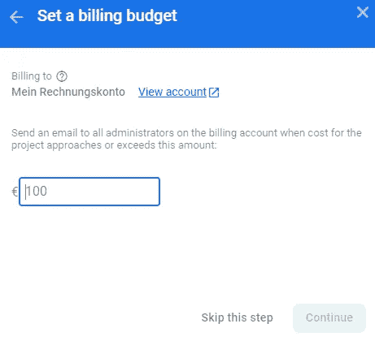

按作者列出的开单预警设置屏幕截图

🔹最后，点击**购买**完成流程

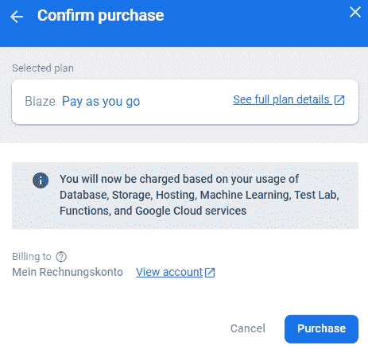

作者购买确认截图

你的计划现在升级了。您可以使用额外的 Firebase 特性，如机器学习、测试实验室或函数👍

## 检查您的使用数据

如果你要开发一个有很多用户的应用，你需要熟悉**使用和计费仪表板**。当负载高时，随着谷歌服务的扩大，你的成本可能会出乎意料地高。 **Firebase 使用和计费仪表板**计算每天的成本，这是一种监控资金的好方法。

🔹在您的 Firebase 项目仪表板上，单击齿轮并从列表中选择**使用和计费**

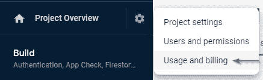

作者的 Firebase 使用和计费链接截图

🔹您将看到下个月初收取的运行成本的概览

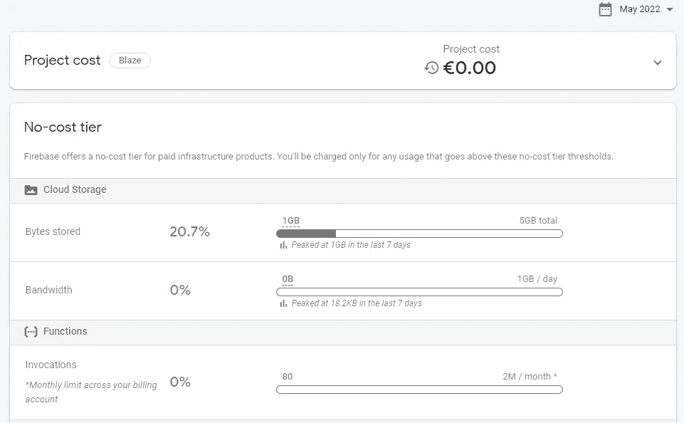

作者提供的 Firebase 使用和计费概述截图

使用 Firebase 跟踪您的当前成本就是这么简单😎

## 管理用户和权限

为了管理用户和权限，Firebase 在项目设置中提供了另一个仪表板，用于添加或删除成员并为他们分配角色。

🔹在 Firebase 项目仪表板上，单击齿轮并从列表中选择**用户和权限**

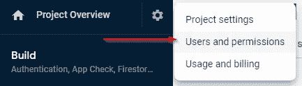

作者的 Firebase 用户和权限链接截图

🔹使用仪表板管理成员和角色。对于高级设置，右下角有一个指向谷歌云控制台的链接。

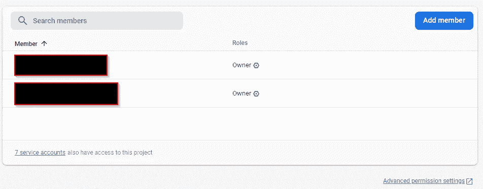

按作者划分的 Firebase 用户和权限仪表板屏幕截图

🔹要邀请新成员，点击**添加成员**按钮，并插入邮件地址和所需角色。

在我看来，Firebase 让用户管理变得非常简单👏

## 创建新的预算预警

当你不想每个月超过一定的金额，但你也不想每天都跟踪你的成本时，预算提醒是很棒的。如果发生事件(例如达到预算的 90%)，预算警报会通知您。这样你就不用担心成本了。

要设置一个或多个预算提醒，请转到**使用和计费仪表板**(参见**检查您的使用数据**部分)并切换到**详细信息&设置**选项卡。

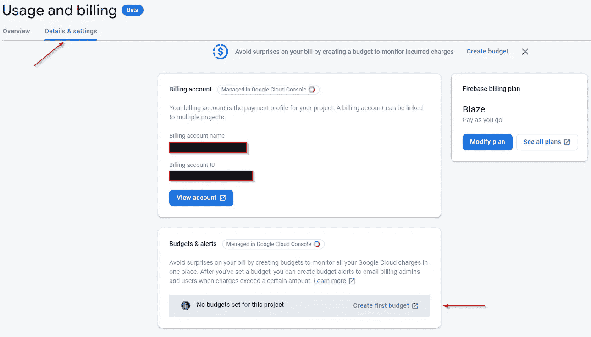

作者提供的 Firebase 详细信息和设置仪表板截图

使用按钮**创建第一个预算**(或者**查看预算**如果你已经有至少一个)来管理你的预算。你会被重定向到**谷歌云控制台**，但是这个向导很容易理解🛠

## 结论

有了这几个步骤，你就可以开发 Firebase 支持的 Flutter 应用了。

这篇文章是 Flutter Firebase 纲要的一部分，其中有许多教程和操作指南，介绍了 Firebase 与 Flutter 应用程序相结合的可能性。


[赛拉杜](https://xeladu.medium.com/?source=post_page-----acd826be8356--------------------------------)

## 了解 Flutter 和 Firebase 的威力

[View list](https://xeladu.medium.com/list/learn-about-the-power-of-flutter-and-firebase-2ec07e25baba?source=post_page-----acd826be8356--------------------------------)13 stories

用我的电子书为 Flutter 开发者充分利用 Firebase。

[](https://xeladu.gumroad.com/l/ffc) [## 颤振燃烧基础概要

### 这本电子书着重于让你能够在你的应用中集成 Firebase 云服务。当你想要的时候，它是一个跳跃的开始…

xeladu.gumroad.com](https://xeladu.gumroad.com/l/ffc) 

[***通过我的推荐链接加入成千上万的媒体会员，每月只需 5 美元就可以阅读你想阅读的文章！***](https://medium.com/@xeladu/membership)

[](https://medium.com/@xeladu/membership) [## 通过我的推荐链接加入 Medium-xela du

### 只需点击一下，就可以通过会员资格访问数千篇文章！您的会员资格只需 5 美元一张…

medium.com](https://medium.com/@xeladu/membership) 

点击 [**此处**](https://xeladu.medium.com/subscribe) 将我所有的新文章发送到你的邮箱🔔浏览[我的 Gumroad 商店](https://xeladu.gumroad.com/)寻找有趣的编程素材🏬


[赛拉杜](https://xeladu.medium.com/?source=post_page-----acd826be8356--------------------------------)

## 适合初学者的颤振文章

[View list](https://xeladu.medium.com/list/flutter-articles-for-beginners-a040ea777956?source=post_page-----acd826be8356--------------------------------)24 stories

[赛拉杜](https://xeladu.medium.com/?source=post_page-----acd826be8356--------------------------------)

## 软件工程师的高级颤振文章

[View list](https://xeladu.medium.com/list/advanced-flutter-articles-for-software-engineers-f074879fdef3?source=post_page-----acd826be8356--------------------------------)9 stories