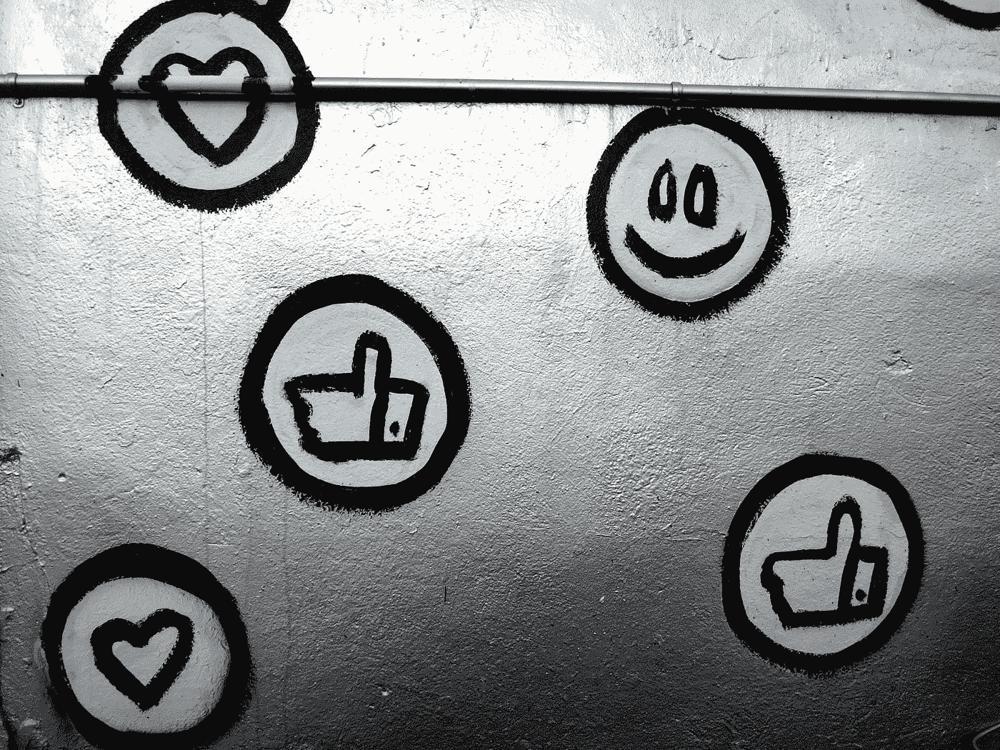

# 如何在你的 Rails 社交媒体应用程序中创建一个关注/取消关注功能

> 原文：<https://levelup.gitconnected.com/how-to-create-a-follow-unfollow-button-in-your-rails-social-media-application-e4081c279bca>

## 使用自我参照关系为你的应用添加有意义的交互性



乔治·帕甘三世在 [Unsplash](https://unsplash.com?utm_source=medium&utm_medium=referral) 拍摄的照片

你有没有想过 Twitter、Instagram 和脸书等社交媒体平台是如何实现关注和取消关注其他用户的功能的？在开发一个社交媒体应用程序的时候，我为此奋斗了很长时间，这要感谢几个非常有用的博客，还有我那了不起的队友(大声喊出来！)，我能够构建这两个特性！最棒的是，这并不像看起来那么难。

**在进入细节之前，这里有一个过程的总结:**

1.  创建具有所需属性的用户模型
2.  创建一个 Follow 模型作为外键的联接器
3.  在每个模型中创建关系，引用相应的类(这是它自引用的原因)
4.  为跟随和取消跟随设置自定义路线
5.  在用户模型中编写 follow 和 unfollow 方法
6.  创建跟随和取消跟随按钮

***请注意:*** *下面概述的过程需要预先设置会话和认证。这个设置将确保您可以引用当前用户，就像我在下面的演练中所做的那样。这里有一篇很棒的文章详细介绍了这个设置过程。* [*Rei Rey noso*](/simple-authentication-guide-with-ruby-on-rails-16a6255f0be8)的 Ruby on Rails 简单认证指南

## 步骤 1:建立自我参照关系

一旦使用`rails new file-name`生成了新的 rails 应用程序，就该创建模型了。本演练非常简单，只需逐步完成基本要求，就可以实现这一功能。

首先，需要生成用户模型和控制器。在终端中实现这一点的一个快速方法是使用`rails g resource`命令，用它的属性链接起来，就像这样:

```
rails g resource users name:string username:string location:string bio:string
```

属性可以根据您的需要定制，这只是一个例子。使用`rails g resource`命令自动为用户数据创建一个迁移文件。此时，既然模型已经建立，那么在控制台中添加一些测试用户或者用一些预加载的用户播种数据会有所帮助。这对构建和测试过程很有用。

接下来，创建 joiner，在这种情况下，它将是 Follow 模型。这就是自我指涉关系建立的地方。

```
rails g resource follows follower_id:integer followee_id:integer
```

如图所示，包含两个 id—一个用于关注者，一个用于被关注者。澄清一下，**跟随者**是创建跟随者的人，而**跟随者**是获得跟随者的人。这可能会令人困惑，所以提醒总是有帮助的！

现在这两个模型已经存在，是时候设置关系以确保所有东西都连接起来了。在关注模型中，为关注者和被关注者添加`belongs-to` 关系。通过将`class_name: ‘User’` 添加到关系的末尾，它们将作为用户类中的子类别关联起来。它基本上允许用户 id 被分配给一个追随者和追随者。

此代码位于 app/models/follow.rb 中

上面代码片段中的两个验证是为了确保一个用户只能关注另一个用户一次，并且一个用户只能关注另一个用户一次。

在用户模型中，为追随者和被追随者添加`has_many` 关系。这个有点复杂。

让我们来分解一下:

```
has_many :followed_users, foreign_key: :follower_id, class_name: 'Follow'has_many :followees, through: :followed_users
```

第一行使一个用户能够关注许多其他用户。它允许从 Follow 类访问外键`follower_id`。然后，用户的 ID 可以作为关注者与关注相关联。第二行说一个用户通过上面一行建立的`followed_users`有很多追随者。

```
has_many :following_users, foreign_key: :followee_id, class_name: 'Follow'has_many :followers, through: :following_users
```

这下一块同上，只是为了反关系。一个用户可以有多个用户关注他们，可以使用`followee_id` 将一个用户的 ID 关联到关注者，成为被关注者。一个用户通过上面一行中建立的`following_users`拥有很多追随者。

***请注意:*** *同样在上面的代码片段中，我有几个验证来确保用户在登录页面上输入正确的信息。这些都是非常基本的，为了正常运行，添加更多是明智的，但这是一个单独的主题，并不影响这些追随者-追随者的关系。*

第一步到此结束！现在，您可以在控制台中创建关注者或种子数据，通过这些关注者和被关注者关联来连接两个用户。确保运行`rails db:migrate`来迁移您的表，如果您预先植入了数据，则运行`rails db:seed`。

*另一个关于这个话题的好博客是* [*迪克·沃德的文章*](https://medium.com/@TheDickWard/self-referential-relationships-aka-self-joins-in-rails-64f8f36ac311) *关于自我参照关系。*

## 步骤 2:设置路线

既然已经建立了模型和关系，是时候为跟随和取消跟随创建自定义路线了。

该代码位于 config/routes.rb 中

之所以使用 POST 操作，是因为这类似于对用户进行更改或更新，即通过将关注与关注者和被关注者相关联来更新数据。这条路线有三个部分。第一部分包括`/users/:id/follow`，所以当点击 follow 按钮时，您会因为 URL 中的 ID 而知道它与哪个用户相关联 unfollow 路线也是同样的想法。第二部分意味着当点击按钮时，相关的路线将指向用户控制器中定义的跟随或不跟随动作。最后一部分是可选的，但是允许在您的代码中更容易地引用该路由，而不需要显式地编写 URL。

基于以上所述，下一步将是在用户控制器中为跟随和取消跟随创建动作(或方法)。

此代码位于 app/controllers/users _ controller . Rb 中

对于关注者，找到用户，将该用户添加到当前用户的关注者中，然后重定向回该用户的显示页面。我们为应用程序设置了一个备用位置，但这是可选的。

对于取消关注，类似地，找到用户，从当前用户的关注者中找到关注实例，销毁该实例，然后重定向回用户的显示页面。

既然所有这些后端工作都已经设置好了，我建议在添加前端代码的同时启动服务器。当您开始使用按钮添加页面内容并尝试各种路线时，一步一步地执行并测试您的代码会容易得多。

## 步骤 3:创建按钮

所有的连接和关系都建立在后端。这一步包括创建一个前端元素，用户可以与之交互来创建和删除 follow 实例。

此代码位于 app/views/users/show.erb 中

在用户的 show 页面中，只需为按钮创建一个部分，并在这个部分中添加一个带有一些不同检查的条件语句:

1.  如果用户的个人资料属于当前用户,“注销”按钮将出现在指定的位置——这是一个选项，但不是必需的，具体取决于您想要的布局
2.  否则，如果当前用户已经在关注该用户,“取消关注”按钮将出现在指定位置
3.  否则(意味着当前用户还没有跟随用户)一个“跟随”按钮将在指定的位置

在每个选项中，都应该创建一个`button_to`元素来链接到所需的路径。这里将使用之前在路线中定义的`follow_user`和`unfollow_user` 路径。

我和我的队友添加了链接来显示用户的关注者和来自他们个人资料的关注者。这是一个额外的功能，我们希望在我们的应用程序，因为这是有益的参考列表如下添加或删除。请尽情发挥创造力，添加您想要的任何功能！

下面是我们构建的应用程序的关注和取消关注功能的示例。如您所见，点击“关注”按钮后，会切换到“取消关注”按钮。Followers 已在数据库中注册，这通过 Followers 页面上显示的列表得到了确认。


你的按钮应该如何运作的例子

*在构建该功能时，另一个很好的参考资源是 Carla Stickler 的文章* *，其中介绍了跟随和取消跟随按钮的过程。*

**就是这样！**

添加跟随和取消跟随功能就是这么简单。乍一看，这似乎令人望而生畏，但是通过设置几个模型和路线，可以使用自参照关系轻松地为用户创建额外的交互性。

## 来源

[](https://guides.rubyonrails.org/command_line.html) [## Rails 命令行— Ruby on Rails 指南

### 阅读完本指南后，你将知道:如何创建一个 Rails 应用程序。如何生成…

guides.rubyonrails.org](https://guides.rubyonrails.org/command_line.html) [](https://guides.rubyonrails.org/action_controller_overview.html) [## 动作控制器概述— Ruby on Rails 指南

### 动作控制器概述在本指南中，您将学习控制器如何工作，以及它们如何适应…

guides.rubyonrails.org](https://guides.rubyonrails.org/action_controller_overview.html) [](/simple-authentication-guide-with-ruby-on-rails-16a6255f0be8) [## Ruby on Rails 的简单认证指南

### 关于在 Rails 应用程序中实现授权/认证的简单教程。我将利用…

levelup.gitconnected.com](/simple-authentication-guide-with-ruby-on-rails-16a6255f0be8) [](https://medium.com/@TheDickWard/self-referential-relationships-aka-self-joins-in-rails-64f8f36ac311) [## Rails 中的自引用关系(也称为自连接)

### 在我学习 web 开发时，Rails 关系是我最难以理解的事情之一…

medium.com](https://medium.com/@TheDickWard/self-referential-relationships-aka-self-joins-in-rails-64f8f36ac311) [](https://medium.com/from-the-stage-to-the-screen/making-a-follow-unfollow-button-in-rails-b3118c485691) [## 在 Rails 中制作跟随/取消跟随按钮

### 好的，所以你已经决定为你的新网站建立一些社交方面，你对自己说，嘿，我应该…

medium.com](https://medium.com/from-the-stage-to-the-screen/making-a-follow-unfollow-button-in-rails-b3118c485691)