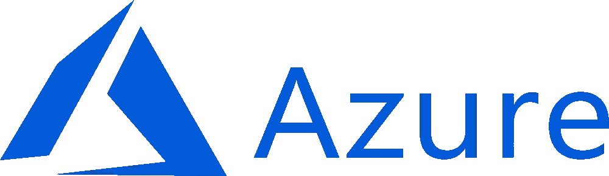
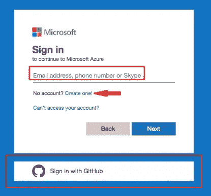
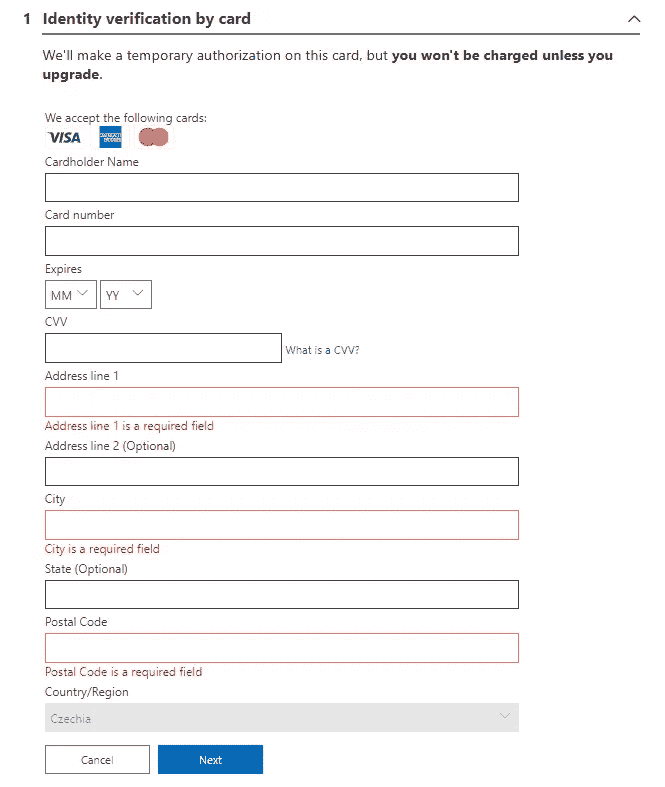
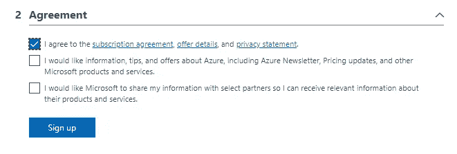
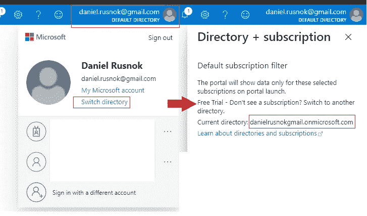
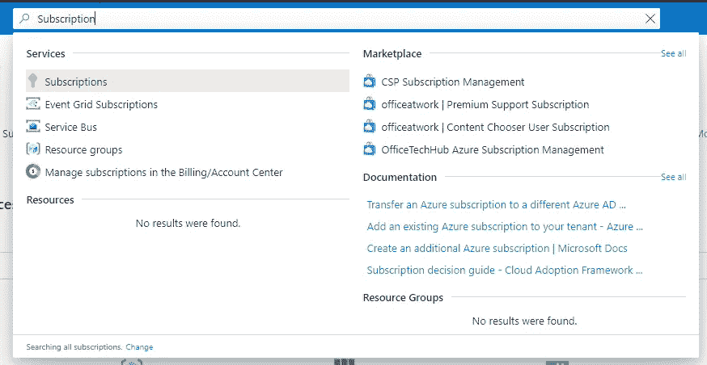
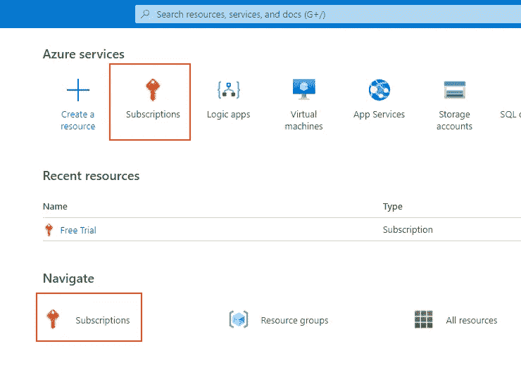

# 如何一步一步创建免费的 Azure 帐户

> 原文：<https://levelup.gitconnected.com/how-to-create-a-free-azure-account-step-by-step-348d4991ae6e>

## AZURE 和云

## 创建免费 Azure 帐户指南。有哪些服务可以免费使用？什么是目录或订阅，Azure 提供什么类型的订阅？

官方 [Azure](https://azure.microsoft.com/) logo 从 seeklogo.com[下载](https://seeklogo.com/vector-logo/326269/microsoft-azure)

# 什么是 Azure

Azure 是微软开发的云提供商。如果你不熟悉云计算，我推荐你阅读我的[云计算简介](/introduction-to-cloud-computing-235e530b9fe0?source=friends_link&sk=9c99063a197df858c8d24a296620ccbc)。

 [## 云计算简介

### 云计算是软件利用、开发和托管的现在和未来。让我给你介绍一下它的…

levelup.gitconnected.com](/introduction-to-cloud-computing-235e530b9fe0) 

# 创建免费的 Azure 帐户

1.  转到[https://azure.microsoft.com/free](https://azure.microsoft.com/free)。
2.  点击“免费开始”按钮。
3.  您将被重定向到登录表单。您需要 Microsoft 帐户。如果你没有，创建一个或者也有可能使用微软购买的 GitHub 帐户。

Microsoft 登录表单

4.成功授权后，您将被重定向到卡形式的身份验证。对于那些也不喜欢给出信用卡首字母的人，我有一个小提示给你。使用 service [Revolut](https://www.revolut.com/) 免费创建国际银行账户，然后生成虚拟信用卡。它是完全免费的。

通过卡形式进行身份验证

5.现在唯一剩下的就是检查协议，点击注册，你的 Azure 帐户就创建好了。恭喜你！

协议和注册按钮

6.如果您没有被重定向到 [Azure 门户，请使用此链接。](https://portal.azure.com/)

# 免费账户的免费服务

有了你的第一次注册，微软对我们非常慷慨。您将获得:

1.  **€170 或 200 美元的免费信贷**，有效期为第一个月。当您的第一个月结束时，点数到期，您将被要求选择一个可用的套餐。我们很快就会谈到它们。
2.  **12 个月免费普及服务。**
3.  **25 项免费独立服务。**不同地区的优惠可能有所不同。

免费服务和优势的结构列表可以在[我们注册](https://portal.azure.com/free)时使用的同一页面上找到。向下滚动，你应该会找到它。

# 目录

每个 Microsoft 帐户或 Microsoft 服务都与 Azure Active Directory (AAD)相关联。AAD 是微软基于云的身份和访问管理服务。

从 Xbox 账号到 Office365，如果你在使用微软的某个服务，你有一个关联 AAD 的账号，还有专门为你准备的目录。

该目录是一个基于云的身份，它总是有其可读的标识符，以 onmicrosoft.com 的后缀*结尾。这样的标识符是全球唯一的。点击右上角的你的名字，然后点击*切换目录*链接，就可以看到你的 AAD 的名字。*

在 Azure Portal 中显示您的目录名称

# 捐款

一个目录可以包含多个订阅。它作为 Azure 资源的单一计费单位。这是最常用的订阅类型:

1.  **现收现付** —顾名思义，您将每月收到当月所用资源的账单。这是一个月免费试用后显而易见的选择。如果你只是想使用免费服务，你没有什么可担心的。
2.  **Azure Open licensing**—从第三方零售商处购买的积分。在 Azure Portal 中，您将获得您要应用的在线表单的代码。
3.  **Visual Studio Enterprise 订阅** —如果您是 VS Enterprise 的用户，您将获得每月 200 美元的免费积分。

还有更多的企业订阅包括 Azure 支持服务。值得一提的是，没有有效的订阅，您无法部署任何服务。

如果你对免费试用一个月不感兴趣，你可以立即升级你的订阅，点击 Azure 门户主页左上角的按钮*升级*。

Azure 门户中的升级按钮

订阅也可以添加投页面订阅。你可以在顶部的交互式搜索栏中导航。

搜索订阅

或者，如果你真的是新手，不玩你主页的设置，你应该能够在 *Azure services* 部分和 *Navigate* 部分看到订阅页面的链接。

Azure 门户主页上的订阅链接

进入订阅页面后，使用按钮*添加*。您将被重定向到提供订购服务的页面。正如你在下图中看到的，我已经禁用了现收现付*选择优惠*按钮，因为我的免费试用期仍在继续。但我可以升级我的帐户，并在旁边提供链接。

# 摘要

我希望一切都很清楚，你现在已经准备好创建你的免费帐户，并开始玩 Azure。Azure 真的是一个巨大的游乐场，非常值得。

# 来源

*   内尔·莫里西的复视课程。
*   [微软学习平台。](https://docs.microsoft.com/en-us/learn/paths/azure-fundamentals/)
*   [蔚蓝入门。](https://azure.microsoft.com/free)
*   [蔚蓝门户。](https://portal.azure.com/)

 [## 丹尼尔·鲁斯诺克的时事通讯

### 每个月我都会给你发一封电子邮件，列出我的最新文章。这当然是友好的联系…

www.danielrusnok.com](https://www.danielrusnok.com/daniel-rusnoks-newsletter) 

# 分级编码

感谢您成为我们社区的一员！升级正在改变教师招聘。 [**在最好的公司**找到你的完美工作](https://jobs.levelup.dev/talent) **，而不仅仅是你的*下一份工作*。如果你是开发人员，请点击“申请加入”,如果你是公司，请点击“开始招聘”。**

 [## 提升——改变招聘流程

### 🔥让软件工程师找到他们热爱的完美角色🧠寻找人才是最痛苦的部分…

作业. levelup.dev](https://jobs.levelup.dev/talent)