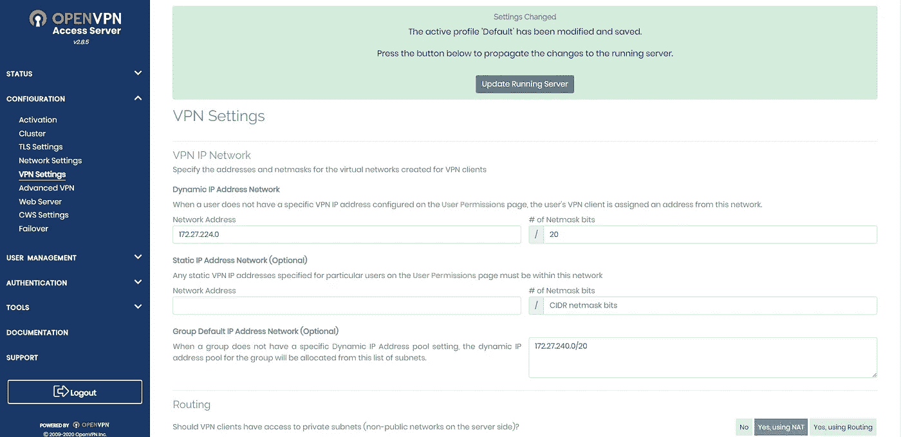

# 如何创建一个免费的 VPN

> 原文：<https://levelup.gitconnected.com/how-to-create-a-free-vpn-2821214839da>

## 在 AWS 中创建您自己的 VPN，绝对免费。


来自 [Pexels](https://www.pexels.com/photo/macbook-pro-on-brown-wooden-table-1901388/) 的[凯文·帕斯特](https://www.pexels.com/photo/macbook-pro-on-brown-wooden-table-1901388/)的照片

## 你需要什么？

你只需要一个免费层 AWS 云账号就可以免费设置 VPN 服务器。如果你没有，你现在就可以在这里创建 [AWS 免费轮胎](https://aws.amazon.com/free/?all-free-tier.sort-by=item.additionalFields.SortRank&all-free-tier.sort-order=asc&awsf.Free%20Tier%20Types=*all&awsf.Free%20Tier%20Categories=*all)。如果您现在创建 AWS 帐户，请确保您在 AWS 内部创建了一个用户，并使用该用户帐户进行所有操作，同时确保 root 凭据的安全。


图片作者来自 [AWS](https://aws.amazon.com/free/?all-free-tier.sort-by=item.additionalFields.SortRank&all-free-tier.sort-order=asc&awsf.Free%20Tier%20Types=*all&awsf.Free%20Tier%20Categories=*all)

## 怎么办？

登录您的 AWS 用户，进入仪表板>服务>计算，然后选择弹性云计算 aka。EC2 只不过是云中的一台虚拟计算机。

## 要遵循的步骤:

*   如果您有一些您想要托管 VPN 服务器的区域规范，这时您需要从 AWS 控制台的右上角选择您的区域。(对于演示，我在不同的国家，但我想在印度托管我的 VPN 服务器，所以我选择了孟买地区)
*   单击 Launch Instance 按钮创建一个新的 EC2 实例。


作者图片来自 AWS_Console

*   在 **Name and tags** 部分，输入您想要给 EC2 实例起的名字，如果需要的话，添加一些可选的标签。
*   在**应用和操作系统映像(Amazon 机器映像)**部分，键入 OpenVPN 并点击浏览更多 ami>AWS market place ami，选择 OpenVPN 访问服务器并按继续。
*   确保您选择的 AMI 没有任何相关的成本。(从下图中，您可以观察到第一个 AMI 没有任何费用，而第二个 AMI 显示“从**$ 0.12/小时**或从**$ 840.00/年】**”


作者图片来自 AWS

*   在**实例类型**部分，单击下拉菜单并选择“t2.micro ”,这是符合条件的自由层。


作者图片来自 AWS

*   在 **Key pain(login)** 部分，使用任何现有的密钥对或通过点击创建新的密钥对>输入名称> RSA >来创建一个新的密钥对。pem >创建密钥对。


作者图片来自 AWS

*   请确保保存这个密钥，因为稍后您将需要它来对 EC2 进行 ssh。
*   在**网络设置**部分，如果您知道如何更改这些证券组规则，您可以更改它们。但是我的建议是保留已经存在的规则。


作者图片来自 AWS

*   在**配置存储**部分，保留默认配置并按下 launch instance。现在，等待一段时间让 AWS 执行检查，然后启动您的 VPN 服务器。


作者图片来自 AWS

*   现在您需要为您的服务器设置一个用户。
*   使用下面的代码打开 git-bash 或任何其他终端并 ssh 到您的实例中。

```
ssh -i ./VPN.pem root@"public ip of your EC2" 
```

*   在执行上述命令之前，请更改 VPN.pem 文件所在的目录。


作者图片来自 AWS

*   按是并输入。按照命令，最后，你可以看到下面的命令…


作者图片来自 AWS

*   现在重复相同的命令，但这次将用户名从“root”改为“openvpnas”。

```
ssh -i ./VPN.pem openvpnas@"public ip of your EC2"
```

*   现在，您需要使用“sudo passwd openvpn”为服务器设置一个用户，并输入两次新密码，您就可以开始了。


作者图片来自 AWS

*   现在使用您的“https://publicip:943/admin”通过任何浏览器连接到您的服务器。你可能会看到下面的窗口，然后你点击继续(不安全)。


*   然后，您需要使用用户名 openvpn 和您之前创建的密码登录到我们的服务器。接下来点击同意。


作者图片来自 AWS


作者图片来自 AWS

*   然后你需要点击配置下的 VPN 设置。


作者图片来自 AWS

*   “客户端互联网流量应该通过 VPN 路由吗？”默认情况下，选项将被禁用。您需要启用它，保存更改，滚动到顶部，然后按“更新运行的服务器”



作者图片来自 AWS

*   现在，您可以将链接“https://publicip:943/admin”更改为“https://publicip ”,并使用与之前相同的凭据登录。


作者图片来自 AWS

*   现在，您可以在这个免费层服务器中一次最多连接两个设备。

## VPN 怎么用？

为了演示，我将展示如何使用手机进行连接。

*   首先，你需要下载 OpenVPN 移动应用。首次打开时，您需要导入 VPN 的配置文件。
*   如图所示，输入您的公共 IP 地址


*   输入 openvpn 作为您的用户名，并使用您的密码。在端口部分使用 943 来导入您的配置文件。
*   现在你需要打开你的 VPN 连接


*   您现在已连接，安全无虞。
*   你可以通过进入浏览器搜索“显示我的 IP？”来检查你的连接

您可以看到，您的 IP 将是您创建的 EC2 实例的公共 IP，位置将是您选择并创建的 EC2 实例的 AWS 区域。


*   从上面的图片中，你可以看到我的 IP 是我的 EC2 的公共 IP，我的位置在印度，即使我在不同的位置。

希望你们会觉得有用。

[](https://harish386.medium.com/how-to-change-the-index-of-a-dataframe-in-python-1315d72bcf07) [## 如何在 Python 中改变数据帧的索引

### 将数据框的索引改为熊猫及其优点。

harish386.medium.com](https://harish386.medium.com/how-to-change-the-index-of-a-dataframe-in-python-1315d72bcf07) [](https://medium.com/python-pandemonium/how-to-import-data-from-multiple-text-files-in-python-c3956a878fe0) [## 如何在 Python 中导入多个文本文件的数据？

### 从多个文本文件中导入、重新排列、合并和索引数据，以及导出合并的…

medium.com](https://medium.com/python-pandemonium/how-to-import-data-from-multiple-text-files-in-python-c3956a878fe0) 

你可以在 [Twitter](https://twitter.com/rishi6984) 和 [LinkedIn](https://linkedin.com/in/harish-maddukuri) 上关注我，了解更多不同主题的内容。

谢谢你，很快再见…！

再见。