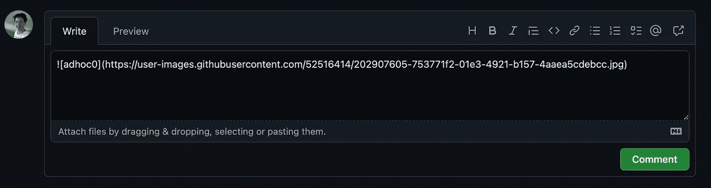
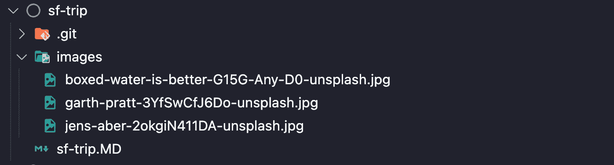
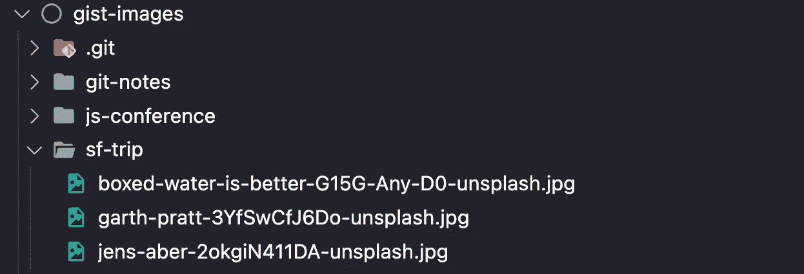
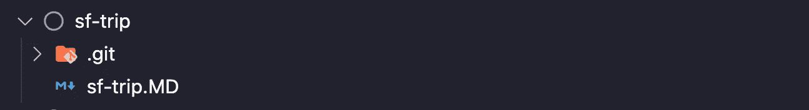

# 如何用图像创建要点

> 原文：<https://levelup.gitconnected.com/how-to-create-a-gist-with-images-f02f4adbcd75>

使用 Github repo 存储所有 gists 的图像


*照片由* [*笔*](https://unsplash.com/@abillion?utm_source=unsplash&utm_medium=referral&utm_content=creditCopyText) *笔* [*笔*](https://unsplash.com/s/photos/pictures-in-documents?utm_source=unsplash&utm_medium=referral&utm_content=creditCopyText)

Gists 是与他人分享信息的好方法，很多时候你会希望包含图片以提高可读性。问题是，如果你把你的降价文档和你的图像文件一起上传到 gist，那么你的 Gist 将会和你的降价文档一起显示你所有的图像文件。但是，如果您不上传您的图像文件，那么您的要点将显示一个空白的图像资源占位符。

有一个解决方法可以避免 gist 中图像文件的混乱。流程是将您的图像文件一个接一个地拖放到 gist 文件上传输入字段，以创建系统生成的图像地址。接下来，用这个系统生成的名称替换您的 markdown 中的映像地址引用，然后退出映像上传过程，不进行提交。对每个图像重复上述步骤。

我对这种变通办法的两个问题是，这是一个繁琐的过程，很难维护。您的图像文件名现在有系统生成的名称，不同于您的原始源文件名。



解决方法-执行上传以获取系统生成的文件名，然后退出而不提交

# 更简单的方法

有一种更简单的方法来处理 gist/images 问题，将所有 gist 的图像存储在 Github repo 中，然后你的 markdown 文档引用这个 repo。这个过程利用了 Github 的免费页面功能，使你所有的图片都可以通过互联网访问。

## 创建图像报告

这是创建存储所有 gists 图像文件夹的 repo `gist-images`的一次性步骤。这个回购中唯一的项目将是你的 gists 的图像文件夹。接下来，转到该回购的设置并创建一个页面。这将使您的所有图像都可以通过互联网访问。创建页面不需要 html 文档。

## 要点设置

*   如果您还没有您的回购`gist-images`的本地副本，那么将其克隆到您的本地计算机。
*   将 images 文件夹从您的本地 markdown 移动到您克隆的`gist-images` repo。将移动的文件夹重命名为`<your-gist-name>`。提交并推动你的`gist-images`回购。您不再需要回购的本地副本，因此请将其从本地计算机中删除。
*   现在你所有的照片都可以上网了。
*   移动之后，你的 gist 文件夹应该只有你的 markdown 文档。你所有的 gist 图片都在你的 Github repo 中，并且都可以通过互联网访问。

在下面的例子中，你可以看到我的要点文件夹`sf-trip`和我的要点图像报告`gist-images`。回购有三个图像文件夹，我的每个 gists 一个:`gist-notes`、`js-conference`和`sf-trip`。我将图像文件夹移动到`gist-images`中，并将移动的文件夹重命名为`sf-trip`。

gist 和 repo 受不同的 git 控制。gist 文件夹推送至 gist，repo 文件夹推送至 Github。



移动图像文件夹前的要点



每个 gist 都有自己的图像文件夹



移动图像文件夹后的要点 sf-trip

## 更新降价文档以使用回购图像互联网地址

*   降价图像的格式为``，您需要将图像文件夹`images`更改为互联网可寻址回购图像文件夹`https://<your-account-name>.github.io/gist-images/<your-gist-name>`
*   在您的降价文档中执行全局替换。“安全”全局替换可能是
    查找`](images/`替换为`](https://<your-account-name>.github.io/gist-images/<your-gist-name>/`
*   现在你的图片应该都可以在你的本地 markdown 上正确显示了。
*   提交并推动你的主旨

*在全局查找/替换之前*

```

```

*全局查找/替换后*

```

```

## 维护

*   改变图像:改变`gist-images` repo 中的图像。你的要点会自动反映你的变化。
*   添加图像:向您的`gist-images` repo 添加图像。在您的要点中，使用此报告的互联网地址/要点来显示该图像。