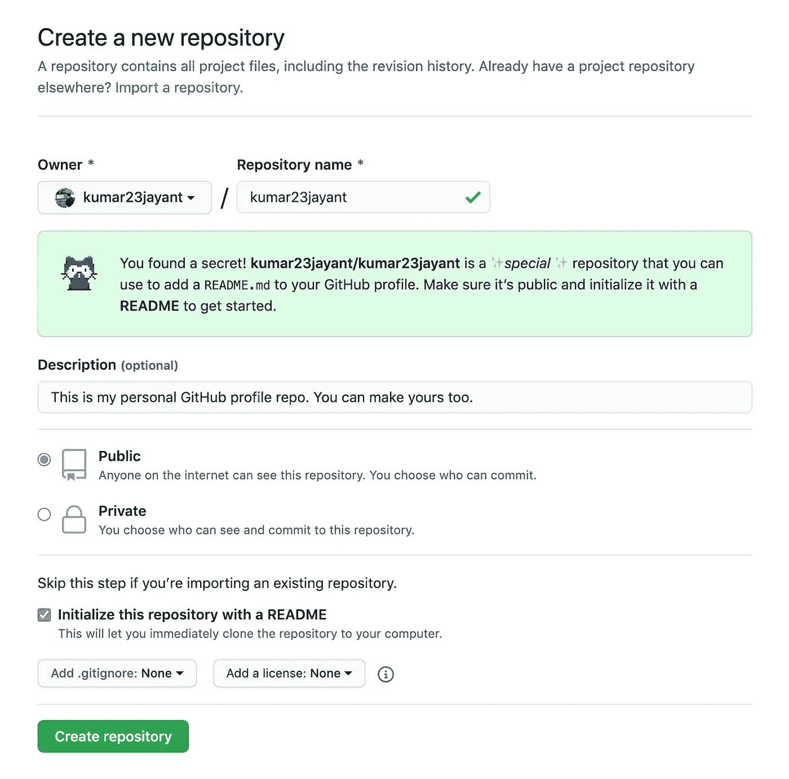
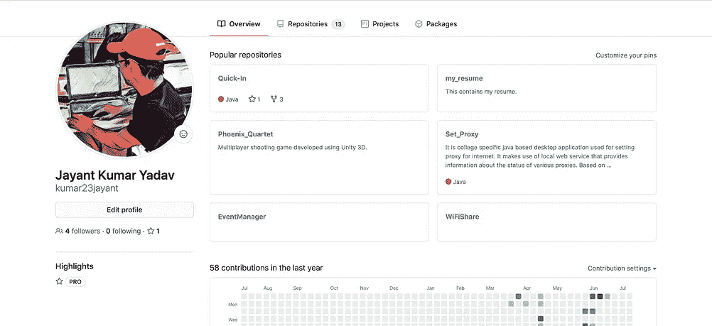

# 如何创建 Github 配置文件自述文件

> 原文：<https://levelup.gitconnected.com/how-to-create-a-github-profile-readme-5f9cd1445965>

GitHub 最近发布了一项功能，允许用户创建配置文件级别的自述文件，以突出显示在他们的 GitHub 配置文件上。让我们看看如何为您的 GitHub 配置文件启用该功能。

**档案级自述文件**功能允许您添加比档案简介更多的内容。它支持 markdown，这意味着你可以通过更多的视觉内容(gif 是最棒的部分！).本自述文件非常显眼，因为它位于您个人资料页面上的固定存储库上方，并且在网页折叠上方占据尽可能多的空间。

在配置文件级别添加 README 似乎是对许多 GitHub 用户已经熟悉的惯例的巨大扩展。

# 如何创建我的个人资料自述文件？

*   创建一个与您的 GitHub 用户名同名(包括大小写)的新资源库。[点击这里为您创建一个。](https://github.com/new)
*   为这个回购添加一个很酷的描述。你可以跳过这个。这是可选的。
*   请确保此存储库是公共的。显然，你想炫耀每个人访问你的个人资料。
*   检查选项说**用一个自述文件初始化这个库。**
*   点击**创建库**按钮**。**
*   添加文本、表情符号、图像、gif 等。到您的自述文件。
*   提交您喜欢的自述文件更改，就大功告成了。喔喔喔！！🥳 🎉

GitHub 自述文件是用 Markdown 编写的，这意味着你不仅仅局限于文本和链接，你还可以包括 gif 和图像。需要复习 Markdown 语法吗？[查看此降价备忘单](https://guides.github.com/pdfs/markdown-cheatsheet-online.pdf)。

我的 GitHub 个人资料之前和之后

以下是我目前为止看到的一些有趣的 GitHub 简介。绝对有助于激发你的想象力。要有创意！

**那都是乡亲们！编码快乐！！**

如果你喜欢这个故事，分享给你的朋友，让整个 GitHub 社区更新他们的 GitHub 档案。不要忘记评论你的创意 GitHub 简介。让我看看你做了什么。🤪

普京先生喜欢为一个好故事鼓掌。像他一样。