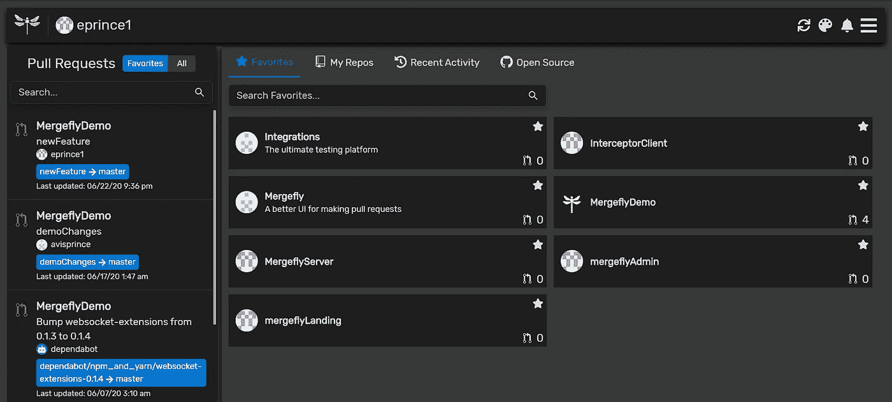
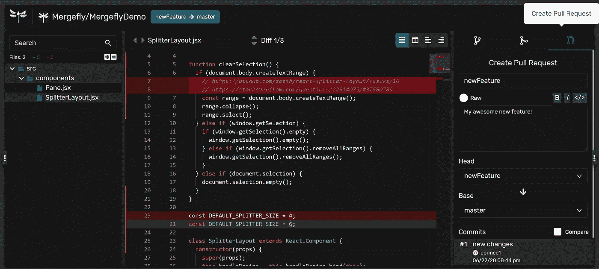
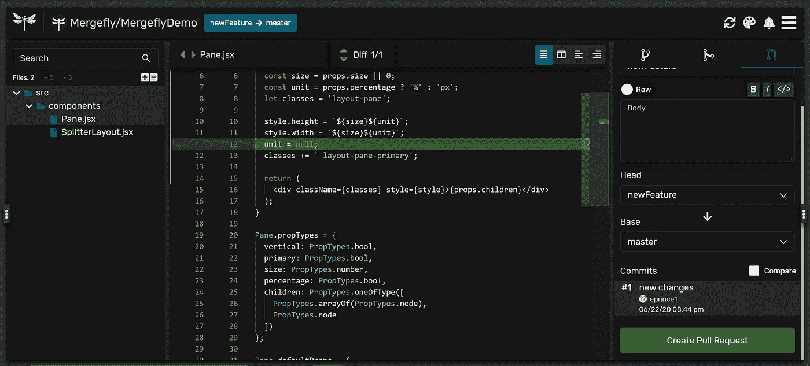
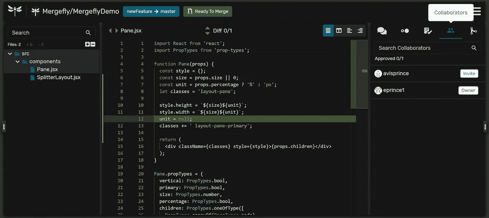
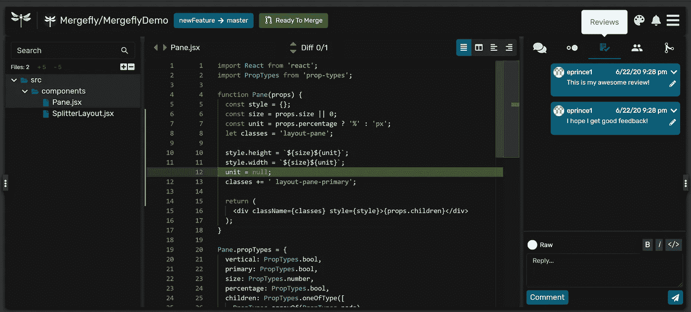
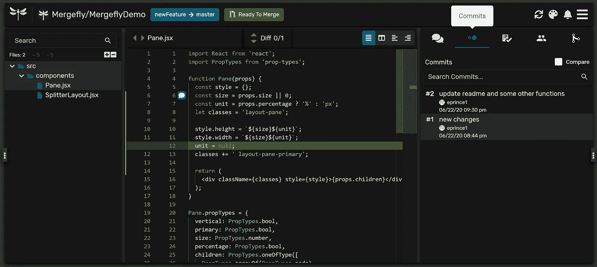
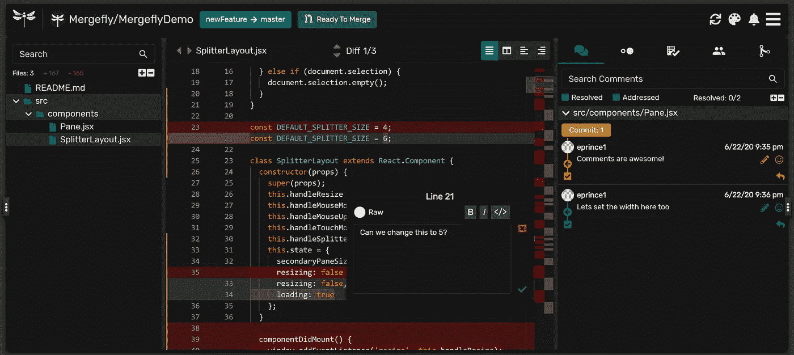
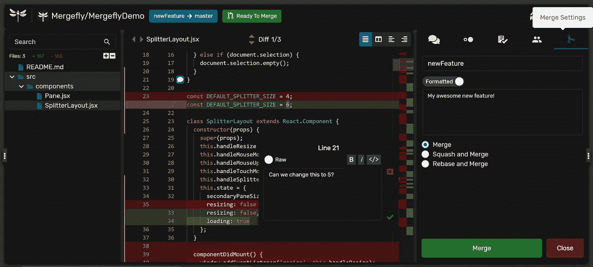
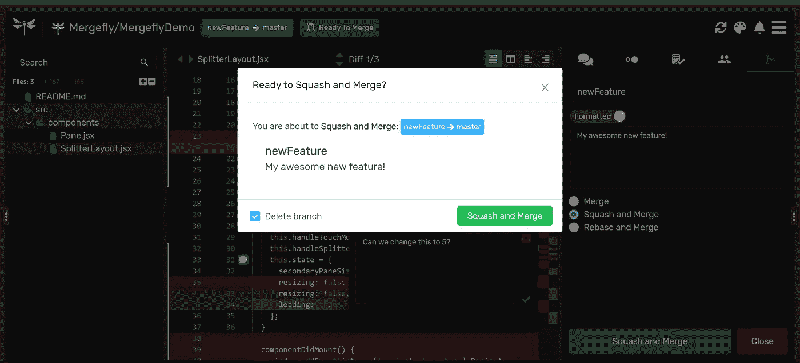

# 如何使用 Mergefly 创建 GitHub Pull 请求

> 原文：<https://levelup.gitconnected.com/how-to-create-a-github-pull-request-using-mergefly-7db0854de8d9>

遵循以下简单步骤，使用 Mergefly 提高团队生产力:

# **启动拉取请求**

让我们首先在 [Mergefly](https://mergefly.com/) 主页上导航到您的存储库。在这里，您可以将存储库添加到您的*收藏夹*中，以便将来更快地导航。

主页的收藏夹部分

在存储库中，单击右侧窗格中的“创建拉式请求”选项卡。然后，设置要从哪个分支创建拉取请求。请记住，在您的团队成员看到任何内容之前，您可以在 Mergefly 上完全预览拉请求。

拉式请求预览

准备好创建拉动式请求后，单击屏幕右下角的绿色“创建拉动式请求”按钮。

创建拉式请求

恭喜你！您已成功创建了一个拉取请求。(您的拉取请求也会在 GitHub 上显示)

# 与拉取请求交互

现在您已经创建了拉请求，让我们看看您的团队成员如何与之交互。

## 合作者

“协作者”选项卡将显示谁有权访问拉动式请求。您还将能够看到请求是否已被批准，或者队友是否正在请求进一步的更改。在这里，您可以通过点击他们姓名旁边的“邀请”按钮，邀请他们查看您的拉式请求。您还可以设置时差通知，以便您的团队在收到请求更新时得到提醒，从而增强团队的异步协作。

合作者

## 复习

“Reviews”选项卡将显示关于拉动式请求的一般注释。它可以实时更新，也可以作为同时检查拉请求的队友的消息传递平台。与 GitHub 一样，Mergefly 不允许您批准或拒绝自己的 pull 请求。

复习

## 承诺

“提交”选项卡将显示拉请求中的所有提交及其所有者。如果您只想查看更新的更改，而不是查看整个拉请求中的提交，那么您可以方便地比较特定的提交。

承诺

## 评论

Mergefly 上的注释可用于导航右侧边栏的 pull 请求。您还可以在页面右侧查看、编辑或回复注释，或者使用我们的浮动注释功能在代码编辑器内部创建和回复注释。可以拖动或隐藏注释以获得最佳视觉界面。左侧文件树和右侧窗格都可以展开和折叠，以提供可定制的查看体验。这些特性确保注释不会妨碍代码。

评论

## 合并

现在是合并您的拉取请求的时候了！此时，您可以更新您的拉取请求的名称和描述。在这里，您可以选择希望拉请求如何合并(合并、挤压或重定基础)。您还可以关闭拉请求，并选择从存储库查看器中重新打开它。

合并

您还可以将您的分支设置为在成功合并后自动删除自身。我们认为这是最佳实践，因为它消除了分支混乱！

完成合并并删除分支

这总结了使用 [Mergefly](https://mergefly.com/) 管理拉请求的基础。我们对未来的教程感到兴奋，它将涵盖收藏夹，最近的历史，快速导航，热键，以及与 Slack 的集成。

[Mergefly](https://mergefly.com/) 对所有的公共和私人存储库都是免费的。跳进来四处看看吧！我们感谢任何和所有的反馈，并期待使拉请求和开发工作流程更加高效和有效。

快乐合并！