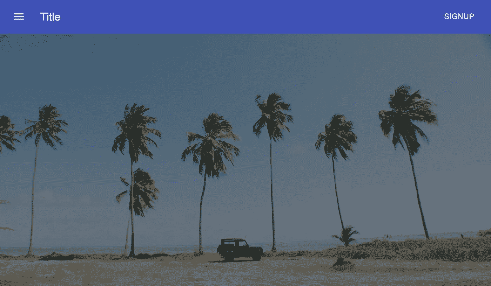

# 如何使用 React-Player 创建带有视频的英雄部分

> 原文：<https://levelup.gitconnected.com/how-to-create-a-hero-section-with-video-using-react-player-aa46445094db>

## 用背景视频突出你的英雄部分


由 [Esteban Lopez](https://unsplash.com/@exxteban?utm_source=medium&utm_medium=referral) 在 [Unsplash](https://unsplash.com?utm_source=medium&utm_medium=referral) 拍摄的照片

当你访问任何一个网站时，首先看到的是英雄版块。英雄部分是通常在网页顶部显示带有一些文本和行动号召的图像的部分。您还可以包含背景视频而不是图像，以使其对用户更具吸引力。

在这篇文章中，我们将学习如何为 React 网站建立一个英雄部分。我们将学习如何使用 react-player 播放背景视频，并添加内容和一个黑暗的覆盖。

本文将继续我们使用 React 和 Material-UI 构建网站的系列。之前，我们创建了一个导航栏。如果你错过了那篇文章，请点击这里查看。您还可以在下面找到本系列所有文章的链接。

1.  [用 React 和 Material-UI 创建一个注册页面](/create-a-signup-page-with-react-and-material-ui-9b203d18cf3f)
2.  [将 React 钩子表单与 Material-UI 组件一起使用](/using-react-hook-form-with-material-ui-components-ba42ace9507a)
3.  [如何用 Material-UI 创建导航栏](/how-to-create-a-navigation-bar-with-material-ui-9cbcfcec2570)
4.  **如何使用 React 播放器创建带有视频的英雄部分**

# 入门指南

如果您错过了以前的文章，我们使用 create-react-app 初始化了一个 React 应用程序。我们已经创建了一个导航栏和一个打开注册表单模式的按钮。我们的项目目前看起来是这样的。


你需要做的第一件事是找到一个你想用作英雄部分背景的视频。我喜欢使用的一个网站是[cover](https://coverr.co/)。他们有库存录像，你可以免费下载。找到你喜欢的视频，添加到`src`文件夹。

接下来，在项目中创建一个名为`Hero.js`的新文件。在这个文件中，创建一个名为 Hero 的功能组件并将其导出。

然后，在`App.js`文件中导入 Hero 组件，并在我们之前创建的 Navbar 组件下渲染。`App.js`文件将如下所示。

```
import Navbar from './Navbar';
import Hero from './Hero';const App = () => {
  return (
    <div className="App">
      <Navbar />
      <Hero />
    </div>
  );
};export default App;
```

# 使用反应播放器

为了嵌入视频，我们将使用一个名为 [react-player](https://www.npmjs.com/package/react-player) 的外部包。这个包使得向 React 应用程序添加视频变得很容易。使用`npm install react-player`在项目中安装库。

在`Hero.js`文件中，从 react-player 导入`ReactPlayer`组件，并导入我们之前添加的视频。

```
import ReactPlayer from 'react-player';
import heroVideo from './HeroVideo.mp4';
```

`ReactPlayer`组件易于使用。你所需要做的就是将一个 url prop 和你想要播放的视频一起传递给它。在我们的例子中，除了 url 属性，我们还将传递以下可选属性。

```
<ReactPlayer
  url={heroVideo}
  playing
  loop
  muted
  width="100%"
  height="100%"
/>
```

接下来，将`ReactPlayer`组件包装在一个`<section>`标签中。我们将添加 CSS 属性，以便在 section 标签中的 hero 部分正确显示视频。

在我的例子中，我使用 Material-UI 中的`makeStyles`钩子来添加样式。如果您不熟悉 Material-UI 的样式，请在这里查看他们的文档。如果你愿意，你也可以用基本的 CSS 达到同样的效果。

```
const useStyles = makeStyles(*theme* => ({
  root: {
    width: '100%',
    height: '80vh',
    '& video': {
      objectFit: 'cover',
    },
  },
}));
```

我们在这里做的是给这个部分一个 100%的宽度和 80vh 的高度。然后，我们将目标指向`video`标签，并赋予它一个适合对象的属性 cover。这是一个重要的步骤，因为我们希望视频播放器总是覆盖整个部分。

当前的项目将是这样的。


# 添加深色叠加

到目前为止，英雄部分看起来不错，但是如果我们想在视频上添加内容呢？为了使内容更加突出，我们将添加一个黑暗的视频覆盖。这可以像使用基本 CSS 属性做任何事情一样来完成。我们将使用`position: 'absolute'`和`top: 0`T10。

首先，在`ReactPlayer`组件下创建一个`<div>`。我们将再次使用 Material-UI `makeStyles`向这个`<div>`添加以下样式属性。

```
overlay: {
  position: 'absolute',
  top: 0,
  left: 0,
  width: '100%',
  height: '100%',
  backgroundColor: 'rgba(0, 0, 0, 0.5)',
},
```

不要忘记将`position: 'relative'`添加到根组件样式中。我们现在应该看到相同的网站，但在视频上有一个黑色的覆盖，如下所示。



# 添加标题和按钮

最后，我们可以在覆盖图的顶部添加内容。你可以随意在你的网站上添加任何你想添加的东西。在我的例子中，我将添加一个标题和一个按钮。

在我们刚刚创建的`<div>`中，我将使用 Material-UI 中的 Box 组件作为包装器来使内容居中。如果您不熟悉 Box 组件，请查看下面的文章。

[](/using-the-box-component-in-material-ui-to-easily-style-your-project-532894edd205) [## 使用 Material-UI 中的 Box 组件轻松设置项目样式

### 不使用 CSS 文件、CSS-in-JS 或内联样式来设计您的应用程序

levelup.gitconnected.com](/using-the-box-component-in-material-ui-to-easily-style-your-project-532894edd205) 

在框组件中，我将使用 Material-UI 中的排版组件和按钮组件添加一个标题和按钮。

```
<Box
  height="100%"
  display="flex"
  flexDirection="column"
  justifyContent="center"
  alignItems="center"
  color="#fff"
>
  <Typography variant="h3" component="h1" className={classes.title}>
    Title Goes Here
  </Typography>
  <Button color="primary" variant="contained">
    Click Me
  </Button>
</Box>
```

我还给`makeStyles`加了另一个值，叫 title。这种风格是添加`paddingBottom: theme.spacing(4)`在标题和按钮之间创造一些空间。

如果你跟随我的例子，这个项目到目前为止应该是这样的。


# 包扎

最终的`Hero.js`文件将如下所示。

感谢阅读！英雄版块是网站的重要组成部分。添加背景视频是让你的网站脱颖而出的好方法。

如果你想看到这个项目的完整源代码，请查看下面我的 GitHub repo。一定要检查英雄区分支。

[](https://github.com/chadmuro/medium-signup/tree/hero-section) [## Chad muro/中型注册

### 这个项目是用 Create React App 引导的。在项目目录中，您可以运行:在…中运行应用程序

github.com](https://github.com/chadmuro/medium-signup/tree/hero-section) 

当我们建立这个网站时，请继续关注即将到来的文章！