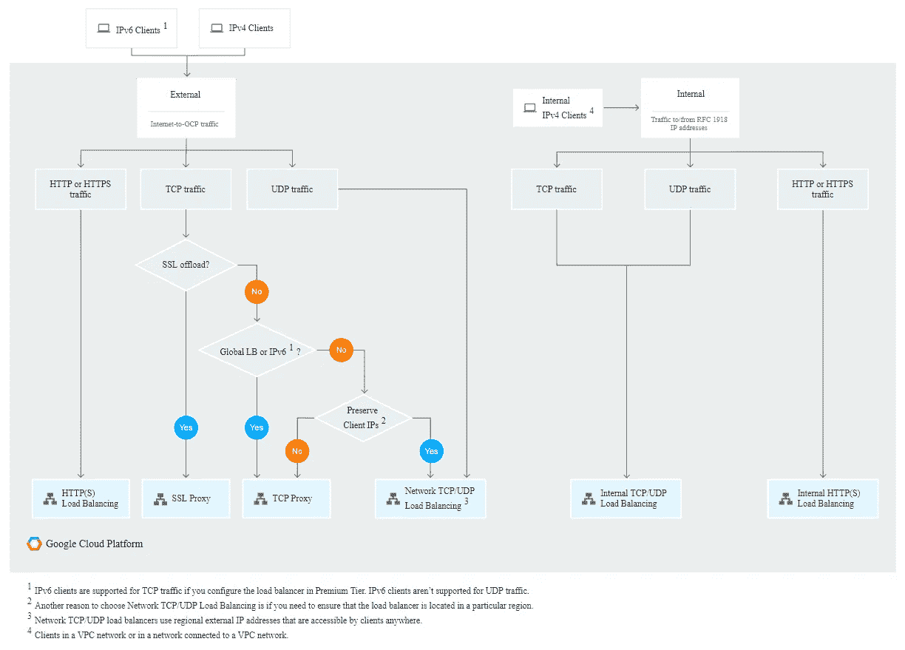
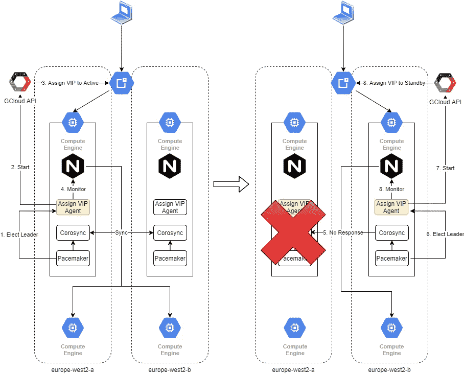

# 如何在 Google 云平台上创建高可用的 NGINX 负载均衡器

> 原文：<https://levelup.gitconnected.com/how-to-create-a-highly-available-nginx-load-balancer-on-google-cloud-platform-9ebc8b6abb09>

## 在 CentOS 7 上使用 Pacemaker、Corosync 和 Static IPs 的 Google Cloud 上的高可用性 NGINX 负载平衡器


泰勒·米利根在 [Unsplash](https://unsplash.com?utm_source=medium&utm_medium=referral) 上的照片

随着虚拟化的基于云的基础设施的出现，越来越多的组织正在向云迁移。这样做有很多好处，但是近乎无限的可伸缩性、高可用性、成本降低和性能提高是重要的驱动因素。

大多数可伸缩且高度可用的应用程序都运行在某种形式的负载平衡器之后。Google Cloud Platform 是领先的云提供商之一，支持多种类型的负载平衡，作为满足您需求的托管服务。如果你想了解更多，那么请查看[https://cloud . Google . com/load-balancing/docs/choosing-load-balancer](https://cloud.google.com/load-balancing/docs/choosing-load-balancer)。

Google Cloud 还提供了一个很棒的流程图，可以根据您的特定需求选择负载平衡器。



图片来自[谷歌云平台](https://cloud.google.com/load-balancing/images/choose-lb.svg)

虽然我们鼓励您在可用的负载平衡器之间进行选择，但是有些情况下这些负载平衡器可能不符合您的需求。例如，让我们考虑一种情况，如果您在本地环境中使用一个负载平衡器，如 NGINX 或 HAProxy，在该环境中，您在不同的端口上处理多种请求。如果您想迁移到云，而不是使用一个 NGINX 实例，您将不得不创建多个负载平衡器，这对您来说可能是一件昂贵的事情，尤其是如果您有一个最小的负载。此外，大多数向云迁移的组织都希望进行类似的迁移，并希望避免改变他们的应用程序架构来适应云。在这种情况下，您可能不会选择切换到 Google 云负载平衡。

您总是可以在 Google 计算引擎实例上配置 NGINX 或 HA 代理。然而，问题是 Google 计算引擎实例是一个区域资源。因此，它无法经受住区域性破坏。为了解决这个问题，您需要在每个区域都有冗余的负载平衡器，以便在某个区域发生故障时能够在这些实例上进行故障转移。在内部部署环境中，您可以使用 keepalived 等工具，该工具使用 VRRP 协议来自动执行故障转移。然而，由于谷歌云使用完全虚拟化的基础设施，VRRP 不在那里工作，我们需要寻找替代方式来做到这一点。

# 解决办法

谷歌云平台提供虚拟静态 IP，你可以提前预约。这些 IP 可以是内部或外部的。您需要将内部 IP 作为现有虚拟以太网适配器的别名，而外部 IP 作为资源直接连接到计算实例。您可以利用这一原则，通过编写自定义脚本来实现主节点和辅助节点之间的自动故障转移。已经有一些写得很好并且经过测试的解决方案，比如今天我们将使用的 [this](https://github.com/bharatmicrosystems/gcp-failoverd) 。

# 基础设施设计

我们有两个运行在两个不同区域的 Google 计算引擎实例。两者都安装了充当负载平衡器的 NGINX。我们还安装了 Pacemaker 和 Corosync，它们有助于管理集群。

Corosync 是一个允许集群多个服务器的实用程序，它们使用 UDP 相互通信。它们充当对等体之间的消息传递层。

“Pacemaker”是一个集群资源管理器，管理集群内的资源代理，比如选举 leader 资源并对其进行监控，当 leader 不再响应时，选择另一个代理作为 leader。

资源代理是一个响应 Pacemaker 的启动、监控和停止请求的脚本。这是连接集群和 Google Cloud API 的核心。

1.  Corosync 和 Pacemaker 启动并建立集群。
2.  Pacemaker 选举一个资源作为领导者，并执行资源代理的启动命令。资源代理响应启动请求并启动 nginx
3.  一旦 NGINX 启动，资源代理调用 Google Cloud APIs 将静态 IP 分配给运行它的服务器。
4.  “Pacemaker”然后监控资源代理，查看 NGINX 是否在服务器上运行，并响应健康检查请求。
5.  如果在监控期间没有收到响应，备用实例的起搏器会检测到它，并认为它需要接管。
6.  备用实例中的“起搏器”选举备用实例资源代理作为领导者，并且它变成活动的。资源代理响应启动请求并启动 nginx
7.  NGINX 启动后，资源代理调用 Google Cloud APIs 将静态 IP 分配给备用服务器。
8.  “Pacemaker”然后监控资源代理，查看 NGINX 是否在服务器上运行，并响应健康检查请求。



# 资源代理脚本

资源代理脚本构成了 Pacemaker 与 Google 云平台集成的主干。它负责调用相关的 Google Cloud APIs 来监控和分配 VIP 给请求它的实例。

资源代理脚本

分配 VIP 脚本

# 示范

我现在将使用两个运行 NGINX 的 Google 计算引擎实例来演示如何在 Google Cloud 上实现这一点。我们将使用 Terraform 来启动我们的服务器，然后我们将运行一些脚本来设置解决方案。

您需要安装 Terraform CLI 并设置一个服务帐户才能启动。

请阅读“[设置您的云环境](https://medium.com/better-programming/how-to-terraform-with-jenkins-and-slack-on-googles-cloud-platform-56c5e8b3aeeb#f1cb)”和“[安装 Terraform](https://medium.com/better-programming/how-to-terraform-with-jenkins-and-slack-on-googles-cloud-platform-56c5e8b3aeeb#22c1) ”以了解有关如何操作的更多详细信息。

# 加速您的基础设施

我们现在将启动运行设置所需的基础架构。当您应用 Terraform 时，它将启动两个 GCE 实例，其中 NGINX 安装了一个 bastion 主机服务器、一个内部静态 VIP、一个外部静态 VIP 和一个用于出站互联网流量的云 NAT。它还将配置防火墙规则，向您指定的源范围开放端口 22 和 80，并开放 UDP 端口 5404–5406，以便 Corosync 在节点之间进行通信。

对 Terraform 运行以下命令来加速您的基础架构。

```
git clone [https://github.com/bharatmicrosystems/gcp-failoverd.git](https://github.com/bharatmicrosystems/gcp-failoverd.git)
cd gcp-failoverd/
cp terraform.tfvars.example terraform.tfvars
```

修改`terraform.tfvars`文件，用`project`、`region`和`source_ranges`的相关值替换变量。

将你下载的 JSON key 复制到`gcp-failoverd/`中，重命名为`credentials.json`。

运行以下内容

```
terraform init
terraform plan
terraform apply
```

# 设置高可用性

我们现在将在负载平衡器之间设置高可用性。

## 登录到堡垒主机

通过运行`gcloud compute ssh`命令从本地系统 SSH 到 bastion 主机。

```
gcloud compute ssh bastion --zone europe-west2-a
```

它应该打开一个与 bastion 主机的 SSH 会话。在 bastion 主机中，克隆`gcp-failoverd`存储库。

该存储库包含已经为您编写并在 Google 云平台上测试过的脚本。我们将浏览这些脚本，并探索它们的功能。

```
git clone [https://github.com/bharatmicrosystems/gcp-failoverd.git](https://github.com/bharatmicrosystems/gcp-failoverd.git)
cd gcp-failoverd/
cp -a scripts/ exec/
```

# 快速启动

已经有一个自动脚本可以为您设置解决方案，并运行自动冒烟测试。你可以利用它来快速周转。

该脚本有以下用法

```
sh -x setup-gcp-failoverd.sh -i [internal_vip_name] -e [external_vip_name] -l [load_balancers] -c [cluster_name] -h [health_check_endpoint]Where:
internal_vip_name : name of the static internal ip which needs to be attached to the active instance
external_vip_name : name of the static external ip which needs to be attached to the active instance
load_balancers : comma-separated list of load balancers part of the cluster
health_check_endpoint : The endpoint that the agent needs to monitor to declare your service healthy. If you are serving the health endpoint on localhost:80/healthz, then write :80/healthz
```

要在我们的演示中使用自动化脚本，请运行以下命令:

```
cd exec/
sh -x setup-gcp-failoverd.sh -i nginx-internal-vip -e nginx-external-vip -l nginx-instance01,nginx-instance02 -c nginx-cluster -h :80/
```

# 艰难的道路

## 安装起搏器和个人电脑

“Pacemaker”有助于管理集群，因此将 corosync 作为一个依赖项。PCS 是一个命令行工具，有助于与起搏器互动。我们将在所有 Nginx 负载平衡器实例中安装它们。使用`gcloud compute ssh [instance_hostname] --internal-ip`登录虚拟机。您需要选择一个密码，确保在所有虚拟机上使用一致的密码。

```
PASSWORD=[YOUR_CLUSTER_PASSWORD]
sudo yum install -y pacemaker pcs
sudo usermod --password $(openssl passwd -1 $PASSWORD) hacluster
sudo systemctl enable pcsd.service
sudo systemctl start pcsd.service
sudo systemctl restart pcsd.service
```

## 配置集群

仅登录到主实例`nginx-instance01`

```
PASSWORD=[YOUR_CLUSTER_PASSWORD]
CLUSTER_NAME=nginx-instance
sudo pcs cluster auth nginx_instance01 nginx_instance02 -u hacluster -p $PASSWORD
sudo pcs cluster setup --name $CLUSTER_NAME nginx_instance01 nginx_instance02
sudo pcs cluster start --all
sudo pcs status corosync
sudo pcs cluster status
sudo pcs property set stonith-enabled=false
```

输出

```
+ sudo pcs cluster auth nginx-instance01 nginx-instance02 -u hacluster -p $PASSWORD
nginx-instance01: Authorized
nginx-instance02: Authorized
+ sudo pcs cluster setup --name nginx-cluster nginx-instance01 nginx-instance02
Destroying cluster on nodes: nginx-instance01, nginx-instance02...
nginx-instance01: Stopping Cluster (pacemaker)...
nginx-instance02: Stopping Cluster (pacemaker)...
nginx-instance02: Successfully destroyed cluster
nginx-instance01: Successfully destroyed clusterSending 'pacemaker_remote authkey' to 'nginx-instance01', 'nginx-instance02'
nginx-instance01: successful distribution of the file 'pacemaker_remote authkey'
nginx-instance02: successful distribution of the file 'pacemaker_remote authkey'
Sending cluster config files to the nodes...
nginx-instance01: Succeeded
nginx-instance02: SucceededSynchronizing pcsd certificates on nodes nginx-instance01, nginx-instance02...
nginx-instance01: Success
nginx-instance02: Success
Restarting pcsd on the nodes in order to reload the certificates...
nginx-instance01: Success
nginx-instance02: Success
+ sudo pcs cluster start --all
nginx-instance01: Starting Cluster (corosync)...
nginx-instance02: Starting Cluster (corosync)...
nginx-instance01: Starting Cluster (pacemaker)...
nginx-instance02: Starting Cluster (pacemaker)...
+ sudo pcs status corosyncMembership information
----------------------
    Nodeid      Votes Name
         1          1 nginx-instance01 (local)
         2          1 nginx-instance02
+ sudo pcs cluster status
Cluster Status:
 Critical: Unable to get stonith-history
 Connection to the cluster-daemons terminated
 Reading stonith-history failedPCSD Status:
  nginx-instance01: Online
  nginx-instance02: Online
+ sudo pcs property set stonith-enabled=false
```

## 配置资源代理

将资源代理文件复制到两台服务器上

```
loadbalancers=nginx_instance01,nginx_instance02
for instance in $(echo $loadbalancers | tr ',' ' '); do
  ZONE=`gcloud compute instances list --filter="name=${instance}"|grep ${instance} | awk '{ print $2 }'`
  gcloud compute scp --zone=$ZONE --internal-ip gcp-failoverd.sh gcp-assign-vip.sh ${instance}:~/
done
```

登录到两个虚拟机并运行

```
sudo systemctl enable corosync.service pacemaker.service
sudo mkdir -p /usr/lib/ocf/resource.d/gcp
sudo mv gcp-failoverd.sh /usr/lib/ocf/resource.d/gcp/gcp-failoverd
sudo mv gcp-assign-vip.sh /usr/bin/gcp-assign-vip.sh
sudo chmod +x /usr/lib/ocf/resource.d/gcp/gcp-failoverd
sudo chmod +x /usr/bin/gcp-assign-vip.sh
sudo chown -R root:root /usr/lib/ocf/resource.d/gcp
sudo chown root:root /usr/bin/gcp-assign-vip.sh
```

## 启动资源代理

登录到活动服务器 nginx-instance01

```
sudo pcs resource create GCPFailoverd ocf:gcp:gcp-failoverd internal_vip=nginx-internal-vip external_vip=nginx-external-vip healthz=:80/
sudo pcs status
```

输出

```
+ sudo pcs status
Cluster name: nginx-cluster
Stack: corosync
Current DC: nginx-instance02 (version 1.1.20-5.el7_7.2-3c4c782f70) - partition with quorum
Last updated: Thu Apr 16 15:09:13 2020
Last change: Thu Apr 16 14:49:31 2020 by hacluster via crmd on nginx-instance022 nodes configured
1 resource configuredOnline: [ nginx-instance01 nginx-instance02 ]Full list of resources:GCPFailoverd   (ocf::gcp:gcp-failoverd):       Started nginx-instance01Daemon Status:
  corosync: active/enabled
  pacemaker: active/enabled
  pcsd: active/enabled
```

# 烟气试验

我们现在将运行一些冒烟测试，以查看设置是否按预期工作

## 获取内部 IP

```
healthz=:80/
internal_vip=nginx-internal-vip
external_vip=nginx-external-vip
INTERNAL_IP=`gcloud compute addresses list --filter="name=$internal_vip"| grep $internal_vip | awk '{ print $2 }'`
```

## 等待 IP 分配

```
INTERNAL_IP_STATUS=`gcloud compute addresses list --filter="name=$internal_vip"| grep $internal_vip | awk '{ print $NF }'`
while [[ $INTERNAL_IP_STATUS != "IN_USE" ]]; do
  INTERNAL_IP_STATUS=`gcloud compute addresses list --filter="name=$internal_vip"| grep $internal_vip | awk '{ print $NF }'`
  echo "Waiting for the IP $INTERNAL_IP to be alloted to an instance"
  echo "Sleeping for 10 secs..."
  sleep 10
done
```

输出

```
INTERNAL_IP_STATUS=RESERVED
Waiting for the IP 10.154.15.192 to be alloted to an instance
Sleeping for 10 secs...
INTERNAL_IP_STATUS=RESERVED
Waiting for the IP 10.154.15.192 to be alloted to an instance
Sleeping for 10 secs...
INTERNAL_IP_STATUS=IN_USE
```

## 获取分配给内部 IP 的 GCE 实例

```
INTERNAL_INSTANCE_REGION=$(gcloud compute addresses list --filter="name=${internal_vip}"|grep ${internal_vip}|awk '{print $(NF-2)}')
INTERNAL_INSTANCE_NAME=$(gcloud compute addresses describe ${internal_vip} --region=${INTERNAL_INSTANCE_REGION} --format='get(users[0])'|awk -F'/' '{print $NF}')
INTERNAL_INSTANCE_ZONE=$(gcloud compute instances list --filter="name=${INTERNAL_INSTANCE_NAME}"|grep ${INTERNAL_INSTANCE_NAME}|awk '{print $2}')
INTERNAL_INSTANCE_STATUS=$(gcloud compute instances describe --zone=${INTERNAL_INSTANCE_ZONE} $INTERNAL_INSTANCE_NAME --format='get(status)')
echo "$INTERNAL_IP has been allocated to $INTERNAL_INSTANCE_NAME at $(date)"
```

输出

```
10.154.15.192 has been allocated to nginx-instance01 at Thu Apr 16 14:52:00 UTC 2020
```

## 调用 NGINX 端点

```
$ status=$(curl -s -o /dev/null -w '%{http_code}' [http://$INTERNAL_IP$healthz](/$EXTERNAL_IP$healthz))
$ echo "$(date): internal status: $status"
```

输出

```
Thu Apr 16 14:49:58 UTC 2020: internal status: 200
```

## 获取外部 IP

```
EXTERNAL_IP=`gcloud compute addresses list --filter="name=$external_vip"| grep $external_vip | awk '{ print $2 }'`
```

## 等待 IP 分配

```
EXTERNAL_IP_STATUS=`gcloud compute addresses list --filter="name=$external_vip"| grep $external_vip | awk '{ print $NF }'`
while [[ $EXTERNAL_IP_STATUS != "IN_USE" ]]; do
  EXTERNAL_IP_STATUS=`gcloud compute addresses list --filter="name=$external_vip"| grep $external_vip | awk '{ print $NF }'`
  echo "Waiting for the IP $EXTERNAL_IP to be alloted to an instance"
  echo "Sleeping for 10 secs..."
  sleep 10
done
```

输出

```
EXTERNAL_IP_STATUS=IN_USE
```

## 获取分配给外部 IP 的 GCE 实例

```
EXTERNAL_INSTANCE_REGION=$(gcloud compute addresses list --filter="name=${external_vip}"|grep ${external_vip}|awk '{print $(NF-1)}')
EXTERNAL_INSTANCE_NAME=$(gcloud compute addresses describe ${external_vip} --region=${EXTERNAL_INSTANCE_REGION} --format='get(users[0])'|awk -F'/' '{print $NF}')
EXTERNAL_INSTANCE_ZONE=$(gcloud compute instances list --filter="name=${EXTERNAL_INSTANCE_NAME}"|grep ${EXTERNAL_INSTANCE_NAME}|awk '{print $2}')
EXTERNAL_INSTANCE_STATUS=$(gcloud compute instances describe --zone=${EXTERNAL_INSTANCE_ZONE} $EXTERNAL_INSTANCE_NAME --format='get(status)')
echo "$EXTERNAL_IP has been allocated to $EXTERNAL_INSTANCE_NAME at $(date)"
```

输出

```
35.230.154.167 has been allocated to nginx-instance01 at Thu Apr 16 14:52:17 UTC 2020
```

## 调用 NGINX 端点

```
$ status=$(curl -s -o /dev/null -w '%{http_code}' [http://$EXTERNAL_IP$healthz](/$EXTERNAL_IP$healthz))
$ echo "$(date): external status: $status"
```

输出

```
Thu Apr 16 14:52:17 UTC 2020: external status: 200
```

## 停止运行 NGINX 的实例

```
gcloud compute instances stop -q --zone europe-west2-a nginx-instance01
```

输出

```
Stopping instance(s) nginx-instance01...done.
Updated [[https://compute.googleapis.com/compute/v1/projects/my-project-1505734237566/zones/europe-west2-a/instances/nginx-instance01](https://compute.googleapis.com/compute/v1/projects/my-project-1505734237566/zones/europe-west2-a/instances/nginx-instance01)].
```

等待 60 秒，然后重复这些步骤。您会发现 IP 已成功切换到第二个实例。

# 结论

感谢阅读，我希望你喜欢这篇文章。请在下面找到一些我在故事中使用的有用链接

[](https://github.com/bharatmicrosystems/gcp-failoverd/blob/master/scripts/configure-gcp-failoverd-start.sh) [## bharat Microsystems/GCP-failoved

### Permalink GitHub 是 4000 多万开发人员的家园，他们一起工作来托管和审查代码、管理项目以及…

github.com](https://github.com/bharatmicrosystems/gcp-failoverd/blob/master/scripts/configure-gcp-failoverd-start.sh) [](https://cloud.google.com/load-balancing/docs/choosing-load-balancer) [## 选择负载平衡器|负载平衡|谷歌云

### 本文档帮助您确定哪种 Google 云负载平衡器最能满足您的需求。要决定哪个负载平衡器…

cloud.google.com](https://cloud.google.com/load-balancing/docs/choosing-load-balancer)