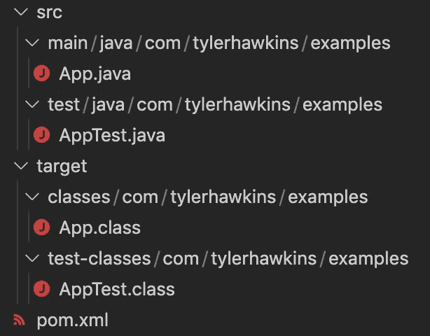

# 如何用 Maven 创建 Java 项目

> 原文：<https://levelup.gitconnected.com/how-to-create-a-java-project-with-maven-89867bef811a>

## 只需几分钟即可启动并运行！


Maven 是管理软件项目的流行工具。它可以帮助您创建、构建、测试、记录和部署您的应用。Maven 对于 Java 项目来说是一个很好的选择，可以通过命令行或者 IntelliJ 这样的 IDE 来运行。

如果您是 Java 新手，那么学习工具生态系统可能会令人望而生畏。但是，通过使用一个称为原型的项目模板，您可以在几分钟内用 Maven 创建您的第一个 Java 项目！在本文中，我们将向您展示如何实现。

# 步骤 1:安装 Java

可以从[甲骨文的网站](https://www.oracle.com/java/technologies/downloads/)下载安装 Java。为 macOS、Linux 或 Windows 选取您想要的版本。

# 步骤 2:设置 Java 环境变量

建议设置一个名为`JAVA_HOME`的环境变量，存储 Java 在机器上的安装路径。对于 Mac 用户，您可以像这样将其添加到您的`~/.bash_profile`文件中:

```
export JAVA_HOME="/Library/Java/JavaVirtualMachines/jdk-18.jdk/Contents/Home"
```

只需确保用正确的位置和 Java 版本修改该值。

# 步骤 3:验证是否安装了 Java

一旦在您的机器上安装了 Java，您就可以从命令行运行以下命令来检查 Java 是否已经安装:

```
java -version
```

这将向您的控制台输出几行如下所示的内容:

```
java version "18" 2022-03-22
Java(TM) SE Runtime Environment (build 18+36-2087)
Java HotSpot(TM) 64-Bit Server VM (build 18+36-2087, mixed mode, sharing)
```

同样，确切的输出会根据您的操作系统和您使用的 Java 版本而有所不同。

# 步骤 4:安装 Maven

接下来，我们可以从 [Apache Maven 项目网站](https://maven.apache.org/download.cgi)下载安装 Maven。撰写本文时的最新版本是 3.8.5。

# 步骤 5:设置 Maven 环境变量

一旦安装了 Maven，我们还需要为 Maven 设置几个环境变量。对于 Mac 用户来说，这也可以放在你的`~/.bash_profile`文件中:

```
export MAVEN_ROOT="$HOME/path/to/maven/apache-maven-3.8.5"
export PATH="$MAVEN_ROOT/bin:$PATH"
```

同样，一定要用 Maven 目录的正确位置来修改这个值。

我们在这里使用的`MAVEN_ROOT`变量只是一个辅助变量。重要的部分是将 Maven 的可执行文件添加到您的`PATH`变量中，以便您的机器可以成功执行 Maven 命令。

# 步骤 6:验证 Maven 已经安装

我们可以通过从命令行运行以下命令来验证是否正确安装了 Maven:

```
mvn --version
```

输出将如下所示:

```
Apache Maven 3.8.5 (3599d3414f046de2324203b78ddcf9b5e4388aa0)
Maven home: /Users/yourusername/path/to/maven/apache-maven-3.8.5
Java version: 18, vendor: Oracle Corporation, runtime: /Library/Java/JavaVirtualMachines/jdk-18.jdk/Contents/Home
Default locale: en_US, platform encoding: UTF-8
OS name: "mac os x", version: "10.14.4", arch: "x86_64", family: "mac"
```

如果您得到一个无法找到`mvn`命令的错误消息，请确保环境变量中的路径是正确的，然后尝试在新的终端 shell 中运行该命令，或者用`source ~/.bash_profile`重新加载 bash 概要文件。

# 步骤 7:使用原型生成项目

现在我们已经成功安装了 Java 和 Maven，我们可以使用原型创建一个新的 Maven 项目。原型是基于您选择的原型为您引导应用程序的项目模板。

在我们的例子中，我们将使用`maven-archetype-quickstart`原型。在希望创建项目的目录中，从命令行运行以下命令:

```
mvn archetype:generate -DgroupId=com.tylerhawkins.examples -DartifactId=plinko -DarchetypeArtifactId=maven-archetype-quickstart -DinteractiveMode=false
```

我们来分解一下。

`mvn archtype:generate`是我们正在运行的命令。`-D`前缀用于给命令添加参数。

我们使用`-DgroupId`来指定我们的组 ID，这将是我们希望存储它的高级包。您的公司可能有一个他们使用的通用约定，但是这实际上是一个任意的值。我选了`com.tylerhawkins.examples`，但它可能是任何东西。

我们使用`-DartifactId`来命名我们的项目和它创建的构建工件。我正在构建一个 Plinko 游戏，所以我将我的游戏命名为`plinko`。

我们使用`-DarchetypeArtifactId`来指定我们想要使用的原型或者项目模板。我们选择了`maven-archetype-quickstart`。

最后，我们使用`-DinteractiveMode=false`来运行这个命令，而不需要我们任何进一步的交互输入。

新创建的项目将位于名为`plinko`(工件 ID 的名称)的目录中，目录结构如下所示:



新 Maven 项目的项目目录结构

Maven 对其项目的目录结构有自己的看法，偏爱约定胜于配置。您可以看到在`src`目录中有两个文件树，一个用于 app 代码，一个用于测试代码。`target`目录是编译和打包代码的地方。`pom.xml`文件是一个项目对象模型文件，包含了我们项目的所有元数据。

# 步骤 8:指定您想要使用的 Java 的源版本和目标版本

我们几乎准备好构建我们的应用程序了。首先，我们需要指定我们正在使用的 Java 的源和目标版本。源是我们用来编写代码的 Java 版本，目标是我们希望编译后的应用程序与之兼容的 Java 版本。

我们可以将这些属性添加到我们的`pom.xml`文件中。我对源和目标都使用 Java 18:

```
<properties>
  <maven.compiler.source>18</maven.compiler.source>
  <maven.compiler.target>18</maven.compiler.target>
</properties>
```

# 步骤 9:构建并测试应用程序

这样，我们就可以构建和测试我们的应用程序了。Maven 有内置的生命周期，其中包含完成各种工作的阶段。默认 Maven 构建生命周期的一些阶段是`validate`、`compile`、`test`、`package`、`integration-test`、`verify`、`install`和`deploy`。

我们可以通过从项目根目录运行以下命令来构建和测试我们的应用程序:

```
mvn clean package
```

`clean`命令从`target`目录中删除以前的构建输出，然后`package`命令运行几个阶段来编译、测试和打包应用程序到可执行的 JAR 文件中。

# 第十步:运行应用程序

最后，我们可以通过从项目根目录运行以下命令来运行我们的应用程序:

```
java -cp target/classes com.tylerhawkins.examples.App
```

这将运行我们的`App`文件，它简单地输出:

```
Hello World!
```

我们做到了！我们使用 Maven 创建了一个 Java 应用程序，并成功运行了它！

# 后续步骤

现在您已经有了一个应用程序的基本框架，您可以开始编写 Java 代码了。您可能会添加更多的源文件，向您的`pom.xml`文件添加更多的配置，并编写更多的测试。我们不会在这里讨论这些，但是到现在为止，您应该已经知道了足够多的知识，至少可以开始运行了。如果你想看工作示例的完整代码，这里是我创建的 [Plinko 应用](https://github.com/thawkin3/plinko-java-maven)。

感谢您的阅读，祝您编码愉快！