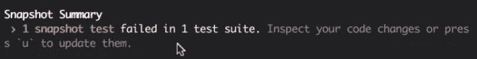

# 如何在 React 中创建 Jest 快照测试

> 原文：<https://levelup.gitconnected.com/how-to-create-a-jest-snapshot-test-in-react-6fd2f755a568>

## 测试对于维护任何应用程序都是至关重要的！


亲爱的读者们，你们好，

我带回了一篇关于测试ヾ(⌐■_■)ノ♪的热门文章

在构建应用程序时，测试是一个至关重要的支柱。知道如何编码是重要的，知道如何有效地测试你编码的东西是至关重要的。你想知道为什么吗？如今，计算机科学几乎应用于各个领域。构建一个应用程序需要许多团队和协作，许多阶段(开发阶段，集成，生产…等等。)很多资源。因此很多钱。今天，如果你正在寻找一个开发者的帖子，你会注意到他们也会问你关于你的测试工具和技能的问题。

测试是确保我们不会破坏我们迄今为止所构建的东西的唯一方法，同时也是确保整个应用程序足够强大以向世界或其真实用户传播的唯一方法。

废话说够了，让我们按照这个计划开始吧:

*   什么是玩笑？
*   **笑话测试示例**
*   **如何写一个 Jest 快照测试？**
*   **外卖**

# 什么是玩笑？

你可能已经听说过 Jest，它在市场上占据越来越多的位置。Jest 最初由脸书制造，用于测试 React 组件。该工具基本上是一个测试运行器，它的+在于它比 Karma 高效得多。现在，甚至一些有角度的应用程序也变成了笑话。

## 想知道因果报应和笑话◉_◉之间的区别？

我两个都用过。我喜欢 Karma，因为它与浏览器相连，我们可以运行特定的测试，并在浏览器上看到可读和可见的结果。这也是它的限制，因为它必须使用浏览器实例。而 Jest 是独立的，它不需要浏览器。因此，如果你习惯了因果报应，你会失望的。您必须在命令行上读取结果。这还不是全部。Jest 可以通过指定在启动测试运行器时要使用多少线程来并行运行测试。这就是 Jest 如此受欢迎的原因，因为我们看到了它在时间上的真正差异。当然，没有完美的解决方案。使用 Jest，您不能马上直接运行特定的测试。由于 Jest 不知道如何做，它将跳过所有其他测试，直到到达您想要运行的特定测试。当在开发阶段调试一个测试时，这是非常令人厌烦和耗时的。

因此，Karama 运行测试的方式对于开发人员来说在编写应用程序时是高效的，但它需要更多的时间，这并不好，尤其是当您有一个企业或大型应用程序时。在这种情况下，Jest 会更有效。

# Jest 测试示例

如果你已经知道 Jest 并使用过它，你可以跳过这一节直接看‿。如果这是你第一次发现 Jest，那么，对你来说好消息是，它几乎以同样的方式用`describe`和`it`编写测试。区别取决于我们如何运行测试和调试它们。顺便说一下，这里有一个例子，也可以应用于角度应用。

下面是一个显示文章列表的简单文章组件:

物品测试:

我们可以在`it`部分测试我们想要的任何东西。现在，让我们转到快照测试。

# 如何写一个 Jest 快照测试？

在回答*如何*之前，我们需要先了解一下*什么*，对吗？

***那么，什么是 Jest 快照测试呢？***

快照基本上是给定时间的组件树。当您更新组件树时，您也更新了快照，以便您的测试通过。

***需要一个例子，Nah？***

下面是一个简单的 *Hello World* 的例子:

**#1:我们需要安装一个快照反应库:**

为此，我使用了`react-test-renderer`库。你所需要的就是安装 NPM 或纱线。

```
yarn add --dev **react-test-renderer
// Or** npm add --dev **react-test-renderer**
```

**#2:导入库依赖项，以便我们可以创建快照:**

```
import **renderer** from **'react-test-renderer';**
```

**#3:创建快照**

```
**renderer**.create(<div>Hello world</div>);
```

如果我们保存这一行代码，我们将会看到很多关于元素树的不必要的信息。这就是为什么我们将使用`toJSON()`功能，以便我们只看到重要的信息。下面是我们上面例子的结果:

```
const **element**= renderer.**create**(<div>Hello world</div>).**toJSON**();
console.log(**element**);// ==> printed result
{type: '**div**', props:{}, children:['**Hello world**']}
```

**#4:检查快照**

```
expect(element).**toMatchSnapshot**();
```

现在，让我们为文章测试创建一个快照:

如果我们打印出`articlesTree`将会看到下面的结果:

```
{ 
  type: 'div',
  props: {},
  children: [
     {type: 'div', props: [Object], children: [Object]},
     {type: 'div', props: [Object], children: [Object]},
     {type: 'div', props: [Object], children: [Object]},  ]  
}
```

我们还会注意到一个名为`ArticlesTest.js.snap`的新生成文件。这个文件包含了我们组件的所有信息，甚至是样式细节。一切！这就像我们组件的 DNA，任何变化都会导致测试失败。

如果我们改变或重构我们的组件会发生什么？每当我们对需要更新快照的组件进行所需的更改时，测试都会失败。超级实用的是 Jest 会给出两个版本的差异，这也是我们测试失败的原因。Jest 也会问你这是不是想要的；因此，我们需要更新快照:



通过点击`u`，我们更新了快照，测试将再次通过。

就这样？不要。

您可以检查快照是否与组件树匹配，但是您也可以测试其他东西，因为在我们的例子中，我们传递了一个文章列表。我们可以检查渲染的文章是否与我们的道具中传递的文章数量相匹配。

以下是方法:

```
**expect**(articlesTree.children.length).toBe(3)
```

因为我们的 testProps 对象中有 3 篇文章。

诸如此类！

# 外卖

*   快照就像一个组件的树形表示。它反映了它的结构和风格。
*   `toJson()`功能很实用，可以看到关于你的组件树的重要东西。
*   您可以使用 snapshot json 对象作为工具来测试其他东西。
*   每当组件表示或样式改变时，您需要在运行相应的测试后点击`u`来更新快照。

如果你喜欢这篇文章，请让我为更多的文章鼓掌或评论。

无论你在哪里，我都希望你和你的家人平安！

***坚持住。明天会更好！***

**FAM**

**关注我上** [**中**](https://medium.com/@famzil/) **，** [**领英**](https://www.linkedin.com/in/fatima-amzil-9031ba95/) **，** [**脸书**](https://www.facebook.com/The-Front-End-World) **，以及** [**推特**](https://twitter.com/FatimaAMZIL9) **查看更多文章。**