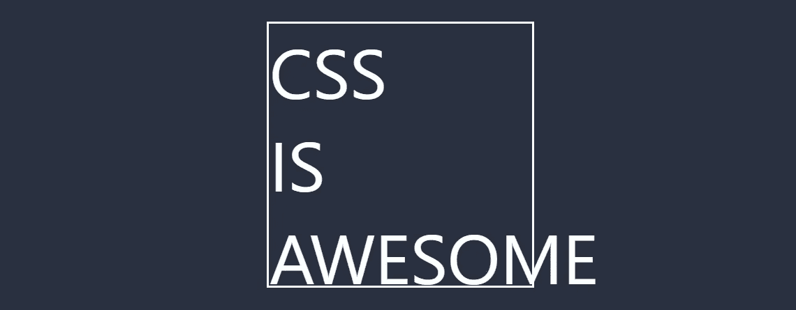
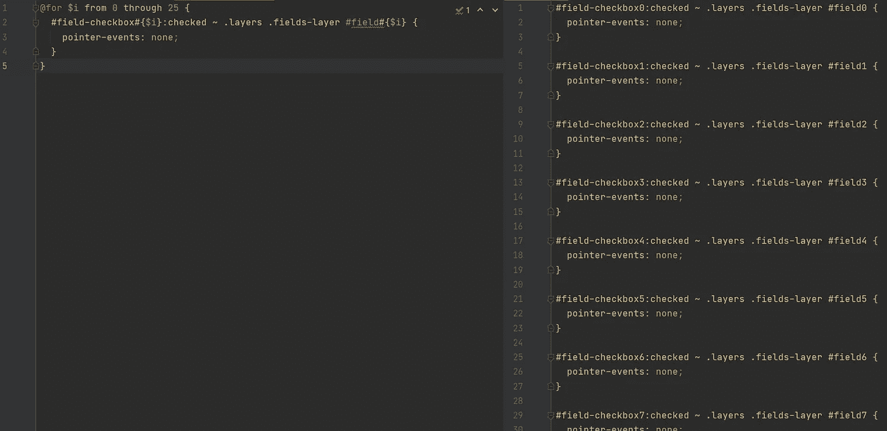
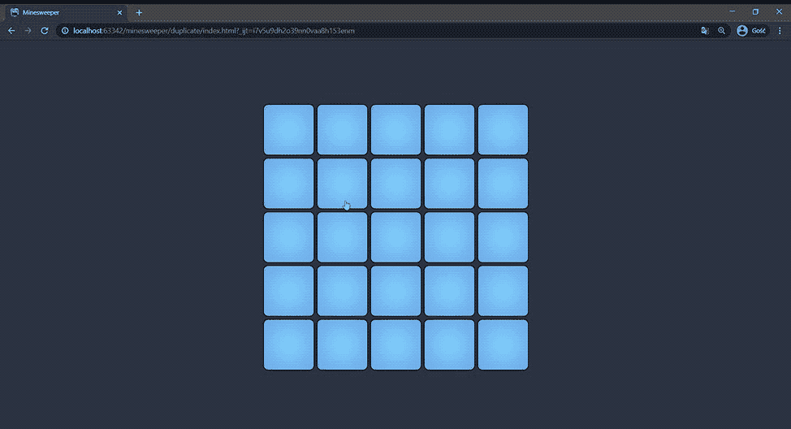
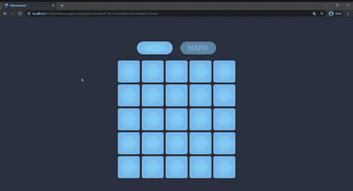
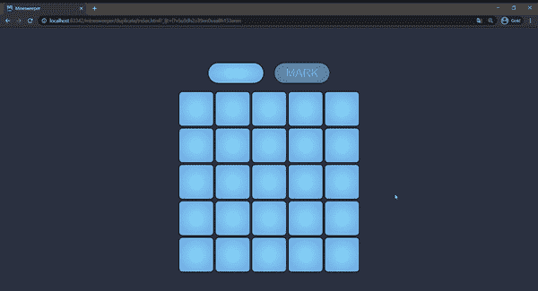
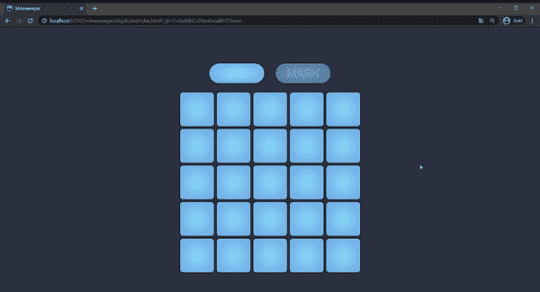
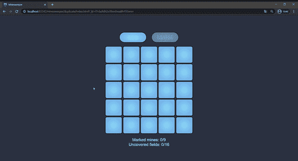

# 如何不用 JS 用 CSS 创建扫雷游戏

> 原文：<https://levelup.gitconnected.com/how-to-create-a-minesweeper-game-in-css-without-js-e0ace38aa216>

## 谁说你不能用 CSS 编程？


Photo by [鏡飛 匙](https://unsplash.com/@sweetheartshi?utm_source=unsplash&utm_medium=referral&utm_content=creditCopyText) on [Unsplash](https://unsplash.com/?utm_source=unsplash&utm_medium=referral&utm_content=creditCopyText)

听到“CSS”你会想到什么？可能是与颜色、字体、flexbox 相关的东西，也可能是动画……一般来说，你可以想到与网页的**外观相关的一切——这是正确的，因为根据维基百科，CSS 是:**

> 级联样式表是一种样式表语言，用于描述以 HTML 等标记语言编写的文档的**表示**



这个迷因是我对 CSS 的第一个联想

一些**的交互和逻辑**呢？我很确定这不是你的第一个想法。我们有一些像“hover”这样的伪选择器，所以我们可以引入基本的交互，但是逻辑和交互是我们通常使用 Javascript 来实现的。但是如果我们真的很固执呢？让我们尝试在 CSS 中创建一个全交互的 [**扫雷**](https://en.wikipedia.org/wiki/Microsoft_Minesweeper) 游戏。**不带 JS！**

## 放弃

如果你正在寻找一些关于有用的东西的严肃文章，你可能应该去别的地方，因为我们在这篇文章中所构建的仅仅是乐趣。但是谁说娱乐不是生活中重要的一部分呢，即使我说的“娱乐”是指“CSS”！如果你准备好花些时间来玩 HTML 和 CSS——让我们开始吧！

# 扫雷舰—快速回顾

我假设你熟悉扫雷游戏，但为了以防万一，让我回忆一下主要规则:

*   游戏的主要部分是一个方格
*   您可以**挖掘(揭开)**田地或**标记它们**以指示潜在的地雷位置
*   如果未覆盖的区域有地雷，你会被炸飞并失败
*   如果你发现所有的空地，你就赢了
*   未覆盖的区域包含一个数字，告知您周围有多少地雷
*   公告板旁边是一个计数器，上面显示有多少地雷尚未标记
*   原扫雷包含一个定时器，但我们今天不会实现这一部分。在 CSS 中是可以的，可以自己试试！

# 让我们创造我们的领域

我们在 21 世纪，埃隆·马斯克想要在火星上建造一座城市，每年我都听说迪拜计划建造飞行出租车，但有一件事仍然是不可能的:为 HTML 复选框元素应用自定义样式。你不能就这样做:

```
input[type=checkbox] {
  background: red;
}
```

没用的。复选框不能被样式化——用户浏览器决定它们的外观。当然，这不是一个大问题，因为我们可以使用一个小技巧，创建一个连接到复选框的`<label>`，然后隐藏`<input>`并根据我们的需要设置`<label>`的样式。即使复选框被隐藏，也可以通过点击相关的`<label>`来选中它。此外，我们可以根据隐藏的复选框状态(选中/未选中)来更改标签外观

当我们有了第一个字段时，创建整个板很简单——只需通过复制粘贴创建更多的字段(或者使用一个循环，如果你使用的是 [Pug](https://pugjs.org/language/iteration.html) 和 [SCSS](https://sass-lang.com/documentation/at-rules/control/for) )。此外，我们想阻止“挖”字段-一旦字段成为未覆盖的用户不能改变这一点。那没有任何意义。

暂时不是火箭科学。以防万一，如果你不熟悉 SCSS 的循环——记住这只是一个 CSS 代码生成器。当你在 SCSS 使用 loop 时，你只需要告诉“为我多次创建那些 CSS 规则”。在我们的例子中，我们还使用`$i`作为迭代器，为`#field-checkbox1`、`#field-checkbox2`、`#field-checkbox3`等生成单独的规则。下面你可以找到一个循环结果的例子。SCSS 的循环将是我们代码库的重要组成部分，所以在继续之前，请确保您了解它们是如何工作的。



在这一点上，我们可以添加一些额外的样式，让它看起来更友好——比如游戏的背景，居中等。我不会在这里粘贴每一行 CSS 代码，因为这是我们冒险中很无聊的一部分——如果你想看完整的源代码，你可以查看我附在本文底部的 CodePen。



微笑！我们有我们的董事会成立！

# 炸弹在哪里？

我们现在的游戏中没有炸弹，但是在添加炸弹之前，我们应该让用户标记地雷。为了实现这一点，我们将复制我们的**字段-图层**:

*   **字段层**(我们在上面构建的)包含用户可以挖掘的字段。换句话说，这是我们的标准游戏板
*   **标志层**是一个相同的网格，但是用户可以在这一层标记潜在的炸弹位置

这里有一个技巧:在游戏板上方，我们将添加一个开关，允许用户选择是*挖*还是*标记炸弹*。基于它的状态，我们可以显示正确的层。当然，我们必须注意一些事情(括号中的数字将帮助您在下面的代码中找到相关的行):

*   [1]当用户想要**挖掘**时，我们应该隐藏并禁用**标志层**
*   [2]当用户想要**标记炸弹**时，应禁用并隐藏**字段层**
*   [3]标记为炸弹的字段**即使在“**挖掘模式**下也应可见**
*   [4] **未覆盖的**字段即使在“**标记模式**下也应可见
*   [5]用户无法**揭开**标记为**炸弹**的字段
*   [6]用户不能将**未覆盖的**域标记为**炸弹**

哇，有很多事情要做！这将需要一些时间来设置正确的选择器来操作`visible`和`pointer-events`属性，但基本上，上述所有要求都很容易满足。我喜欢把这种任务想象成谜题😅



它开始看起来像扫雷舰！

好吧，我不得不承认这不是世界上最有趣的游戏，因为你不能赢或输。但是和我呆在一起——我们马上会添加一些炸弹！

# 这里有炸弹，那里有炸弹…

首先，我们必须以某种方式硬编码关于哪些区域有地雷的信息。在正常情况下，你可能会用 HTML(或者更好——用 Javascript 随机生成)来编写这个代码，但是嘿——让我们变得荒谬一些，使用 CSS 来保存关于炸弹位置的信息。因为为什么不呢？

我们将在 SCSS 创建一个列表，它将指出哪些字段包含炸弹。为了使这个列表更具可读性，我断开了一些行，使它看起来像一个矩阵——但实际上，它是普通的单向列表。

```
// 1 means "bomb", 0 means an empty field
$fields:  1, 0, 0, 0, 1,
          0, 0, 1, 0, 0,
          1, 1, 0, 0, 1,
          0, 0, 1, 0, 1,
          0, 0, 1, 1, 1;
```

基于`$fields`列表，我们可以创建选择器来引用有(或没有)炸弹的字段，如果我们想确定用户是赢了还是输了，这是非常有用的。怎么会？这是小菜一碟:

*   默认情况下，两个终端屏幕(赢家和输家)都是隐藏的
*   如果用户**发现一个包含炸弹【2】**的字段，我们可以显示 loser-screen
*   为了获胜，用户必须揭开所有的空字段，所以当**所有的空字段都被挖开【3】**时，我们将显示一个*赢家屏幕*。这将是一个非常长的 CSS 选择器，但幸运的是，SCSS 给了我们一个`append`函数，它将帮助我们创建它**【1】**
*   因为我们的游戏在`<form>`里面，所以我们可以将`<button type="reset">`添加到终端屏幕中。这个按钮将清除整个表单，包括所有的复选框——这样游戏就可以很容易地重新开始



我们快完成了！

# 向未覆盖的字段添加提示

我们的游戏还缺少一个重要的东西。扫雷不是猜测炸弹在哪里，所以我们必须为用户添加一些提示。就像在最初的游戏中，我们会在每一个空白区域(我是说没有炸弹的区域)填入一个数字来表示周围有多少地雷。我们可以硬编码这些数字，因为我们的游戏板不是随机生成的，但那会很无聊！让我们假设我们是认真的 CSS 程序员，并创建一个适用于每个字段集的简单算法。为此，我们将遍历所有字段，检查邻居是否包含炸弹。接下来，对于`content`属性，我们将用数字填充每个空字段



不错！我们可以在这里结束！

## 还有一件事！

我们终于有了一个功能齐全的游戏！但是我想给你看一组更有趣的 CSS 属性。听说过 CSS 中的 [**计数器**](https://www.w3schools.com/css/css_counters.asp) 吗(我指的是纯 CSS，不是 SCSS)？它们是 CSS 中的某种变量，可以被操纵(增加和减少)。它们是 CSS 中某种可以操纵的变量(增加和减少)。它们可以用来计算带有特定选择器的元素在 HTML 中出现的次数。我们可以使用它们向用户显示关于有多少字段未被覆盖以及有多少字段被标记为炸弹的信息。让我们通过定义未覆盖/标记字段的选择器来增加我们的计数器！



决赛成绩

# 谢谢大家！

如果你正在读这句话，我想感谢你和我一起冒险。用 CSS 创建一个游戏是一种疯狂，但是我在这个小项目中度过了一段非常美好的时光！我想很快展示更多不太明显的 CSS 项目，敬请关注😃

> 我能在哪里找到源代码吗？

是的，检查下面的 CodePen 找到完整的源代码。这段代码可以通过使用一些 mixins 和其他来自 SCSS 的很酷的东西写得更好，但是，我想让它尽可能简单，让不是 SCSS 忍者的人也能理解。

**再次感谢您，再见！**