# 如何在 5 个步骤中创建一个最小的反应和包裹应用程序

> 原文：<https://levelup.gitconnected.com/how-to-create-a-minimal-react-and-parcel-app-in-5-steps-2806fa09a371>

照片由 [Sean Lim](https://unsplash.com/@seanlimm?utm_source=medium&utm_medium=referral) 在 [Unsplash](https://unsplash.com?utm_source=medium&utm_medium=referral) 上拍摄

# 为什么不用`create-react-app`？

当谈到创建 React 项目时，大多数人很自然地会想到`create-react-app`。这没什么不好。`create-react-app`非常方便，当我只需要一个 React 项目并且不在乎它安装了多少依赖项时，我经常使用它。但是，有时候，我需要一些最简单的东西。在那些时候，我不需要`App.test.js`文件或图像资产。

对于这种情况，我觉得`create-react-app`没有必要。创建一个项目并自己设置它可以让您更好地控制它的依赖项。

# Webpack 替代方案

我想到了阅读 Webpack 文档并手动设置一个 React 项目。但是看着 Webpack 文档，我似乎需要一些时间才能理解如何设置一切。这时我发现了 Parceljs。它应该是零配置的，很容易上手。

我试了一下，很快就见效了。创建一个项目并安装依赖项以在 localhost 上查看结果—只需要 5 个步骤。

## 1.创建项目

第一步是创建一个项目。转到您的控制台或命令行，创建一个新目录，并在该目录中输入`cd`。

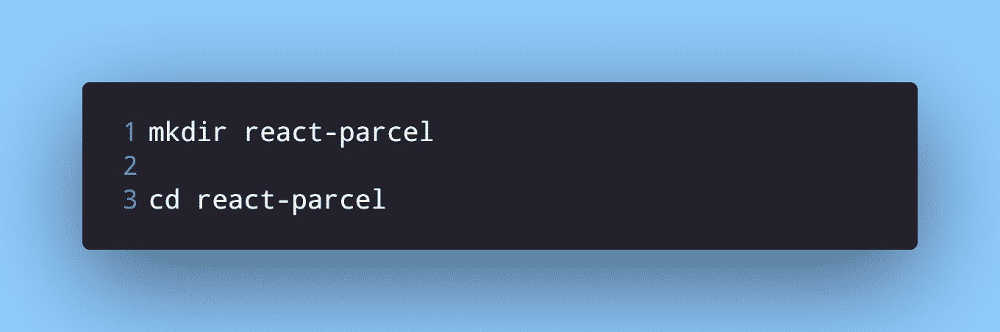

在安装任何依赖项之前，我们需要一个`package.json`文件。让我们也创建它。

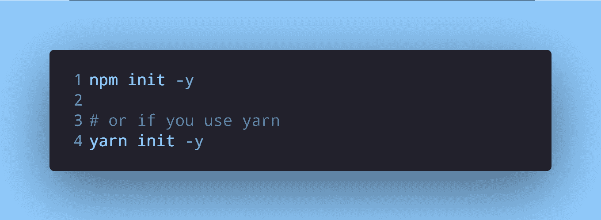

`-y`标志将对所有问题回答*是*，并使用默认选项创建一个`package.json`文件。现在我们可以安装我们的依赖项了。

## 2.安装依赖项

我们将需要 Parceljs 和 Babel 插件作为开发依赖以及 React 包。

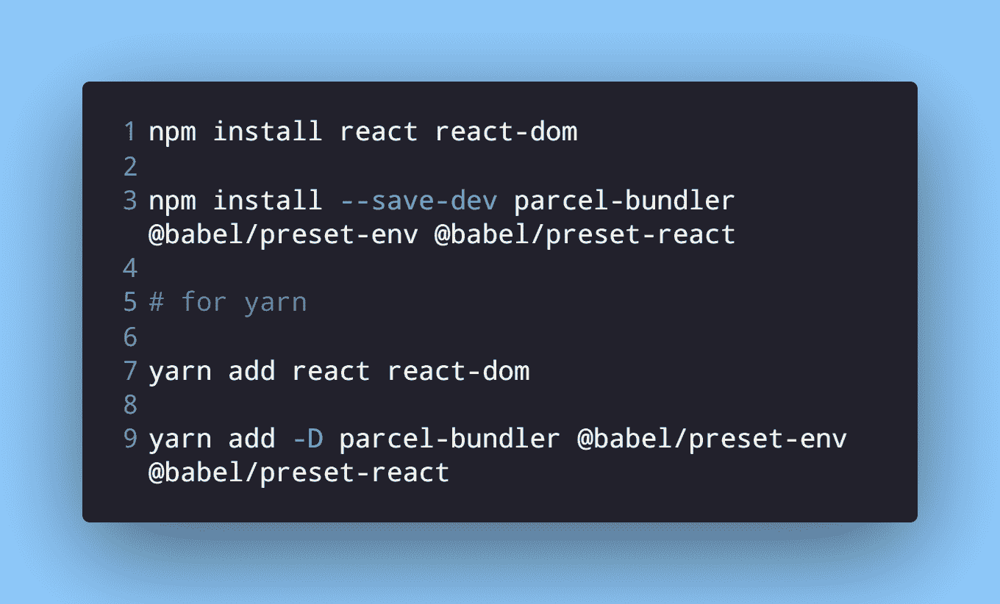

这些都是我们开始一个 React 项目所需要的依赖项。

## 3.表格配置和脚本

这些巴别塔插件将需要添加到一个配置文件。Babel [很好的解释了](https://babeljs.io/docs/en/config-files)和`.babelrc.json`、`babel.config.json`的区别以及何时使用其中任何一个。我已经在这个项目中使用了`.babelrc.json`。

在这个阶段，你的文件夹结构应该是这样的。

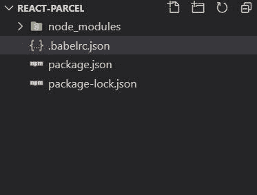

我已经添加了 babel 配置文件和预置。

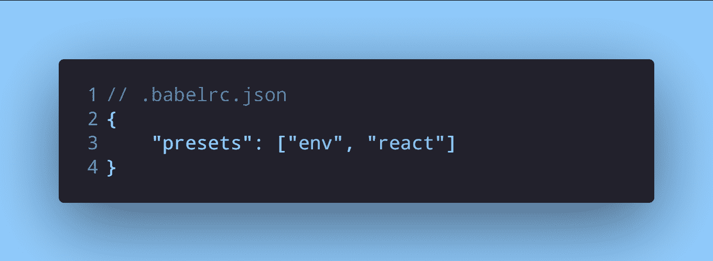

接下来，我们需要在`package.json`中添加一个启动脚本。

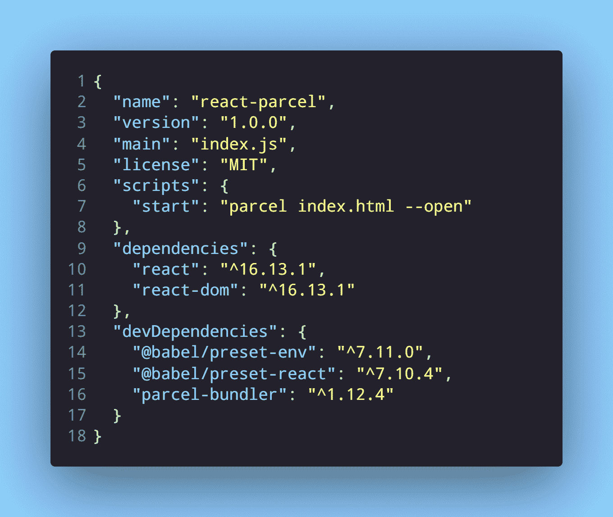

我们需要告诉 Parcel 它需要渲染的文件。`--open`标志告诉 Parcel 在系统的默认浏览器中打开 localhost。如果您不需要包裹来完成此操作，请不要使用此标志。你仍然可以在你选择的浏览器中打开`localhost:1234`。包裹使用的默认端口是 **1234** 。

## 4.写代码

虽然我们创建了启动脚本，但是我们没有 HTML 文件，也没有编写任何 React 代码。让我们现在做那件事。首先，我们将创建 HTML 文件，在`App.js`中编写一些 React 代码，然后将组件呈现到入口文件`index.js`中的 DOM 中。

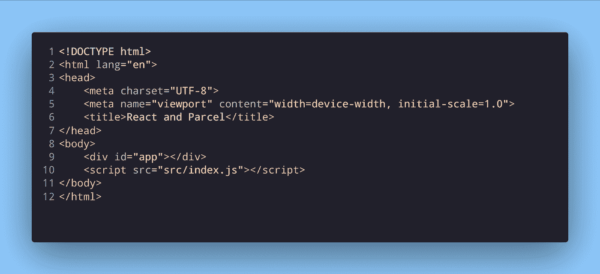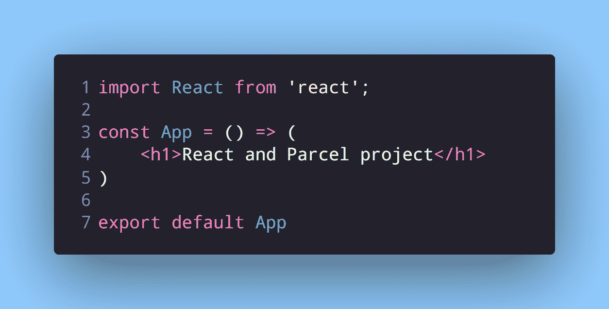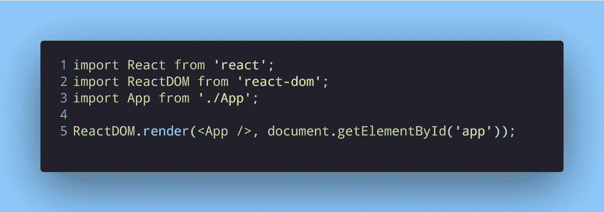

下面是添加代码文件后的文件夹结构。除了 HTML 文件，我将其他代码文件保存在`src`文件夹中:

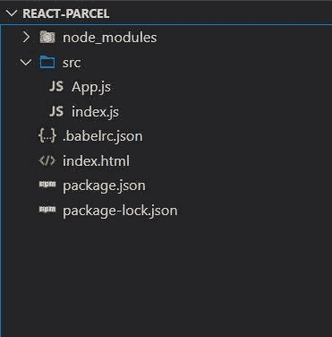

## 5.开始包裹

我们已经在第二步中编写了启动脚本。让我们运行这个项目。

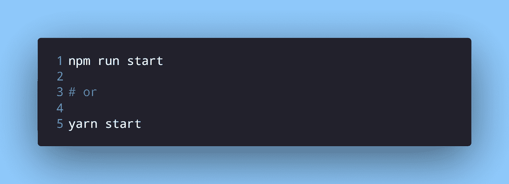

如果您在启动脚本中添加了`--open`标志，那么它应该已经在您系统的默认浏览器中打开了。否则，只需打开您选择的浏览器并进入`localhost:1234`。

# 包扎

即使没有 create-react-app 或 Parcel 等价物 create-react-app-parcel，您也可以创建一个最小的 react 应用程序。如果您的项目需要更多的复杂性、更多的库或不同的文件夹结构，您可以将其添加到现有的代码中。

如果你一直使用 Webpack，请尝试一下 package。它的设置速度非常快，不需要太多的配置。

*原载于* [*我的博客*](https://niharraoteblog.netlify.app/how-to-create-a-minimal-react-and-parcel-app-in-5-steps) *。*