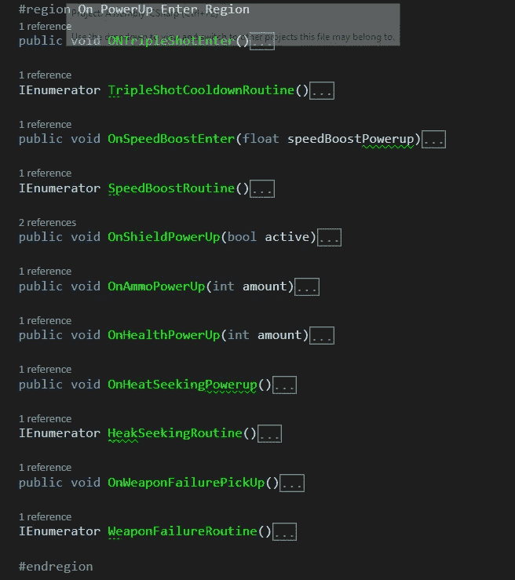
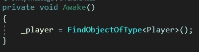
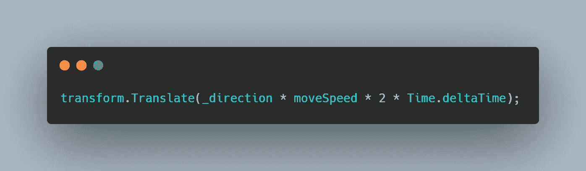
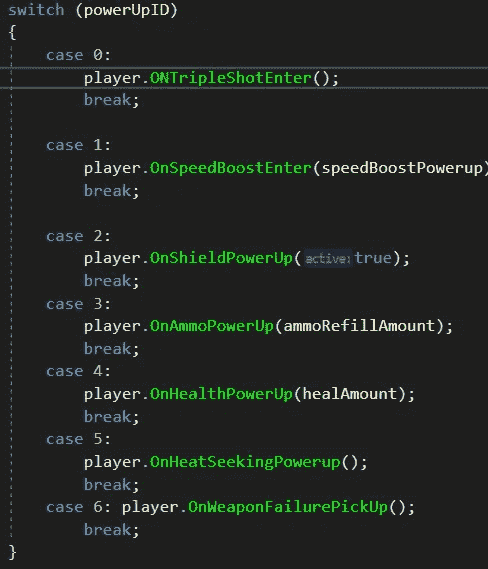
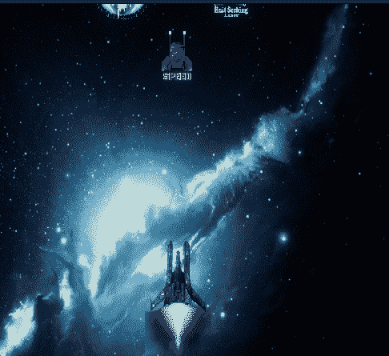

# 如何在 Unity 2D 创建模块化启动系统

> 原文：<https://levelup.gitconnected.com/how-to-create-a-modular-power-up-system-in-unity-2d-66fb4aa6240f>

> 目标

为你的 2D 游戏建造一个模块化的电力系统。假设你的游戏有大约 5 个或 10 个电源 ups，而你不想让电源 ups 系统变得太复杂，今天我们将学习一种简单有效的方法。


> 方法

让我们从创建一个 C#脚本开始，并将其命名为*加电，*为你第一次加电(比如加速加电)创建一个空游戏对象。确保添加一个碰撞器 2D 并选中 isTrigger 框，添加一个刚体 2D 并确保重力设置为零，这样我们就可以在需要时控制它的运动。



还要创建一个玩家脚本来控制每个加电方法，这将决定每个加电方法要做什么。

如你所见，每种方法都包含了获得能量后发生的事情。

在中，加电的唤醒方法获取你创建的播放器组件，以便在必要时调用加电方法。



由于游戏中只有一个玩家，我们可以很容易地得到它

在power up 的更新方法中，如果您希望它在实例化时移动，您可以编写以下代码来指定它的移动方向和速度(速度值可以序列化以便进一步控制)。



模块化系统背后的想法是能够创建一种方法来控制许多电源，而无需一遍又一遍地重新创建代码。所以一个简单的方法就是给每个异能和 ID，然后当玩家拿起它的时候就按照那个 ID 行动。让我们为加电 ID 创建一个序列化字段

```
//Here we have 6 power ups and each ID represents one.
//We add a Range and a tooltip to make it designer friendly>[Range(0,6)] 
>[Tooltip("tripleshot = 0, speed =1, shield = 2, ammo = 3, health = 4, heatseek = 5, weaponFailure = 6")]
>[SerializeField] int powerUpID;
```

> 现在是这个系统的核心

当玩家碰撞器与基于触发的碰撞器发生碰撞时，能量增强被拾取，所以让我们创建一个 OnTriggerEnter2D 方法，使用标签检查我们与玩家的碰撞

```
>private void OnTriggerEnter2D(Collider2D other)
> if(other.CompareTag("Player"))
>   if(_player != null)
//Always null check//code below
```



使用我们为每次加电创建的 ID，我们可以在触发器方法中创建一个 switch 语句。这样又比如我们把 Speed power up 的 ID 设为 1，那么在 switch 方法中我们说 case: 1，调用播放器脚本，调用 Speed Power up 方法。你甚至可以播放剪辑或 VFX 效应拿起。下面是切换方法的样子…

之后不要忘记破坏电源。



从这里开始，你可以创造尽可能多的能量，你可以手动将它们放入你的游戏中，或者让它们随机产生。你可以创造类似于我们为敌人波浪创造的[模块化产卵系统](https://novusxdev.medium.com/my-take-on-modular-wave-system-97dfab00d6b8)的东西。