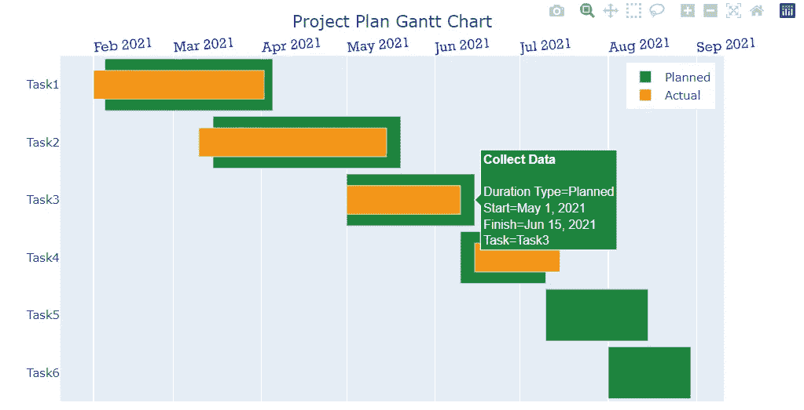

# 如何使用 Plotly 创建多层甘特图

> 原文：<https://levelup.gitconnected.com/how-to-create-a-multi-layer-gantt-chart-using-plotly-e7d7f158938c>

## 创建甘特图，根据计划完成日期和实际完成日期来跟踪项目计划


图片由 [Pixabay](https://pixabay.com/photos/sticky-notes-project-management-1455911/) 提供(作者修改)

甘特图对于项目经理和团队计划和跟踪项目路线图、时间表和进度是一种非常流行和有用的视觉效果。基本甘特图通过在纵轴上列出要执行的任务，在横轴上列出每项任务的计划开始和完成日期来说明项目计划。

有时，除了显示任务的计划日程，我们还想显示所有任务的实际开始和完成日期。下面的甘特图是一个多层甘特图，包含两层计划日期和实际日期:“计划日程”条形图(绿色)是甘特图的第一层，“实际日程”条形图(橙色)是第二层。如何使用 Python 轻松创建这样的多层甘特图？


作者图片

在这篇文章中，我将向你展示如何使用`Plotly`轻松创建多层甘特图。对于那些不熟悉`Plotly`的人来说，`Plotly` Python 库是一个交互式的开源图形库，涵盖了广泛的图表类型和数据可视化用例。它有一个名为`Plotly Express`的包装器，是`Plotly`的高级接口，作为创建一些最常见可视化的起点，使用起来超级简单快捷。

`Plotly`也有一个叫做`Plotly Graph Objects`的底层图形包，它通常需要更多的编码，但是与`Plotly Express`相比更加可定制和灵活。在本帖中，我们将使用`Plotly Express`来绘制多层甘特图。

如果您的计算机上还没有`plotly`，您可以通过运行以下命令来安装它:

```
pip install plotly
```

让我们首先导入所有的库，并将我们的样本数据读入 Pandas 数据框架。请注意，数据的组织方式是，对于每项任务，我们有两行数据，一行是计划的开始和完成日期，另一行是实际的开始和完成日期。


作者图片

为了创建甘特图，我们需要使用`px.timeline()`来绘制时间线图，其中数据帧的每一行都表示为沿 x 轴的矩形/水平条，从“开始”日期跨越到“完成”日期，每个任务都沿 y 轴列出。

我们还指定了参数`color`来为“计划”和“实际”进度栏分配不同的颜色。您可以为第 2 行和第 3 行中的两个条形设置您的颜色首选项。

现在，这是使甘特图看起来双层的诀窍:我们需要更新“实际日程”条形图的宽度，以便它们不会与“计划日程”条形图完全重叠。我们在第 16 行做。如果不应用这个技巧，你的图看起来会像左上方的图:


我们快完成了！让我们通过添加图表标题、将 x 轴标签移动到顶部、调整图例的位置、删除图例标题等来微调图表。



作者图片

这就对了。我们已经创建了一个多层甘特图，使用`Plotly.Express`按计划和实际进度显示项目计划。感谢阅读，我希望你喜欢这个关于`Plotly`的简短教程。

## 数据源:

本文中使用的样本数据集是作者出于演示目的创建的。

你可以通过这个[推荐链接](https://medium.com/@insightsbees/membership)注册成为 Medium 会员(每月 5 美元)来获得我的作品和 Medium 的其他内容。通过这个链接注册，我将收到你的会员费的一部分，不需要你额外付费。谢谢大家！