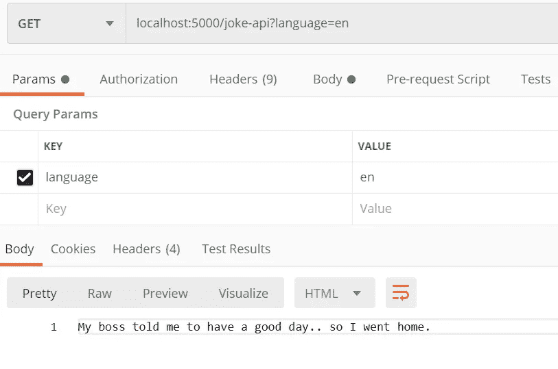
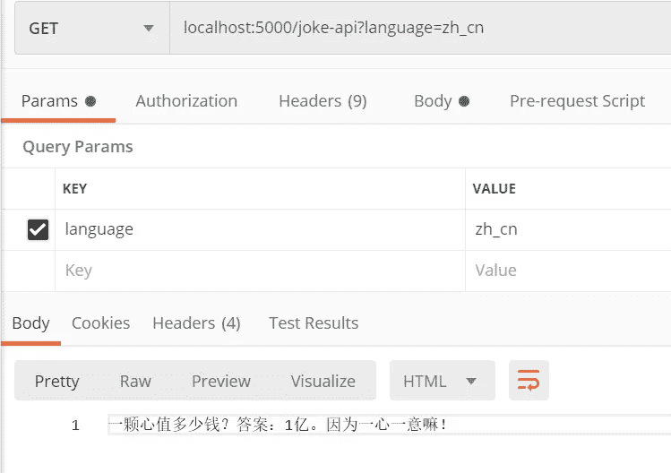
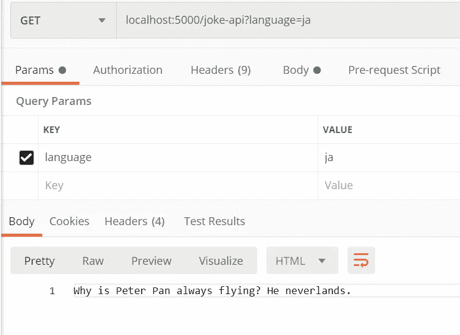
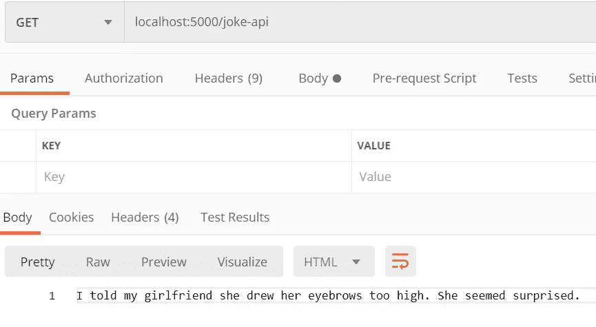

# 如何用 Python 创建多语言笑话 API

> 原文：<https://levelup.gitconnected.com/how-to-create-a-multi-lingual-jokes-api-in-python-c47957c39d73>

一天一个笑话，医生远离我


照片由[丹·库克](https://unsplash.com/@dan_scape?utm_source=unsplash&utm_medium=referral&utm_content=creditCopyText)在 [Unsplash](https://unsplash.com/s/photos/laugh?utm_source=unsplash&utm_medium=referral&utm_content=creditCopyText) 上拍摄

通过阅读这篇文章，你将学会用 Python 构建一个多语言笑话 API。在本教程结束时，您应该有一个工作的开发服务器，它会在每次 API 调用时为您返回一个随机笑话。您可以基于自己的用例继续在它的基础上进行构建。本教程有 4 个部分

1.  设置
2.  履行
3.  试验
4.  结论

让我们进入下一节，开始编写一些 Python 代码。

# 1.设置

## 瓶

设置非常简单明了。在本教程中，我将使用 Flask。如果您使用 Django 或另一个 Python 服务器，请相应地修改它。强烈建议您在继续之前设置一个虚拟环境。用下面的命令安装 Flask。

```
pip install flask
```

## 笑话数据集

下一步是为我们的 API 收集一些笑话数据。您可以决定将其作为 Python 字典存储在 Python 文件中，或者作为 json 格式存储在文本文件中。这两种方法各有利弊。我将把它作为字典存储在一个名为`api_data.py`的文件中。可以根据自己的喜好随意命名。

对于 Python 2 用户，在 Python 文件的顶部添加以下代码。如果您使用的是 Python 3，可以放心地忽略这一部分。

```
# -*- coding: utf-8 -*-
```

这表明我们正在为这个 Python 文件使用`utf-8`编码，因为我们正在构建一个多语言笑话 API。

接下来，创建一个字典，并用你收集的笑话数据集填充它。每个键代表一种语言，值是一个字符串列表。强烈建议使用适当的语言代码，以便将来事情变得更容易。

```
joke_dict = {
"en": ["joke1", "joke2"],
"zh_cn": ["笑话", "消化", "小花"]
}
```

如果你没有足够的语言数据，请随意检查以下要点。我添加了一些英语、简体中文和韩语的例子。

让我们继续下一节，开始实现 Python 服务器。

# 2.履行

在与`api_data.py`相同的目录下创建一个新的 Python 文件。

## 导入

添加以下导入语句。`random`模块将用于从笑话列表中获取一个随机元素。

```
from flask import Flask, request
import api_data
import random
```

定义以下变量。您可以根据自己的偏好使用任何端口，只要它没有被使用。

```
server_port = 5000
app = Flask(__name__)
```

## 途径

添加以下代码来定义到 API 的路由。相应地修改路线的名称。

```
@app.route('/joke-api')
def joke():
```

在函数内部，添加以下代码以从`GET`请求中获取语言数据。如果没有指定，将默认为`en`。

```
language = request.args.get('language', 'en')
```

话虽如此，但在我们的`joke_dict`中可能会出现指定语言不存在的情况。如果找不到语言，我将把它设置为`en`。

```
if(language not in api_data.joke_dict):
        language = 'en'
```

函数的最后一部分是返回随机笑话。

```
return random.choice(api_data.joke_dict[language])
```

您可以将它包装在一个`json`中，API 的状态根据您的用例指示为`Success`或`Failure`。

## 主要的

最后，添加以下代码以在启动时运行 Flask 应用程序。

```
if __name__ == "__main__":
    app.run('0.0.0.0',port=server_port)
```

您的 Python 文件中应该有以下代码

一旦你对它感到满意，就运行 Flask 应用程序。在下一节中，我们将测试 joke API。

# 3.试验

访问我们 API 的 url 应该如下所示

```
localhost:5000/joke-api?language=en
```

## （构成动词）表示“使处于…状态”

如果您对路由的端口或名称进行了任何更改，请对其进行相应的修改。当你调用 API 时，你应该得到一个随机的笑话。



作者图片

## 字典中的其他语言

让我们使用除了`en`之外的语言再次测试 API。为此，我将使用`zh_cn`。



作者图片

## 字典中没有的其他语言

如果您指定的语言在字典中找不到，它应该返回一个英语笑话。让我们用代表日语的`ja`来试试吧。



作者图片

## 未指定语言

如果没有指定语言，它应该默认为英语。



作者图片

恭喜你！您已经成功构建了自己的多语言笑话 API。

# 4.结论

让我们回顾一下今天所学的内容。

我们首先通过 pip install 安装烧瓶模块。此外，我们还准备了一些笑话数据集，并将其作为字典存储在 Python 文件中，其中 key 代表一种语言，值是笑话列表。

之后，我们实现了一个简单的 Flask 应用程序，当你调用它的 API 时，它会返回一个随机的笑话。

最后，我们测试了我们的多语言笑话 API，并确认它正在按预期工作。

感谢你阅读这篇文章。希望在下一篇文章中再见到你！

# 参考

1.  [myapp.py 要点](https://gist.github.com/wfng92/964a8f4fad7395bb93a32c66612e9183)
2.  [api_data.py 要点](https://gist.github.com/wfng92/dc4e5b50d4d9f9718c0c09f35092c33d)