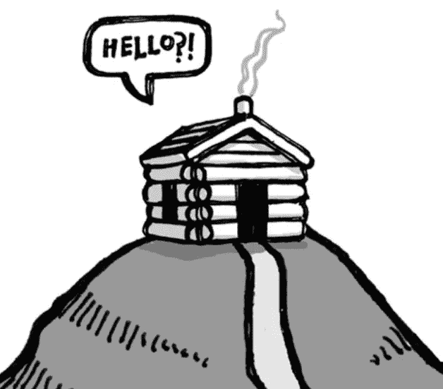
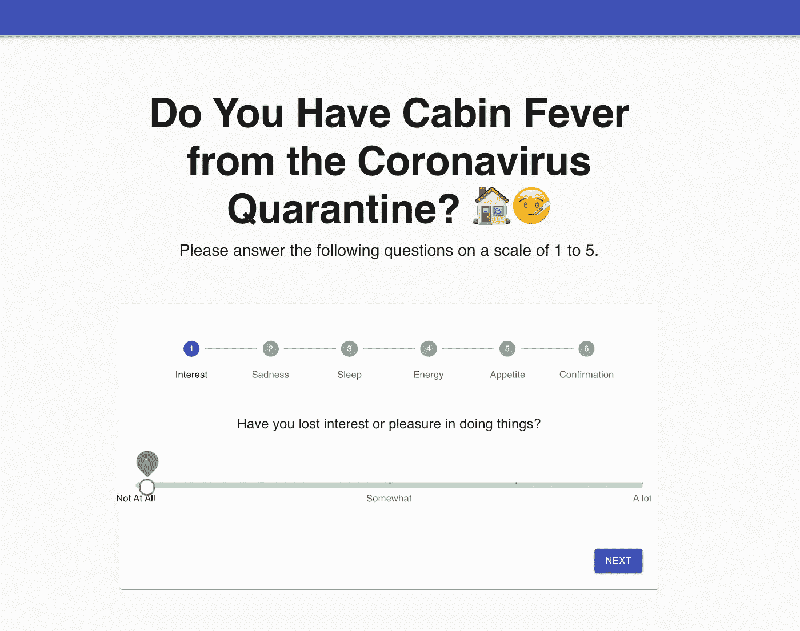
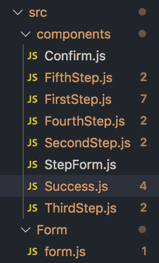

# 如何用滑块创建多步表单:冠状病毒小屋热测验

> 原文：<https://levelup.gitconnected.com/how-to-create-a-multistep-form-with-slider-coronavirus-cabin-fever-quiz-a2787d6decc7>

冠状病毒(新冠肺炎)袭击纽约已经一个月了。像你们中的许多人一样，我一直被困在家里，我已经没有什么可以和我的猫谈论的了。所以，如果你已经听过很多次那个高中故事了，老兄，你还会再听到的！！！玩笑归玩笑，我不禁觉得自己好像患上了某种形式的幽居病。有趣的事实:在我进入编程领域之前，我一直在从事临床心理学和医学方面的职业。因此，对我来说，注意到我自己没有 100%的感觉，并表现出一些异常的行为症状是第二天性。症状表明有幽居病，特别是因为我已经自我隔离了 4 个星期，再加上我们国家现在的暗淡前景。

虽然幽居病不是你在 DSM-5 中找到的真正的心理诊断，但症状和现象是合理的。幽居病的症状包括坐立不安、焦虑、嗜睡、悲伤或抑郁、注意力难以集中、动力下降、睡眠困难、绝望。

我认为让人们做一个简短的测验/问卷会很好，这将衡量他们是否可能因新冠肺炎引起的长期自我隔离而患幽居病的可能性。在这篇博客中，我将使用材质 UI 制作一个带有滑块的多步表单。

首先，安装材质 UI。

`npm install @material-ui/core`

在`src`下创建一个`components`文件夹和`form`文件夹。`form`文件夹和`components`文件夹应包含以下组件:

`StepForm`是父组件。每个“步骤”(第一步，第二步)都是一个单独的问题。`Confirm`是确认页面。`Success`将是结果页面。

我们要看的第一个组件是`form.js`。这将是我们的多步表单的模板。注意，我们必须在这里导入我们的 StepForm。

接下来，让我们创建我们的 StepForm 组件。StepForm 组件将保存我们表单的所有逻辑。

在第 15–22 行，我们必须制作一个标签数组来表示问卷中“步骤”的数量。

在第 24–34 行，我们使用钩子来设置每个问题答案的状态。如您所见，`useState`是一个空值，因为当用户移动滑块时，我们将获取答案。

在第 36–54 行，我们为每个问题构建了`handleChange`函数，以便在用户移动滑块时获取答案值。

在第 56–62 行，我们必须创建一个数组来记录所有的答案。

在第 66–68 行中，`handleNext`和`handleBack`函数允许我们前进到下一个问题或返回到表单中的上一个问题。

在第 71–129 行，我们使用一个 switch 语句来决定下一步执行哪个“步骤”，或者我们表单中的问题。我们还在每个组件中传递道具。

在第 132–154 行，我们显示了多步表单的元素，如标签和步进器。步进器通过编号的步骤显示进度。一旦用户完成整个调查问卷，就会呈现成功页面。

太好了！让我们继续我们测验的第一个问题。下一个组件是`FirstStep`。

在第 14-18 行，我们正在解构我们的道具。

在第 22–50 行，我们使用材质 UI 中的 Pretto 滑块来构建样式。

在第 52–73 行，我们创建了一个名为`marks`的数组来表示滑块上的值。

在第 75–109 行，我们呈现了我们的问题和滑块。

对于第二步、第三步、第四步和第五步，代码非常相似。唯一的区别是我们破坏的道具和问题。如果你想看这些组件的代码，请查看 https://github.com/Bellex0/covid-cabin-fever 的。

现在，让我们进入`Confirm.js`组件。

在第 9-13 行，我们销毁了道具。

在第 17-23 行，我们将所有问题的答案相加。

在第 26–84 行，我们呈现了用户之前的所有回答和他们的分数。

最后，我们到达了`Success.js`组件。在这里，我们列出了调查问卷的结果。

瞧啊。查看这里的成品[https://covidcabinfever.netlify.com](https://covidcabinfever.netlify.com/)

请记住:这个测验仅用于娱乐和教育目的。如果你觉得自己真的患有抑郁症，请咨询健康专家。改变你的日常生活也总是好的。做一些你知道会让你笑并让你心情愉快的事情。狂看新节目。打电话给朋友。查找[虚拟博物馆](https://www.goodhousekeeping.com/life/travel/a31784720/best-virtual-tours/)。在 Youtube 上学习新的食谱。锻炼身体。

保持安全和健康每个人❤️.