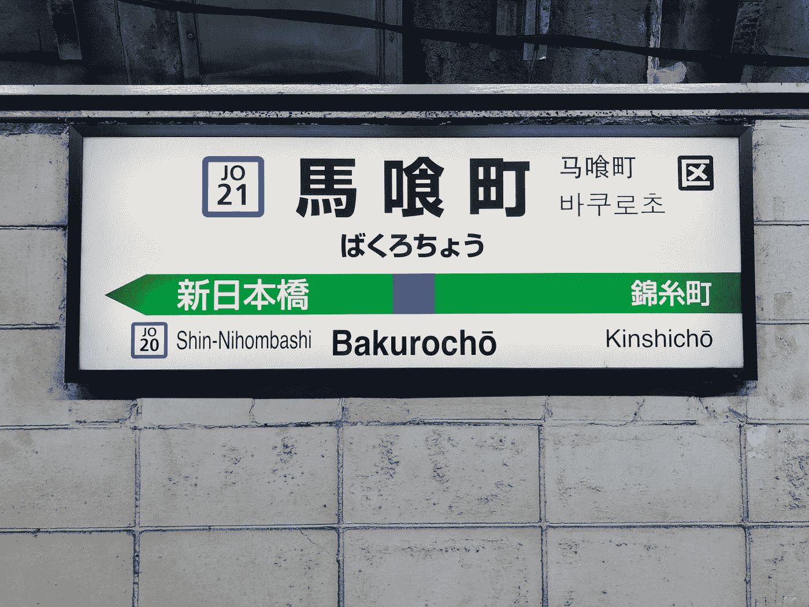
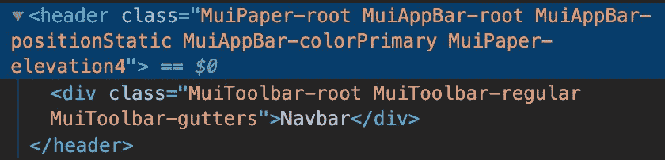
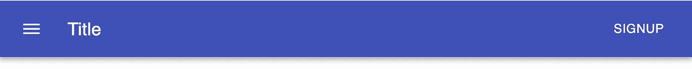

# 如何用 Material-UI 创建导航栏

> 原文：<https://levelup.gitconnected.com/how-to-create-a-navigation-bar-with-material-ui-9cbcfcec2570>

## 了解 Material-UI 中的 AppBar 和工具栏组件



Nikita Vasilevskiy 在 [Unsplash](https://unsplash.com?utm_source=medium&utm_medium=referral) 上拍摄的照片

导航栏是用户在网站上首先看到的东西之一。您可以使用 Material-UI 中的组件库在 React 中轻松创建漂亮的导航栏。

在本文中，我们将了解如何使用 Material-UI 中的 AppBar 和工具栏组件创建导航栏。我们将创建的导航栏将为菜单图标、徽标/公司名称和注册按钮留出空间。

我们将从上一篇文章继续，在上一篇文章中，我们已经创建了一个新的 react 项目并安装了 Material-UI 核心包。在那篇文章中，我们创建了一个打开带有注册表单的模态的按钮。如果你错过了，看看下面的链接。

[](/create-a-signup-page-with-react-and-material-ui-9b203d18cf3f) [## 用 React 和 Material-UI 创建一个注册页面

### 了解如何为您的下一个网站创建一个对话框和表单

levelup.gitconnected.com](/create-a-signup-page-with-react-and-material-ui-9b203d18cf3f) 

# 入门指南

如果您是从上一篇文章开始，那么您想要做的第一件事就是更改`index.css`文件中的样式。这里我们唯一的样式是一个基本的 CSS 重置。我们将设置空白和填充为 0。这是重要的一步。如果我们跳过这一步，我们的导航栏将应用默认边距和填充。

```
* {
  margin: 0;
  padding: 0;
}
```

接下来，我们将在项目中创建一个新文件，并将其命名为`Navbar.js`。在这个文件中，我们将使用 Material-UI 中的 AppBar 和工具栏创建一个新的 Navbar 组件。

让我们首先渲染这些来创建一个基本的导航栏。Material-UI AppBar 的默认位置为“固定”。如果你愿意，你可以通过传递一个`position`道具来改变它。工具栏将是 AppBar 的子工具栏。

```
import React from 'react';
import AppBar from '@material-ui/core/AppBar';
import Toolbar from '@material-ui/core/Toolbar';const Navbar = () => {
  return (
    <AppBar position="static">
      <Toolbar>Navbar</Toolbar>
    </AppBar>
  );
};export default Navbar;
```

然后，我们可以将 Navbar 组件导入到我们的`App.js`文件中，并像这样显示它。

```
<div className="App">
  <Navbar />
</div>
```

# 应用程序栏与工具栏

你可能想知道的一件事是，为什么我们需要使用应用程序栏和工具栏？

如果我们看一下 HTML 的内部，我们会看到这个。



AppBar 组件使用 HTML `<header>`标签，而工具栏组件使用`<div>`标签。查看这些类，我们还可以看到 AppBar 正在添加颜色。

如果我们更仔细地查看 CSS，我们还会发现 AppBar 具有`display: flex`和`flex-direction: column`的属性。工具栏有一个属性`display: flex`，但是没有设置伸缩方向。这意味着它正在使用默认值`flex-direction:row`。因此，工具栏是在导航栏中连续显示组件的地方。

如果我们不使用工具栏，我们仍然会看到应用程序栏，但是我们试图显示的任何东西都会在一个列中。如果我们不使用 AppBar，我们就不会有`<header>`标签，我们的导航栏也不会有颜色。

AppBar 和工具栏应用了不同的属性和样式。这就是为什么在创建导航栏时应该两者都用。

# 添加图标、版式和按钮

在我们的导航栏中，我们将添加一个菜单图标按钮、一个标题和一个打开模式的注册按钮。

首先，我们需要导入[材质-UI 图标](https://material-ui.com/components/material-icons/)包。

```
npm install @material-ui/icons
```

在我们的`Navbar.js`文件中，添加以下导入。

```
import { makeStyles } from '@material-ui/core/styles';
import Typography from '@material-ui/core/Typography';
import IconButton from '@material-ui/core/IconButton';
import Button from '@material-ui/core/Button';
import MenuIcon from '@material-ui/icons/Menu';
```

然后，我们将以下内容作为子组件添加到工具栏组件中。

```
<AppBar position="static">
  <Toolbar>
    <IconButton edge="start" color="inherit" aria-label="menu" className={classes.menuButton}>
      <MenuIcon />
    </IconButton>
    <Typography variant="h6" className={classes.title}>Title</Typography>
    <Button color="inherit">Signup</Button>
  </Toolbar>
</AppBar>
```

这里我不会详细介绍其他组件是如何工作的。如果你有兴趣了解更多，请查看下面的 Material-UI 文档。

[](https://material-ui.com/) [## Material-UI:一个流行的 React UI 框架

### React 组件使 web 开发更快更容易。建立自己的设计体系，或者从材料设计开始。

material-ui.com](https://material-ui.com/) 

我们还将为菜单图标和标题添加一些样式，使我们的导航栏看起来更好一些。

```
const useStyles = makeStyles(*theme* => ({
  menuButton: {
    marginRight: theme.spacing(2),
  },
  title: {
    flexGrow: 1,
  },
}));
```

最后一步是将我们在上一篇文章中创建的模态表单连接到注册按钮。我们将把之前写在`App.js`文件中的代码移到我们的`Navbar.js`文件中。这包括声明`open`状态、`handleOpen`和`handleClose`功能，以及呈现`ModalDialog`组件。同样，如果你错过了上一篇文章，请务必点击这里查看。

最终的导航栏将如下所示。



# 包扎

最终的`Navbar.js`文件看起来会像这样。

如果你想看到目前为止该项目的完整源代码，请查看下面的 GitHub repo。务必检查名为*导航栏的正确分支。*

[](https://github.com/chadmuro/medium-signup/tree/navigation-bar) [## Chad muro/中型注册

### 这个项目是用 Create React App 引导的。在项目目录中，您可以运行:在…中运行应用程序

github.com](https://github.com/chadmuro/medium-signup/tree/navigation-bar) 

感谢阅读！到目前为止，我真的很喜欢建立这个网站，所以我在考虑在建立网站的时候把它做成一个系列。请务必继续关注即将推出的更多内容。

如果您错过了上一篇文章，请查看下面的内容，在那里我们学习了如何连接 React Hook Form 来处理表单输入数据。

[](/using-react-hook-form-with-material-ui-components-ba42ace9507a) [## 将 React 挂钩形式与材质 UI 组件一起使用

### 使用 Material-UI 时处理表单数据的更好方法

levelup.gitconnected.com](/using-react-hook-form-with-material-ui-components-ba42ace9507a)