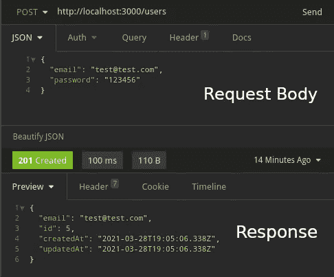

# 如何创建带身份验证的 NestJS 应用程序

> 原文：<https://levelup.gitconnected.com/how-to-create-a-nestjs-app-with-authentication-c0ae845ff6ac>


杰佛森·桑多斯在 [Unsplash](https://unsplash.com?utm_source=medium&utm_medium=referral) 上拍摄的照片

[NestJS](https://nestjs.com/) 是一个强大而令人敬畏的框架，它为您构建应用程序提供了坚实的基础。像任何强大的框架一样，一开始它可能有点吓人。因此，在本教程中，我将尝试帮助您完成创建 NestJS 应用程序的第一步。

# 创建应用程序

使用它的 CLI 启动 NestJS 应用程序非常容易。我们将从全局安装它开始(在本教程中我将使用 yarn ),并运行命令来创建基本应用程序:

```
yarn global add @nestjs/cli
nest new project-name
```

这个项目已经准备好了。运行下面的命令，打开 [http://localhost:3000](http://localhost:3000) 看到一个“Hello World”:

```
yarn start:dev
```

# 设置. env 文件

我们要做的下一件事是设置 NestJS 的[配置模块](https://docs.nestjs.com/techniques/configuration):这个模块用于加载你的*。env* 文件，如果您想拥有多个或动态配置，它有一些不错的特性。第一步是安装它:

```
yarn add @nestjs/config
```

现在我们可以在我们的 *app.module.ts* 上导入它:

应用程序模块

我们将 ***ConfigModule*** 添加到***imports****参数数组中，并将它的 ***isGlobal*** 属性设置为 ***true*** ，这样这个模块就会加载到所有其他模块中(如果不设置这个，就必须将 ***ConfigModule*** 添加到*环境*信息)。*

# *连接到数据库*

*为了访问和连接数据库，我们将使用 TypeORM(带 MySQL ),因为 NestJS 与它有很好的集成。让我们从安装所需的库开始:*

```
*yarn add @nestjs/typeorm typeorm mysql2*
```

*现在我们将设置我们的数据库信息。我将使用 docker 运行 MySQL(你可以查看本教程[的第一部分](/adding-and-using-a-database-on-a-typescript-api-with-typeorm-41c49336eff5)，了解如何用 Docker 建立你自己的数据库)。在项目的根文件夹中创建一个. env 文件，并将信息更改如下:*

*。包封/包围（动词 envelop 的简写）*

*让我们将 ***类型模块*** 添加到我们的 *app.module.ts* 文件中:*

*应用程序模块*

*这里我们创建了一个 ***实体*** 数组，我们将使用它来添加我们的实体，并使用来自我们*的数据库信息。env* 文件。*

# *创建用户*

*所以，让我们继续，创造我们的用户。通过运行以下命令开始:*

```
*nest g resource users
# Select REST API
# Select to NOT generate CRUD entry points*
```

*我们第一次运行这个命令时，它会使用 NPM 安装一些库。如果你正在使用 yarn，不要忘记删除 package-lock.json 并再次运行 yarn。*

*在你运行这个之后会发生很多事情。NestJS 的 CLI 将创建一个包含以下内容的 *users* 文件夹:*

*   **users.controller.ts* 和*users . constroller . spec . ts*文件*
*   **users.service.ts* 和 *users.service.spec.ts* 文件*
*   **users.module.ts* 文件*

*规格文件是测试文件，在本教程的其余部分将被忽略(如果您愿意，可以删除它)。*

*让我们从安装 bcrypt 来散列用户的密码开始:*

```
*yarn add bcryptjs
yarn add @types/bcryptjs -D*
```

*现在我们在*用户*文件夹中创建一个*用户.实体. ts* 文件:*

*用户.实体. ts*

*我们必须用***Entity()***decorator 创建我们的用户类，并扩展 ***BaseEntity*** 。然后我们添加 ***id*** ， ***email*** ， ***密码*** ， ***createdAt*** 和 ***updatedAt*** 字段以及 ***hashPassword*** 和***validate password***方法*

*准备好用户实体后，让我们创建一个 DTO。DTO 用于验证我们收到的数据。让我们首先添加类验证器库来帮助我们进行验证:*

```
*yarn add class-validator*
```

*然后我们在 *users* 文件夹中创建一个 *dto* 文件夹，并将 *create-user.dto.ts* 添加到其中:*

*创建用户*

*我们将使用此 DTO 来确保我们将收到有效的电子邮件和非空的密码。让我们继续并编辑 *users.service.ts* 文件:*

*用户.服务. ts*

*所以，在这里我们创建了 ***create*** ， ***showById*** ， ***findById*** 和 ***findByEmail*** 方法。为了创建用户，我们用来自 DTO 的数据实例化一个用户对象并保存它。然后我们从这个用户对象中删除密码参数并返回它。*

*现在我们只需编辑我们的*用户.控制器. ts* ，并将我们的 ***用户*** 实体添加到 ***实体*** 数组中的 *app.module.ts* 文件上:*

*用户.控制器. ts*

*应用程序模块*

*让我们启动应用程序并创建一个用户。运行***yarn start:dev***命令，然后用 ***电子邮件*** 和 ***密码*** 向[http://localhost:3000/users](http://localhost:3000/users.)发送 Post 请求。我通常使用[失眠](https://insomnia.rest/)来发送请求，但是你可以使用任何你想要的程序([邮递员](https://www.postman.com/)是另一个很棒的选项):*

**

*这里我们要做的最后一件事是导出我们的用户服务。编辑*用户服务文件*文件:*

*用户.模块. ts*

# *创建身份验证*

*让我们从创建我们将需要的文件开始。运行 NestJS 的 CLI generate 命令:*

```
*nest g resource auth
# Select REST API
# Select to NOT generate CRUD entry points*
```

*我们需要一些库来实现认证。让我们安装它:*

```
*yarn add @nestjs/passport @nestjs/jwt passport passport-jwt
yarn add @types/passport-jwt -D*
```

*现在，我们必须在实际登录之前进行一些设置。我们必须给我们的*增加一个 ***JWT_SECRET*** 。env* 文件:*

*。包封/包围（动词 envelop 的简写）*

*我们必须创建一个 *jwt.strategy.ts* 和一个 *jwt-auth.guard.ts* :*

*jwt.strategy.ts*

*jwt-授权保护. ts*

*然后我们还要将 ***UsersModule*** ，***passport module***， ***JwtModule*** 和 ***JwtStrategy*** 添加到 ***AuthModule*** 。编辑*认证模块:**

*授权模块. ts*

*在继续之前，让我们解释一些东西: ***JwtStrategy*** 负责从请求的头部获取我们的令牌，并检查它是否有效。如果是，那么它将从 payload 中获取 ***userId*** (我们将把这个 ***userId*** 添加到 payload 上的 ***AuthService*** )。 ***JwtAuthGuard*** 是调用 ***JwtStrategy*** 的类，我们将使用它来保护我们的路线。*

*我们快到了。让我们创建一个 *auth-login.dto.ts* (在一个 *dto* 文件夹中)并编辑我们的 *auth.service.ts* 文件:*

*auth-登录. dto.ts*

*授权服务. ts*

*我们通过构造函数获取了 ***UsersService*** 和 ***JwtService*** ，并添加了 ***login*** 和 ***validateUser*** 方法。现在我们只需编辑*授权控制器. ts* :*

*我们在控制器上创建了*登录和 ***测试*** 方法。这里的 ***测试*** 方法只是举例说明如何使用我们之前创建的 ***JwtAuthGuard*** (看一下***use guards***decorator)。**

**我们现在试着登录:发送一个 Post 请求到[http://localhost:3000/auth](http://localhost:3000/auth)，正文带有 ***邮箱******密码*** :**

****

**测试授权登录**

**有用！让我们测试一下我们的 ***JwtAuthGuard*** 是否也在工作:让我们发送一个 Get 请求到[http://localhost:3000/auth](http://localhost:3000/auth):**

******

使用和不使用我们的令牌测试授权保护** 

**太棒了，我们添加***UseGuards***decorator 的每条路线都需要令牌。**

**作为快速参考，我们的 *src* 文件夹应该是这样的:**

****

**文件结构**

**现在我们有了带身份验证的 NestJS 应用程序。如果你想看看最终的文件，你可以[查看这里](https://github.com/phcarvalho/medium-posts/tree/main/03-starting-nestjs)。如果你是第一次与 NestJS 合作，看看他们的[文档](https://docs.nestjs.com/)。它们有比我在这里展示的更多的现成特性:队列、cron 任务、web 套接字、微服务等等…**