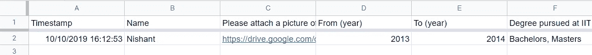

# 如何使用 Google Apps 脚本从 Google 电子表格数据创建文档

> 原文：<https://levelup.gitconnected.com/how-to-create-a-new-document-from-data-in-a-google-spreadsheet-using-google-apps-script-1c8c2848b59b>


你好，学习者，

本文的目的是解释如何使用 Google Apps 脚本从 Google 电子表格数据生成 Google Docs。

在研究开发之前，我们应该理解开发如何帮助和简化我们的任务。

# 这个脚本和开发有什么好处？

我们将看到这个脚本可以执行的一些有用的任务。

*   学生的分数可以从谷歌电子表格数据中生成。
*   房屋分配信可以由电子表格数据生成。
*   这个脚本还可以为客户生成发票。
*   可以生成研讨会证书并发送给学生。

这个脚本可以用来根据需要制作更多类似的东西。

# 为了开发这个项目，我们需要以下东西:

1.  用所需的数据作为模板创建一个 Google 文档。

2.创建谷歌电子表格并保存数据。

3.创建一个用于保存文档的 Google Drive 文件夹。

4.编写 Google Apps 脚本，使用数据生成 Google 文档。

# 以下是创建生成 Google 文档的 Google Apps 脚本的步骤

我们将遵循我们在以前的文章中关于使用 Google 电子表格数据开发 Google Apps 脚本的相同过程。

我们正在为大学生信息生成一个文档。

**步骤 1:** 创建 Google 电子表格并保存数据，在此表格中，数据可以使用 Google 表单收集，也可以手动填写。样本谷歌电子表格可能看起来像这样。



谷歌电子表格图像

**第二步:**现在，创建带有替换标签*(这里我们使用的标签是——时间戳、姓名、图片、from_year、to_year、college_name)* 的 Google 文档，这些标签将在生成文档时用作模板。

步骤 3: 我们已经准备好了谷歌电子表格和文档模板，现在打开谷歌脚本编辑器，开始按照以下步骤编写脚本。

**步骤 3.1:** 这个 **fillData()** 函数从 **getData()** 函数中获取 JSON 对象格式的数据，帮助我们替换我们在文档模板中定义的标签。

在 **fillData()** 函数中我们定义了，电子表格 id，文档 id，可以从文档 URL 栏中复制。

然后，我们读取文档的 id 和主体，使用脚本将标签替换为电子表格数据。

在用标签替换数据后，我们用文件夹 id 来标识我们的文件夹，一旦你在 Google Drive 中打开文件夹，并在 pdf 格式转换到该文件夹后移动文档文件，也可以从 URL 栏复制文件夹 id。

```
function fillData() {try {var ss = SpreadsheetApp.openById("YOUR_SPREADSHEET_ID");
var sheet = ss.getSheetByName("main");
var parseJson = getData(sheet);var templateId = 'YOUR_DOCUMENT_TEMPLATE_ID';var documentId = DriveApp.getFileById(templateId).makeCopy().getId();var doc = DocumentApp.openById(documentId);var body = doc.getBody();if(parseJson.timestamp !="") {body.replaceText("<<timestamp>>", parseJson.timestamp);body.replaceText("<<name>>", parseJson.name);body.replaceText("<<picture>>", parseJson.picture);body.replaceText("<<from_year>>", parseJson.from_year);
body.replaceText("<<to_year>>", parseJson.to_year);
body.replaceText("<<college_name>>", parseJson.college_name);DriveApp.getFileById(documentId).setName(parseJson.name + "_" + parseJson.timestamp);doc.saveAndClose();var source = DriveApp.getFileById(documentId)var blob = source.getAs('application/pdf');var file = DriveApp.createFile(blob);var pdf_file_id = file.getId();file.setName(source.getName() + '.pdf');//folder id in which file will be saved
var folder = DriveApp.getFolderById('YOUR_FOLDER_ID');var folderToMoveFile = isFolderExists(folder);file.moveTo(folder);
var status = "success";return status; }
}catch(err) {status = err;}}
```

**步骤 3.2:** 我们已经在**步骤 3.1** 中定义了 **getData()** 函数，为了得到 JSON 对象格式的数据，必须用脚本定义该函数。让我们看看下面的脚本。

```
function getData(sheet){  
 var jo = {};  
 var dataArray = [];
// collecting data from 2nd Row , 1st column to last row and last    // column sheet.getLastRow()-1var rows = sheet.getRange(2,1,sheet.getLastRow()-1,sheet.getLastColumn()).getValues();for(var i = 0, l= rows.length; i<l ; i++)
{  var dataRow = rows[i];
     var record = {};
      record['timestamp'] = dataRow[0];
      record['name'] = dataRow[1];
      record['from_year'] = dataRow[2];
      record['to_year']=dataRow[3];
      record['college_name']=dataRow[4];
      dataArray.push(record);
   }   jo = dataArray;
   var result = JSON.stringify(jo);
return jo;
}
```

在上面的脚本中，我们从 Google 电子表格中读取数据并将其转换为 JSON 对象，然后返回到 **fillData()** 函数。

一旦运行了 **fillData()** 函数，脚本就会被执行，所需的任务就会完成。

如果你有兴趣学习 Google Apps 脚本和自动化你的 Google Workspace？必须试试这本**电子书**上的“ [**谷歌应用套件脚本:初学者指南**](https://www.amazon.com/dp/B0BTJC9X5R) ”

我希望这篇文章能帮助你理解如何在 Google Apps 脚本的帮助下使用 Google 电子表格生成文档。如有疑问，欢迎留言评论。我很乐意帮助你。