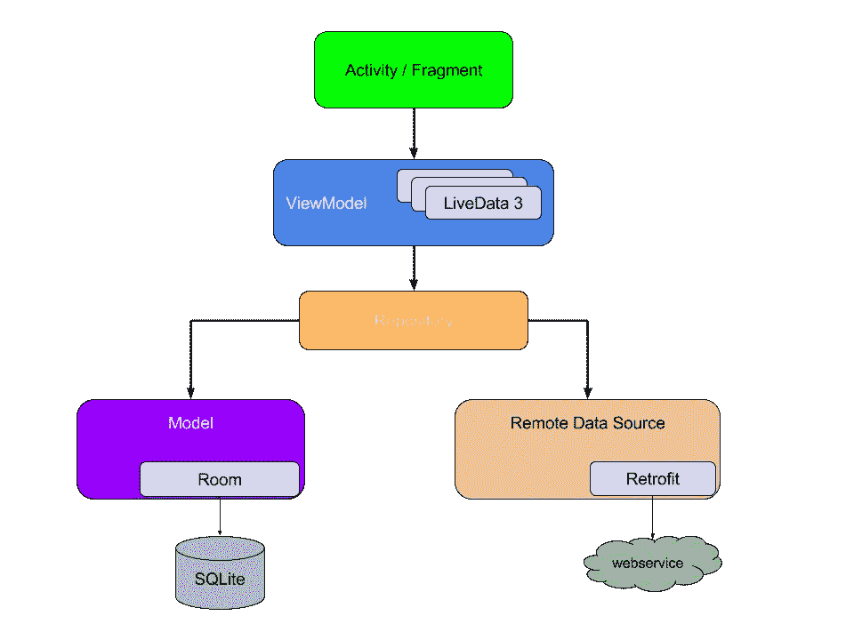

# 如何使用 Kotlin 独有的特性创建一个完美的存储库

> 原文：<https://levelup.gitconnected.com/how-to-create-a-perfect-repository-using-kotlin-exclusive-features-61c3121f22df>

## 组织您的数据和属性域图层

由 [You X Ventures](https://unsplash.com/@youxventures?utm_source=medium&utm_medium=referral) 在 [Unsplash](https://unsplash.com?utm_source=medium&utm_medium=referral) 上拍摄的照片

这一切都始于谷歌为 Android 引入架构开发。首先，让我们看看为什么移动应用程序开发需要架构。移动开发是过去十年中增长最快的技术之一，每天有数十亿活跃用户来自世界各地。

当我们拥有如此可观的用户规模时，我们必须放眼全球。将会有来自互联网可能很慢的地方的用户，或者他们无法理解像英语这样的标准语言和许多我们无法想象的用例。

为这样的用户群开发应用并不是一件简单的事情。我们不是为一次性发布创建应用程序；会有更新，所以我们正在编写的代码应该有一个模式，帮助我们重用代码，并使事情尽可能简单。

架构的主要目的之一是提供一个代码库，当需求改变时，它可以快速适应，这意味着需要改变的代码量应该总是最小的。

现在让我们看看谷歌推荐的架构是什么样子的:

Google 推荐设计应用程序架构的方法

让我们讨论一下这个架构的基本内容，然后深入到存储库。

活动/片段与 UI 相关，ViewModel 负责通过 LiveData 向 UI 组件提供数据。ViewModel 从存储库中获取数据。最后，我们到了存储库部分。存储库是该架构中唯一依赖于两个因素的组件:远程服务器和本地数据库。这是我们现在需要处理的部分。

# 存储库概述

存储库不应该依赖于远程服务器和本地存储，所以我们需要创建数据源逻辑，存储库从数据源逻辑获取数据，而数据源逻辑将从本地存储获取数据。如果本地数据库中没有数据，它将从远程服务器获取并保存在数据库中，然后发送到存储库。通过这种方式，存储库从单一来源获取数据。

在架构级别进行开发是一件复杂的事情，您应该了解许多概念，并且知道如何在通用格式中使用它们。因此，我将推荐一些文章来帮助你理解高级概念，如果你不熟悉相应的概念，可以先浏览一下。

# 局部存储器

数据的总体来源来自本地存储，所以让我们从那里开始。对于本地存储，Google 推荐 Room library，这是一个来自 jetpack 家族的库，充当 SQLite 上的抽象层。

如果你对房间不熟悉，看看下面这篇文章。

 [## Android Room 持久性库🔗科特林协程

### 制造悬念😉数据库ˌ资料库

medium.com](https://medium.com/@sgkantamani/android-room-persistence-library-kotlin-coroutines-26d53a09d384) 

要实现房间数据库，我们需要 Dao 和实体。看看《道》和《实体》就能得到电影列表

获取电影的实体

电影岛

# 网络

那么下一个数据源来自远程服务器。同样，我们使用谷歌推荐的，也是最著名的图书馆改造。retrieval 是一个基于注释的网络库，它使用 okhttp 进行套接字通信。

如果你不熟悉翻新，看看下面的文章

 [## 了解改造是如何工作的

### 要成为一名优秀的开发人员，就要知道幕后发生了什么

medium.com](https://medium.com/mindorks/understand-how-does-retrofit-work-c9e264131f4a) 

在这里，我们使用 Kotlin 协程的改型。

用协程程序翻新

在这里，我们必须处理全局的错误处理，否则将会出现各种类型的错误，如改造错误或来自服务器的错误。为了首先实现系统的错误处理，我们需要创建一个密封的类来保存所有的状态和数据，比如错误、响应和加载，如下所示。

要对密封类有一个正确的认识，请参考下面的文章

 [## 科特林的密封课堂

### 了解如何在 Android 中使用密封类

medium.com](https://medium.com/@sgkantamani/sealed-classes-in-kotlin-e48e072daca8) 

现在该用 Basedatasource 处理错误了。在这里，我们使用高阶函数 livedata 等来尽可能简化错误处理。看看 basedatasource 类。

要了解高阶函数，请参考下面的文章。

 [## 使用 Kotlin 进行高级 Android 编程

### kot Lin-您应该使用的独有功能

medium.com](https://medium.com/better-programming/advanced-android-programming-with-kotlin-5e40b1be22bb) 

现在是实现远程服务调用的时候了。

# 数据加载技术

既然我们已经完成了本地存储和远程服务。是时候处理如何把它们结合起来了。首先，我们需要从本地存储中检索数据，并发出这些数据来更新 UI。然后发起远程服务器调用，获取最新数据并保存在本地存储器中；与此同时，我们也必须向 UI 发出最新的数据。

我们必须创建一个策略，在一个地方操作所有这些任务，这样，如果我们将来想要对核心模式进行任何更改，都将很容易。在这里，我们使用 Kotlin 扩展使它变得简单而全面。看一看

让我们先探索一下这个扩展，它声明了两个通用数据类`<T, L>`。`T`是我们从本地数据库获得的模型，而`L`是我们从远程服务器获得的模型。

这里你会得到一个问题，为什么不用同样的模型？
现在，使用相同的模型似乎是正确和直接的，但我强烈建议保持两种不同的模型。

维护不同类型的优势

1.  您不需要为服务器中的更改更新数据库。
2.  您不需要遵循服务器命名约定或模式。

接下来，扩展有三个参数，我们在这里传递高阶函数。通过名字本身，你就会明白每个功能的用途。

现在进入实际功能，从`androidx.lifecycle:lifecycle-livedata-ktx`的 livedata 扩展开始。我们使用它是因为它可以接受 Dispatcher 类型，这有助于我们在带有`Dispatcher.IO`的后台线程中运行数据库和网络相关的任务

参考下面的文章来了解关于 Kotlin 协程的一切。

 [## 科特林协程，从基础到高级

### 是时候了:协程在这里

medium.com](https://medium.com/better-programming/kotlin-coroutines-from-basics-to-advanced-ad3eb1421006) 

在我们开始探索身体之前，你应该知道什么是发射和发射源。

emit 用于将数据发布到 livedata 中，例如，`emit(data)`类似于`livedata.postValue(data)`，而 emit source 用于分配另一个 LiveData 值，例如，`emitSource(someLiveValue)`类似于`data = someLiveData`

现在回到函数体，首先我们发布加载类型，这样在 UI 组件中你可以显示加载，然后在下一步我们执行`roomQueryToRetriveData`高阶函数，从本地数据库获取数据，并用`emitSource`发布到 UI

此时，UI 将使用本地数据库中的数据进行更新。现在是从服务器获取最新数据的时候了，所以我们执行第二个高阶函数`networkRequest`，然后我们开始验证请求是否成功。如果网络请求成功，我们必须调用第三个函数`roomQueryToSaveData`将数据保存在本地数据库中。

这就是全部，您已经成功地完成了所有棘手的部分，现在让我们从存储库开始实现它们。

# 贮藏室ˌ仓库

因为我们已经完成了数据加载部分中的所有复杂任务，所以非常简单。看一看

前一节中的改造网络处理和房间默认支持 LiveData，我们在这里的工作非常简单。

# 用例

很长一段时间，我认为用例是架构工作的额外负担。显然，我是愚蠢的想法，让我们看看为什么。例如，如果您从五到六个视图模型中访问存储库中的某个功能。那么在将来，如果该功能中有任何需要更改的地方，您需要更改所有这些视图模型中的代码。

相反，如果您为存储库中的每个功能创建一个用例，并访问这个用例，那么将这些更改应用到代码中就很容易了。这里看一下我从存储库中获取电影的用例。

这样，如果服务器上的电影有任何变化，我们可以在一个地方处理。

# 数据映射器

DataMapper 是一个简单的 Kotlin 类，我们在其中发送类型为`T`的数据并获取类型为`L`的数据。

请记住，我说过对服务器响应和本地存储使用不同的数据类，DataMappers 是您根据需要转换类型的地方。如果您有相同的数据库和网络模型，但是您想要使用不同的模型来更新 UI，那么您可以在用例中使用这种映射。

另一方面，您可以在我们编写的 Kotlin 扩展中使用数据映射器，转换来自服务器的响应，然后直接将它们保存在本地存储中。通过这种方式，您不需要在每个用例中进行转换，而是选择适合您情况的转换。

数据映射器在服务器向您发送服务器时间戳的情况下非常方便，但是您必须显示用户的本地时间戳。这只是一个简单的场景，但是映射器会以一种通用的方式处理这种情况，这样你就不需要在整个项目中编写代码。

# 视图模型

剩下的唯一事情就是从 ViewModel 发起调用。

这就是你能从你的活动/片段中观察到的 livedata 来更新 UI。

你可以在[中](https://medium.com/@sgkantamani)、[推特](https://twitter.com/SG5202)和 [LinkedIn](https://www.linkedin.com/in/siva-kantamani-bb59309b/) 上找到我。

感谢您的阅读。