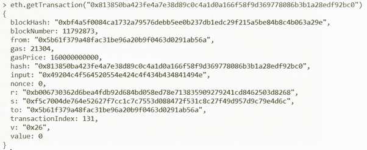
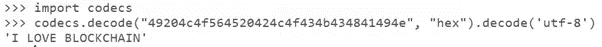
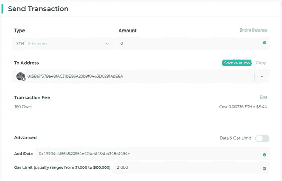
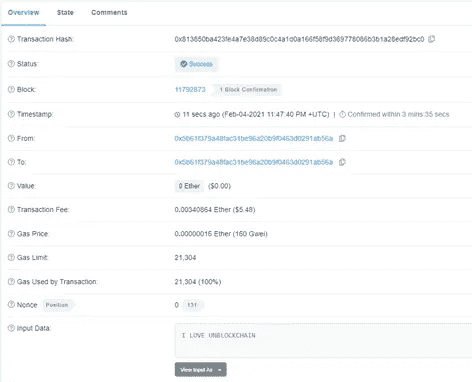
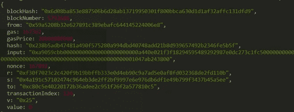

# 如何在以太坊区块链创建一个永久的不可审查的信息

> 原文：<https://levelup.gitconnected.com/how-to-create-a-permanent-uncensorable-message-on-the-ethereum-blockchain-afd1ad23fa5e>

## 从求婚到政治信息，人们一直在以太坊区块链到处写未经审查的信息。学习如何写下这些信息，并使它们在区块链永垂不朽！

让我们继续享受以太坊的乐趣，学习如何在以太坊区块链上写和读信息。

众所周知，以太坊是一个去中心化的计算机网络。目前，有超过 11 000 个以太坊节点复制以太坊总账上的所有数据。这意味着电子区块链上的任何消息、交易、智能合同或 DNS 域都被复制了 11 000 次，确保了不变性和弹性，这使得区块链成为一项令人敬畏的技术。这也是区块链像以太坊一样抵制审查的原因。没有人，甚至是一个专制的大国，能够阻止或审查一个公开的区块链。这也是为什么这么多人在区块链写政治信息。甚至有一些项目是为了保护历史不被审查机构用区块链删除而开发的。

如果写在社交媒体或网站上，可能会导致该消息被删除，甚至更糟的是，导致该人被起诉。但是，因为区块链是分散的，所以不能控制或删除它们。


把你的留言永远放在以太坊区块链吧！

[记录在区块链上的第一条政治信息](https://medium.com/geekculture/decoding-bitcoins-first-block-coinbase-transaction-aeefe87ceec0)是由中本聪写的——“泰晤士报 03/1/2009 财政大臣处于对银行的第二次救助的边缘”——它被记录在比特币区块链的起源块(第一个块)上。

如今，任何人都可以在区块链上写下这些永恒的信息。

## 哪里可以找到以太坊消息场？

每个 Etehreum 事务都有一堆类似于您在下面看到的字段。在交易数据中，字段“输入”是我们可以找到消息的地方。

这些消息用于不同的目的。首先，它们可以用于提供交易的任何附加信息。第二，它们可以被智能合约用作附加字段，以允许智能合约执行某些功能或用于在以太坊区块链上发送代币。最后，它们也可以用来记录任何你想永久保存的信息。

让我们看一个例子:

我创建了一个事务，并在其中嵌入了一条“秘密”消息。所有事务都有一个事务哈希来标识事务，在这种情况下，哈希是"[0x 813850 ba 423 Fe 4a 7 e 38d 89 c 0 C4 a1 d0a 166 f 58 F9 d 369778086 B3 B1 a 28 EDF 92 BC 0](https://etherscan.io/tx/0x813850ba423fe4a7e38d89c0c4a1d0a166f58f9d369778086b3b1a28edf92bc0)"(您可以在以太坊块浏览器 Etherscan 上单击查看)。此交易包含在 11792873 块中，其中包含一条我自己写的消息。让我们来看看这个交易:



您可以注意到交易值为零。这是因为发送者只需要支付汽油来处理交易，但他实际上不需要发送任何值。

消息在**输入**栏，是**0x 49204 C4 f 564520554 e 424 C4 f 434 b 434841494 e**但是……WTF，我该怎么读那些随机字符？

该消息是用十六进制写的，不可读，但我们可以很容易地转换它。如果您有 python 命令提示符，请尝试以下命令将十六进制字符串转换为 UTF-8 文本:

```
import codecscodecs.decode(“hex string”, “hex”).decode(‘utf-8’)
```

如果你的电脑上没有 python，你可以使用一个在线的十六进制到文本的转换器来把信息转换成文本🤩

回到 python，我们可以写几行代码来自动完成这项工作，但只是简单地复制不带 0x 的输入字段，然后运行命令。让我们解码上述块的输入:



耶，所以我永久写在区块链上的信息是“我爱区块链”！🐶

以太坊区块链的信息是不可变的，这意味着没有人可以改变它，而且它是抗审查的。因此，区块链以太坊到处都有人写爱情短信、求婚短信和政治短信。

## 如何在以太坊区块链上写新消息

在以太坊区块链上写消息，需要有一个以太坊钱包，里面有一些以太来交煤气费，需要连接一个钱包接口比如 [MEW —我的以太钱包](https://www.myetherwallet.com/):



然后，您需要以 0x 开始的十六进制值插入您的消息(您可以在众多[在线转换器](http://www.unit-conversion.info/texttools/hexadecimal/)之一中将您的文本消息转换为十六进制)。然后，点击发送，你的信息将永远保存在区块链中！

消化撰写信息的简单步骤:

1.  获得一个与我的以太钱包兼容的以太钱包(Metamask 非常容易使用)
2.  转移一点乙醚到你的钱包里来支付汽油费(几美元的乙醚就足够了)
3.  打开我的以太钱包，连接到你的钱包
4.  发送金额为零的新交易，并以十六进制编写消息(可以使用在线转换器)

要检查此消息，您也可以访问诸如 Etherscan.io 之类的块浏览器，并检查消息:



## ERC20 令牌传输也使用消息

我随机选择了另一个将 ERC20 令牌转移到智能合约的交易。所以这种信息看起来像这样:



要读取这个十六进制消息，我们必须将它分成更小的组。我们已经知道，0x 意味着这是一个十六进制消息。随后的 8 个字节“a9059cbb”是功能标识符。之后每 32 个字节就是一段对应地址和金额的报文。智能协定会将此消息解释为传输(地址，uint256)

该消息将类似于以下内容

MethodID: a9059cbb

地址:00000000000000000000000a 440 e 021 F3 f 18294595489292987 e0dc 273 C1 fc 5

金额:000000000000000000000000000000000000000000000001047 ab 243800

好吧。我希望它是有用的！如果你有任何问题，请在评论区告诉我！

**🚀跟随我的媒介，也请检查我的🧱区块链课程:**

**🐶** [**有史以来第一次 Dogecoin 课程**](https://www.udemy.com/course/-dogecoin-course-the-first-complete-dogecoin-course/?referralCode=9416B1408224CE309DD8)

**👨‍🎓** [**Fintech、云和网络安全课程**](https://www.udemy.com/course/fintech-technologies-cloud-and-cybersecurity/?referralCode=F1D4EA005A2881735A36)

**📖**[](https://www.amazon.com/dp/B091CYTX37/ref=sr_1_1?dchild=1&keywords=unblockchain&qid=1617186443&s=digital-text&sr=1-1)**[**完整的 NFTs 教程**](https://www.udemy.com/course/the-complete-nft-course-learn-everything-about-nfts/?referralCode=AAEE908D13D0E2276B19)**

****👨‍🎓** [**Unblockchain 课程**](https://www.udemy.com/course/blockchain-deep-dive-from-bitcoin-to-ethereum-to-crypto/?referralCode=B8463EE382E6D313304B) **—脑洞大开的区块链课程****