# 如何使用 VS 代码在 GitHub 上创建一个 Pull 请求

> 原文：<https://levelup.gitconnected.com/how-to-create-a-pull-request-on-github-using-vs-code-f03db28308c4>

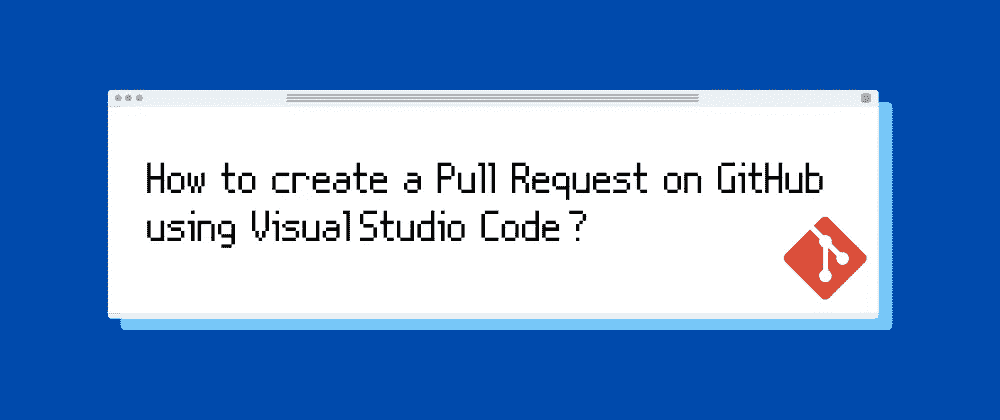

# 介绍

在这篇博客中，你将会看到如何使用编辑器 Visual Studio 代码和 Git VCS 在 GitHub 上创建 PR (Pull Request)。这绝对是初学者友好的，所以坚持住，让我们做一些开源贡献！

# 重要的事情先来！

*在我们开始之前，你需要什么:*

1.  VS 代码或者任何你选择的编辑器(这个博客将基于 VS 代码)。
2.  在 GitHub 上有一个帐户。
3.  在您的计算机/笔记本电脑上安装和设置 Git。
4.  你在 GitHub **或**上被分配的一个问题，一个你想添加到资源库的代码特性。

# 步骤 1—派生存储库。

## 什么是分叉？

在 GitHub 上派生一个存储库仅仅意味着——复制别人的存储库。一旦你创建了一个库，你自己的账户中就会有一个副本，这给了你在复制版本的代码库上工作的自由，而不是别人拥有的原始库。

## 点击右上角的“叉”。

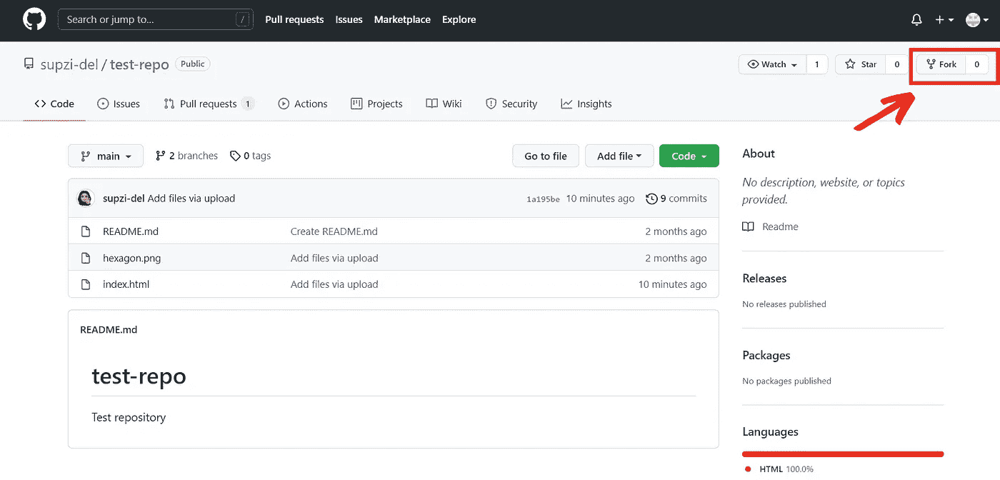

GitHub 中的分叉

一旦你分叉了，你应该会看到一个复制的库，就像这样！

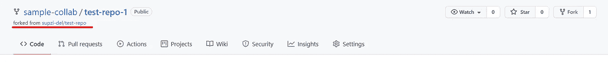

分叉知识库

# 步骤 2 —克隆存储库。

## 什么是克隆？

根据 [GitHub 文档](https://docs.github.com/en)的说法，“克隆一个**仓库会拉下 GitHub** 在那个时间点拥有的所有仓库数据的完整副本。”

## 复制链接。

点击标有**代码**的绿色按钮，并点击**剪贴板**图标复制链接。

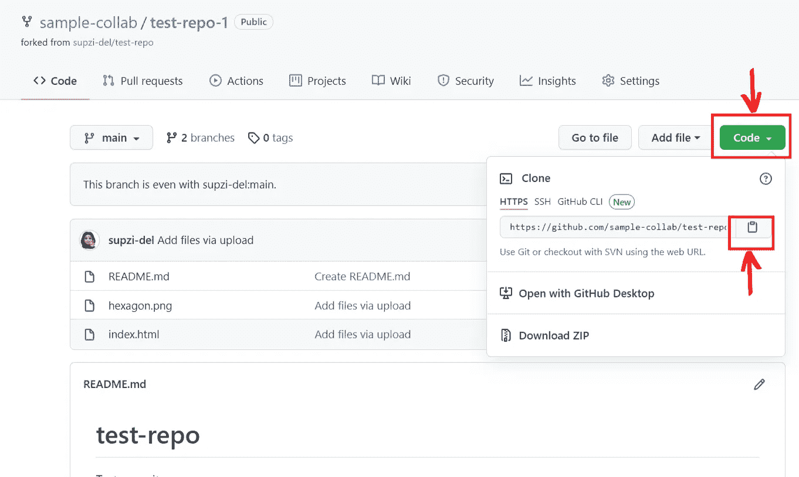

复制链接

## 在您的 PC 上启动 Git Bash。

1.  决定您想要在电脑上的什么位置储存克隆的项目。例如:

```
cd /c/project
```

**或**

```
cd "C:\project"
```

2.运行下面的命令**粘贴上一步复制的链接**并点击**进入**。

```
git clone link
```

耶！该项目存储在您的系统中，以便在本地使用！

# 步骤 3——在 VS 代码中打开克隆的项目。

## 1.将所需代码添加到文件中，并按 **Ctrl + S** 保存更改。

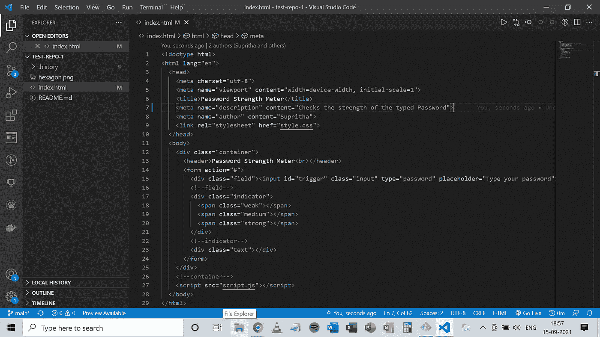

将所需代码添加到文件中

# 小费！

你可以**创建一个分支或者通过点击左下角的“main”后的源代码控制图标**切换到另一个分支。

使用分支允许你**有一个新的工作目录**，在那里*新的提交被记录*在当前分支的历史中。

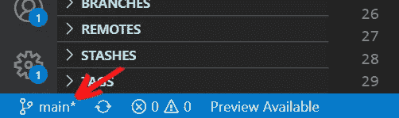

创建分支

## 2.上演变革。

点击**源控制图标**，如图所示。

**选择您已做出更改的文件**，点击 **'+'** 图标进行更改。

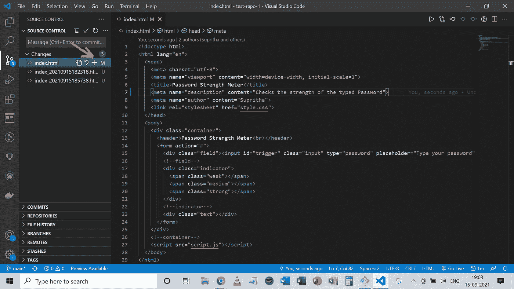

## 3.添加提交消息。

提交消息将描述提交，这对审阅者是有帮助的。查看这篇文章[“良好提交消息的重要性”。](/the-importance-of-good-commit-messages-9331251e5e33)

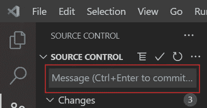

提交消息

## 4.推之前别忘了拉。

点击这三个点，然后拉，这将避免合并冲突，因为它获取和合并更新到您的本地分支。

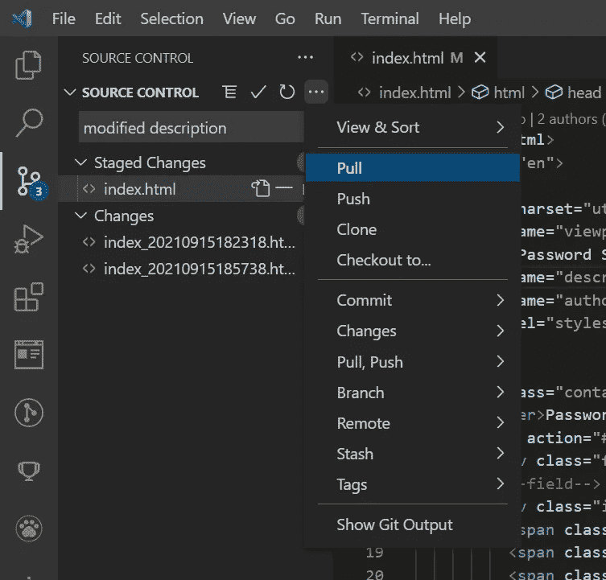

单击拉动

## 5.提交阶段性更改。

在准备和添加提交消息之后，让我们最终提交更改。

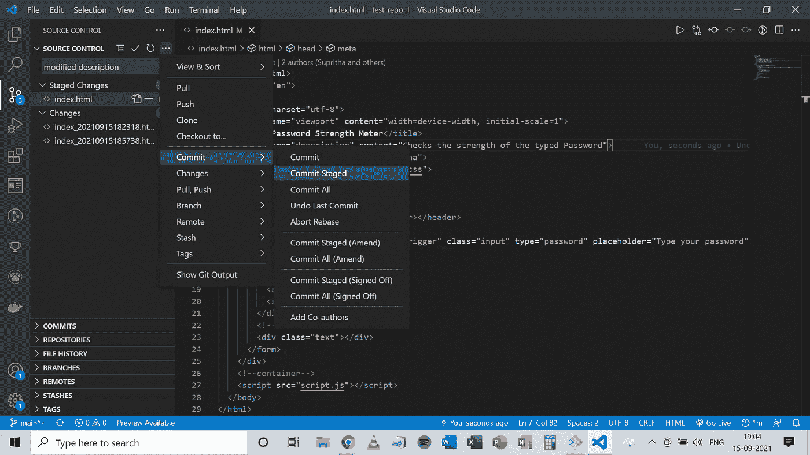

提交已暂存

## 6.推动变革。

推送将**本地存储库内容上传到远程存储库。**

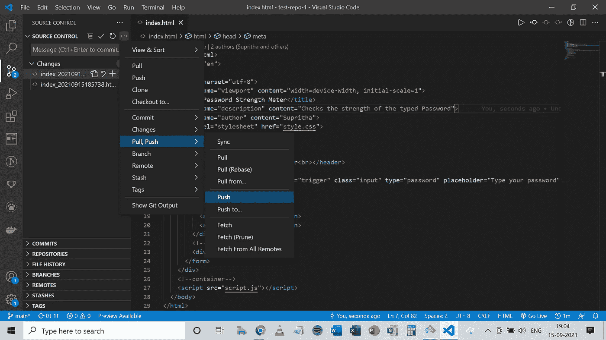

推

# 步骤 4-创建拉式请求。

# 方法 1 —使用 VS 代码

## 1.确保您已经安装了 VS 代码扩展“GitHub Pull Requests and Issues”。

安装完成后，VS Code 会要求你**链接你的 GitHub 账号，**链接到，你只需要**登录**并**授予访问权限**。

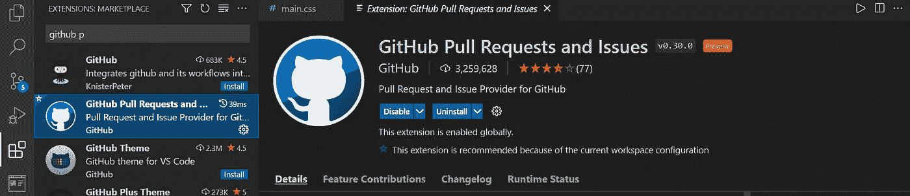

GitHub 拉请求和问题—扩展

## 2.创建拉式请求。

点击 PR 图标切换到 GitHub Pull requests 选项卡。

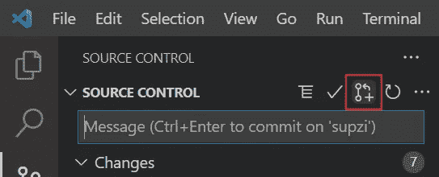

公关图标

在创建之前，添加一个 **PR 描述**并确保您正在从**右库**和**分支**创建一个 PR。

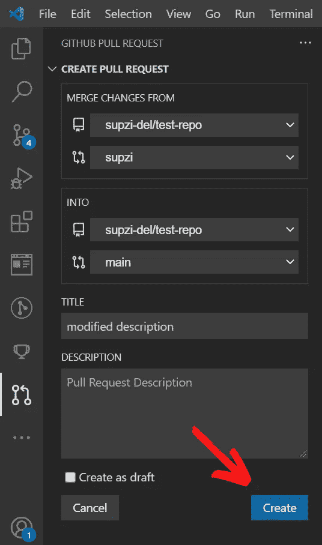

创建 PR

# 方法 2 —使用 GITHUB

## 1.提交后，前往 GitHub 创建您的 PR！

转到存储库中的**拉动请求部分**并点击**比较&拉动请求按钮。**

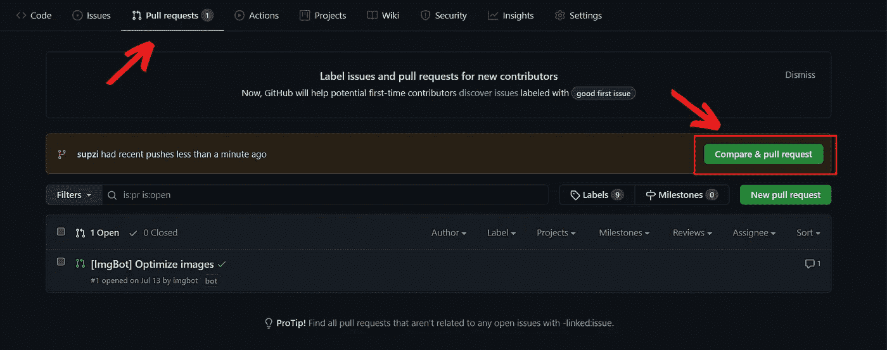

比较和提取请求

## 2.打开一个拉取请求。

在点击**创建拉动式请求**之前，最好写下关于您的 PR 的标题和**描述(问题编号、做出的更改等)。).**

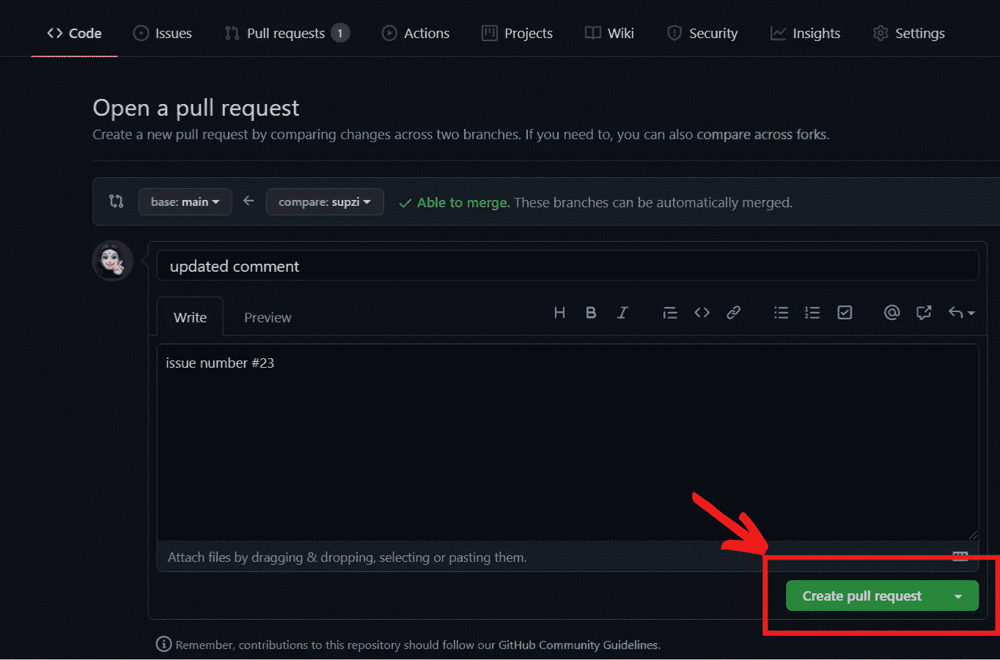

创建拉式请求

# 第五步——为自己感到骄傲！

瞧啊。您成功地提出了一个拉取请求。🎉

# 感谢您的阅读！

你可以和我联系

[LinkedIn](https://www.linkedin.com/in/supritha-ravishankar-560008216/)|[GitHub](https://github.com/supzi-del)|[Twitter](https://twitter.com/SuprithaRavish1)|[Medium](https://supri161.medium.com/)|[dev . to](https://dev.to/supritha)