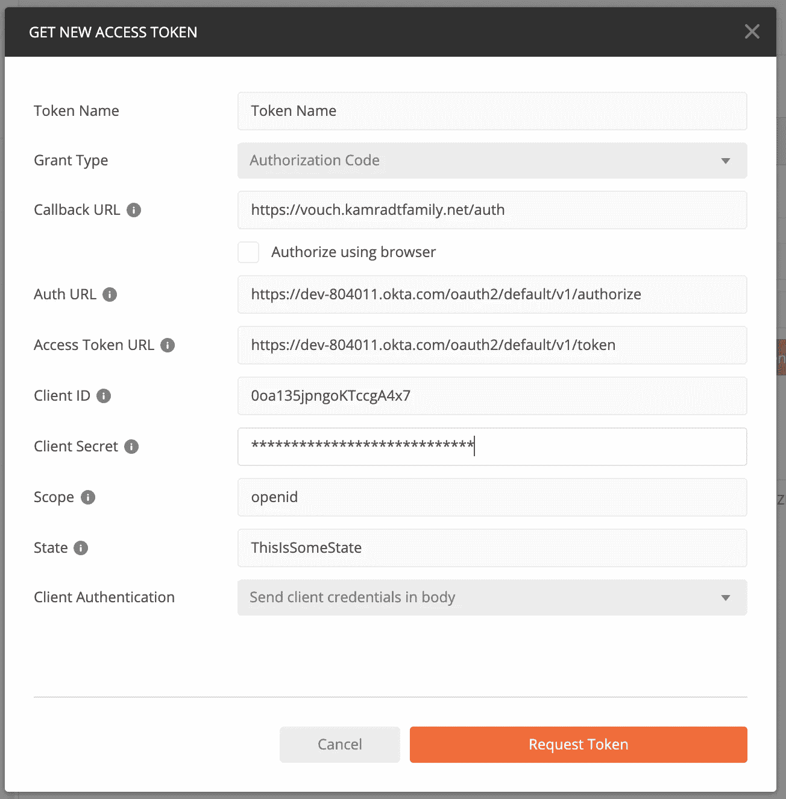

# 如何使用 Flask 和 Connexion 创建 Python API

> 原文：<https://levelup.gitconnected.com/how-to-create-a-python-api-using-flask-connexion-4f3fc77e7f6e>

## 让经过认证的后端在云中运行


图片由[迪安·莫里亚蒂](https://pixabay.com/users/terimakasih0-624267/?utm_source=link-attribution&utm_medium=referral&utm_campaign=image&utm_content=1020837)从[皮克斯拜](https://pixabay.com/?utm_source=link-attribution&utm_medium=referral&utm_campaign=image&utm_content=1020837)拍摄

在我的文章[现代 PHP](/modern-php-df3d3bf343f8) 中，我创建了一个全栈应用程序。后来我用 PHP 和 Lumen 编写了# You may also want to set up a virtual environment here
pip3 install -r requirements.txt

继续编辑您的`README.md`，并添加一个`LICENSE`和您通常在项目中保留的任何内容。有一个文件`client_secrets.json.dist`，它会让你的秘密不被 Okta 知道。一旦它被填充，我们不想把它签入 GitHub。我常用的技术是将包含敏感信息的文件复制到存储库的父目录，它永远不会提交给 git，然后在那里引用它:

```
mv client_secrets.json.dist ../client_secrets.json
```

现在你可以编辑它并替换`OKTA_DOMAIN`、`CLIENT_ID`和`CLIENT_SECRET`。如果您遵循了现代 PHP 系列，您应该已经有了一个`config.yml`，我们用它作为凭证单点登录代理，并且在与`client_secrets.json`相同的目录中有这些值。否则，您将不得不在设置应用程序时使用 Okta 中的值。

接下来，编辑`main.py`，将`./client_secrets.json`改为`../client_secrets.json`。使用以下命令启动服务器:

```
python3 main.py
```

并浏览至 [http://localhost:8000](http://localhost:8000)


到目前为止相当无聊！这给我们带来了一个先有鸡还是先有蛋的问题，您需要前端登录并获取 JWT，以便我们可以查看访问控制路径`api/messages`，现在我们得到:


由于这是单点登录的一部分，我可以使用我的一个使用 JWT 的应用程序，通过使用 Chrome 开发者工具来复制它。但是还有另一种方法。如果您有 Postman(您应该)添加一个带有[http://localhost:8000/API/messages](http://localhost:8000/api/messages)的 GET 请求，单击 Authorization 选项卡，选择 OAuth 2.0 的类型，然后单击“Get New Access Token”按钮。


接下来，填写字段



我的回调 URL 来自我之前设置的凭证代理，所以我可以在我的 Okta 客户端设置中有一个回调 URL。你应该使用你在设置 Okta 时输入的任何内容。

在下一个屏幕上，单击“使用令牌”按钮，它将自动填写授权标题。现在，您可以按“发送”按钮，您应该可以访问安全的终端


JWT 代币过一会儿就过期了，所以到期时你需要换一张新的。

## 填写 API

现在，我们只有示例端点，让我们制作一些真正的端点。我将使用 Connexion 库将 Swagger 标记转换为所有端点。这种方法的好处是 Swagger 不仅可以定义您的 API，它还可以用来生成样板代码，以及一个可以帮助您为其他人测试和记录 API 参数的 UI。下面是我们将要使用的`swagger.yml`:

```
swagger: "2.0"
info:
  description: Wine Cheese Pairing API Swagger
  version: "1.0.0"
  title: Wine Cheese Pairing API
consumes:
  - application/json
produces:
  - application/jsonbasePath: /api# Paths supported by the server application
paths:
  /pairing:
    get:
      operationId: winePairing.read_all
      tags:
        - WinePairing
      summary: Read the entire list of Wine Cheese Pairings
      description: Read the list of Wine Cheese Pairings
      parameters:
        - name: length
          in: query
          type: integer
          description: Number of Wine Cheese Pairings to get
          required: false
        - name: offset
          in: query
          type: integer
          description: Offset from beginning
          required: false
      responses:
        200:
          description: Successfully read list operation
          schema:
            type: array
            items:
              properties:
                id:
                  type: integer
                wine:
                  type: string
                wine_descrption:
                  type: string
                cheese:
                  type: string
                cheese_descrption:
                  type: string
                pairing_notes:
                  type: string post:
      operationId: winePairing.create
      tags:
        - WinePairing
      summary: Create a wine pairing and add it
      description: Create a new wine pairing
      parameters:
        - name: pairing
          in: body
          description: Pairing to create
          required: True
          schema:
            type: object
            properties:
                wine:
                  type: string
                wine_descrption:
                  type: string
                cheese:
                  type: string
                cheese_descrption:
                  type: string
                pairing_notes:
                  type: string
      responses:
        201:
          description: Successfully created wine pairing /pairing/{id}:
    get:
      operationId: winePairing.read_one
      tags:
        - WinePairing
      summary: Read one wine pairing
      description: Read one wine pairing
      parameters:
        - name: id
          in: path
          description: Id of the pairing
          type: integer
          required: True
      responses:
        200:
          description: Successfully read wine pairing
          schema:
            properties:
                id:
                  type: integer
                wine:
                  type: string
                wine_descrption:
                  type: string
                cheese:
                  type: string
                cheese_descrption:
                  type: string
                pairing_notes:
                  type: string put:
      operationId: winePairing.update
      tags:
        - WinePairing
      summary: Update a wine pairing
      description: Update a wine pairing
      parameters:
        - name: id
          in: path
          description: Id of the wine pairing to update
          type: integer
          required: True
        - name: person
          in: body
          schema:
            type: object
            properties:
                id:
                  type: integer
                wine:
                  type: string
                wine_descrption:
                  type: string
                cheese:
                  type: string
                cheese_descrption:
                  type: string
                pairing_notes:
                  type: string
      responses:
        200:
          description: Successfully updated wine pairing delete:
      operationId: winePairing.delete
      tags:
        - WinePairing
      summary: Delete a wine pairing
      description: Delete a wine pairing
      parameters:
        - name: id
          in: path
          type: integer
          required: True
      responses:
        200:
          description: Successfully deleted a wine pairing
```

要使用 Connexion，首先安装它:

```
pip3 install connexion
pip3 install "connexion[swagger-ui]"
```

注意`connexion[swagger-ui]`被引用了。Mac 上的新 shell，`zsh`将[]视为特殊字符，所以我们需要用引号将其括起来。此外，将新的需求添加到 requirements.txt 的末尾。

`operationId`是我们连接代码的地方。例如，`winePairing.read_all`需要是文件`winePairing.py`中的方法`read_all`。这是在`winePairing.py`的第一关:

```
def read_one(id):
    return "this is a pairing"def read_all():
    return "this is the pairing list"def create():
    return "this is where we create"def update(id):
    return "this is where we update"def delete(id):
    return "this is where we delete"
```

接下来，我们可以将连接库添加到我们的 main.py 中:

```
import json
import timefrom flask import Flask, render_template, url_for, redirect
from flask_cors import CORS
from flask_oidc import OpenIDConnectimport connexion# Create the application instance
app = connexion.App(__name__, specification_dir='./')# Read the swagger.yml file to configure the endpoints
app.add_api('swagger.yml')CORS(app.app)
app.app.config.update({
    'SECRET_KEY': 'SomethingNotEntirelySecret',
    'OIDC_CLIENT_SECRETS': '../client_secrets.json',
    'OIDC_ID_TOKEN_COOKIE_SECURE': False,
    'OIDC_SCOPES': ["openid", "profile", "email"],
    'OIDC_CALLBACK_ROUTE': '/authorization-code/callback'
})oidc = OpenIDConnect(app.app)[@app](http://twitter.com/app).route("/")
def home():
    return "Hello!  There's not much to see here." \
           "Please grab one of our front-end samples for use with this sample resource server"[@app](http://twitter.com/app).route("/api/messages")
[@oidc](http://twitter.com/oidc).accept_token(True)
def messages():
    response = {
        'messages': [
            {
                'date': time.time(),
                'text': 'I am a robot.'
            },
            {
                'date': time.time()-3600,
                'text': 'Hello, World!'
            }
        ]
    }return json.dumps(response)if __name__ == '__main__':
    app.run(host="localhost", port=8000, debug=True)
```

现在开始尝试吧。运行:

```
python3 main.py
```

并浏览至[http://localhost:8000/API/ui](http://localhost:8000/api/ui)


很时髦，是吧？单击周围，尝试每个端点。除了我们放在`winePairing.py`文件中的虚假信息之外，你什么也得不到。

## 添加数据库

如果没有数据库来存储数据，那么使用 API 来修改数据就没有多大意义。我可以从我的现代 PHP 转到存储库，使用`docker-compose.yml`打开数据库并初始化它，但我只是把它复制到这里，这样就方便了。因为我们使用 Docker Compose，所以您必须安装 Docker。如果没有，请遵循这些[说明](https://docs.docker.com/docker-for-mac/install/)。此外，您应该在 [DockerHub](https://hub.docker.com/) 有一个账户

我们将使用 MariaDB。如果你对 MariaDB 和 MySQL 感到困惑，当 MySQL 被 Oracle 收购时，MySQL 的创建者并不认为 Oracle 会保留 MySQL，因为它是他们主要摇钱树的竞争对手。所以它被分流到开源的 MariaDB。自从被分叉后，它们几乎保持不变，所以通常很容易把一个换成另一个。但是如果你是一个尽责的开源者，请使用并支持 MariaDB。

我们需要三样东西来启动 MariaDB，一个 docker-compose.yml(您也可以从命令行运行 docker)，一个 init 脚本和一个带秘密的配置脚本。我将从现代 PHP 系列创建的项目中复制这些内容，但我将在这里展示它们。下面是 docker-compose.yml:

```
version: "3"
services:
  mariadb:
    image: mariadb
    restart: always
    volumes:
     - ./init:/docker-entrypoint-initdb.d
    env_file:
      - ../mariadb.env
    ports:
      - 3306:3306
```

图像“mariadb”来自 DockerHub，是官方图像。在“研究”模式下，我通常不贴图片标签，只拍最新的。当你开始真正的开发时，你应该总是使用一个标签，这样事情就不会神秘地中断。`init`目录应该包含一个在 MariaDB 第一次启动时执行的脚本。以下是我所知道的:

```
CREATE DATABASE IF NOT EXISTS winelist;
USE winelist;
CREATE TABLE IF NOT EXISTS wine_pairing
  (id INT AUTO_INCREMENT NOT NULL,
   wine VARCHAR(255) NOT NULL,
   wine_description VARCHAR(255) NOT NULL,
   cheese VARCHAR(255) NOT NULL,
   cheese_description VARCHAR(255) NOT NULL,
   pairing_notes VARCHAR(255) NOT NULL,
   PRIMARY KEY(id))
   DEFAULT CHARACTER SET utf8mb4
   COLLATE `utf8mb4_unicode_ci`
   ENGINE = InnoDB;INSERT INTO wine_pairing (wine, wine_description, cheese, cheese_description, pairing_notes)
  VALUES('wine1', 'wine1description', 'cheese1', 'cheese1description', 'notes1'),
  ('wine2', 'wine2description', 'cheese2', 'cheese2description', 'notes2'),
  ('wine3', 'wine3description', 'cheese3', 'cheese3description', 'notes3');
```

因为这个 API 将与我的葡萄酒和奶酪配对应用程序一起工作，所以它有一个表‘wine _ pairing’。

最后，我将拥有包含秘密的`mariadb.env`，以便应用程序可以与数据库对话。我将把这个文件保存在父目录中，因为它有秘密，我们不想把它们提交给 GitHub。

```
DATABASE_URL=mysql://root:<secrethere>@mariadb:3306/winelist
MYSQL_ROOT_PASSWORD=<secrethere>
```

MariaDB 读取 MYSQL_ROOT_PASSWORD，另一个将由 API 使用。

有了这些，我们就可以启动 MariaDB 了。但首先，我想确保我没有留下上一部分的任何容器:

```
docker ps -a
<stray containers listed here>
docker rm <containerId1> <containerId2> <etc...>
```

那就发动她！

```
docker-compose up
```

注意我没有使用`-d`选项，我喜欢在我的终端中查看日志。要继续，您可以按 Command-T，它将打开一个新的终端窗口。如果希望能够查看数据库，可以使用 Docker Compose exec 命令:

```
randalkamradt@Fuji flaskapi % docker-compose exec mariadb /bin/sh
# mariadb -u root -p
Enter password: 
Welcome to the MariaDB monitor.  Commands end with ; or \g.
Your MariaDB connection id is 4
Server version: 10.5.5-MariaDB-1:10.5.5+maria~focal mariadb.org binary distributionCopyright (c) 2000, 2018, Oracle, MariaDB Corporation Ab and others.Type 'help;' or '\h' for help. Type '\c' to clear the current input statement.MariaDB [(none)]> use winelist;
Reading table information for completion of table and column names
You can turn off this feature to get a quicker startup with -ADatabase changed
MariaDB [winelist]> select * from wine_pairing; 
+----+-------+------------------+---------+--------------------+---------------+
| id | wine  | wine_description | cheese  | cheese_description | pairing_notes |
+----+-------+------------------+---------+--------------------+---------------+
|  1 | wine1 | wine1description | cheese1 | cheese1description | notes1        |
|  2 | wine2 | wine2description | cheese2 | cheese2description | notes2        |
|  3 | wine3 | wine3description | cheese3 | cheese3description | notes3        |
+----+-------+------------------+---------+--------------------+---------------+
3 rows in set (0.002 sec)MariaDB [winelist]> exit
Bye
# exit
randalkamradt@Fuji flaskapi %
```

## 与数据库对话

这就是奇怪的地方。我花了很多时间来弄清楚我需要哪些驱动程序，以及如何实现这个解决方案。我最后想到的是把文件拆分成`main.py`、`config.py`、`models.py`和`winePairing.py`。

但是首先，依赖关系。安装这些依赖项，并将它们添加到 requirements.txt:

```
pip3 install marshmallow
pip3 install marshmallow-sqlalchemy
pip3 install sqlalchemy
pip3 install flask_sqlalchemy
pip3 install flask_marshmallow
pip3 install mysql-connector-python
```

`marshmallow`库用于编组输入和输出有效载荷。`sqlalchemy`库提供 ORM 类型功能，而`mysql-connector-python`是实际的 MySQL/MariaDB 驱动程序。

需要跨模块共享的所有配置都包含在 config.py 中，如下所示:

```
import os
import connexion
from flask_sqlalchemy import SQLAlchemy
from flask_marshmallow import Marshmallow
from flask_cors import CORSbasedir = os.path.abspath(os.path.dirname(__file__))
connex_app = connexion.App(__name__, specification_dir=basedir)app = connex_app.appapp.config.from_pyfile('../flask.cfg')db = SQLAlchemy(app)ma = Marshmallow(app)CORS(app)app.config.update({
    'SECRET_KEY': 'SomethingNotEntirelySecret',
    'OIDC_CLIENT_SECRETS': '../client_secrets.json',
    'OIDC_ID_TOKEN_COOKIE_SECURE': False,
    'OIDC_SCOPES': ["openid", "profile", "email"],
    'OIDC_CALLBACK_ROUTE': '/authorization-code/callback'
})
```

这里我创建了`connexion`应用程序，它包含了`flask`应用程序。我在 MariaDB 配置的父目录`../flask.cfg`中创建了一个新的 secrets 文件。看起来是这样的:

```
SQLALCHEMY_ECHO = True
SQLALCHEMY_DATABASE_URI = 'mysql+mysqlconnector://root:
     <pw>@mariadb:3306/winelist'
SQLALCHEMY_TRACK_MODIFICATIONS = False
```

`config.py`还初始化数据库，棉花糖编组器，并为 CORS 和`openid` (Okta)添加配置。

最终的`main.py`变得简单多了:

```
import config# Get the application instance
connex_app = config.connex_app
connex_app.add_api("swagger.yml")if __name__ == "__main__":
    connex_app.run(debug=True)
```

我们所做的就是加载 API 定义文件，并启动服务器。请注意，这是*而不是*生产服务器，所以您可能希望在真实环境中使用 Python 和 Nginx 之间的 WSGI 实现。

接下来是我们定义 WinePairing 数据和模式的模型。因为我们将这个服务添加到一个现有的数据库中，所以我们不需要利用数据库创建工具。实际上，我们无论如何都不应该在代码中这样做，因为这些是微服务。因此，没有一个服务应该负责创建数据库，最好将它留给外部实体。总之，这里是`model.py`:

```
from config import db, ma
from marshmallow_sqlalchemy import ModelSchemaclass WinePairing(db.Model):
    __tablename__ = 'wine_pairing'
    id = db.Column(db.Integer, primary_key=True)
    wine = db.Column(db.String(32),)
    wine_description = db.Column(db.String(32))
    cheese = db.Column(db.String(32))
    cheese_description = db.Column(db.String(32))
    pairing_notes = db.Column(db.String(32))class WinePairingSchema(ModelSchema):
    class Meta:
        model = WinePairing
        sqla_session = db.session
```

同样，我们从`config.py`导入数据库和棉花糖。然后我们定义了两个类，一个作为数据对象，另一个作为模式。

最后，我们到达`winePairing.py`,它现在已经填充了所有的数据库调用。它看起来是这样的:

```
import connexion
from flask_oidc import OpenIDConnect
from flask import (
    make_response,
    abort,
    request
)
from config import (
    db,
    app
)from models import (
    WinePairing,
    WinePairingSchema,
)oidc = OpenIDConnect(app)def read_one(id):
    winePairing = WinePairing.query \
        .filter(WinePairing.id == id) \
        .one_or_none()
    if winePairing is not None:
        winePairing_schema = WinePairingSchema()
        return winePairing_schema.dump(winePairing)
    else:
        abort(404, 'WinePairing not found for Id: {id}'.format(id=id))def read_all():
    winePairing = WinePairing.query \
        .order_by(WinePairing.id) \
        .all()
    winePairing_schema = WinePairingSchema(many=True)
    return winePairing_schema.dump(winePairing)[@oidc](http://twitter.com/oidc).accept_token(True)
def create():
        schema = WinePairingSchema()
        newWinePairing = schema.load(request.json, session=db.session)
        db.session.add(newWinePairing)
        db.session.commit()
        return schema.dump(newWinePairing), 201[@oidc](http://twitter.com/oidc).accept_token(True)
def update(id):
    updateWinePairing = WinePairing.query.filter(
        WinePairing.id == id
    ).one_or_none()
    if updateWinePairing is None:
        abort(
            404,
            "WinePairing not found for Id: {id}".format(id=id),
        )
    schema = WinePairingSchema()
    update = schema.load(request.json, session=db.session)
    update.id = updateWinePairing.id
    db.session.merge(update)
    db.session.commit()
    data = schema.dump(updateWinePairing)
    return data, 200[@oidc](http://twitter.com/oidc).accept_token(True)
def delete(id):
    winePairing = WinePairing.query.filter(WinePairing.id == id).one_or_none()
    if winePairing is not None:
        db.session.delete(winePairing)
        db.session.commit()
        return make_response(
            "WinePairing {id} deleted".format(id=id), 200
        )
    else:
        abort(
            404,
            "WinePairing not found for Id: {id}".format(id=id),
        )
```

如你所见，事情变得复杂多了。让我非常吃惊的一件事是端点方法不能接受一个以上的参数。因此，我没有为 PUT 和 POST 传递封送的请求体，而是传入 request.json，幸运的是，`schema.load`方法能够使用 json。这与使用`@oidc.accept_token`包装函数有关。如果任何一个端点需要额外的路径参数，我不知道该怎么办。

## 将一切都转移到云上

现在，我们可以将其容器化，然后添加到我们的云部署脚本中。只需要多一个文件，一个 docker 文件来告诉我们如何把这些放在一起。这很简单:

```
FROM python:3.9.0-alpine3.12
WORKDIR /project/app
ADD . /project/app
RUN pip install -r requirements.txt
CMD ["python","main.py"]
```

我将调整 config.py 以从`../config`获取配置文件，这样我就可以将它们挂载到`/project`中，它是`/project/app`的父目录。我将在本地对`docker-compose.yml`做一点小小的补充:

```
version: "3"
services:
  mariadb:
    image: mariadb
    restart: always
    volumes:
     - ./init:/docker-entrypoint-initdb.d
    env_file:
      - ../mariadb.env
    ports:
      - 3306:3306
  api:
    image: rlkamradt/winepairingapi
    volumes:
    - ../config:/project/config
    ports:
      - 5000:5000
```

首先，用`docker build -t rlkamradt/winepairingapi .`构建映像，然后你可以用`docker-compose up`启动它。浏览到[http://localhost:5000](http://localhost:5000)/API/pairing，应该会得到葡萄酒的列表。我从日志中注意到，出于某种原因，Swagger UI 没有被加载，但我不会为此担心。我们也许不应该在生产环境中暴露 Swagger。

现在推送至 DockerHub: `docker push rlkamradt/winepairingapi`(当然使用自己的 DockerHub 用户名)我们应该准备好部署到云端了。

我将用这个服务替换旧的 read 服务，因为它既可以读取也可以修改。这违背了我的愿望，我希望将它们分开，以便 read 可以与 modify 进行不同的伸缩，modify 还可以使用消息队列将其与服务器分离，使其在高峰时间响应更快。但是现在我将追求简单，以后必要时可能会把事情复杂化。

您可以在这个[存储库](https://github.com/rkamradt/phpappprod/tree/v0.4)中找到我使用的部署脚本。我将简单地用新的`pyrest`应用程序替换`phprest`应用程序。我还将保留`phprest.kamradtfamily.net`的 DNS 名称，这样我就不必与 CloudFlare 发生冲突了。这里是`nginx.conf`的新章节:

```
server {
    access_log /dev/stdout;
    listen 443 ssl;
    server_name phprest.kamradtfamily.net;
    ssl_certificate /etc/certs/kamradtfamily.net.pem;
    ssl_certificate_key /etc/certs/kamradtfamily.net.key;
    ssl_protocols TLSv1 TLSv1.1 TLSv1.2;
    ssl_ciphers HIGH:!aNULL:!MD5;
    location / {
        proxy_pass [http://pyrest:5000](http://pyrest:5000);
}
```

以及 docker-compose.yml 中的新部分:

```
pyrest:
    image: rlkamradt/winepairingapi
    volumes:
    - ../config:/project/config
    ports:
      - 5000:5000
```

现在我们可以提交并将其推送到 GitHub，这样我们就可以在我们的云虚拟机中启动它。

让我们在云虚拟机上安装新的配置文件。打开一个 ssh 终端到虚拟机，创建一个名为`config`的目录并更改到该目录，然后您可以`vi``client_secrets.json`和`flask.cfg`，将笔记本电脑中的内容复制并粘贴到虚拟机。我们必须特别处理这些文件，因为它们包含秘密，所以它们不能成为我们 GitHub 库的一部分，这是我们通常将更改上传到 VM 的方式。

现在，我们可以`cd`到云虚拟机上的`~/phpappprod`目录，并使用`git pull`获取最新配置。取下`docker-compose.yml`，清理干净，重新拉图像，重启:

```
sudo docker-compose down
sudo docker-compose system prune --all --volumes
sudo docker-compose pull
sudo docker-compose up
```

我没有使用`-d`选项，因为我将假设有问题，并且我想查看日志。当然，是有的。但是问题出在配置文件上。我忘了使用运行在云虚拟机上的 MariaDB 的密码。我对云中的版本使用了与笔记本电脑上运行的实例不同的密码。修复它，并把它带回来给我更多的错误！

问题中的错误是由于依赖项中的版本不匹配。pip install 不更新`requirements.txt`的事实似乎是一个真正的缺点。我依靠`requirements.txt`来使 docker 映像工作，任何想在其他主机上运行代码的人都将依靠它。我开始更新一些依赖关系，看看我是否能让事情一起工作。

经过一些修改后，我可以打开它并运行所有的端点。


所以现在我们的 API 运行在云中，对所有人都可用，但受授权头保护(除了 reads)。

这么说我可能会树敌，但是用 Python 制作这个 API 是我这么长时间以来最糟糕的经历。我花了很多时间让所有的部分正常工作。我使用过很多语言，我不会向任何人推荐 Python 作为通用编程语言。我可以看到它作为一种特殊用途的脚本语言的用途，但是试图把任何东西放在一起，即使是适度复杂的，似乎也是一个挑战。这种语言散发着黑客和无指导的“改进”的味道，以保持其流行性。这可能是你最后一次看到我用 Python 写作，除了在我的 Jupyter 笔记本的安全壳里。

谢谢你听我说完，我希望我诚实的观点不会得罪太多人。这是一篇相当长的文章，但是我们完成了很多事情，从认证到从数据库读取，再到在云中部署。我的下一步计划是制作一个 React 前端，它可以读取这些内容并给它一个漂亮的外观。在那之前，永远不要停止学习(不管有时看起来多么令人沮丧)。

引用的存储库:

[](https://github.com/rkamradt/flaskapi/tree/v0.1) [## rkamradt/flaskapi

### 葡萄酒和奶酪配对应用 GitHub 的一个示例 Python/Flask API 是超过 5000 万开发人员的家园，他们工作…

github.com](https://github.com/rkamradt/flaskapi/tree/v0.1) [](https://github.com/rkamradt/phpappprod/tree/v0.4) [## rkamradt/PHP pprod

### phpapp GitHub 生产版的部署脚本是超过 5000 万开发者的家园，他们一起工作…

github.com](https://github.com/rkamradt/phpappprod/tree/v0.4) 

参考文章:

[](/modern-php-df3d3bf343f8) [## 现代 PHP

### 使用 Upstart 上最需要的项目语言之一开始你的自由职业生涯。

levelup.gitconnected.com](/modern-php-df3d3bf343f8) [](/modern-php-part-2-4973f48a90c0) [## 现代 PHP(第 2 部分)

### 部署到 web

levelup.gitconnected.com](/modern-php-part-2-4973f48a90c0) [](/modern-php-part-3-1f5b78b3371d) [## 现代 PHP(第 3 部分)

### 所有 web 应用程序的单点登录。

levelup.gitconnected.com](/modern-php-part-3-1f5b78b3371d) [](/microservices-with-php-and-lumen-d9af0b915a71) [## 使用 PHP 和 Lumen 的微服务

### 与 PHP 的过去决裂，而不破坏现有的应用程序

levelup.gitconnected.com](/microservices-with-php-and-lumen-d9af0b915a71)