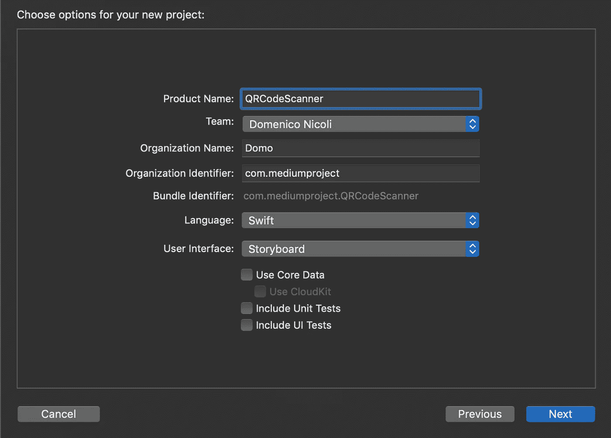
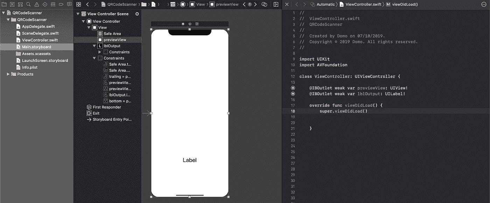
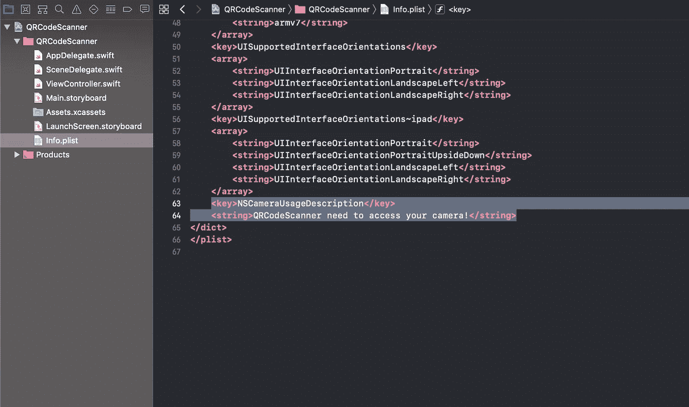
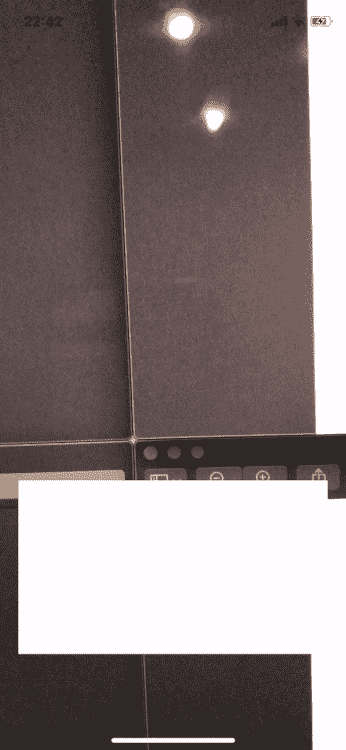

# 如何在 Swift 中创建二维码阅读器

> 原文：<https://levelup.gitconnected.com/how-to-create-a-qrcode-reader-in-swift-1b633d5ac95e>

## 使用 Swift 在几分钟内创建一个二维码阅读器


照片由[🇨🇭·克劳迪奥·施瓦茨| @purzlbaum](https://unsplash.com/@purzlbaum?utm_source=medium&utm_medium=referral) 在 [Unsplash](https://unsplash.com?utm_source=medium&utm_medium=referral) 上拍摄

# 介绍

QR 码是一种广泛用于传输数据的 2D 矩阵条形码。它主要用于物品识别、时间跟踪和营销。它由正方形网格中的黑色正方形组成，可以通过智能手机等成像设备读取。

今天我将解释如何创建一个可以读取二维码的相机应用程序。

# 入门指南

首先，打开 [Xcode](https://developer.apple.com/xcode/) 并创建一个新项目。选择“单视图应用程序”。



现在转到`Main.storyboard` 并在屏幕底部添加一个约束到边框的`UIView`和一个`Label`。



要使用设备摄像头，您需要拥有用户权限。您可以通过在`Info.plist`文件中添加以下键来实现，系统会向用户显示弹出窗口。



# 履行

现在我们已经准备好了输出标签，但是我们仍然需要应用程序的主要部分！要创建一个摄像机捕捉会话，我们需要使用 [AVFoundation](https://developer.apple.com/av-foundation/) 框架，它使我们能够处理视听媒体。

您需要将框架添加到您的`ViewController.swift`文件中。在 UIKit 导入下添加以下代码:

```
import AVFoundation
```

现在用下面的代码覆盖`viewDidLoad`方法，创建一个新的捕获会话:

当摄像头检测到二维码时，我们需要管理委托呼叫。这是`[metadataOutput](https://developer.apple.com/documentation/avfoundation/avcapturemetadataoutputobjectsdelegate/1389481-metadataoutput)`方法，下面你可以找到一个简单的实现:

它从你的相机扫描二维码，解码文本，并显示在标签上。

# 是时候测试一下了

在开始之前，请记住您需要一个物理设备来测试相机应用程序！



# 结论

关于如何创建二维码扫描仪的教程到此结束！如果您有问题或建议，请写下评论！

**你可以在这里** **找到完整的代码** [**。**](https://github.com/domeniconicoli/QRCodeScanner)

[](https://www.buymeacoffee.com/nicolidomenico)[](https://gitconnected.com/learn/ios-swift) [## 学习 Swift -最佳 Swift 教程(2019) | gitconnected

### 35 大 Swift 教程-免费学习 Swift。课程由开发人员提交并投票，使您能够…

gitconnected.com](https://gitconnected.com/learn/ios-swift)