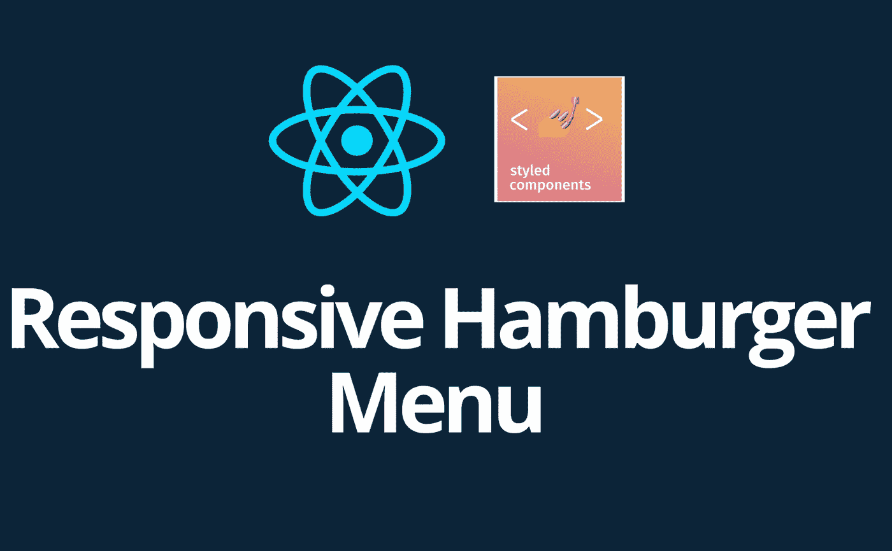
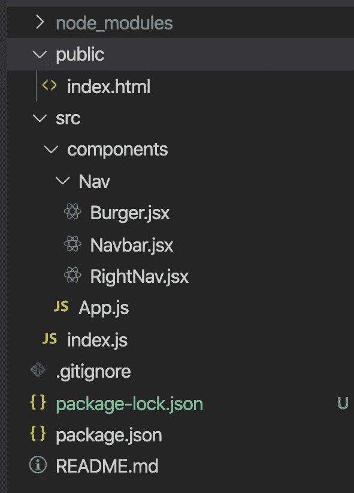
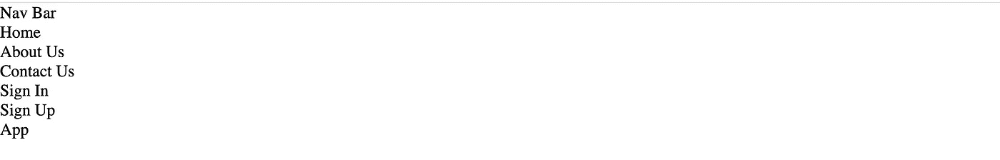
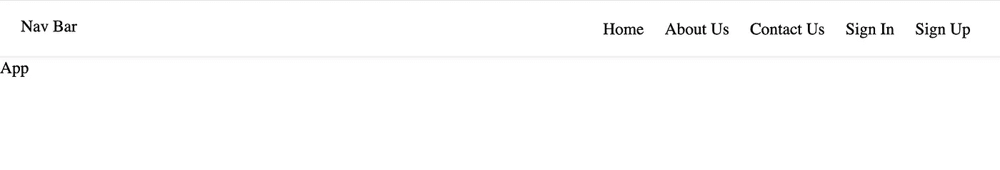
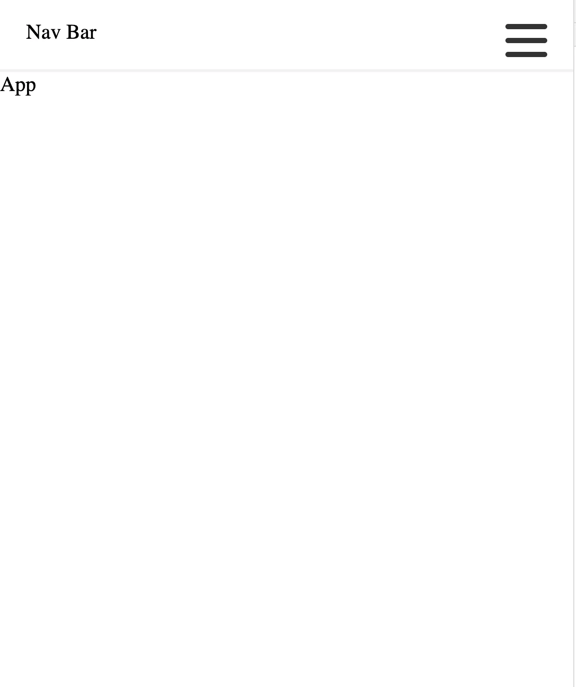
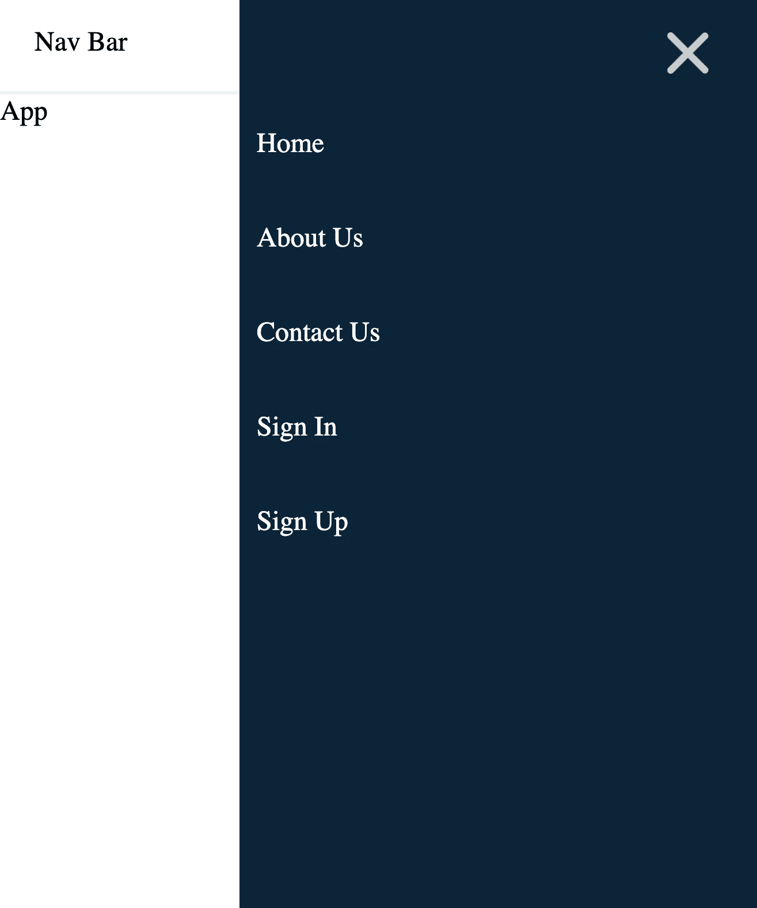

# 如何创建一个响应式汉堡导航菜单——反应和样式组件

> 原文：<https://levelup.gitconnected.com/how-to-create-a-responsive-hamburger-navigation-menu-reactjs-and-styled-components-59ce167ed543>



为了建立一个具有良好用户体验的网站，有很多事情需要考虑，其中之一就是你的网站的响应速度。你的网站可以响应迅速，但用户体验仍然很差。但是你怎么解决这个问题呢？

*最初发表我的博客这里* [***这里***](https://awacreates.com/blog/responsive-hamburger-navigation-menu--reactjs-and-styled-components)

在本文中，我将带您从头开始使用[***Reactjs***](https://reactjs.org)***和*** [***样式化组件*** 构建一个汉堡响应导航菜单。要做到这一点，有几件事情需要处理。](https://styled-components.com/)

## 设置 React 应用程序

在您的终端中，运行以下脚本。然后打开 [http://localhost:3000](http://localhost:3000) 看你的 app。

```
npx create-react-app responsive-nabar
cd responsive-nabar
npm start
```

当您的应用程序运行时，使用以下脚本安装样式化组件。

```
npm install styled-components
```

转到您的根目录，并清除我们将不需要的 create react 应用程序文件。您的目录结构应该完全如下所示



响应式导航条的文件结构

打开您的`index.html`，在`<title>`标签下直接添加以下代码。

```
<style>
  * {
    padding: 0;
    margin: 0;
    box-sizing: border-box;
  }
</style>
```

用下面的代码更新您的`App.js`文件

您的`RightNav.jsx`、`Burger.jsx`和`Navbar.jsx`文件应该有下面各自的代码

在这之后，你的应用程序应该看起来如下所示，还没有样式。



## 将样式应用于组件

假设我们已经安装了样式化的组件，我们的`RightNav.jsx`、`Burger.jsx`和`Navbar.jsx`组件最终将如下所示。

现在，您可以在浏览器上检查您的应用程序，它应该是这样的



# 结论

最后，你应该有一个响应性的导航菜单，点击时会有一些漂亮的汉堡动画。如果你遇到任何问题，你可以参考 [GitHub](https://github.com/dieudonneAwa/responsive-navbar) 上的库

谢谢