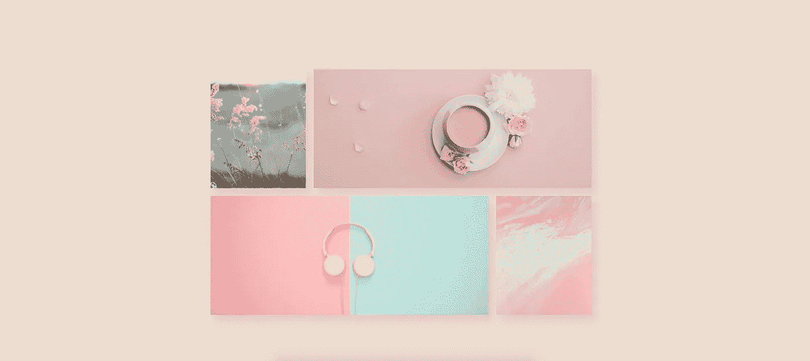
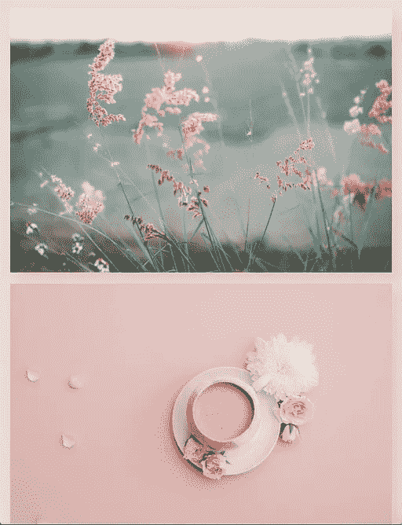
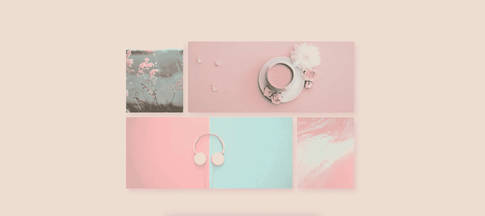

# 如何创建一个响应式图像 CSS Flexbox 网格布局

> 原文：<https://levelup.gitconnected.com/how-to-create-a-responsive-image-css-flexbox-grid-layout-4e890505b31d>

## 我们将使用 flexbox 创建一个简单的图像 CSS 网格布局。



虽然有 CSS 库和框架可以帮助你建立一个网格布局，但有时你希望你的站点的一部分有一个小的图像网格布局。

也许你正在为你的网站建立一个登陆页面，你想要一个小的图像网格布局。我们将在不使用任何库或框架的情况下构建一个简单的四图像网格模式。

这是我们制作的最终结果。



桌面和移动版本的图像网格。

# 图像网格 HTML 标记

这是我们的图像网格的基本标记。

```
<div class="row">
    <div class="img img-1"></div>
    <div class="img img-2"></div>
    <div class="img img-3"></div>
    <div class="img img-4"></div>
</div>
```

我们的 div 标签有一个类`.row`，在`<div class="row">`中，我们有四个 div 标签来保存我们的图像。

我们继续为我们的图像网格创建 CSS。

# 用 CSS 构建我们的图像网格

首先，我们构建图像网格的移动布局。对于`.row`类，我们使用`display: flex`和`flex-wrap: wrap`。Flex wrap 帮助我们的图像折叠成单独的一行，而不是挤在一行。

```
.row {
  width: 100%;
  height: 100%;
  max-width: 1000px;
  margin: 10px 0;
  display: flex;
  flex-wrap: wrap;
}.img {
  height: 50%;
  margin: 10px;
  box-shadow: 10px 14px 20px 0px rgba(226,204,189,1);
}
```

在`.row` div 中的每个图像被设置为带有背景图像的全幅。

```
.img-1{
  background: url('[https://images.unsplash.com/photo-1422205512921-12dac7b3b603?ixlib=rb-1.2.1&ixid=eyJhcHBfaWQiOjEyMDd9&auto=format&fit=crop&w=2255&q=80'](https://images.unsplash.com/photo-1422205512921-12dac7b3b603?ixlib=rb-1.2.1&ixid=eyJhcHBfaWQiOjEyMDd9&auto=format&fit=crop&w=2255&q=80')) no-repeat center center;
  background-size: cover;
  width: 100%;

}.img-2{
  background: url('[https://images.unsplash.com/photo-1528696892704-5e1122852276?ixlib=rb-1.2.1&ixid=eyJhcHBfaWQiOjEyMDd9&auto=format&fit=crop&w=2250&q=80'](https://images.unsplash.com/photo-1528696892704-5e1122852276?ixlib=rb-1.2.1&ixid=eyJhcHBfaWQiOjEyMDd9&auto=format&fit=crop&w=2250&q=80')) no-repeat center center;
  background-size: cover;
  width: 100%;
}.img-3{
  background: url('[https://images.unsplash.com/photo-1524678606370-a47ad25cb82a?ixlib=rb-1.2.1&auto=format&fit=crop&w=2250&q=80'](https://images.unsplash.com/photo-1524678606370-a47ad25cb82a?ixlib=rb-1.2.1&auto=format&fit=crop&w=2250&q=80')) no-repeat center center;
  background-size: cover;
  width: 100%;

}.img-4 {
  background: url('[https://images.unsplash.com/photo-1563305145-b64e0c2184aa?ixlib=rb-1.2.1&ixid=eyJhcHBfaWQiOjEyMDd9&auto=format&fit=crop&w=2250&q=80'](https://images.unsplash.com/photo-1563305145-b64e0c2184aa?ixlib=rb-1.2.1&ixid=eyJhcHBfaWQiOjEyMDd9&auto=format&fit=crop&w=2250&q=80')) no-repeat center center;
  background-size: cover;
  width: 100%;

}
```

我们现在已经完成了我们的移动布局。现在，我们为桌面布局创建一个媒体查询。

```
[@media](http://twitter.com/media) screen and (min-width: 800px) {
  .row{
    height: 600px; 
  }

  .img{
    height: 50%;  
  }

  .img-1,
  .img-4 {
    width: 24%;
  } .img-2,
  .img-3 {
    width: 70%;
  }
}
```

对于我们的桌面布局，我们将整个网格的最大宽度设为 1000 像素。我们将图像设置为不同的宽度，以赋予网格砖石风格的外观。

这就结束了我们简单的 CSS 四图像网格布局。

你可以看看我最近写的其他 HTML 和 CSS 相关的文章:

[](/a-simple-way-to-create-a-hover-animation-for-your-buttons-using-css-8dff77245690) [## 使用 CSS 创建按钮悬停动画的简单方法

### 我们将创建两个具有简单而有趣的悬停动画效果的按钮。

levelup.gitconnected.com](/a-simple-way-to-create-a-hover-animation-for-your-buttons-using-css-8dff77245690) [](https://medium.com/@endubueze00/how-to-create-a-blog-post-preview-layout-with-css-using-flexbox-c616f0fd0b10) [## 如何使用 Flexbox 创建带有 CSS 的博客文章预览布局

### 我们使用 flexbox 的基础来帮助创建这个极简的博客文章预览布局。

medium.com](https://medium.com/@endubueze00/how-to-create-a-blog-post-preview-layout-with-css-using-flexbox-c616f0fd0b10)