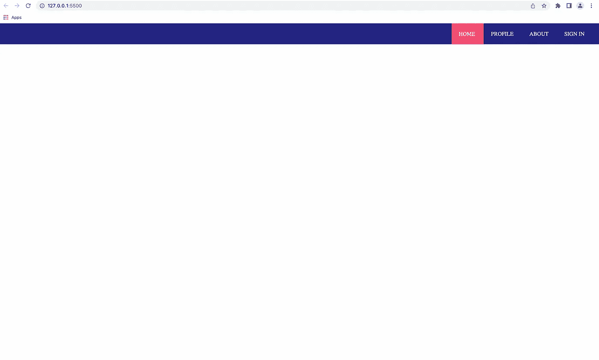
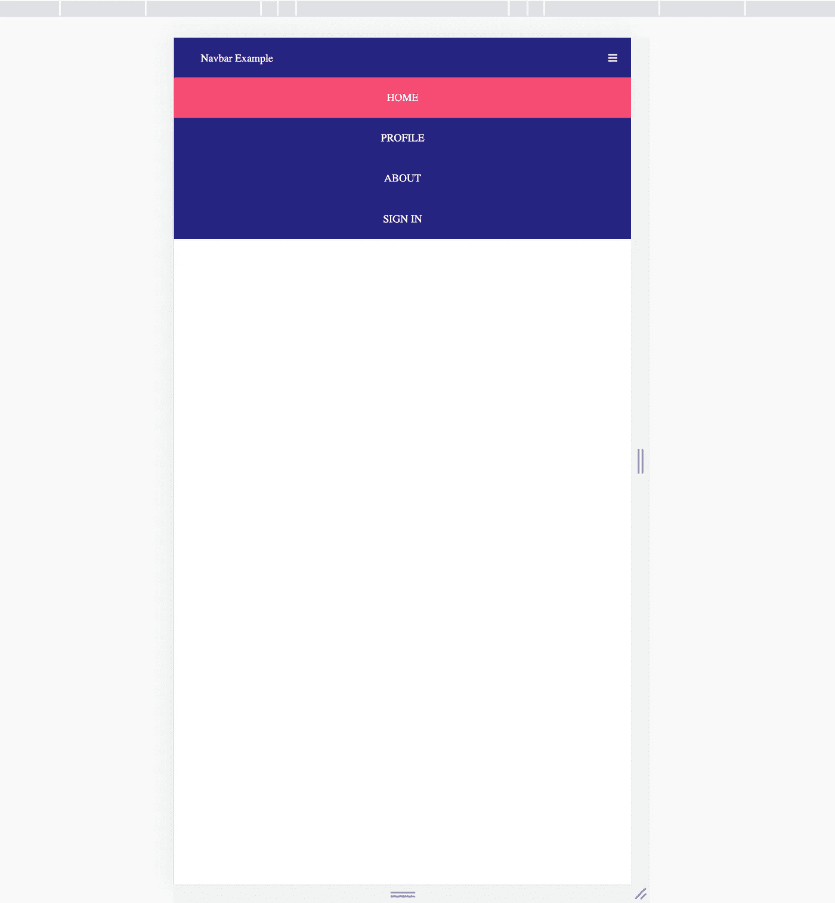

# 如何使用和不使用 JavaScript 创建一个响应式导航栏

> 原文：<https://levelup.gitconnected.com/how-to-create-a-responsive-navigation-bar-with-and-without-javascript-81f6d0671c6d>


照片由[威廉·布特](https://unsplash.com/@williambout?utm_source=medium&utm_medium=referral)在 [Unsplash](https://unsplash.com?utm_source=medium&utm_medium=referral) 上拍摄

想象你正在建立一个包含很多页面的网站。设计每一页总是一项工作。因此，您希望确保用户能够毫不费力地访问每个页面。为了方便他们，你需要在你的网站上实现一个导航条。

现在，添加一个导航栏使得在桌面屏幕上使用你的网站变得更加容易。但是手机和平板电脑屏幕呢？我以前说过，手机占互联网使用的 50%以上。因此，导航条的响应速度非常重要。

在这篇文章中，我将向你展示如何使用和不使用 JavaScript 来构建一个响应式导航条。

# 创建导航栏

在开始项目之前，首先，在 HTML 文件的`<head>`标签中包含以下内容。

```
<link href="styles.css" rel="stylesheet"><link rel="stylesheet" href="https://cdnjs.cloudflare.com/ajax/libs/font-awesome/4.7.0/css/font-awesome.min.css">
```

第一个是 CSS 文件，第二个是字体很棒的 CDN，用于菜单图标。

下面的背景色将用于导航栏。这样做是为了可重用性。阅读[本](https://www.w3schools.com/css/css3_variables.asp)了解 CSS 变量。

```
:root { --bgcolor: #242582;}
```

此外，在 CSS 文件的开头包含这些样式。

```
* {
   margin: 0;
   padding: 0;
}
```

这将删除某些元素的所有默认边距和填充。

## 页眉

创建一个页面标题，导航栏将位于其中。

```
<div class="page-header"> <!-- Your nav-bar comes here --></div>
```

向其中添加以下样式:

```
.page-header { background-color: #242582; padding: 1.3rem; display: flex; justify-content: flex-end;}
```

背景颜色是随机选择的，因为设计部分不在这篇文章的范围内。

## 导航链接

现在，添加导航链接。

```
<div id="navigation-bar" class="nav-bar"> <a class="active"> HOME </a> <a> PROFILE </a> <a> ABOUT  </a> <a> SIGN IN </a></div>
```

这些是每个超链接元素的样式。使用`display: inline`在一行中显示元素。此外，为代表您当前所在页面的活动链接添加不同的颜色。

```
.nav-bar a   { color: white; padding: 1.3rem; cursor: pointer;}.nav-bar a.active { background-color: #f64c72;}
```



桌面导航栏

# 响应行为

至此，您已经为桌面屏幕创建了一个导航栏。对于中小尺寸的屏幕，我们将引入一个菜单图标来代替导航链接。我对图标使用了超棒的字体。

```
<a id="menu-icon" class="menu-icon"> <i class="fa fa-bars"></i></a>
```

最初，在较宽的屏幕上，图标是不可见的，但在较小的屏幕上，它应该是可见的。我已经使用媒体查询来实现这一点。

```
.menu-icon { color: white; cursor: pointer; display: none;}@media screen and (max-width: 850px) { .menu-icon { display: block; }}
```

导航链接将不可见，所以在媒体查询下添加以下样式。

```
.nav-bar { display: none; position: absolute; top: 3.7rem; left: 0; width: 100%; background-color: var(--bgcolor); text-align: center;}
```

导航栏将占据整个屏幕的宽度。我已经将它的位置定义为具有必要偏移量(顶部和左侧)的绝对位置，因此它将相对于视口而不是其父元素(即标题)进行定位。

## 用 JavaScript 实现菜单功能

导航条应该通过点击菜单图标来切换(开和关)。要实现这一点，将属性`onClick="onMenuClick()"`添加到菜单图标。因此，点击图标，就会调用一个 javascript 函数。现在，让我们实现这个函数。

```
function onMenuClick() { var navbar = document.getElementById('navigation-bar'); var responsive_class_name = 'responsive' navbar.classList.toggle(responsive_class_name)}
```

首先，获取 navbar 元素，并将类`responsive`切换到该元素。该函数在每次执行时添加和删除类。在媒体查询中添加响应类的样式。

```
.nav-bar.responsive { display: block;}
```

添加`responsive`类会覆盖导航条的`display: none`属性，并用`display: block`替换它，而移除它会恢复之前的属性。



较小屏幕上的导航栏

## 不使用 JavaScript 的实现

现在，让我们看看如何只用 HTML 和 CSS 实现同样的功能。这里最常见的方法是使用复选框，通过选择或取消选择来切换导航栏。

我们会用同样的方法。让我们先有一个复选框类型的输入。

```
<input type="checkbox" id="toggle-menu">
```

通过单击复选框，可以切换导航栏。但是我们不想要复选框，我们想要一个打开导航栏的菜单图标。这可以用下面的方法来完成。

```
<label class="menu-icon" for="toggle-menu"> <a id="menu-icon"> <i class="fa fa-bars"></i> </a></label>
```

`label`的`for`属性代表这个`label`所绑定的`input`。当一个`label`被绑定到一个`input`元素时，它能够模仿`input`元素的行为。

在这种情况下，它被绑定到复选框，所以通过单击标签复选框得到切换。因此，我们的菜单图标被包装在这个标签中。

现在，使复选框不可见。

```
#toggle-menu { display: none;}
```

要切换导航栏，我们不需要 onClick 函数或单独的`responsive`类。

相反，我们使用`:checked`伪类选择器，如果复选框被选中，它将应用某些样式，在我们的例子中，显示导航链接。此外，我们使用波浪符号将这些样式应用于元素的兄弟，即导航栏。阅读此内容以了解更多关于[波浪号](https://www.geeksforgeeks.org/what-does-symbol-tilde-denotes-in-css)的信息。

```
#toggle-menu:checked ~ .nav-bar { display: block;}
```

因此，每当复选框被选中时，将`display: block`应用到导航栏。

就是这样！通过这些步骤，您可以在应用程序中实现一个响应式导航栏。当然，还有其他实现，这是其中之一。因为我是响应式网站设计的新手，如果你发现任何不正确的地方，或者如果有更好的方法来实现某些东西，请随意评论。

在 [GitHub](https://github.com/KunalN25/responsive-navbar.git) 上找到这两个实现。主分支包含 javascript 实现，而特性分支包含另一个实现。

# 结论

拥有导航条可以帮助用户浏览你网站上的不同页面。它必须有反应。在这篇文章中，我解释了两种方法，通过这两种方法你可以实现一个响应式导航条。希望这对你下一个项目有帮助。

如果您无法理解内容或对解释不满意，请在下面评论您的想法。新想法总是受欢迎的！如果你喜欢这篇文章，请鼓掌。**订阅**、**关注**我获取每周内容。如果你想讨论什么，请在推特上联系我。到那时，再见！！